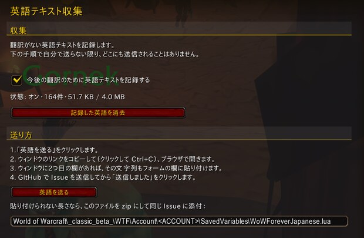

# WoW Forever Japanese (日本語化)

An addon that shows World of Warcraft: Forever in Japanese: quests, NPC dialogue, books, item and spell tooltips,
and the game's interface. Hold **Alt** and the game's own English comes back; let go and the Japanese returns. Alt
is only the default: any key can be chosen. Names of people, places, creatures, items and spells stay in English
everywhere.

With the free voice download it also reads its Japanese aloud: over 14,000 quest texts, NPC lines and book pages,
each NPC in a voice cast for who they are, with a panel that shows who is speaking and what they say.

It is made for **World of Warcraft: Forever** only. It is not for WoW Classic or for the modern game.

Website: [foreverjapanese.com](https://foreverjapanese.com)

**日本語の説明は[下にあります](#日本語)。**

## What it translates

| | In Japanese |
|---|---|
| Quests | 4,758 |
| NPC dialogue lines | 10,959 |
| Book pages | 923 |
| Letter pages | 209 |
| Item tooltips | 9,182 |
| Spell tooltips | 20,061 |
| UI | 15,906 |

## Install

### With the CurseForge app

1. Open the CurseForge app, choose **World of Warcraft**, and search for **WoW Forever Japanese**.
2. Make sure your **Forever** install is the one selected at the top of the game page.
3. Click **Install**.

### By hand

1. Download the zip of the latest release from the
   [releases page](https://github.com/zyaga/wow-forever-japanese/releases).
2. Find your Forever client's folder: open the Battle.net app, choose World of Warcraft, pick the Forever version,
   and use **Show in Explorer** (Windows) or **Show in Finder** (macOS) from the gear menu next to the Play button.
   Inside it, open `Interface`, then `AddOns` (create `AddOns` if it is not there yet).
   - Windows: `<World of Warcraft>\<Forever folder>\Interface\AddOns`
   - macOS: `<World of Warcraft>/<Forever folder>/Interface/AddOns`
3. Unzip the download into that `AddOns` folder.
4. Check the folder name: `AddOns` must hold a folder called exactly `WoWForeverJapanese` (not a folder inside
   another folder).

### Turn it on in the game

At the character select screen, click **AddOns**, make sure **WoW Forever Japanese** is ticked, and log in.

### Add the Japanese voice

The voice is a separate, free download of about 1.1 GB, so installing the addon never pulls it in. It needs the
addon: installing it from the CurseForge app brings the addon too, and the game never loads the voice without it.

- **With the CurseForge app:** install the addon first, then search for **WoW Forever Japanese Voice** and click
  **Install**. The app installs every voice pack with it and keeps them up to date. In the game, the packs show as
  extra rows under the addon in the AddOns list; leave them ticked.
- **By hand:** on the [releases page](https://github.com/zyaga/wow-forever-japanese/releases), open the latest
  release whose name starts with **Voice**, download the zip whose name ends in `-all-` and a date, and unzip it into
  the same `AddOns` folder. It holds `WoWForeverJapanese_Voice` and one folder per voice pack.

The addon's **About & Help** page says whether the voice is installed and which packs loaded. One setting on its
**Voice** page turns the voice off; removing the voice folders removes it, and the addon keeps working. The voices
were made on the maintainer's own computer with the AivisSpeech Engine and the voice models listed in
[`ATTRIBUTION.md`](ATTRIBUTION.md).

## Using it

**Hold Alt to read the English.** Wherever Japanese is showing, holding Alt shows the game's own English until you
let go. Alt is the default. Any key can take its place: Ctrl, Shift, one side of either, a letter or a mouse button.

| Japanese | Holding Alt |
|---|---|
|  |  |

**Popup dictionary.** Point at a Japanese word in quest text, NPC dialogue, a book page or a window label, and a
small popup shows how to read it, its dictionary form, and a short English meaning of the word as the sentence uses it.

**Japanese voice.** With the voice installed ([see below](#add-the-japanese-voice)), quest offers, progress and
turn-ins, NPC greetings and talk, and book and letter pages are read aloud in Japanese: over 14,000 lines. Each NPC
speaks in a voice cast for their race or kind of creature, gender and age. Your character says its own error lines,
such as being out of range, in Japanese too, in a voice for its race and sex.

**Voice panel.** While a line plays, a panel at the bottom of the screen shows who is speaking: their face, their
name and title, and the Japanese a sentence at a time, with the popup dictionary on every word. Close the window and
the line keeps playing, so you can walk on while the NPC finishes. A line that starts meanwhile waits its turn in a
list above the panel; click it to hear it now. Hold Alt and the panel shows the line's English while the voice goes
on. Point at the panel for pause, play again, the whole text and close. The quest log has a play button too, for a
quest you already took. The panel can be moved, shrunk to a small strip, switched to a dark style or turned off.

**Markers.** A line with no translation yet shows **[未翻訳 / Not Translated]** and stays in the game's English. A
line whose English has changed since it was translated shows **[要更新 / English Changed]**. Either marker can be
turned off.

**Why some text is still in English.** Some English is not in the game's files at all: NPC dialogue, a quest's text
when you check its progress or hand it in, and what NPCs say in chat come from the server only when a player sees
them. A line nobody has recorded yet has no Japanese, so it stays in English with the **[未翻訳 / Not Translated]**
marker. The addon notes such lines as you play (see below), and once someone sends them in, a later update
translates them.

**Settings.** Open **Esc > Options > AddOns > WoW Forever Japanese**, or type `/wfj config`. You can turn the whole
translation on or off, turn each area on or off (quests, NPC talk, tooltips, the interface, books), change the key
you hold for English, set a key that switches translation on and off, and turn the markers, the popup dictionary and
the minimap button on or off. With the voice installed, the **Voice** page sets what is read aloud and how the voice
panel looks.

**English it has no Japanese for.** When the game shows English the addon has no translation for (quest text, NPC
dialogue with the id of the NPC who said it, item and spell descriptions, NPC names), the addon notes that English
in its saved settings file, so it can be translated later. It saves your class and race, because some game lines change depending on them. It never saves your character's name, account, realm or location. Nothing is sent anywhere unless you send it yourself. It is on by
default, the addon says so in chat the first time, and you can turn it off under **English Collector** in the
settings.

**Sending the English it noted.** On the **English Collector** settings page, click **Send English** (or type
`/wfj collector send`). A window packs the lines you have not sent yet into one link: copy it (click it, then
Ctrl+C), open it in your web browser, and a GitHub issue form opens already filled in. If the window shows a second
box, the text was too long for the link: copy it into the form's box too. Submit the issue, then click **I sent it**
in the game, so the next send holds only new lines. Lines that have a translation by then are left out. When the
window says the text is too long even to paste, it asks you to zip the saved file and drag it into the same form
(type `/reload` first if you played since logging in).

**A reminder to send it.** When 10 or more lines are waiting to be sent, a small window opens at login or reload with
how many, a **Send English** button and **Later**, at most once a day. To stop it, tick **Don't remind me again** in that
window, type `/wfj collector remind off`, or turn off **Remind me when collected English is waiting to be sent** on the
**English Collector** page. While any line is waiting, the minimap button's right-click
menu also has **Send collected English**, with the count.

## Reporting a bad translation

1. Click the **字** button on the minimap (or type `/wfj fix`).

   

2. Pick the line from the ones you just read, choose what is wrong, and, if you like, write a better Japanese
   line. Then open **Send report** and copy the report.

   

3. Open a [translation report](https://github.com/zyaga/wow-forever-japanese/issues/new?template=translation-report.yml)
   and paste it. A check reads it within a minute. If your Japanese is used, you are credited by the name you
   choose. The issue and the credit are public.

   

## Reporting a bug or an idea

Type `/wfj bug` (or right-click the **字** button and choose **Report a bug or idea**, or use the button on the
About page of the settings). A window opens with a link: copy it (click it, then Ctrl+C) and open it in your web
browser. The bug report form opens with the game build, the addon version and any Lua errors raised in the addon's own
files already filled in. Write what happened and submit the issue, then click **I sent it** in the game, so the next report holds
only new errors. If the window shows a second box, copy that text into the form's Lua errors field. Choose
**Idea** at the top of the window for a link to the idea form instead. You need a GitHub account, and the issue is
public. If you use BugSack or a similar addon, it catches Lua errors first: the window says so, and you can paste
this addon's errors from it.

## FAQ

**Why is a buff's tooltip sometimes in English?** There are two cases.

- **In combat.** The game hides from addons which buff an icon under the minimap is, so its tooltip stays in the
  game's English until the fight ends. Then it is Japanese again.
- **On the target frame.** Buffs and debuffs there always stay English: the game draws their tooltip in a window no
  addon is allowed to touch.

Your own buffs under the minimap and those on party frames are Japanese out of combat. Spell tooltips on your action
bar stay Japanese in combat, the cooldown countdown too.

**Why are names still in English?** On purpose. Names of people, places, creatures, items and spells are never
changed, so what you read matches what other players say and what guides call things.

**What do the markers mean?** **[未翻訳 / Not Translated]** means the line has no translation yet and is shown in
the game's English. **[要更新 / English Changed]** means the English changed after the line was translated.

Both can be turned off in the settings.

**Which game does it work with?** World of Warcraft: Forever only.

## Credits

The hand-written translations are the work of the Japanese translators of **WoWJapanizer**, **QuestJapanizer** and
**CraftJapanizer_Quest**, who are listed by name in [`ATTRIBUTION.md`](ATTRIBUTION.md). Lines those projects did
not cover are machine-drafted and marked as such in the data. Players whose
fixes ship are credited in the same file.

The bundled Japanese font is IPA UI Gothic, under the IPA Font License v1.0.

## License

GPL-2.0-or-later ([`LICENSE`](LICENSE)). Where the text comes from and what is not ours:
[licensing](docs/legal/licensing.md).

This addon is made by fans. It is not affiliated with or endorsed by Blizzard Entertainment. Game screenshots: ©2004
Blizzard Entertainment, Inc. All rights reserved. World of Warcraft, Warcraft and Blizzard Entertainment are
trademarks or registered trademarks of Blizzard Entertainment, Inc. in the U.S. and/or other countries.

## Contributing

Translation fixes, bug reports and code are welcome: see [`CONTRIBUTING.md`](CONTRIBUTING.md). How it works
and why: [docs](docs/overview.md). What changed in each release: [`CHANGELOG.md`](CHANGELOG.md).

---

## 日本語

World of Warcraft: Forever を日本語で遊べるようにするアドオンです。クエスト、NPC の会話、本、アイテムと呪文のツールチップ、ゲームのインターフェースを日本語で表示します。**Alt** キーを押している間はゲーム本来の英語が表示され、離すと日本語に戻ります。Alt は初期設定のキーで、好きなキーに変更できます。人物・地名・モンスター・アイテム・呪文の名前はすべて英語のままです。

無料の音声を追加すると、日本語を読み上げることもできます。クエスト、NPC の会話、本のページなど 14,000 行以上を、NPC ごとに合わせて選んだ声で読み上げ、誰が何を話しているかをパネルに表示します。

対応しているのは **World of Warcraft: Forever** のみです。WoW Classic や現行の World of Warcraft 用ではありません。

ウェブサイト: [foreverjapanese.com](https://foreverjapanese.com)

### 翻訳の量

| | 日本語化済み |
|---|---|
| クエスト | 4,758 |
| NPC の会話 | 10,959 行 |
| 本 | 923 ページ |
| 手紙 | 209 ページ |
| アイテムのツールチップ | 9,182 |
| 呪文のツールチップ | 20,061 |
| UI | 15,906 |

### インストール

#### CurseForge アプリで

1. CurseForge アプリで **World of Warcraft** を選び、**WoW Forever Japanese** を検索します。
2. ゲームのページ上部で **Forever** のインストール先が選ばれていることを確認します。
3. **Install** を押します。

#### 手動で

1. [リリースページ](https://github.com/zyaga/wow-forever-japanese/releases)から最新版の zip をダウンロードします。
2. Battle.net アプリで World of Warcraft を選び、Forever のバージョンを選んで、「プレイ」ボタン横の歯車メニューから **エクスプローラーで表示**（Windows）または **Finder で表示**（macOS）を開きます。その中の `Interface`、`AddOns` の順にフォルダを開きます（`AddOns` がなければ作成）。
   - Windows: `<World of Warcraft>\<Forever のフォルダ>\Interface\AddOns`
   - macOS: `<World of Warcraft>/<Forever のフォルダ>/Interface/AddOns`
3. ダウンロードした zip をその `AddOns` フォルダに展開します。
4. `AddOns` の中に `WoWForeverJapanese` という名前のフォルダがあることを確認します（フォルダの中にさらにフォルダが入っていないこと）。

#### ゲーム内で有効にする

キャラクター選択画面で **AddOns** を押し、**WoW Forever Japanese** にチェックが入っていることを確認してからログインします。

#### 日本語音声を追加する

音声は約 1.1 GB の無料の別ダウンロードで、アドオンをインストールしても音声は入りません。音声にはアドオンが必要です。CurseForge アプリで音声を入れるとアドオンも一緒に入り、ゲームもアドオンなしで音声を読み込むことはありません。

- **CurseForge アプリで:** 先にアドオンを入れてから、**WoW Forever Japanese Voice** を検索して **Install** を押します。すべての音声パックが一緒に入り、更新もアプリが行います。ゲーム内の AddOns 一覧では、アドオンの下に音声パックの行が並びます。チェックは入れたままにしてください。
- **手動で:** [リリースページ](https://github.com/zyaga/wow-forever-japanese/releases)で名前が **Voice** で始まる最新のリリースを開き、名前が `-all-` と日付で終わる zip をダウンロードして、同じ `AddOns` フォルダに展開します。中身は `WoWForeverJapanese_Voice` と音声パックごとのフォルダです。

アドオンの **情報とヘルプ** ページに、音声が入っているか、どのパックが読み込まれたかが表示されます。**音声** ページの設定ひとつで音声をオフにできます。音声のフォルダを削除すれば音声はなくなり、アドオンはそのまま動きます。音声は、メンテナーのコンピューター上で AivisSpeech Engine と [`ATTRIBUTION.md`](ATTRIBUTION.md) に記載した音声モデルを使って作りました。

### 使い方

**Alt で英語を表示。** 日本語が表示されているところでは、Alt を押している間だけゲームの英語が表示されます。Alt は初期設定です。Ctrl、Shift、左右どちらかの修飾キー、文字キー、マウスボタンなど、好きなキーに変更できます。

| 日本語 | Alt を押している間 |
|---|---|
|  |  |

**ポップアップ辞書。** クエスト本文、NPC の会話、本のページ、ウィンドウのラベルで日本語の単語にマウスを合わせると、読み方・辞書形・その文脈での短い英語の意味が表示されます。

**日本語音声。** 音声を入れると（[下記](#日本語音声を追加する)）、クエストの受注・進行・完了の文、NPC のあいさつや会話、本や手紙のページを日本語で読み上げます。合わせて 14,000 行以上です。NPC はそれぞれ、種族やモンスターの種類・性別・年齢に合わせて選んだ声で話します。自分のキャラクターも、射程外などのエラーの一言を、種族と性別に合わせた声で日本語で話します。

**音声パネル。** 読み上げ中は、画面下のパネルに話している NPC の顔、名前と肩書き、読み上げ中の日本語が 1 文ずつ表示されます。どの単語にもポップアップ辞書が使えます。ウィンドウを閉じても読み上げは続くので、NPC の話を聞きながら先へ進めます。その間に始まった行はパネルの上の一覧で順番を待ち、クリックするとすぐに再生できます。Alt を押している間は、声はそのままでパネルにその行の英語が表示されます。パネルにマウスを合わせると、一時停止・もう一度再生・全文表示・閉じるのボタンが出ます。クエストログにも再生ボタンがあり、受けたあとのクエストの文も聞けます。パネルは移動でき、小さな帯の表示、暗い背景、オフに切り替えられます。

**マーカー。** まだ翻訳のない行は **[未翻訳 / Not Translated]** と表示され、英語のままになります。翻訳後に英語が変わった行には **[要更新 / English Changed]** が付きます。どちらも非表示にできます。

**英語のまま残るテキスト。** NPC の会話、クエストの進行中や報告時の文章、チャットに出る NPC のセリフなど、一部の英語はゲームのファイルに入っておらず、プレイヤーが目にしたときにだけサーバーから届きます。まだ誰も記録していない行には日本語訳がないため、**[未翻訳 / Not Translated]** マーカー付きの英語のまま表示されます。アドオンはこうした行をプレイ中に記録します（下記）。誰かが送ってくれれば、以降の更新で翻訳されます。

**設定。** **Esc > オプション > AddOns > WoW Forever Japanese**、または `/wfj config` で開きます。翻訳全体や項目ごとのオン・オフ、英語表示キーの変更、翻訳を切り替えるキーの設定、マーカー・ポップアップ辞書・ミニマップボタンの表示を切り替えられます。音声を入れている場合は、**音声** ページで読み上げる内容と音声パネルの見た目を設定できます。

**まだ翻訳のない英語の記録。** ゲームに表示された英語のうち、アドオンに日本語訳がないもの（クエスト本文、NPC のセリフとその NPC の ID、アイテムと呪文の説明、NPC の名前）は、あとで翻訳できるようにアドオンの設定ファイルに記録されます。クラスと種族は保存されます。ゲームの文章の一部がそれによって変わるためです。キャラクター名、アカウント、レルム、位置は保存されません。自分で送らない限り、どこにも送信されません。初期設定ではオンで、最初にチャットでお知らせします。設定の **英語テキスト収集** でオフにできます。

**記録した英語の送り方。** 設定の **英語テキスト収集** ページで **英語を送る** をクリックします（`/wfj collector send` と入力しても同じです）。まだ送っていない行が 1 つのリンクにまとめられたウィンドウが開きます。リンクをコピーして（クリックして Ctrl+C）ブラウザで開くと、入力済みの GitHub の Issue フォームが開きます。ウィンドウに 2 つ目の欄があるときは、リンクに入りきらない長さです。その文字列もフォームの欄に貼り付けてください。Issue を送信したら、ゲーム内で **送信しました** をクリックします。次回は新しい行だけを送ります。その時点で翻訳がある行は除かれます。貼り付けられないほど長いとウィンドウに表示されたときは、保存ファイルを zip にして同じフォームにドラッグするよう案内されます（ログイン後に遊んだ場合は先に `/reload` してください）。

**送信待ちのお知らせ。** まだ送っていない行が 10 以上あると、ログイン時と /reload 時に小さなウィンドウが開き、その数と **英語を送る**・**あとで** ボタンが表示されます（1 日 1 回まで）。止めるには、そのウィンドウの **今後は知らせない** にチェックを入れるか、`/wfj collector remind off` と入力するか、**英語テキスト収集** ページの **集めた英語が送信待ちのときに知らせる** をオフにします。送っていない行があるあいだは、ミニマップボタンの右クリックメニューにも件数付きの **集めた英語を送る** が表示されます。

### 翻訳の問題を報告する

1. ミニマップの **字** ボタン（または `/wfj fix`）を押します。

   

2. 直前に読んだ行から選び、何が問題かを選びます。よりよい日本語を書くこともできます。**報告を送る** を開いて報告文をコピーします。

   

3. [翻訳の報告フォーム](https://github.com/zyaga/wow-forever-japanese/issues/new?template=translation-report.yml)に貼り付けます。1 分以内に自動チェックの結果がコメントされます。あなたの日本語が採用された場合は、指定した名前でクレジットに載ります（Issue とクレジットは公開されます）。

   

### 不具合や提案を送る

`/wfj bug` と入力します（**字** ボタンを右クリックして **不具合・提案を報告** を選ぶか、設定の About ページのボタンでも開けます）。リンクが入ったウィンドウが開きます。リンクをコピーして（クリックして Ctrl+C）ブラウザで開くと、ゲームのビルド、アドオンのバージョン、アドオン自身のファイルで起きた Lua エラーが入力済みの不具合報告フォームが開きます。起きたことを書いて Issue を送信したら、ゲーム内で **送信しました** をクリックします。次回は新しいエラーだけを送ります。ウィンドウに 2 つ目の欄があるときは、その文字列をフォームの Lua エラー欄に貼り付けてください。ウィンドウ上部で **提案** を選ぶと、提案フォームへのリンクになります。GitHub アカウントが必要で、Issue は公開されます。BugSack などのアドオンを使っている場合は、そちらが先に Lua エラーを取得します。ウィンドウにその旨が表示されるので、そこからこのアドオンのエラーを貼り付けてください。

### よくある質問

**バフのツールチップが英語になることがあるのはなぜ？** 理由は二つあります。

- **戦闘中。** ゲームはミニマップの下のアイコンがどのバフなのかをアドオンに隠すため、そのツールチップは戦闘が終わるまでゲームの英語のままです。戦闘が終わると日本語に戻ります。
- **ターゲットフレーム。** ここに表示されるバフとデバフは常に英語です。ゲームがそのツールチップを、アドオンが触れることのできないウィンドウに表示するためです。

ミニマップの下の自分のバフとパーティーフレームのバフは、戦闘外なら日本語で表示されます。アクションバーの呪文のツールチップは戦闘中も日本語で、クールダウンの残り時間も表示されます。

**名前が英語のままなのはなぜ？** 意図した仕様です。人物・地名・モンスター・アイテム・呪文の名前は変えません。ほかのプレイヤーの会話や攻略情報と同じ名前のまま読めます。

**マーカーは何を表している？** **[未翻訳 / Not Translated]** はまだ翻訳がなく、ゲームの英語のまま表示されている行です。**[要更新 / English Changed]** は翻訳のあとで英語の原文が変わった行です。

どちらも設定で非表示にできます。

**どのゲームで使える？** World of Warcraft: Forever 専用です。

### クレジット

手書きの翻訳は、**WoWJapanizer**、**QuestJapanizer**、**CraftJapanizer_Quest** の翻訳者の皆さんによるものです。翻訳者の名前は [`ATTRIBUTION.md`](ATTRIBUTION.md) に記載しています。これらのプロジェクトが扱っていない行は機械で下訳したもので、データ上でその旨を記録しています。報告から採用された修正の提供者も同じファイルに記載します。同梱のフォントは IPA UI ゴシック（IPA フォントライセンス v1.0）です。

### ライセンス

GPL-2.0-or-later（[`LICENSE`](LICENSE)）。翻訳の出典などは[ライセンスの説明](docs/legal/licensing.md)（英語）を参照してください。

このアドオンはファンが制作したものです。Blizzard Entertainment とは関係がなく、承認も受けていません。ゲーム画面: ©2004 Blizzard Entertainment, Inc. All rights reserved. World of Warcraft、Warcraft、Blizzard Entertainment は、米国およびその他の国における Blizzard Entertainment, Inc. の商標または登録商標です。

### 開発に参加する

翻訳の修正、不具合の報告、コードの変更を歓迎します。詳しくは [`CONTRIBUTING.md`](CONTRIBUTING.md)（英語）をご覧ください。仕組みと設計の理由は[ドキュメント](docs/overview.md)（英語）、各リリースの変更点は [`CHANGELOG.md`](CHANGELOG.md) にあります。
