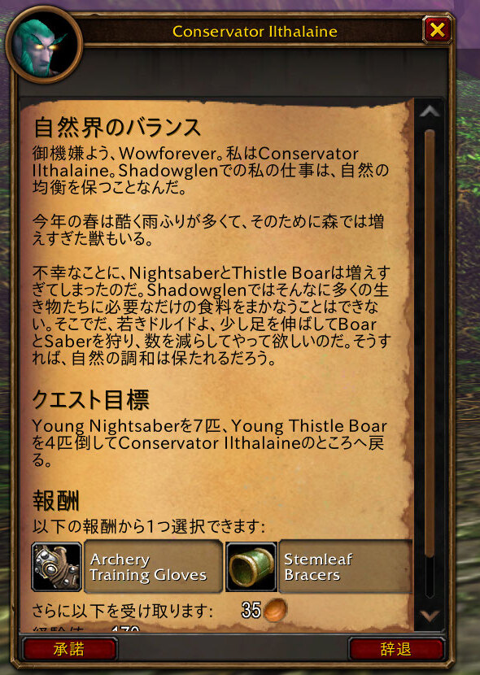
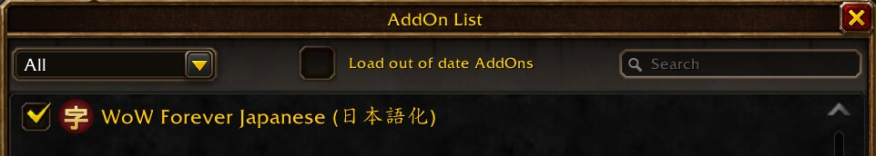
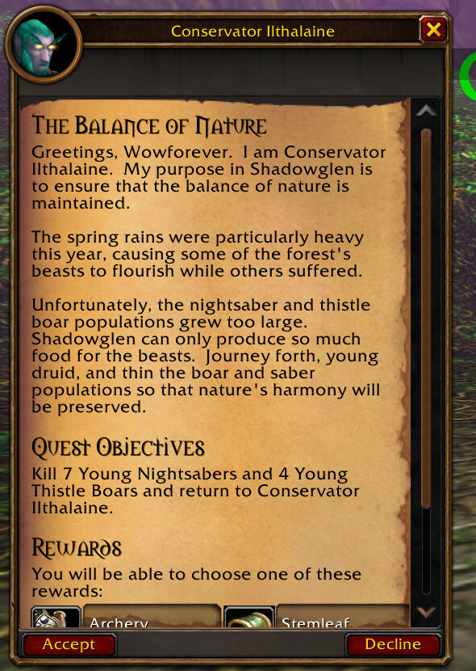
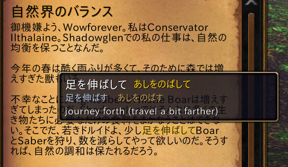
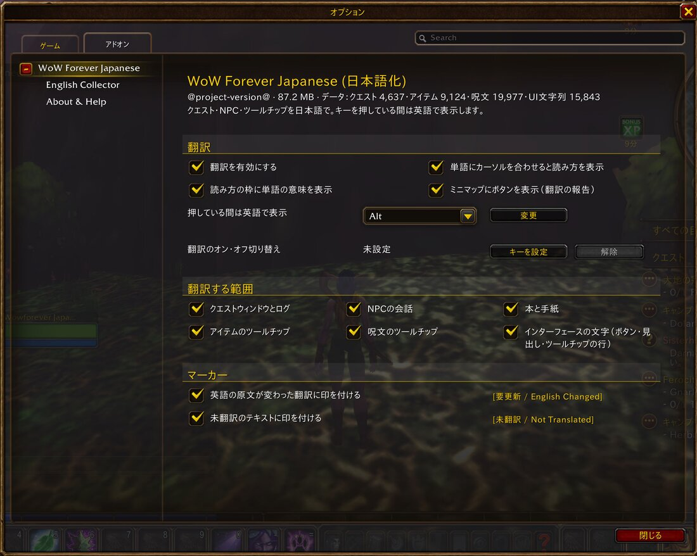
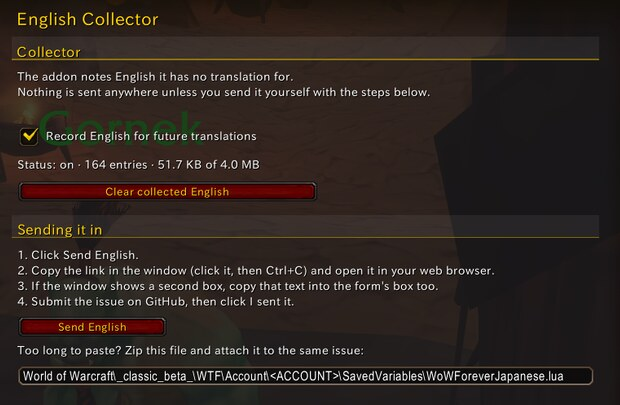
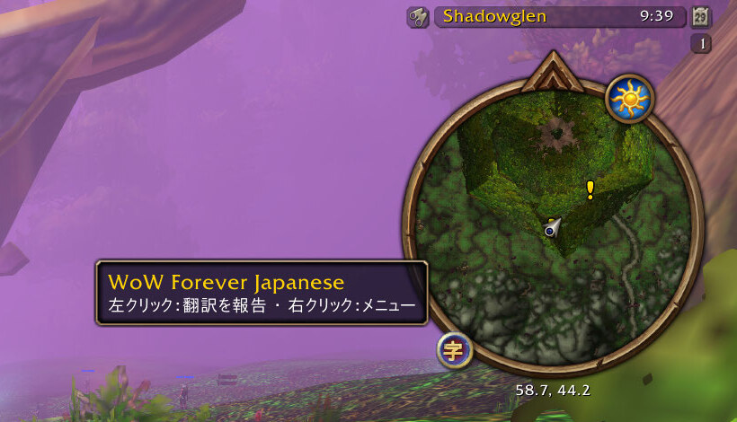
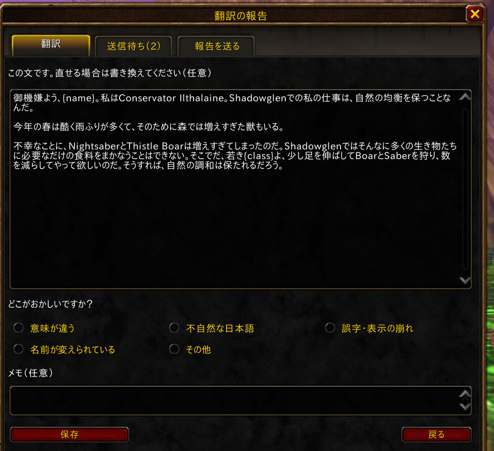
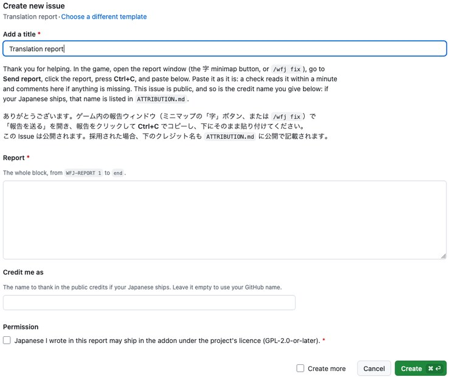

# WoW Forever Japanese (日本語化)

An addon that shows World of Warcraft: Forever in Japanese: quests, NPC dialogue, books, item and spell tooltips,
and the game's interface. Hold **Alt** and the game's own English comes back; let go and the Japanese returns. Alt
is only the default: any key can be chosen. Names of people, places, creatures, items and spells stay in English
everywhere.

It is made for **World of Warcraft: Forever** only. It is not for WoW Classic or for the modern game.

Website: [foreverjapanese.com](https://foreverjapanese.com)

**日本語の説明は[下にあります](#日本語)。**

## Install

### With the CurseForge app

1. Open the CurseForge app, choose **World of Warcraft**, and search for **WoW Forever Japanese**.
2. Make sure your **Forever** install is the one selected at the top of the game page.
3. Click **Install**.

### By hand

1. Download the zip of the latest release from the
   [releases page](https://github.com/zyaga/wow-forever-japanese/releases).
2. Find your Forever client's folder: open the Battle.net app, choose World of Warcraft, pick the Forever version,
   and use **Show in Explorer** (Windows) or **Show in Finder** (macOS) from the gear menu next to the Play button.
   Inside it, open `Interface`, then `AddOns` (create `AddOns` if it is not there yet).
   - Windows: `<World of Warcraft>\<Forever folder>\Interface\AddOns`
   - macOS: `<World of Warcraft>/<Forever folder>/Interface/AddOns`
3. Unzip the download into that `AddOns` folder.
4. Check the folder name: `AddOns` must hold a folder called exactly `WoWForeverJapanese` (not a folder inside
   another folder).

### Turn it on in the game

At the character select screen, click **AddOns**, make sure **WoW Forever Japanese** is ticked, and log in.

## Using it

**Hold Alt to read the English.** Wherever Japanese is showing, holding Alt shows the game's own English until you
let go. Alt is the default. Any key can take its place: Ctrl, Shift, one side of either, a letter or a mouse button.

| Japanese | Holding Alt |
|---|---|
|  |  |

**Popup dictionary.** Point at a Japanese word in quest text, NPC dialogue, a book page or a window label, and a
small popup shows how to read it, its dictionary form, and a short English meaning of the word as the sentence uses it.

**Markers.** A line with no translation yet shows **[未翻訳 / Not Translated]** and stays in the game's English. A
line whose English has changed since it was translated shows **[要更新 / English Changed]**. Either marker can be
turned off.

**Settings.** Open **Esc > Options > AddOns > WoW Forever Japanese**, or type `/wfj config`. You can turn the whole
translation on or off, turn each area on or off (quests, NPC talk, tooltips, the interface, books), change the key
you hold for English, set a key that switches translation on and off, and turn the markers, the popup dictionary and
the minimap button on or off.

**English it has no Japanese for.** When the game shows English the addon has no translation for (quest text, NPC
dialogue with the id of the NPC who said it, item and spell descriptions, NPC names), the addon notes that English
in its saved settings file, so it can be translated later. Your character's name is stored as a placeholder; no
account, realm or location is stored. Nothing is sent anywhere: the file stays on your computer unless you choose
to attach it to an issue. It is on by default, the addon says so in chat the first time, and you can turn it off
under **English Collector** in the settings.

## Reporting a bad translation

1. Click the **字** button on the minimap (or type `/wfj fix`).

   

2. Pick the line from the ones you just read, choose what is wrong, and, if you like, write a better Japanese
   line. Then open **Send report** and copy the report.

   

3. Open a [translation report](https://github.com/zyaga/wow-forever-japanese/issues/new?template=translation-report.yml)
   and paste it. A check reads it within a minute. If your Japanese is used, you are credited by the name you
   choose. The issue and the credit are public.

   

Other problems or ideas: [open an issue](https://github.com/zyaga/wow-forever-japanese/issues).

## FAQ

**Why is a buff's tooltip sometimes in English?** There are two cases.

- **In combat.** The game hides from addons which buff an icon under the minimap is, so its tooltip stays in the
  game's English until the fight ends. Then it is Japanese again.
- **On the target frame.** Buffs and debuffs there always stay English: the game draws their tooltip in a window no
  addon is allowed to touch.

Your own buffs under the minimap and those on party frames are Japanese out of combat. Spell tooltips on your action
bar stay Japanese in combat, the cooldown countdown too.

**Why are names still in English?** On purpose. Names of people, places, creatures, items and spells are never
changed, so what you read matches what other players say and what guides call things.

**What do the markers mean?** **[未翻訳 / Not Translated]** means the line has no translation yet and is shown in
the game's English. **[要更新 / English Changed]** means the English changed after the line was translated.

Both can be turned off in the settings.

**Which game does it work with?** World of Warcraft: Forever only.

## Credits

The hand-written translations are the work of the Japanese translators of **WoWJapanizer**, **QuestJapanizer** and
**CraftJapanizer_Quest**, who are listed by name in [`ATTRIBUTION.md`](ATTRIBUTION.md). Lines those projects did
not cover are machine-drafted and marked as such in the data. Players whose
fixes ship are credited in the same file.

The bundled Japanese font is IPA UI Gothic, under the IPA Font License v1.0.

## License

GPL-2.0-or-later ([`LICENSE`](LICENSE)). Where the text comes from and what is not ours:
[licensing](docs/legal/licensing.md).

This addon is made by fans. It is not affiliated with or endorsed by Blizzard Entertainment. Game screenshots: ©2004
Blizzard Entertainment, Inc. All rights reserved. World of Warcraft, Warcraft and Blizzard Entertainment are
trademarks or registered trademarks of Blizzard Entertainment, Inc. in the U.S. and/or other countries.

## Contributing

Translation fixes, bug reports and code are welcome: see [`CONTRIBUTING.md`](CONTRIBUTING.md). How it works
and why: [docs](docs/overview.md). What changed in each release: [`CHANGELOG.md`](CHANGELOG.md).

---

## 日本語

World of Warcraft: Forever を日本語で遊べるようにするアドオンです。クエスト、NPC の会話、本、アイテムと呪文のツールチップ、ゲームのインターフェースを日本語で表示します。**Alt** キーを押している間はゲーム本来の英語が表示され、離すと日本語に戻ります。Alt は初期設定のキーで、好きなキーに変更できます。人物・地名・モンスター・アイテム・呪文の名前はすべて英語のままです。

対応しているのは **World of Warcraft: Forever** のみです。WoW Classic や現行の World of Warcraft 用ではありません。

ウェブサイト: [foreverjapanese.com](https://foreverjapanese.com)

### インストール

#### CurseForge アプリで

1. CurseForge アプリで **World of Warcraft** を選び、**WoW Forever Japanese** を検索します。
2. ゲームのページ上部で **Forever** のインストール先が選ばれていることを確認します。
3. **Install** を押します。

#### 手動で

1. [リリースページ](https://github.com/zyaga/wow-forever-japanese/releases)から最新版の zip をダウンロードします。
2. Battle.net アプリで World of Warcraft を選び、Forever のバージョンを選んで、「プレイ」ボタン横の歯車メニューから **エクスプローラーで表示**（Windows）または **Finder で表示**（macOS）を開きます。その中の `Interface`、`AddOns` の順にフォルダを開きます（`AddOns` がなければ作成）。
   - Windows: `<World of Warcraft>\<Forever のフォルダ>\Interface\AddOns`
   - macOS: `<World of Warcraft>/<Forever のフォルダ>/Interface/AddOns`
3. ダウンロードした zip をその `AddOns` フォルダに展開します。
4. `AddOns` の中に `WoWForeverJapanese` という名前のフォルダがあることを確認します（フォルダの中にさらにフォルダが入っていないこと）。

#### ゲーム内で有効にする

キャラクター選択画面で **AddOns** を押し、**WoW Forever Japanese** にチェックが入っていることを確認してからログインします。

### 使い方

**Alt で英語を表示。** 日本語が表示されているところでは、Alt を押している間だけゲームの英語が表示されます。Alt は初期設定です。Ctrl、Shift、左右どちらかの修飾キー、文字キー、マウスボタンなど、好きなキーに変更できます。

| 日本語 | Alt を押している間 |
|---|---|
|  |  |

**ポップアップ辞書。** クエスト本文、NPC の会話、本のページ、ウィンドウのラベルで日本語の単語にマウスを合わせると、読み方・辞書形・その文脈での短い英語の意味が表示されます。

**マーカー。** まだ翻訳のない行は **[未翻訳 / Not Translated]** と表示され、英語のままになります。翻訳後に英語が変わった行には **[要更新 / English Changed]** が付きます。どちらも非表示にできます。

**設定。** **Esc > オプション > AddOns > WoW Forever Japanese**、または `/wfj config` で開きます。翻訳全体や項目ごとのオン・オフ、英語表示キーの変更、翻訳を切り替えるキーの設定、マーカー・ポップアップ辞書・ミニマップボタンの表示を切り替えられます。

**まだ翻訳のない英語の記録。** ゲームに表示された英語のうち、アドオンに日本語訳がないもの（クエスト本文、NPC のセリフとその NPC の ID、アイテムと呪文の説明、NPC の名前）は、あとで翻訳できるようにアドオンの設定ファイルに記録されます。キャラクター名はプレースホルダーに置き換えて保存し、アカウント・レルム・位置は保存しません。どこにも送信されません。自分で Issue に添付しない限り、ファイルはあなたのパソコンの中にあります。初期設定ではオンで、最初にチャットでお知らせします。設定の **英語テキスト収集** でオフにできます。

### 翻訳の問題を報告する

1. ミニマップの **字** ボタン（または `/wfj fix`）を押します。

   

2. 直前に読んだ行から選び、何が問題かを選びます。よりよい日本語を書くこともできます。**報告を送る** を開いて報告文をコピーします。

   

3. [翻訳の報告フォーム](https://github.com/zyaga/wow-forever-japanese/issues/new?template=translation-report.yml)に貼り付けます。1 分以内に自動チェックの結果がコメントされます。あなたの日本語が採用された場合は、指定した名前でクレジットに載ります（Issue とクレジットは公開されます）。

   

そのほかの問題や提案は [Issue](https://github.com/zyaga/wow-forever-japanese/issues) へどうぞ。

### よくある質問

**バフのツールチップが英語になることがあるのはなぜ？** 理由は二つあります。

- **戦闘中。** ゲームはミニマップの下のアイコンがどのバフなのかをアドオンに隠すため、そのツールチップは戦闘が終わるまでゲームの英語のままです。戦闘が終わると日本語に戻ります。
- **ターゲットフレーム。** ここに表示されるバフとデバフは常に英語です。ゲームがそのツールチップを、アドオンが触れることのできないウィンドウに表示するためです。

ミニマップの下の自分のバフとパーティーフレームのバフは、戦闘外なら日本語で表示されます。アクションバーの呪文のツールチップは戦闘中も日本語で、クールダウンの残り時間も表示されます。

**名前が英語のままなのはなぜ？** 意図した仕様です。人物・地名・モンスター・アイテム・呪文の名前は変えません。ほかのプレイヤーの会話や攻略情報と同じ名前のまま読めます。

**マーカーは何を表している？** **[未翻訳 / Not Translated]** はまだ翻訳がなく、ゲームの英語のまま表示されている行です。**[要更新 / English Changed]** は翻訳のあとで英語の原文が変わった行です。

どちらも設定で非表示にできます。

**どのゲームで使える？** World of Warcraft: Forever 専用です。

### クレジット

手書きの翻訳は、**WoWJapanizer**、**QuestJapanizer**、**CraftJapanizer_Quest** の翻訳者の皆さんによるものです。翻訳者の名前は [`ATTRIBUTION.md`](ATTRIBUTION.md) に記載しています。これらのプロジェクトが扱っていない行は機械で下訳したもので、データ上でその旨を記録しています。報告から採用された修正の提供者も同じファイルに記載します。同梱のフォントは IPA UI ゴシック（IPA フォントライセンス v1.0）です。

### ライセンス

GPL-2.0-or-later（[`LICENSE`](LICENSE)）。翻訳の出典などは[ライセンスの説明](docs/legal/licensing.md)（英語）を参照してください。

このアドオンはファンが制作したものです。Blizzard Entertainment とは関係がなく、承認も受けていません。ゲーム画面: ©2004 Blizzard Entertainment, Inc. All rights reserved. World of Warcraft、Warcraft、Blizzard Entertainment は、米国およびその他の国における Blizzard Entertainment, Inc. の商標または登録商標です。

### 開発に参加する

翻訳の修正、不具合の報告、コードの変更を歓迎します。詳しくは [`CONTRIBUTING.md`](CONTRIBUTING.md)（英語）をご覧ください。仕組みと設計の理由は[ドキュメント](docs/overview.md)（英語）、各リリースの変更点は [`CHANGELOG.md`](CHANGELOG.md) にあります。
