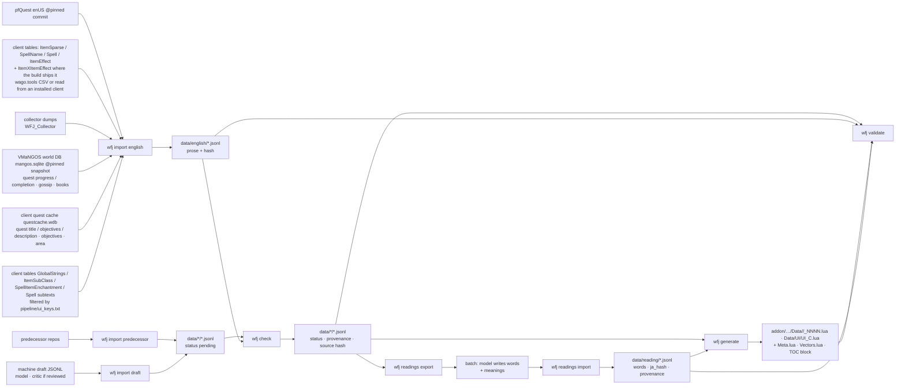

# Data model

> How translation data is stored in `data/` (the source of truth), the English it is checked against, and the compact Lua shape the addon loads. Terms: [Glossary](../glossary.md). Decisions: [ADR-001](../adr/001-id-keyed-data-with-per-field-provenance.md)/[002](../adr/002-live-english-only.md)/[003](../adr/003-ship-stale-with-marker.md)/[005](../adr/005-gossip-key-fingerprint.md)/[007](../adr/007-unaligned-ships-with-runtime-gate.md)/[008](../adr/008-generated-data-layout.md)/[011](../adr/011-provenance-layers-and-completeness.md)/[012](../adr/012-human-decisions-survive-regeneration.md)/[013](../adr/013-collector-english.md)/[014](../adr/014-machine-drafted-text-and-ui-dictionary.md)/[015](../adr/015-ui-text-surfaces.md)/[016](../adr/016-whole-window-interface-coverage.md)/[017](../adr/017-gossip-surface.md)/[019](../adr/019-quest-english-per-field-and-live-check.md)/[020](../adr/020-quest-cache-harvest.md)/[021](../adr/021-client-tables-from-the-local-archive.md)/[022](../adr/022-book-and-trainer-greeting-surfaces.md)/[024](../adr/024-gender-variants-and-short-name-candidates.md)/[027](../adr/027-column-maps-verified-per-build.md)/[031](../adr/031-objective-lines-menus-and-helptips.md)/[032](../adr/032-level-1-gaps-subtexts-and-name-titles.md)/[033](../adr/033-level-1-gaps-name-list-tails-and-untagged-menus.md)/[036](../adr/036-readings-hover-word-lists.md)/[042](../adr/042-client-table-text-families.md)/[043](../adr/043-included-text-icons-and-branch-variants.md)/[044](../adr/044-area-text-and-book-word-cards.md)/[045](../adr/045-player-fix-reports.md).

## Purpose
One representation that is diffable in PRs (one line per translated field), records per-field trust and lineage, rebuilds against new inputs without losing a human decision, and compiles to a Lua table the client loads in one read.

## Diagram


## Components

### `data/<type>/<type>-NNNN.jsonl`: one JSON object per **entry** (id + field), sharded by 1,000 ids
`quest/`, `item/`, `spell/`, `gossip/`, `book/`, `ui/`, `objective/` (keyed by QuestObjective id: `objective-0381.jsonl` holds ids 381000–381999), `area/` (keyed by quest id, field `text`), `unit/` (empty, schema present). `NNNN` = `id // 1000`, zero-padded to 4 (`quest-0007.jsonl` holds ids 7000–7999; `book-0000.jsonl` holds pages 0–999; a book id is the `page_text` entry); gossip shards by the first two hex chars of the key (`gossip-NN.jsonl`); `ui` by the key's first character, upper-cased (`ui-A.jsonl`: no case-only twins on a case-insensitive filesystem). Lines sorted by `(id, field order)`, field order per `FIELDS` in `pipeline/wfj/core/model.py`; a data PR diff is the changed lines. `data/SCHEMA` holds the schema version (`1`, = `model.SCHEMA`) so a bump is a visible diff. Key order is fixed by `model.entry()`; the store (`pipeline/wfj/io/jsonl_store.py`) rewrites only changed shards and deletes shards no longer present in the new set (entries are never deleted from `data/`; a shard disappears only if every id in its range does), and load+save is a byte no-op.
```json
{"id": 2, "field": "title", "ja": "…", "status": "pending", "checks": [], "provenance": {"class": "human", "translator": "Tammy", "source": "cqjt@3446c82", "imported": "2026-09-13", "origins": ["cqjt@3446c82#1"]}, "english": null, "reasons": [], "conflicts": []}
```
- `status` ∈ `pending` · `trusted` · `unaligned` (ADR-007, accepted) · `stale` · `rejected` · `missing`. `import` writes only `pending` (imported, not yet checked); `check` moves every line to `trusted` | `unaligned` | `stale` | `rejected`; decision table in [Pipeline → Rules → status](../systems/pipeline.md#rules): quests with English are `trusted` (or `stale` when a prior `english.hash` differs from the current one), items/spells with client-table English are `unaligned` (no offline names/numbers check, never `trusted`), or `stale` once the English they were checked against changed, `ui` lines with English and matching format specifiers are `trusted` (or `stale`); `gossip` lines that pass the Japanese check are `trusted`, never `unaligned` and never `stale`, since the key is the hash of the English and changed English is a different key; `book` lines (ADR-022) are prose checked against their own English like a quest field (names, numbers, completeness; books also keep the English's HTML tags) → `trusted`, or `stale` once that English changed; `objective` lines (ADR-031) are prose checked the same way (`status.PROSE_KINDS`: every Latin name and number the Japanese carries must be in the English) → `trusted` or `stale`; everything else is `rejected` with `reasons`. Machine drafts written by `import draft` also rest at `pending` until `check` runs.
- `provenance.class` ∈ `human` · `machine` · `correction`. `provenance.source` ∈ `cqjt@<sha>` (Classic plugin quests) · `ctjt@<sha>` (Classic plugin items/spells) · `qjp@0.5.8` (QuestJapanizer 2009, wiki-flagged rows) · `cjq@2012031300` (CraftJapanizer_Quest 2012, named rows), ADR-011 · `correction@<YYYY-MM-DD>` (a hand correction; see Correction below), ADR-012 · `draft-<name>@<YYYY-MM-DD>` (machine-drafted text; see Machine draft below), ADR-014. `provenance.translator` is a person's tag or the community label `questjapanizer-wiki` (uncredited wiki text, incl. the Classic plugin's relabelled `"CraftJapanizer"` layer); machine rows of either lineage source are never imported. `provenance.origins`: every source occurrence that collapsed into the line, as `<source>#<nth entry in file>`; duplicate ids with identical Japanese (NFC + whitespace-collapsed compare) collapse into one line with all origins appended.
- **Correction** (ADR-012): a variant a person wrote: `{"class": "correction", "translator": "Az", "source": "correction@2026-09-14", "imported": "2026-09-14", "corrects": "qjp@0.5.8", "note": "Thistle bore → Thistle Boar"}`. `translator` and `corrects` are required (`validate_line`, on the line and on every `conflicts` entry); `translator` is who wrote the Japanese (for a name fix, the corrected variant's translator); `corrects` is the `source` of the corrected variant; `source` is `correction@<YYYY-MM-DD>`; `note` says what changed; no `origins`. No importer collapses into a correction. For an item or spell, copy the corrected variant's `extra` into the correction (a promotion keeps only the winner's `extra`). Written as an extra object in the line's `conflicts`; `check` promotes it when it passes. The truncation rule's first-paragraph-only layer test reads `corrects` when present, so a corrected text from the relabelled wiki layer stays under the structural rule.
- **Machine draft** (ADR-014): a variant a model wrote: `{"class": "machine", "model": "<model id>", "critic": "<critic model id>", "source": "draft-ui@2026-09-14", "imported": "2026-09-14"}`. `model` is required (`validate_line`, on the line and on every `conflicts` entry); `critic` is optional (non-empty when present) and recorded only when a second model actually reviewed the draft; a critique pass is per batch, not required (ADR-014); no `translator`, no `origins`. Written only by `wfj import draft` (below). **Hand-written** = `human` or `correction`; hand-written always ranks ahead of machine, and a machine variant on a line that has a `human` / `correction` variant is not a candidate at all unless it carries `ruling: accept` ([principle 6](principles.md#6-provenance-on-every-line-people-over-machines)). To replace a machine line by hand: add a `correction` variant with `corrects: "<the draft's source>"` and run `make check`.
- **Fix report fields** ([ADR-045](../adr/045-player-fix-reports.md)): a variant written by `wfj report apply` from a player's fix report carries `report`: the GitHub issue number, a positive int, allowed on `correction` and `machine` provenance only. A `correction` the model wrote (a `rewrite` decision) also carries `model`, a non-empty string; a `correction` that is the player's own Japanese (a `use` decision) has none, and its `translator` is the reporter's credit name. `{"class": "correction", "translator": "<credit name>", "source": "correction@2026-10-02", "imported": "2026-10-02", "corrects": "<the corrected variant's source>", "note": "fix report #12 (awkward / unnatural): … (the player's Japanese; approved by the maintainer)", "report": 12}`. A machine line rewritten from a report is replaced in place: `{"class": "machine", "model": "<model id>", "source": "report-12-sg<n>@2026-10-02", "imported": "2026-10-02", "report": 12}` (`-sg<version>` only on a styled field). Both keys are optional and additive; `data/SCHEMA` stays `1`. `model._provenance_problems` refuses `report` on any other class, a non-positive or non-int `report`, and an empty `model` on a correction. `ATTRIBUTION.md`'s Correctors section lists every `correction` translator with `report` and no `model`.
- **`ui` ids** (ADR-014, ADR-016, ADR-032, ADR-042): `UI_KEY_RE`: a Blizzard global-string name (`^[A-Z][A-Z0-9_]*$`, e.g. `ACCEPT`), `ItemSubClass:<classID>:<subClassID>` (an item subclass word, incl. the container family `ItemSubClass:1:*`: Bag, Soul Bag…), `SpellItemEnchantment:<id>` (an enchantment's stat line, "+3 Fire Spell Damage"), or `SpellSubtext:<spellID>` (a spellbook subtext, "Racial Passive"; the Spell table's `NameSubtext_lang`; one representative spell id per distinct prose English, 12 keys; pet families, form names and `QASpell` test rows are names and never listed; a pytest pins the list), or `<Family>:<id>` ([ADR-042](../adr/042-client-table-text-families.md)): a **client-table text family**, keyed by the table's row id: `FactionDescription`, `AchievementTitle`, `AchievementDescription`, `AchievementReward`, `AchievementCategory`, `SkillLineDescription`, `SkillCategory`, `EmoteText`, `HolidayDescription`, `CurrencyDescription`, `CurrencyCategory`, `DispelType`, `CreatureType`, `QuestSort`, `CustomizationCategory`, `CustomizationOption`, `CustomizationChoice`, `CustomizationSource`, `PvpColumn`, `PvpColumnTooltip`, `LfgCategory`, `LfgActivityGroup`, `LfgActivity`, `WidgetText`, `ItemNameDescription` (`core/model.UI_FAMILIES`, equal to `io/wago.TEXT_FAMILIES`' keys); and `ItemSubClassName:<classID>:<subClassID>` (the long subclass name the auction house's category list shows: "Staves", "One-Handed Axes"; from ItemSubClass `VerboseName_lang`, else `DisplayName_lang`; `ItemSubClass:<c>:<s>` stays the short tooltip word). Every family and `ItemSubClassName` is **restricted** (`core/model.RESTRICTED_FAMILIES`, `ui_family`): the addon finds its rows only where a widget names the family, so `validate`'s one-Japanese-per-English rule compares a restricted key only with keys of its own family: "Close" may be 閉じる as `CLOSE` and 寄せ as a `CustomizationChoice`. One key per distinct English per family is listed: the addon finds the text by its fingerprint, so one row answers every id with that English. `EmoteText:<id>` rows are **slotted**: the English keeps `%s` slots the chat line fills with names (`%s waves at %s.`), the Japanese keeps them (positional `%N$s` when the order changes), and the addon matches the line by putting the names back ([Addon modules](addon-modules.md)). `WidgetText:<id>` rows are **numbered** (`core/numbered`): the English holds world-state tokens (`Towers Controlled: %2327w`) the client replaces with live numbers; `data/` keeps the tokens in the Japanese, and `generate` ships the hash of the English skeleton (every token and digit run `#`) as the row's h1 and the Japanese with each token as `%<k>$s`, k its place among the English's number runs. Names (faction, skill, currency, holiday, class, race, zone, profession) are never family keys. Anything else is refused by `validate_line`. **Curation** (`pipeline/ui_keys.txt`, tested by `test_ui_keys.py`): no key whose English is a name (a reviewed collision list); colour codes (`|c…|r`), plural grammar (`|4singular:plural;`), file textures (`|T<path>:<size>…|t`) and the `|n` break are allowed (kept verbatim, below); links (`|H`), atlas textures (`|A`), `|K` and `$` tokens are not. Enchant *names* ("Crusader") are never keys.
- **`import draft`** (`wfj import draft <type> <draft.jsonl> --model M [--critic C] --date D --name N`; `make import-draft`): rows are exactly `{"id", "field", "ja"}`. Per (id, field): absent → a new `pending` line (**added**); a variant with the same text (`ja_identity`) → **unchanged**; a machine variant from the same draft name → **replaced** (machine replaces machine); otherwise → **appended** to `conflicts`. It never edits a `human` / `correction` variant; a duplicate or invalid row, or an unknown type, writes nothing. **`--reverify`** (`REVERIFY=1`; `ui` only; `import_draft.REVERIFY_TYPES`): every line the draft names (added, replaced or unchanged) records the current English store's `{hash, src}` for its (id, field) as its `english`, because the draft was written against that English; `check` then judges the line against it instead of keeping a stale line's old hash. A row whose (id, field) has no English line is refused and nothing is written. Without the flag the import is unchanged.
- `checks`: which checks actually had something to compare (`names`, `numbers`, `length` when the English is multi-paragraph or the tiny-ratio cut fired) plus `specifiers` (a `ui` line whose English or Japanese has a format specifier) and `tiebreak` when several passing variants were settled by rank (class first: correction, human, machine; then paragraphs, source, named translator). `[]` until `check` runs; an entry with no Latin names and no numbers keeps `checks: []` after checking: visible, counted in `report`, and ships as `trusted`. Items/spells always keep `checks: []` offline (ADR-007).
- `english`: `null` until `check` records `{hash, src}`. `hash` is taken from the English store (never recomputed) in this order: the line's **own** field (quest `title`/`objectives`/`description` from Blizzard's quest cache where cached, else pfQuest (ADR-020); `progress`/`completion` from VMaNGOS; item/spell `description` from the client tables' tooltip text) → the quest's `description` (quest `progress`/`completion` with no VMaNGOS English) → the item/spell `name` (an item/spell `description` with no tooltip English) → the hash of the joined scope without `progress`/`completion` (quests whose pfQuest entry has only a title, so VMaNGOS English arriving does not change their hash). `src` is the source of the field actually used, per field (ADR-019): quest 33's `description` records `pfquest@7786596`, its `completion` `vmangos@13b49dc`. A **quest** line checked against another field's English also records which one: `{"hash", "src", "of"}` with `of` ∈ `description` · `joined` (An item / spell line checked against `name` records `of: "name"` too, but still ships its `h1`). Such a field ships with no `h1` (below), so the addon never compares its live English with another field's hash. A quest with no title / objectives / description English (only VMaNGOS progress / completion) has nothing to join: those three fields are `rejected` `no_english_id`. A change to that English marks a quest, `ui`, item or spell line `stale` on the next run. An item/spell `description` line records the tooltip-text hash, not the name hash; a baseline taken from the name (`of: name`, or a hash equal to the current name hash) never makes a line stale: a rename re-baselines it, and the line's own tooltip English is judged fresh when it arrives. A changed number is still invisible offline (the English is a template); the addon's gate catches it (ADR-007). A `no_english_id` line keeps the `english` it was last checked against (ADR-034), so English that comes back reworded makes the line `stale` rather than freshly checked. It is `null` only when the line never had English. A **gossip** line's `english` is `{"hash": "<its key>", "src": "gossip-key@normalize_v1"}` (`check.GOSSIP_SRC`): the key is the English hash, so no English store is consulted: `data/english/gossip` (collector English) stays stored, not consulted. **Included spells** ([ADR-043](../adr/043-included-text-icons-and-branch-variants.md)): an item / spell line whose English splices other spells in (`$@spelldesc<id>`, `$@spelltooltip<id>`, `$@spellname<id>`, nested ones too) also records `"includes": {"<spellid>.<field>": "<that spell field's English hash>"}` (`""` for a spell the tables lack): `{"hash", "src", "includes"}`. A change to any of them makes the line `stale` like a change to its own English, and `validate` accepts that stale line although its own hash is current.
- `reasons` (rejected), as written by `check`: `no_english_id` (no English scope for the id: no source has English for it, or the served step removed it because no Forever build has served the id; the Japanese stays in `data/` and ships again when a later harvest lists the id) · `not_japanese` · `duplicate_conflict` · `alignment_failed:<name>` (a Latin name in the Japanese not found anywhere in the quest's English) · `numbers_changed:<n>` (a number in the Japanese not found anywhere in the quest's English; checked only for fields that have their own English: `title`/`objectives`/`description`, and `progress`/`completion` when VMaNGOS has them) · `truncated:<ja paragraphs>/<en paragraphs>` (a first-paragraph-only translation: English ≥ 2 paragraphs, Japanese 1, under 0.22 of the English length, or under 0.08 regardless; ADR-011) · `specifiers_changed:<detail>` (`ui` only: the Japanese does not take exactly the English template's arguments; `core/specifiers.py`) · `ruled_reject` (the line's only candidate carries `ruling: reject` and passes the rules; the ruling keeps it out) · `markup_changed:<detail>` (`ui` only: the Japanese does not keep the English's colour tokens `|cAARRGGBB` / `|r`, line breaks (`\n` and, the `|n` escape) and file textures `|T…|t` (Compared verbatim, path, size and all), or carries a malformed `|4` plural group; a `|4` group may be dropped; `core/markup.py`) · `markup_changed:html:<detail>` (`book` only: the page's English is an HTML page (starts with `<HTML`) and the Japanese does not carry the same tag sequence: names case-insensitive, attributes whitespace-collapsed; `markup.html_mismatch`). A `ui` template with no words outside its specifiers and colour codes (`(%s)`) is not `not_japanese` for lacking kana.
- `conflicts`: losing duplicate variants `{ja, provenance}` (+ optional `extra`, `ruling`); duplicate ids with *different* Japanese; the first occurrence wins the line (`status: pending` at import). `check` rules first, `ruling` second: if exactly one variant passes the rules it becomes the line (`promote` swaps `ja`, `provenance`, `extra`, `ruling` in and moves the displaced variant into `conflicts`; nothing is deleted, but any other hand-added key on a conflict entry is not carried); zero or several passing → `rejected/duplicate_conflict` until a person rules. **Stored order** (ADR-012 §5): after promotion `check` sorts every line's `conflicts` by `provenance.class` (`human` < `correction` < `machine` < other), then `source`, `translator`, `ja` (`core/dedupe.canonical_conflicts`), so the bytes never depend on which variant was promoted before; winner selection never reads this order.
- `ruling` (optional, on a line and on each conflict candidate): `{"ruling": "accept" | "reject", "by": "<who>", "date": "YYYY-MM-DD", "note": "<why>"?}` (`note` optional; `dev/rule_held_back` writes one). `accept` on exactly one variant wins the conflict (two accepts → no winner); `reject` excludes a variant. A `machine` variant can win a line that has a hand-written variant in two ways only: it carries `accept`, or **every** hand-written variant on the line carries `reject` (ADR-014; [ADR-023](../adr/023-server-only-text-drafted-in-measured-batches.md) puts `reject` on the 759 quest completion lines whose hand-written text all failed the rules). A ruling decides only *which variant* is the line; the rules still decide its status (an accepted variant that fails alignment is still `rejected`), and an `accept` on a line with no `conflicts` has no effect. A `reject` ruling is permanent: a reject-ruled variant is never a candidate again, even when it later passes the rules (new English, an allowlist entry, a rule change); on a line whose only candidate is ruled `reject` the line is `rejected`, keeping that variant's own reasons, or `ruled_reject` when it passes. To resolve a `duplicate_conflict`: add `ruling: accept` to the chosen variant (line or conflict entry) in the JSONL, run `make check`, commit; `check` promotes it. Accepted by `model.validate_line`. A ruling is carried across `make import` / `make data` (below).
- Empty source fields are omitted at import: no `missing` lines are written; `missing` is derived later as `FIELDS` minus the fields present for an id.
- `extra` (optional, after `conflicts`; only `ruling` may follow it): recorded-but-not-a-field data. Spells keep the predecessor's short text as `extra: {"short": "…"}`. Items have `$N1`-style value tables substituted at import (`"$N1"` → `"70-90"`).
- `stale` is **derived at check time** (`english.hash ≠ current English hash`), never authored, and **sticky**: a stale line keeps the hash it was checked against, so it stays `stale` on every rerun until an audit pass re-verifies it and writes the current hash (ADR-003). For `ui` lines that audit pass is `import draft --reverify`: re-import the line's Japanese (unchanged or re-drafted) with the flag, and the current English is recorded; no hand edit of `english`. `make import` / `make data` carry each line's `english` baseline across the rebuild, keyed by `(id, field)` and not by the Japanese text (ADR-012 §4), so a full `make data` and `make import-english` + `make check` derive the same `stale` lines. **Re-baseline, once** (ADR-019): a `progress` / `completion` line whose prior `english.src` starts with `pfquest@` was checked against the description's hash (pfQuest never provides those fields); when the field now has its own English, `check` judges the line fresh against it instead of calling it `stale`, and records the `vmangos@` hash. A baseline already from `vmangos@` is never re-baselined; a later VMaNGOS change marks that field `stale` like any other. No timestamps anywhere in the line; `imported` is the only date and never changes → `check` is idempotent and byte-stable (CI depends on it).
- Nothing is deleted; rejected keeps `ja`.
- **Carried variants** (ADR-012): `import predecessor` rebuilds the quest / item / spell stores from the pinned inputs, so a normalisation fix in an importer lands on every line, but first reads the existing stores and carries every `correction` variant, every `machine` variant (ADR-014: a draft is not reproducible from any pinned input) and every variant with a `ruling` (`core/decisions.carried`, sorted canonically so the rebuild is byte-stable). A correction is always kept as its own variant (only a byte-identical correction already present is redundant); a machine draft likewise (one identical by `ja_identity` to a variant present is redundant), and no importer collapses into either; a ruled imported variant whose text (`ja_identity`) a rebuilt variant has → that variant takes the ruling, new text → appended to `conflicts` with its own `provenance` / `extra` / `ruling`; an (id, field) the inputs no longer produce → the carried variant becomes the line, except a lone `reject`-ruled one (counted, not shipped). An edit to an imported `ja` that is not marked `correction` is not carried.
- **Paragraph breaks** in `ja` are the canonical `\n\n`: every quest importer turns the sources' 2- or 4-space runs after a sentence terminator into it (`core/paragraphs.normalize_breaks`); `generate` escapes it (`\n`) and the client's `SetText` renders it. English paragraphs are the `$B` runs in the raw pfQuest text.
- **Player placeholders** in `ja`: the corpus's `{name}` / `{class}` / `{race}` tokens and `<male/female>` word pairs are stored literally, never substituted in `data/` or in the generated Lua; the addon expands them per player when the Japanese is applied (`Core/Placeholders.lua`, [Addon modules](addon-modules.md)). `wfj stats` prints the token counts over the shipped lines of each type (`placeholders in shipped lines`). A shipped line carrying any other `{word}` fails `wfj validate` ([Pipeline](../systems/pipeline.md)). Term: [Player placeholder](../glossary.md).
- **Merging sources:** the lineage sources merge rather than rebuild. `make import` merges them inside `import predecessor`'s pass (`--questjapanizer` / `--craftjapanizer-quest`, after the decision carry and before the `english` baseline carry); the standalone `import questjapanizer` / `import craftjapanizer-quest` merge into the committed store. Either way the collector is seeded with the existing quest lines, so a same-(id, field) line with identical Japanese appends an `origins` entry and a different one appends a `conflicts` variant with its own provenance; `check` then picks the winner (exactly one passing variant, else a `correction` first, then the one covering more English paragraphs, then source priority `cqjt` > `cjq` > `qjp` > `qjwiki`, then a named translator over the community label). An identical text arriving with a named credit gives the kept line that translator (source unchanged; `origins` shows where the credit came from). A ruled lineage variant carried at the rebuild collapses with its re-import (origin appended once).

### `data/english/<type>/<type>-NNNN.jsonl`: English prose, never shipped
`{"id": 2, "field": "title", "en": "Sharptalon's Claw", "hash": "<16 hex>", "src": "pfquest@7786596"}`: `hash = key(normalize_v1(en))` (the shared hash primitive). `ENGLISH_FIELDS` is wider than `FIELDS`: item and spell additionally carry a `name` field (`{"id": 117, "field": "name", "en": "Tough Jerky", "hash": "…", "src": "wago@1.15.9.69722"}`), and spell an `aura` field (the buff / debuff text), kept out of every check scope. A quest's area description is its own type, `area` (below). Client-table lines carry `src = "wago@<build>"` (wago.tools CSVs) or `src = "db2@<build>"` (the same tables read from an installed client with `make tables-extract`, ADR-021); the two labels are one source for merging (below). `book` (ADR-022), `objective` (ADR-031) and `area` (ADR-044) have English, a Japanese store, a check, generated Lua and a screen. Each has the single field `text`; `objective` is keyed by the QuestObjective id, `book` by the `page_text` entry, `area` by the quest id. Collector lines carry `src = "collector@<client build>"` (e.g. `collector@1.15.9.69722`). **Gossip** lines are keyed by the gossip key and may carry `npcs`, the creature ids the collector saw say the line: `{"id": "70f068541ce5e138", "field": "text", "en": "Goodbye.", "hash": "70f068541ce5e138", "src": "collector@1.15.9.69722", "npcs": [68, 295]}`; `id == hash`. `validate_line(english=True)` allows `npcs` on gossip lines only, as a non-empty sorted list of unique ints with 0 < id < 2^31 (a dump entry's `n` is at most 32 ids, but the union across dumps here is uncapped, so the blast radius counts every NPC); every other English line is exactly `{id, field, en, hash, src}`. `npcs` is review data for the `wfj stats` blast radius, never part of the key (ADR-005). **Both sources share one `en` convention: Blizzard's tokens:** pfQuest lines are the raw pfQuest text (`$N`/`$C`/`$R`, `$B` breaks, markup as pfQuest has it); collector lines are the collector's tokens with markup already stripped (the player's name as `$N`, quests and gossip only class/race as `$C`/`$R`, paragraphs joined with `$B$B`). VMaNGOS lines are the database text verbatim, in the same tokens (`$N`, `$C`, `$B$B`). Quest-cache lines (`src wdb@<build>`) are Blizzard's raw template from `questcache.wdb` (`$B`, `$N`, `$G a : b;`). Client-table tooltip lines are the raw client template (`Restores $o1 health over $d.`), with a CSV `\n` read as a line break. So `hash = key(normalize_v1(en))` holds for all four and `paragraphs.count_english` counts a collector paragraph exactly as a pfQuest one ([ADR-011](../adr/011-provenance-layers-and-completeness.md)). Same shard naming as `data/<type>/`. Per type the source is:
| type | English source | note |
|---|---|---|
| quest | pfQuest `db/enUS/quests.lua` at a pinned commit (T/O/D → title/objectives/description); Blizzard's quest cache (ADR-020, `import english wdb`): the client's `Cache/WDB/enUS/questcache.wdb` after a quest scan → title/objectives/description, src `wdb@<build>` (the client's pinned build, which must equal the build in the file's header), **replaces pfQuest's line for every (id, field) it caches**; both clients' caches are imported, Classic Era then Forever, under union (inputs per client in `predecessors/clients/<client>-<build>/`), so a quest a cache answered is taken whole: a blank cached field drops pfQuest's (or the earlier cache's) line and that field has no English; while a quest only the other cache answered keeps its line at that build; VMaNGOS world DB `quest_template` (`import english vmangos`): per `entry` the row with the highest `patch` (the 1.12 text), `RequestItemsText` → `progress`, `OfferRewardText` → `completion`, src `vmangos@13b49dc`; collector for any of the five fields: the English the Forever client showed, which replaces a stand-in (pfQuest, VMaNGOS, a Classic Era cache line) for that (id, field) and is the only source of Forever's own progress and completion text (ADR-053); a later `import english vmangos` or `pfquest` run replaces a collector line for an (id, field) it provides, so the dump is imported again after it | pfQuest vendored: ~2 MB; VMaNGOS `13b49dc` provides progress 3,257 · completion 4,220; the lines that remain after the served step are counted in [coverage](../operations/coverage.md); collector lines only where a dump was imported |
| item, spell | `name` lines from `ItemSparse`/`SpellName` (the ID existence list + display name; `import english wago-ids`); tooltip English from the client tables (`import english client-text`): spell `description` = `Spell.Description_lang`, spell `aura` = `Spell.AuraDescription_lang`, item `description` = the item's `ItemEffect` spells' descriptions in (slot, effect id) order; only effects whose `TriggerType` the tooltip prints: 0 Use, 1 Equip, 2 Chance on hit, 5 Use without delay (ADR-021; 6 learn spell and 7 loot tracker are counted and printed, not joined); then `ItemSparse.Description_lang` (flavour), non-empty parts joined by a line break; raw templates, no numbers (ADR-007). Src `wago@<build>` or `db2@<build>` (the client's pinned source and build: Classic Era `wago@1.15.9.69722`, Forever `db2@1.60.1.70170`), which must match the CSVs' source stamp (`tables-source.txt`) or the import refuses. A collector `description` (rendered text, ADR-007) is kept only where the client tables give none. **An item's tooltip "Use:" / "Equip:" line is the *spell's* description, never `ItemSparse.Description_lang`** ([ADR-027](../adr/027-column-maps-verified-per-build.md)): the path is item → item-effect join → `ItemEffect.SpellID` → `Spell.Description_lang`, and `ItemSparse.Description_lang` is only the flavour line: for item 4536 (Shiny Red Apple) it is **empty** on the Forever client, while `data/english/item` holds `"Restores $o1 health over $d.  Must remain seated while eating."` for that id, which is spell 433's description. The two must not be conflated in either direction. **Which table carries the join is per build:** on Classic Era 1.15.9.69722 it is `ItemEffect.ParentItemID`, read from that table's relationship map; on Forever 1.60.1.69913 that relationship map is empty (every section reports `relationship_data_size` 0, against Classic Era's 135,732 bytes), so `ParentItemID` is written `0` for all 12,571 rows and the join comes from `ItemXItemEffect` (12,565 rows) instead; an `optional` table Classic Era does not ship at all | 1.15.9.69722: spell description 17,615 · aura 6,543 · item description 12,814 (1,898 with flavour text, 12,254 with effects); an item with any shown (trigger type 0/1/2/5) effect naming a spell the Spell table lacks gets no description English; hidden-type effects never make an item incomplete |
| gossip | collector `gossip` entries: the gossip window's greeting and options and the quest window's greeting prose, field `text`, `id` = the gossip key, `npcs` unioned across dumps; VMaNGOS: `broadcast_text.male_text` / `female_text` referenced by `npc_text.BroadcastTextID0..7`, `gossip_menu_option.option_text`, `quest_greeting.content_default`: `id = hash = key(normalize_v1(en))`, no `npcs`, src `vmangos@13b49dc`; the quest cache (`import english wdb`, [ADR-054](../adr/054-quest-text-keyed-by-its-english.md)): a quest's conditional descriptions and its completion log line, same key, no `npcs`, src `wdb@<build>`, added only where the key is new | VMaNGOS `13b49dc`: 4,532 gossip keys, 10,641 with the NPC speech `import english vmangos` adds; collector keys only where a dump was imported (a greeting only Forever has arrives this way). A gossip line is checked against its key, so the first `data/gossip/` line (machine-drafted, the Shadowglen greeting) ships without an English line |
| objective | Blizzard's quest cache (`import english wdb`): each objective's own text ("Rescue Drull"), field `text`, `id` = the QuestObjective id stored with the objective (quest 498 → 381177), src `wdb@<build>`; an id cached under two quests is an error. Translated (the quest map's objective lines, ADR-031); an objective whose whole text is a name ("Flame of Azel") is listed in `pipeline/objective_names.txt` and has no Japanese line | lines from the two clients' caches, each drafted or listed as a name; the counts are in [coverage](../operations/coverage.md); kill / collect objectives have no text (the client builds those lines from its `QUEST_*` templates) |
| area | Blizzard's quest cache (`import english wdb`): a quest's area description: the text of an exploration / event objective ("Scout through the Fargodeep Mine"); field `text`, `id` = the quest id, src `wdb@<build>`; follows its quest in the union / replace merge and in `served`. Translated (drafted like objective; found in the addon by fingerprint in the objective index, ADR-044) | 218 lines (203 unique hashes): `wdb@1.15.9.69722` × 120, `wdb@1.60.1.70124` × 98; 216 drafted, 2 name only |
| book | VMaNGOS `page_text` (`import english vmangos`): one line per non-empty page, field `text`, `id` = the page `entry` (pages chain through `next_page`), src `vmangos@13b49dc`. Translated (the item text window, ADR-022) | 1,257 pages; 63 English hashes shared by several pages; 62 HTML pages; 173 with `$B` / `$N` / `$C` |
| unit | collector `npc` entries → field `name` (quest givers, keyed by creature id); pfQuest `units.lua` names (for later) | only the quest givers an imported dump named |
| ui | wago `GlobalStrings` (`BaseTag` → `TagText_lang`, `\n` read as a newline and, `\\` as one backslash, in one pass, so a texture path the table writes `Interface\\GroupFrame\\…` reads `Interface\GroupFrame\…`, as the client's `_G` holds it), `ItemSubClass` (`ItemSubClass:<ClassID>:<SubClassID>` → `DisplayName_lang`) and `SpellItemEnchantment` (`SpellItemEnchantment:<ID>` → `Name_lang`, stat lines only) and, with `--subtexts`, `Spell` (`SpellSubtext:<ID>` → `NameSubtext_lang`) and, with `--families` (Forever only), the text-family tables (twenty-two: `<Family>:<ID>` → the family's text column, developer text filtered) and ItemSubClass `VerboseName_lang` (`ItemSubClassName:<c>:<s>`) at the pinned build, **only the keys listed in `pipeline/ui_keys.txt`** (`import english wago-ui`, field `text`, src `wago@<build>` or `db2@<build>`); a list entry ending in `:*` is a family expanded to every table key with that prefix; a listed key absent or empty fails the import | `en` is the raw template (`Requires Level %d`, `%d \|4Day:Days;`) |
Server-sent text has no upstream to re-fetch, so English is vendored, not indexed.

**Merge between sources** (ADR-013): each importer owns its own lines. `pfquest` / `vmangos` (quest, book) / `wdb` (quest, objective, area) replace their lines and any `(id, field)` they provide and keep other sources' lines, so quest title/objectives/description are `wdb@` where Blizzard's quest cache has them (ADR-020; `import english wdb` runs after `pfquest` and `vmangos`, so the last import owns the key), `pfquest@` elsewhere, and progress/completion are `vmangos@`. The client-table imports, `wago-ids` (`name`), `client-text` (item `description`, spell `description` / `aura`) and `wago-ui` (`text`), merge per field over one source family: a `wago@` or `db2@` import replaces that family's lines of its own fields under either label, plus any other source's line for an (id, field) it provides, so names, tooltip text and UI strings never wipe each other and a `db2@` re-import leaves no `wago@` line of those fields behind. `vmangos` gossip replaces its own `vmangos@` gossip lines as a set; a key already present from another source is kept as it is, `npcs` included (the key is the hash of the English, so it is the same text). A re-import keeps `npcs` that `import english collector` unioned onto a `vmangos@` gossip line; it refuses to replace existing `vmangos@` gossip lines with zero lines, and two different normalized texts under one hash are an error (never resolved silently). Both types are merged before either is written. `collector` takes what the Forever client showed as the English ([ADR-053](../adr/053-forever-shown-english-is-the-english.md)): absent → added, same hash → unchanged, another hash → **replaced** when the stored line is an earlier `collector@` line or a stand-in (pfQuest, VMaNGOS, a client of another game version), with any literal class or race word the stand-in has where the dump wrote `$C` / `$R` put back (`_restore_literals`, kept across re-imports); a line from the same client's own files (its `db2@` / `wago@` tables or `wdb@` quest cache, a `src` whose version shares major.minor with the dump's build) is **kept** and reported as `differs from the client's own files (kept)`. A gossip line with the same hash whose dump names a new NPC gets the union of `npcs`.

**The served step** ([ADR-034](../adr/034-forever-is-the-only-target.md), amended by [ADR-050](../adr/050-english-is-additive.md); `pipeline/wfj/cmd/served.py`, `make import-served`): Forever is the only target, and Classic Era is an input, so after every client is merged `make import` / `make import-english` run `wfj import english served <QuestV2.csv> <questcache.wdb> <ItemSparse.csv> <SpellName.csv> [--map-cache <other client's questcache.wdb>]...` with the Forever client's folder. It is additive: it drops English only for ids Forever has never served. What this build serves: `quest` ids in QuestV2 or the Forever quest cache (placeholders included); `item` ids in ItemSparse; `spell` ids in SpellName; `ui` keys whose English carries the Forever tables' stamp (from `tables-source.txt`: under the union merge Forever wins wherever it has the key) and that are in `ui_keys.txt`. Those ids are added to the committed **served record** `pipeline/served/<kind>.tsv` (kinds quest, item, spell, ui; one `id<TAB>first build<TAB>last build` row per id, under a `#` header line), and their last build moves forward. A line stays in `data/english` when its id is in the record (served by this build or an earlier one) or its `src` is Forever's own (`wdb@1.60…`, `db2@1.60…`); an `area` line follows its quest; an `objective` line follows its quest, mapped through the Forever cache first, then each `--map-cache` (an objective no cache maps is kept and counted). An id an earlier build served that this build did not keeps its English and its older last build, and the import prints `served <kind>: N ids an earlier build served, not served on <build>: kept (pipeline/served/<kind>.tsv keeps their last build)`; nothing acts on that list. `book`, `gossip` and `unit` English and every `data/<kind>` Japanese line are untouched. The set is Forever's own tables, not the English's stamp: a quest QuestV2 lists that the server has not answered yet keeps its Classic Era English and ships. It refuses before writing on a missing input, CSVs whose stamps are missing or differ, a cache whose build is not the stamp's build, or a kind that would lose every line; `--dry-run` prints the counts only; it is idempotent. A Japanese line whose English it removed (Classic Era-only content) is `rejected` `no_english_id` at the next `check` (keeping its last baseline) and is not generated; when a later harvest lists the id, the English returns and the line ships with no data edit.

**Consulted for quest and gossip** ([ADR-053](../adr/053-forever-shown-english-is-the-english.md)): `check` / `validate` / `stats` build quest and gossip scopes from `collector@` English like any other source (`CONSULTED_COLLECTOR_TYPES` in `pipeline/wfj/cmd/check.py`), so an imported dump moves a quest line's hash to the English Forever showed; a quest `progress`/`completion` line whose only English is a collector line is checked against it rather than the `description` fallback. Item and spell collector English stays unconsulted (`UNCONSULTED_SOURCES`): it is recorded with the numbers filled in, while the client tables hold the templates. `wfj stats` lists gossip keys with English by NPC count (the blast radius), and `wfj stats --stale [--dump <SavedVariables>]` lists quest lines whose collector English read from a dump differs from the checked hash ([ADR-017](../adr/017-gossip-surface.md), [Collector](../systems/collector.md)).

### `pipeline/served_columns.txt` + `pipeline/served_dispositions.txt`: the served-text inventory ([ADR-052](../adr/052-coverage-by-served-data.md))
Two committed files say what text the Forever client serves and what the project does with each piece of it. Coverage is measured against them, not against a list of what a player is likely to see.

- **`served_columns.txt`** is generated per build by `make served-columns` from the installed client (read-only, no network). A header names the build; then one line per text column of every DB2 table the install ships: `<table>.f<field>  rows=<n>  text=<non-empty>  distinct=<n>`. A hotfix table the archive does not name is `hash-<hash>.*  hotfix-only`, a table the reader cannot open is `<table>.*  unreadable: <reason>`, and each server cache (`Cache/WDB/enUS/*.wdb`: quests, NPC text, book pages, creature and object names) is `wdb-<name>.*  records=N`. Text columns are found from the bytes, so a table or column a new build adds appears without a column map.
- **`served_dispositions.txt`** is written by hand: one line per served column, `<column>  <disposition>  # evidence`. The disposition kinds are a closed set:

| Disposition | Meaning | Evidence needed |
|---|---|---|
| `surface:<type>.<field>` · `surface:<type>.*` · `surface:ui:<Family>` | a data type or a UI key family ships the text in Japanese | no |
| `names` | names of people, places, creatures, items, spells, zones, factions, titles; names stay English | no |
| `internal` | developer text the client never prints (paths, script, tokens) | yes |
| `no-display` | prose the Forever client has no in-game place for; the evidence cites the UI source | yes |
| `covered-by:<column>` | the same text reaches the screen through another column, which must be a surface | yes |
| `empty` | no non-empty row on this build | no |

`tests/python/test_served_inventory.py` fails on a served column with no disposition, a disposition for a column no longer served, and an inventory whose build is not the Makefile's `forever_BUILD`; `make coverage` refuses on the same conditions. Coverage (`docs/operations/coverage.md`) counts every served line of each surface, and a served line with neither shipped Japanese nor a stated reason is a **gap**: `tests/python/test_coverage.py` fails on any. The report's "Served text inventory" section counts the columns per disposition.

### `data/reading/<type>/<type>-NNNN.jsonl`: whole-word readings ([ADR-036](../adr/036-readings-hover-word-lists.md))
One record per shipped Japanese line of a reading type: `quest` (every quest field), `gossip` (`text`), `ui` (`text`) or, `book` (`text`, by page id; an HTML page takes none), stored apart from the translation, in the same sharding and order as `data/<type>/` (quest by 1,000-id range, gossip by the key's first two hex chars, ui by the key's first character):
```json
{"id": 456, "field": "title", "ja_hash": "90029072567103f2", "words": [["自然界", "しぜんかい"]], "provenance": {"class": "machine", "model": "<model id>", "source": "readings@<batch>", "imported": "2026-09-25"}}
```
- Keys exactly `id, field, ja_hash, words, provenance` (`core/readings.KEYS`); `id` a positive int (quest; book: the page id), the 16-hex gossip key, or a UI string key (ui, `model.UI_KEY_RE`); `field` one of the translation type's fields.
- `words`: `[word, whole reading]` pairs in reading order. Each word sits in the Japanese after the previous one, holds a kanji (CJK ideograph or 々), holds **no ASCII character** (names stay English, [principle 2](principles.md#2-names-stay-in-english); and the generated row packs pairs with ` ` and `=`), and its reading is kana only (hiragana, katakana, ー). A word is whole: 少し → すこし, never すこ over 少. The Japanese itself is never copied or changed.
- Meanings ([ADR-039](../adr/039-word-meanings-written-in-context.md)): an entry may instead be `[word, whole reading, dictionary form, its reading, meaning]`, for example `["倒して", "たおして", "倒す", "たおす", "defeat"]`. The word is then the whole inflected unit; the dictionary form holds no ASCII and its reading is kana; the meaning is one trimmed line, at most 60 characters, no `|` or tab. A **kana word** (all kana, its reading itself) is allowed only as such an entry. A 3- or 4-item entry is refused. Every batch writes 5-item entries, and every current record carries meanings.
- `ja_hash` = the addon's hash primitive over the Japanese exactly as stored (`readings.ja_hash`). It pins the reading to the text it was written for: when the translation changes, the reading is **stale**: `validate` prints it (not a failure), `generate` leaves it out. A reading of a line with no shipped Japanese, a malformed record or a duplicate `(id, field)` fails `validate` and `generate`.
- `provenance.class` ∈ `machine` (needs `model`; source `readings@<batch>`, written by `wfj readings import`) · `correction` (a reviewed fix, written by `wfj readings import --correction`: `translator`, source `correction@<date>`, `corrects` = the replaced record's source, optional `note`). Machine output never replaces a `correction` reading.
- Size: every shipped quest, gossip and UI line with something to annotate has a record, except lines that hold a `|` escape (the reading box refuses any text with `|`). Current counts are in [coverage](../operations/coverage.md).
- Book: one record per shipped plain-text page (the count is in [coverage](../operations/coverage.md)); the 38 HTML pages (`<HTML`, `readings.html_page`) are never exported nor owed. Stored by page id; generated under the key the addon finds a page by (next section).
- Readings are not translation lines: no `status`, no `english`, no `conflicts`; `check` never reads them. The pipeline path: [Pipeline](../systems/pipeline.md) (`readings` verb, validate rule 8); the display: [Readings](../systems/readings.md).

### Generated `addon/WoWForeverJapanese/Data/<Type>/<Type>_NNNN.lua`: id-range shards, 1,000 ids per file (ADR-008)
Written by `wfj generate`, never by hand; `wfj validate` regenerates and diffs on every PR. `NNNN = id // 1000`, zero-padded to 4: the **same boundaries as the JSONL shards** (`Quest_0007.lua` ↔ `quest-0007.jsonl`, ids 7000–7999), so a data PR touches the same shard in both trees. Ranges with no shipped id get no file; a shard whose range empties on regeneration is deleted. Keyed types shard differently: `Data/UI/UI_<C>.lua` by the key's first character, `Data/Gossip/Gossip_NN.lua` and `Data/Book/Book_NN.lua` by the key's first two hex chars.
```lua
-- GENERATED by `wfj generate` from data/quest/quest-0000.jsonl. Do not edit: `wfj validate` regenerates and diffs it.
local _, WFJ = ...
WFJ.Data.add("quest", {
  [2] = { "Sharptalonの鉤爪", nil, nil, nil, "あの獣を…", 0xd311f9a5, nil, nil, nil, 0x0d8319c7, ".mmm." },
})
```
- **What ships:** lines with `status ∈ {trusted, stale, unaligned}` and non-empty `ja`. `rejected`/`pending` lines never reach the addon; an id with no shipped field has no row.
- **Quest row (11 slots, or 16):** 1–5 title / objectives / description / progress / completion (`nil` = not shipped). 6–10: the first 32 bits of each field's `english.hash` as a `0x` literal (`h1`; for a field whose Japanese carries `$N<k>` / `$D<k>`, the **masked** key instead: `key(mask_values(normalize_v1(en)))`, every number `#`, so the live check compares masked with masked, ADR-028; its `h1f` likewise; `nil` when not shipped, or when the field's `english` has `of`: its hash is another field's); used for the quest live check (the stale marker follows whether a fingerprint of the live English equals it, ADR-019) and the collector's known-English check (`Core/Collector.lua` compares it with the live text's hash). 11: status string, one char per field: `.` trusted · `s` stale · `u` unaligned · `m` not shipped. It is interned by Lua so thousands of rows share a handful of strings. 12–16 (ADR-024), only on a row where some field's English has a female variant: `h1f` per field: the first 32 bits of the female variant's key (`nil` where the field has none, or ships no `h1`); `SLOTS.quest.female = 11`, so field `i`'s `h1f` is slot `i + 11`. The quest live check and the collector's known check accept `h1` or `h1f`. Rows without one keep 11 slots.
- **Female variant** (ADR-024): the English with every `$G<male>:<female>;` resolved to its female branch (`normalize.female_variant`, after stripping markup as `normalize_v1` does; `normalize_v1` resolves to the male branch). Its key, `key(normalize_v1(variant))`, is what a female character's live English hashes to. `generate` derives it from `data/english/<type>`: for quests the same (id, field) line, when its hash equals the translation's `english.hash`; for keyed types the line with that hash (a hash whose texts give different female keys gets none and is reported), and uses it only where it differs from the male key. Nothing is stored in `data/` JSON; a stale line whose old English is no longer in `data/english` gets no variant.
- **Item / spell row:** `{ description, h1, status }` (status one char). A spell description's Japanese may end in **`$T`** (ADR-033: a **name-list tail**; the English ends in a `$?s<id>[<break>$@spellname<id>][]` chain, one live spell-name line per spell known, e.g. Languages 1293657, Armor Proficiency 1293712): the Japanese translates the head only, and the addon appends the client's live lines from the first line break on. It sits beside `$N<k>` / `$D<k>` as an in-band placeholder; the row shape is unchanged, and a row without `$T` renders unchanged. With [ADR-043](../adr/043-included-text-icons-and-branch-variants.md), `ja` may hold **`$I<k>`**, the k-th inline icon (`$@spellicon<id>` in the English), copied from the live line; and a line whose English (inclusions spliced in) carries `$?<cond>[…][…]` branches keeps that skeleton in `ja`, with `$N` / `$D` numbered over the whole template. Such a **branch line's slot is a Lua table** instead of a string: `{ "<variant 1>", "<variant 2>", …, shape = { "<values>/<durations>", … } }`: one Japanese per branch combination, renumbered to that combination's own reading order, with the counts of values and durations a live line showing it holds (identical pairs once; `generate.branch_variants`). Item / spell only; `Lookup.get` returns it as `variants` / `shapes` and the addon applies the one variant that fits the live line (`Align.checkVariants`). **Objective row** (ADR-031): `[<QuestObjective id>] = { text, h1, status }` in `Data/Objective/Objective_NNNN.lua`, the same row shape, keyed by game id ([principle 5](principles.md#5-every-translation-is-keyed-by-the-game)). The client exposes no objective id where the line is written, so the addon indexes the rows by `h1` and finds one by the hash of the live line's text with its count set aside (`Core/Objectives.lua`); an `h1` that two rows share with different Japanese is ambiguous and never shown; `validate` refuses to ship that (`rule_objective`). **Area row** (ADR-044): `[<quest id>] = { text, h1, status }` in `Data/Area/Area_NNNN.lua`, the objective row's shape. The addon builds **one** index from objective and area rows (`Objectives.build{ sources }`; an entry is its type and id, so equal ids never collide); an `h1` with different Japanese across both types is ambiguous and never shown, and `rule_objective` groups both types by `h1` to refuse it. **Gossip:** `["<16 hex key>"] = { text, status }` in `Data/Gossip/Gossip_NN.lua`, sharded by the first two hex chars of the key . **Book page** (ADR-022): `["<16 hex english.hash>"] = { text, "." }` in `Data/Book/Book_NN.lua` (NN = the first two hex chars of that hash; the shard's header names `data/book/`, since pages from any JSONL shard land in it). The key is the hash of the English the Japanese was checked against, not the page id: the client exposes no page id, so the addon finds a page by its live English. The status is always `.` (`trusted` and `stale` alike): a key match means the client shows exactly that English; a page whose English changed has another key and shows live English. Pages sharing one English with equal Japanese generate one row; different Japanese under one key makes `generate` (and `validate`) fail naming the page ids (principle 5), except that a `stale` page under the key of a current (trusted) page gives way to it. A shipped book line without `english.hash` fails too (`run make check`). **Gender alias rows** (ADR-024): a gossip or book row whose English has a female variant is repeated, same `{ text, status }`, under the female key, in that key's shard. A real row under the female key wins (alias dropped); aliases on one key with equal rows collapse to one; with different rows none ships (live English). `generate` reports the counts and dropped keys and never raises for them. **UI string** (ADR-014): `["<global-string name | ItemSubClass:c:s | SpellItemEnchantment:id | SpellSubtext:id>"] = { text, h1, status }` in `Data/UI/UI_<C>.lua` (`C` = the key's first character, upper-cased), the same row as item / spell; the addon admits a row only when `h1` equals the hash of the client's live English for that key (ADR-015); `ItemSubClass:`, `SpellItemEnchantment:` and `SpellSubtext:` rows have no client string to read and are matched by fingerprint (a live line whose hash equals `h1`, ADR-016, ADR-032; `UIStrings.isFingerprintKey`). **Reading** (ADR-036): `["<type>:<id>"] = { <field> = "word=reading word=reading …", … }` in `Data/Reading/Reading_<type>_<shard>.lua` (`Reading_quest_0000.lua` by id range, `Reading_gossip_db.lua` by the key's first two hex chars): only current readings; a book row is `["book:<16-hex English hash>"]` in `Reading_book_<hh>.lua` (`readings.addon_keyed`: the addon finds a page by its English, as the book translation row; pages sharing one English ship the lowest page id's reading, the page whose Japanese ships, a stale page giving way to a current one); fields in the type's field order; **one packed string per field**, because a Lua string per word and per reading cost more than the Japanese itself, in file size and client memory. On disk `Data/Reading/` is about 1.8× the translation shards of the four types it annotates (quest, gossip, UI, book).
- **Strings** are Lua double-quoted literals: `\`, `"`, newline, CR, tab escaped; any other C0 control or DEL as `\ddd`; UTF-8 verbatim (`emit/lua_writer.lua_string`). `make luac` parses every generated file; `tests/fixtures/lua/escape_fixture.lua` round-trips the escaping through a real Lua parser.
- **The slot map** is hand-written twice: `WFJ.SLOTS` / `WFJ.STATUS` in `Core/Const.lua` and `SLOTS` / `STATUS_CHAR` in `pipeline/wfj/emit/schema.py`, and parity-tested from both sides (no codegen). The row **key** is always the game id (gossip: its key; `ui`: the global-string name; `objective`: the QuestObjective id), except a book row, keyed by its English hash (ADR-022; the data stays keyed by page id); slots never move without a schema bump.
- **`WFJ.Data.add(type, tbl)`** (`Core/Data.lua`) is the only function generated code calls; it copies rows into `WFJ.Data.<type>`, raises on an unknown type or a duplicate id, and keeps `WFJ.Data.counts`. Reads go through `WFJ.Lookup.get(kind, id)` only ([Addon modules](addon-modules.md)).
- **`Data/Meta.lua`**: content-derived facts only, no timestamp or path: `WFJ.Data.meta = { schema = 1, english = { db2 = "1.60.1.70170", pfquest = "7786596", vmangos = "13b49dc", wago = "1.15.9.69722", wdb = "1.15.9.69722+1.60.1.70170" }, counts = { quest = 4572, item = 9061, spell = 8284, objective = 361, area = 216, gossip = 10641, book = 1130, ui = 13392, reading = 42499, gloss = 132534 }, fields = { quest = { "title", "objectives", "description", "progress", "completion" }, item = { "description" }, spell = { "description", "aura" }, objective = { "text" }, area = { "text" } } }`. `english` is derived from the distinct `english.src` values on shipped lines that are not `stale` (`generate._pins_version`): a stale line keeps the hash and src it was checked against (sticky, ADR-003), so its version is history and does not pin. Two non-stale shipped lines on different versions of one source make `generate` fail (`english sources pinned at several versions`), except a source two clients or builds serve (`schema.MULTI_VERSION_SOURCES`: `wdb`, `db2`, `wago`), which lists every version joined by `+` (in the example above, `wdb` carries Classic Era's build and Forever's), so a `WDB_BUILD` or `VMANGOS_SHA` bump with changed shipped lines still generates; book lines pin their `vmangos` version too (gossip's `english.src` names the key primitive and pins nothing); `counts` are shipped ids per type (book: shipped rows, i.e. distinct English keys); `reading` is lines with a current reading, not ids; `gloss` is distinct meanings; gender alias rows are extra keys, not counted, so `/wfj debug` "entries" (keys) can exceed them.
- **`Data/Reading/` and `Data/Gloss/`**: not translation rows: `WFJ.Data.add("reading", { ["<type>:<id>"] = { <field> = "word=reading word=reading=n …" } })`, one packed string per field, `=n` pointing at a meaning; `WFJ.Data.add("gloss", { [n] = "dictionary form<TAB>its reading<TAB>meaning" })`, each distinct meaning once, numbered from 1 in sorted order, 1,000 per file (`Gloss_<NNNN>.lua`, NNNN = n ÷ 1,000). Read through `Core/Readings` and `Core/Glosses`, not `Lookup` ([Readings](../systems/readings.md)).
- **`Data/Vectors.lua`**: the hash vectors (`vectors/hash_vectors.lua` with `WFJ.Data.vectors =` in place of `return`), shipped so `/wfj debug hash` self-checks the Normalize + Hash port on the live client.
- **The TOC's generated block**: the file list between `# <<< generated by wfj generate. Do not edit between the markers; wfj validate diffs this block.` and `# >>>` in `WoWForeverJapanese.toc` is rewritten by `generate`: `Data\Meta.lua`, `Data\Vectors.lua`, then the shards by type (quest, item, spell, objective, area, gossip, book, ui; `schema.GENERATED_TYPES`: the id-range types `schema.TYPES` first, the keyed types `schema.KEYED_TYPES` in the middle; then `reading`, then `gloss`: `schema.TOC_ORDER`) and range. Everything outside the markers is hand-maintained. The block sits after `Core\Data.lua` and before `Core\Lookup.lua`.
- **Footprint:** resident memory is measured in game (`/wfj debug` and the settings-panel header print `GetAddOnMemoryUsage`; [Testing](../testing/strategy.md) checklist 9). No LoadOnDemand or compression in v1; both stay available without a format change.

## Data flow
1. `import predecessor` → `data/*/` as `pending` lines (identical duplicates collapsed, differing ones in `conflicts`; corrections, machine drafts and ruled variants from the previous store carried); `import draft` merges machine-drafted text (ADR-014). 2. `import english` (pfQuest / VMaNGOS / quest cache / collector / client tables: names, tooltip text, UI strings, as `wago@` CSVs or `db2@` from an installed client) → `data/english/`. 3. `check` → language → alignment (names, numbers, NFKC-folded digits; `ui`: format specifiers) → dedupe ruling (hand-written before machine) → status/reasons/checks/english → `data/*/`. 4. `generate` → `Data/<Type>/<Type>_NNNN.lua` shards + `Data/Meta.lua` + `Data/Vectors.lua` + the TOC's generated block (deterministic; rerun is a byte no-op). 5. `validate` (CI, on every PR with `--base origin/main`): schema, hand-written (`human` / `correction`) never overwritten by machine, zero English hash collisions, referential integrity of every shipped line, regenerate-and-diff of `Data/` + the TOC block, no unknown player placeholder on a shipped line, UI strings keep their English template's specifiers, colour codes and line breaks, keep whitespace-adjacent text captures in order, and no two share one English with different Japanese; no two shipped `objective` / `area` lines share one English fingerprint with different Japanese (`rule_objective`, both types; the addon finds an objective by its English); then `luac -p` over the generated files. 6. Readings: `readings export` → the model writes words → `readings import` → `data/reading/`; `validate` rule 8 checks them against the shipped Japanese, and `generate` emits the current ones.

## Related
- [ADR-001](../adr/001-id-keyed-data-with-per-field-provenance.md) · [ADR-005](../adr/005-gossip-key-fingerprint.md) · [ADR-007](../adr/007-unaligned-ships-with-runtime-gate.md) · [ADR-033](../adr/033-level-1-gaps-name-list-tails-and-untagged-menus.md) · [ADR-008](../adr/008-generated-data-layout.md) · [ADR-011](../adr/011-provenance-layers-and-completeness.md) · [ADR-012](../adr/012-human-decisions-survive-regeneration.md) · [ADR-013](../adr/013-collector-english.md) · [ADR-014](../adr/014-machine-drafted-text-and-ui-dictionary.md) · [ADR-015](../adr/015-ui-text-surfaces.md) · [ADR-016](../adr/016-whole-window-interface-coverage.md) · [ADR-017](../adr/017-gossip-surface.md) · [ADR-019](../adr/019-quest-english-per-field-and-live-check.md) · [ADR-021](../adr/021-client-tables-from-the-local-archive.md) · [ADR-022](../adr/022-book-and-trainer-greeting-surfaces.md) · [ADR-024](../adr/024-gender-variants-and-short-name-candidates.md) · [ADR-027](../adr/027-column-maps-verified-per-build.md) · [ADR-031](../adr/031-objective-lines-menus-and-helptips.md) · [ADR-032](../adr/032-level-1-gaps-subtexts-and-name-titles.md) · [ADR-036](../adr/036-readings-hover-word-lists.md) · [ADR-042](../adr/042-client-table-text-families.md) · [ADR-043](../adr/043-included-text-icons-and-branch-variants.md) · [ADR-052](../adr/052-coverage-by-served-data.md) · [Pipeline](../systems/pipeline.md) · [Collector](../systems/collector.md) · [Readings](../systems/readings.md) · [Addon modules](addon-modules.md)
