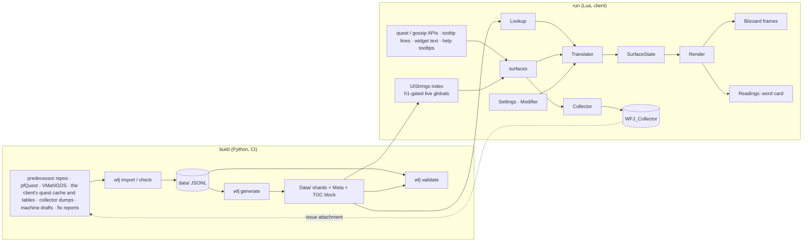

# Architecture overview

> Repo layout, how the pieces fit, and the known limits. The rules every part follows are in [Principles](principles.md).

## Purpose
One page for the whole shape: two build products (the pipeline and the addon), one source of truth (`data/`), one dependency direction, one text primitive. The addon targets the World of Warcraft: Forever client only ([ADR-034](../adr/034-forever-is-the-only-target.md)).

## Principles
The project's non-negotiable rules (Blizzard API only, names stay in English, Japanese by default with English one key away, no stored English game text, every line keyed by the game, provenance on every line, generated files never hand-edited, rendering apart from data, claims about the client backed by a source) are written down once in [Principles](principles.md). The other architecture pages assume them.

## Repo layout
```
wow-forever-japanese/
├── addon/WoWForeverJapanese/        the shipped folder (the packager zips only this)
│   ├── WoWForeverJapanese.toc       @project-version@ · Interface from clients.toml · SavedVariables: WFJ_DB, WFJ_Collector, WFJ_Log
│   ├── Core/   pure logic: Const Compat Normalize Hash Data Lookup Align Objectives Placeholders State Settings
│   │           Modifier Translator UIStrings SurfaceState Collector Readings Glosses RecentLines Reports ReportText
│   ├── UI/     Font Render ButtonText Labels LoadOnDemand HelpTooltip QuestFrame QuestMap Gossip ItemText Tooltip
│   │           Readings ReadingPopup FixWindow MinimapButton Options OptionsText OptionsWidgets KeyCapture
│   │           RevealBinding AddonListButton Slash, plus one module per window the Forever client loads (ADR-030)
│   ├── Data/   GENERATED by `make generate`: Meta.lua · Vectors.lua · Quest/ Item/ Spell/ Gossip/ Book/ Objective/
│   │           Area/ UI/ Reading/ Gloss/ shards; all listed in the TOC's generated block
│   ├── Fonts/  ipagui.ttf (IPA UI Gothic) + its licence + README.txt
│   ├── Media/  the addon icon
│   └── Main.lua  Bindings.xml
├── pipeline/wfj/   core/ (pure)  io/ (readers: predecessor Lua, JSONL store, wago, client tables, quest cache, collector dump)
│   │               emit/ (schema, lua_writer)  cmd/ (the `wfj` verbs)  dev/ (maintainer tooling, not in the CLI)
│   └── pyproject.toml · allowlist.txt · ui_keys.txt · ui_inventory.txt · ui_exclusions.txt · clients.toml · translation_glossary.tsv …
├── data/           quest/ item/ spell/ gossip/ book/ objective/ area/ ui/ unit/ reading/  (*.jsonl shards)
│                   english/  the same layout, English prose, never shipped
├── vectors/        hash, align and report vectors: canonical JSONL + a generated Lua twin each (`make vectors`)
├── tests/          python/  lua/spec/ (helpers, loader, wow_stub, *_spec)  fixtures/
├── docs/  ·  .github/ (workflows pr, release, report-check; issue forms)
├── .pkgmeta  .luacheckrc  Makefile  README.md  LICENSE  ATTRIBUTION.md  CHANGELOG.md
```
Main commands: `make data` (import → check → generate) · `make test` · `make validate` (the CI gate: schema, provenance, collisions, referential integrity, regenerate-and-diff, then luac) · `make coverage` · `make package` · `make release`. The full list is `make help`; the verbs are in [Pipeline](../systems/pipeline.md).

## Diagram


## Components
- **One text primitive** `normalize_v1 → Hash32x2` (ADR-005): gossip keys, source hashes, collector fingerprints, the CI collision gate.
- **Data model** ([Data model](data-model.md)): JSONL per (id, field); statuses trusted / unaligned / stale / rejected / missing; English vendored, never shipped; generated Lua shards keyed by game id, one per 1,000-id range, positional slots plus inline 32-bit hashes (ADR-008).
- **Pipeline** ([Pipeline](../systems/pipeline.md)): pure core, measured alignment rules, deterministic output; `validate` regenerates and diffs.
- **Addon** ([Addon modules](addon-modules.md)): UI → Core → Data. `Compat` resolves every client-specific name; English is read from APIs; `SurfaceState` is keyed by logical element. Tooltips replace the description run in place (first line primary, the rest blank companions, ADR-010), with a runtime align gate for unaligned entries (`Core/Align`, ADR-007) that also fills the value placeholders from the live line. Interface text (tooltip structural lines, window labels, menus, help tooltips, load-on-demand windows) is matched against one UI string index built from the client's own globals and gated by the shipped hash (`Core/UIStrings`, ADR-015, ADR-016).
- **Readings** ([Readings](../systems/readings.md)): the word card over quest, gossip, window-label and book prose.
- **Settings** ([Settings](../systems/settings.md)), **Collector** ([Collector](../systems/collector.md)), **Fix reports** ([Fix reports](../systems/fix-reports.md)), **Release** ([Release](../operations/release.md)), **Testing** ([Testing strategy](../testing/strategy.md)).

How much of the game ships in Japanese is generated, not written by hand: [Coverage](../operations/coverage.md).

## Known limits and risks
1. **Strict alignment rejects some correct lines.** The name and number checks trust a hand-written quest line only when it matches its English; about a third of rejections are correct translations with extra names or a rewritten quest. Precision on the labelled 200-entry sample is 1.000. A rejected line shows the live English, never a guess.
2. **CurseForge game version.** The release workflow uploads under Forever only; until CurseForge lists that game version the upload fails after the release is pushed, and running the release again with the same version resumes it ([Release](../operations/release.md), [ADR-046](../adr/046-one-action-release.md)).
3. **Tooltip line mapping.** The run's first line takes the Japanese and the other lines are blanked (ADR-010). Hand-written `$N` placeholders numbered out of reading order would show correct numbers in the wrong slots, and the runtime gate cannot see it; the audit of the hand-written lines looks for it.
4. **Quest frame re-layout after `SetText`.** The quest surfaces refit with the panel scroll frame's `UpdateScrollChildRect()`; the panels are anchor-chained, so positions follow text height. Clipped text is the most likely first report from players.
5. **Collector cap basis.** `CAP_BYTES` = 4 MiB against a per-entry estimate (`2·#key + #e + escapes + 117`, measured on the fixture). The client documents no SavedVariables limit.
6. **Button fonts on state change.** A button's text region takes its Normal / Highlight / Disabled font object on hover, press and disable; `UI/ButtonText` re-applies the bundled font after each state script and after the tab helpers (`PanelTemplates_SelectTab` and friends).
7. **Taint around secure frames.** Window modules never call layout functions or write Blizzard fields. Text and font written into a Blizzard FontString come back tainted to the code that measures it, so a FontString Blizzard measures on the way to a protected call (the spellbook's spell items and headers) is left untouched, and nothing of the addon runs inside such a pass ([ADR-058](../adr/058-text-blizzard-measures-on-a-protected-path-stays-untouched.md), [Client limits](client-limits.md)). The always-on taint watch records where any taint that reaches the action bars came from ([Diagnostics](../systems/diagnostics.md#the-taint-watch)); the client's `taintLog` is never used on Forever. Japanese on fixed-width widgets sized from English at `OnLoad` is not re-measured.
8. **Font.** IPA UI Gothic's Latin face renders the English names inside Japanese prose. Subsetting the font is deferred (it would need `fontTools` and an ADR).

## Related
- [Principles](principles.md) · [Roadmap](../roadmap.md) · [ADRs](../adr/) · [ADR-008 generated data layout](../adr/008-generated-data-layout.md) · [ADR-009 surfaces post-hook the writer](../adr/009-surfaces-post-hook-the-writer.md) · [ADR-010 tooltip in-place run replacement](../adr/010-tooltip-in-place-run-replacement.md) · [ADR-011 provenance layers and completeness](../adr/011-provenance-layers-and-completeness.md) · [ADR-012 human decisions survive regeneration](../adr/012-human-decisions-survive-regeneration.md) · [ADR-013 collector English](../adr/013-collector-english.md) · [ADR-014 machine-drafted text and the UI dictionary](../adr/014-machine-drafted-text-and-ui-dictionary.md) · [ADR-015 UI text surfaces](../adr/015-ui-text-surfaces.md) · [ADR-016 whole-window interface coverage](../adr/016-whole-window-interface-coverage.md)
