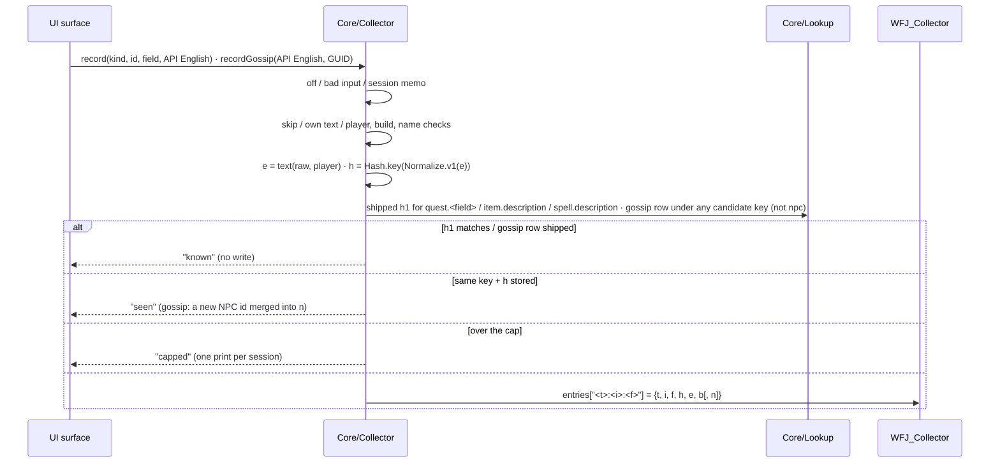

# Collector

> Records the English the game shows that the addon cannot recognise, so `data/english/` can grow and the gap can be measured. Decisions: ADR-005/006/007/011/013/017/019/024/053.


## Purpose
Quest progress/completion text, Forever-new quests, rendered item and spell descriptions, NPC dialogue (gossip) and NPC names exist nowhere but in players' clients. `Core/Collector.lua` writes what a client shows (only what the shipped hashes don't recognise) to its own SavedVariables `WFJ_Collector`, private by construction, for manual hand-off (a GitHub issue) and `wfj import english collector`. What the Forever client shows is the English ([ADR-053](../adr/053-forever-shown-english-is-the-english.md)): imported collector English replaces stand-in English (pfQuest, VMaNGOS, an older client) in `data/english/`, and `check` / `validate` / `stats` consult it for quest and gossip. Quest turn-in (completion) and progress text exist only in what the server sends at the NPC, so the collector is the only source of Forever's version of them. Item and spell collector English is stored but not consulted ([ADR-013](../adr/013-collector-english.md)).

## How it works


### Record order: `Collector.record(kind, id, field, raw) → result[, reason]`
The body runs under `pcall`: an error returns `"error", message` and increments the error count; a surface is never broken.

1. Not loaded → `"off"`; a file from a newer version → `"refused", "read_only"`; `collector.enabled` off → `"off"`.
2. Kind/field not in `KINDS`, or kind `gossip` (its entry point is `recordGossip`, below) → `bad_kind`; id not a positive integer → `bad_id`; `raw` nil/empty → `empty`.
3. **Session memo:** the same `raw` for the same key `<t>:<i>:<f>` answers from memory: no normalize, hash or lookup. A `"recorded"`/`"replaced"` replays as `"seen"`. Not replayed: `"capped"` (space may free up) and the state-dependent refusals `no_player` / `no_build`. The memo is cleared by `load` and `clear`.
4. **Skip:** `Collector.SKIP = { item = {[6948]}, spell = {[8690], [556]} }`: the Hearthstone item's `Use:` line and the Hearthstone / Astral Recall spell descriptions, which name the player's bind location → `skip` [likely; checklist 8 (In-game checklists, first list) hovers them].
5. **Own text:** `raw` contains any CJK character (U+3000–U+9FFF: ideographic punctuation, kana, kanji; UTF-8 lead bytes `E3`–`E9`) or a `WFJ.MARKER` message (the bilingual marker messages) **anywhere** → `own_text`. Our Japanese or a marker never becomes "English".
6. **Player and build:** player name nil/empty or, for quest and gossip text (`TOKEN_KINDS`), class or race not known yet (a literal class word would be stored) → `no_player`; `GetBuildInfo()` gives no build, or one that is not a valid `collector@<build>` source (`[%w._-]`, 4–64 chars) → `no_build`.
7. **Name** (checked on the markup-free paragraphs, so a colour code next to the name cannot hide it): **item, spell and NPC** text containing the player's name as a whole word → `own_name`: Blizzard never writes the name there, so a match is a coincidence ("Guard", "Light") and a placeholder would point at the name. **Quest** and **gossip** text containing a name under 3 code points (which `normalize_v1` never replaces) → `short_name`.
8. **Text:** `e = Collector.text(raw, player)`: markup is stripped over the whole text first (a break inside a link label never splits the link): breaks (newline, `|n`, `$B`/`$b`) are marked, the whole text goes through `Normalize.v1(…, player)`, then it is split on the marks, empty paragraphs dropped. The stored form is Blizzard's tokens, the pfQuest convention: the player's name as `$N`, **quests and gossip only** class/race as `$C`/`$R`, including the lowercase forms Blizzard prints for `$c`/`$r` ("young druid"), which `normalize_v1`'s exact-case replacement would leave in place (quest 456 prints one), paragraphs joined with `$B$B`. Item/spell/NPC text gets no player substitution at all (a name there was refused in step 7). Class/race → `$C`/`$R` in quests is a deliberate choice: right for the common `$C`/`$R` lines; a literal class or race word (~1.8% of curated quest lines) is the known exception, visible in an import audit when dumps from different classes disagree. `e == ""` → `empty`. `h = Hash.key(Normalize.v1(e))` (16 hex), which equals `Hash.key(Normalize.v1(raw, player))`: proven against all 50 hash vectors in `collector_spec`.
9. **Known:** quest/item/spell → `lookup("<kind>.<field>", id)`: `quest.<field>`, `item.description`, `spell.description`, field-qualified (spell has two fields); shipped `h1` equals the first 32 bits of `h` → `"known"`; a shipped **quest** line whose Japanese carries `$N<k>` / `$D<k>` ships a **masked** `h1` (every number `#`, ADR-028) and is known when the recorded text, normalized with its digit runs masked the same way, hashes to it: the server's count never makes it new, a rewording does; for a quest field also a shipped `h1f`, the female variant's (ADR-024), so a female character's English is known. gossip → `lookup("gossip", k)` for each candidate key `k` of `Collector.keys(raw, player)` (below); a row shipped under any of them is this English → `"known"`. `npc` is never known. Quest title/objectives/description can match, and so can progress/completion whose quest has VMaNGOS English (their `h1` is that field's own hash, ADR-019). A quest field whose English is another field's (`english.of`, e.g. a completion with no VMaNGOS English, checked against the description) ships **no** `h1`, so it is never known and its English is recorded; item/spell rows carry the name hash (ADR-007) and never match.
10. **Dedupe:** same `h` stored under the key → `"seen"` (gossip: when the speaker's creature id is not yet in the entry's `n` and `n` holds fewer than `NPC_CAP` = 32 ids, the id is merged in (sorted, unique) subject to the cap below, still `"seen"`); another `h` → `"replaced"`; absent → `"recorded"`.
11. **Cap:** `size = 2·#key + #e + escapes + 117` (`escapes` = the `"` and `\` in `e`; measured on the fixture file), plus `16 + 20·#n` for a gossip entry's id list (~20 bytes per id as the client writes it: `\t\t\t\t6740, -- [1]`). `bytes - oldSize + size > CAP_BYTES` (4 MB) → `"capped"`, no write, `capped = true`, one print per session: `WFJ: collector full (4.0 MB). /wfj collector path to hand it off, /wfj collector clear to start over.`
12. Write `{ t, i, f, h, e, b }` (gossip: `+ n` when the speaker is a creature; a line holding `$C` / `$R`: `+ p`, the recording character's `"Class|Race"`), adjust `bytes`, clear `capped` (a successful write means the file is not full). The build index `b` is taken only here, when an entry is written.

### Gossip (`Collector.recordGossip(raw, guid) → result[, reason]`)
One line of NPC dialogue: a gossip greeting or option, or the quest window's greeting prose. Runs under `pcall` like `record`. There is no game id: the entry is keyed by the text's **full gossip key**, `Collector.key(raw, player) = Hash.key(Normalize.v1(Collector.text(raw, player)))`, with the player's name, class and race (capitalized or lowercase) replaced ([ADR-005](../adr/005-gossip-key-fingerprint.md), [ADR-017](../adr/017-gossip-surface.md)).
- **Candidate keys:** `Collector.keys(raw, player)` (pure) → the distinct keys a translation of the line may be shipped under, most specific first: the full key, the race-only key (name and race replaced, class kept literal), the class-only key (name and class replaced, race kept literal), the name-only key (only the name replaced) and the key with nothing replaced. A line that says a class or race word literally ("the mage tower") gets the full key only for players of that class, so its data may be keyed either way; a line that says one literally and the other as a token ("young $R, a wise druid") matches through the race-only or class-only key ([ADR-053](../adr/053-forever-shown-english-is-the-english.md)). `Main`'s `gossipKey` renders by the first candidate with a shipped row (`Lookup.gossip`), else the full key; `known` passes when a row is shipped under any candidate. Every candidate hashes this same English, so no candidate can show another line's Japanese. Residual: data keyed from a dump by a player of the class the line names (a Mage's "mage tower" stored as `$C tower`) still misses for other classes; an import audit watches for it. A player name under 3 code points is never replaced (ADR-005's minimum token length), so the first five candidates cannot replace it; two more follow (ADR-024) for a 1–2 code-point name: full, then name only, with the name also replaced as a whole word (exact case, ASCII-letter boundaries) on the markup-free text. They come after the first five, so a line whose literal English is shipped still wins. Residual: a short name that is also an ordinary word ("An") could pick another line only when the literal line is unshipped and that line's `$N` form equals the live text at every occurrence. Recording still refuses a short name (`short_name`).
- **Fingerprints** (ADR-019): `Collector.fingerprints(raw, player, masked)` (pure) → the `h1` of each distinct candidate of `Collector.keys`, in the same order; with `masked` every digit run of the normalized candidate becomes `#` before hashing (the key a quest line filled from live values ships (`normalize.mask_values`), memoized apart from the plain ones), used by the Translator's quest live check (a quest field's live English against the shipped `h1`), not by recording. Empty (the build-time status then decides) when `raw` is empty or when the player's name, class or race is not known yet. A second return, `inconclusive` (ADR-024), is `true` when the name is under 3 code points and the text contains it as a word: the short-name candidates are included, a match removes the marker, and no match lets the build-time status decide instead of marking. The quest live check also accepts the field's `h1f`. Both returns are memoized per player and text, because the quest window re-resolves its records on every refresh; the memo is dropped when it reaches `Collector.MEMO_MAX` = 64 entries. The returned table is shared and never mutated.
- Steps 1, 4–12 as above with kind `gossip`, field `text`: `raw` nil/empty → `empty`; own text, `no_player` (class and race required), `short_name`, `no_build`; entry key `gossip:<h>:text`, `i = h`.
- `guid` → `Collector.creatureId(guid)`; a `Creature`/`Vehicle` id becomes `n = { id }` on a new entry or is merged into a stored one; a `Player`/`GameObject`/nil GUID records the text without an id.
- **Session memo** keyed by (creature id or 0, raw), so the same line from a second NPC is evaluated again and its id merged.

### What is recorded
| Kind | Fields | Call site | English source |
|---|---|---|---|
| `quest` | `title` `objectives` `description` `progress` `completion` | `UI/QuestFrame.showPanel` (every field's getter English, **before** the widget equality guard); `UI/QuestMap.showPane`: the quest map details pane and the tracker popup (title/objectives/description, from `C_QuestLog.GetTitleForQuestID` and `GetQuestLogQuestText()`); `UI/QuestMap`'s quest list / tracker rows (title) | quest API getters |
| `item` | `description` | `UI/Tooltip.onItem` | the description run's line texts joined with `"\n"` (tooltips are the widget exception, ADR-010) |
| `spell` | `description` | `UI/Tooltip.onSpell` | `GetSpellDescription(id)` only when non-empty; the positional fallback is a guess and never becomes data |
| `gossip` | `text` (id = the gossip key) | `UI/Gossip.onUpdate` → `recordGossip(C_GossipInfo.GetText(), UnitGUID("npc"))` and the same for every `C_GossipInfo.GetOptions()` name, after each `GossipFrame:Update` while the window is shown [`UnitGUID("npc")` likely; checklist 3's `n` (In-game checklists, first list)]; `UI/QuestFrame.onGreeting` → `recordGossip(GetGreetingText(), UnitGUID("questnpc"))`; `UI/Speech.onAddMessage` → `recordGossip(<the server's English>, <the speaker's GUID>)` for every NPC say, yell, whisper and emote line the chat window shows (`eventArgs[1]`, `eventArgs[12]`), translated or not, never a line the client marks secret: NPC speech is in no client file | the gossip API; `GetGreetingText()`; the chat event's arguments |
| `npc` | `name` | `UI/QuestFrame.showPanel` → `recordNpc(UnitGUID("questnpc"), UnitName("questnpc"))`: `UnitName("questnpc")` [verified: classic_era `Classic/QuestFrame.lua:118`]; `UnitGUID` with the same token [likely; checklist 8's `npc:` entries confirm (In-game checklists, first list)] | the quest giver as the window names it |

- No unit-tooltip hook. NPC chat speech is recorded through `UI/Speech` (the table above), except a line the NPC says to another player, which may carry that player's name; speech bubbles are not read separately: a bubble repeats a chat line.
- Recording is independent of the master switch, areas and the modifier: it reads the API, not what we show.
- **NPC id:** `Collector.creatureId(guid)` → integer for `Creature-…`/`Vehicle-…` via `guid:match("-(%d+)-%x+$")` [verified: classic_era `Blizzard_PTRFeedback_Tooltips.lua:89–91`]; `Player`/`Pet`/`GameObject`/other → `nil` (`recordNpc` → `"refused", "no_creature"`; `recordGossip` records without an id). The GUID is never stored.

### Dump shape: `WFJ_Collector`
```lua
WFJ_Collector = {
  version = 1, disclosed = true, builds = { "1.15.9.69722" }, bytes = 1740, capped = false,
  entries = { ["quest:2:description"] = { t = "quest", i = 2, f = "description", h = "<16 hex>",
    e = "$N, the hippogryph Sharptalon has been hunting near Splintertree Post.$B$BBring me its claw.", b = 1 },
    ["gossip:70f068541ce5e138:text"] = { t = "gossip", i = "70f068541ce5e138", f = "text", h = "70f068541ce5e138",
    e = "Goodbye.", b = 1, n = { 68, 295 } } },
}
```
- `e` is normalize_v1 text in Blizzard's tokens (`$N`, quest and gossip `$C`/`$R`, `$B$B` between paragraphs), the same convention as pfQuest English, so `paragraphs.count_english` counts a collector paragraph exactly as a pfQuest one ([ADR-011](../adr/011-provenance-layers-and-completeness.md)). No `{name}` placeholders and no newlines are stored.
- `n` (gossip only): the sorted creature ids that said the line, at most `NPC_CAP` = 32 (a generic "Goodbye." would otherwise grow without bound), each 1..2^31−1 (a 32-bit GUID field). Creature ids are game data, not a location; see Privacy.
- `b` is an index into `builds` (`GetBuildInfo()` → `version .. "." .. build`), appended on first use. An entry is never written without a build (`no_build`); a hole in a hand-edited `builds` list never moves an existing index (a new build takes the next free slot).
- **Load** (`Collector.load(saved, deps)`, deps `enabled / lookup / player / build / print` injected by `Main`): non-table → fresh version-1 table. `version` read with `tonumber`; greater than 1 (a string `"2"` included) → the table is returned **untouched**, recording paused (read-only), one print. Otherwise non-table `entries`/`builds` reset, invalid entries dropped (key ≠ `t:i:f`, unknown field, `h` not 16 hex, empty `e`, bad `b`, a `p` that is not a string; a gossip entry whose `i` is not the string `h`, or whose `n` is not absent or a list of 1–32 positive integers each ≤ 2^31−1; any other kind carrying `n`), `bytes` recomputed, `capped`/`disclosed` kept only when `true`. The session memo starts empty.
- Separate from `WFJ_DB`, so a settings toggle never rewrites the dump.

### Privacy
Only normalized text in Blizzard's tokens is stored; keys are game ids or, for gossip, the text's own hash. **NPCs talked to:** a gossip entry's `n` stores the creature ids of the NPCs who said the line, sorted and not in visit order: a coarse trail of which NPCs the character met, the same precedent as the `npc:` entries (quest givers). Creature ids are game data, not a location; no time or zone is attached. No GUID, timestamp, realm, zone, coordinates, character or account field exists in the shape. Short names in quest text, the player's name in item/spell/NPC text, the bind-location lines (`SKIP`) and our own output are refused. **Known exception:** wording the client resolves by the character's gender (`$G`: "sir"/"madam", "he"/"she") is kept as shown: `normalize_v1` keeps the first form and cannot map a resolved form back, so a female character's text is recorded as seen. It identifies no one, and the disclosure and the issue form say so. `collector_spec` scans a scripted stub session's table for the stub player name, realm (`GetRealmName`, stubbed but never read by the addon) and `Creature-`; checklist 8 (In-game checklists, first list) greps a real file for the character name.

### Disclosure, commands, hand-off
- **Setting:** `collector.enabled` (boolean, default on, "Record English for future translations"), defined in `Core/Collector.lua`, which gives the panel control and `/wfj` status line for free ([Settings](settings.md)).
- **Disclosure:** `Main` calls `Collector.disclose()` on `PLAYER_ENTERING_WORLD`. Once per dump, when enabled and not read-only, it prints two lines (what is recorded, "quest text, NPC dialogue with the ids of the NPCs who said it, item and spell descriptions, NPC names", and where; no character/account/realm/location; `/wfj collector off` · `/wfj collector path`) and sets `WFJ_Collector.disclosed`. `clear()` keeps the flag.
- **Slash:** `/wfj collector` = `status` · `on` · `off` · `path` · `clear`; any other second word falls through to the settings grammar (`/wfj collector enabled off`). Status: `WFJ: collector on · 12 entries · 3.4 KB of 4.0 MB[ · full][ · paused (file from a newer version)][ · N errors]`; the same text is the `/wfj debug` `collector:` line. `path` prints `World of Warcraft\<client folder>\WTF\Account\<ACCOUNT>\SavedVariables\WoWForeverJapanese.lua` (literal placeholders), that the file is saved on logout or `/reload`, the counts and `Collector.ISSUE_URL`. `clear` first asks: `type /wfj collector clear again within 5 seconds to clear N entries`; the same command within 5 s empties entries/builds/bytes/capped and the session memo and prints the count (any other `/wfj` command in between forgets the ask); a newer-version file skips the ask and is never cleared.
- **Settings page**: *English Collector*, under the addon's AddOns category, is the UI for `/wfj collector`: `collector.enabled`, the `Status · 状態: <describe()>` line, **Clear collected English** (clears on a second click within 5 s; the slash `clear` asks the same way), and the SavedVariables path and issue link as copyable boxes ([Settings](settings.md)).
- **Hand-off:** `ISSUE_URL` opens `.github/ISSUE_TEMPLATE/collector-dump.yml`: client dropdown, client build, addon version (required), the zipped file, a required confirmation checkbox, and a statement of contents (`WFJ_DB` settings + `WFJ_Collector` text, including NPC dialogue with the ids of the NPCs who said it; no character, account, realm, location, chat or time data; gender-dependent wording kept as the game shows it). The SavedVariables path and escaping are [likely; checklist 8 (In-game checklists, first list) imports a real dump].

### Import: `wfj import english collector <file>` (`make import-collector DUMP=<file>`)
- `io/lua_reader.parse_assignments` reads every `NAME = <value>` in the file; `io/collector_dump.read_dump` takes `WFJ_Collector` (missing, or `version ≠ 1` → error, exit 1). Arrays are accepted positional (`"x", -- [1]`) or keyed; strings with Lua escapes.
- Each entry is re-validated, rejections counted by reason in this order: `bad_key`, `bad_kind`, `bad_field`, `bad_id`, `not_english` (empty, or any kana or kanji), `unknown_placeholder` (a `{…}` placeholder, or any `$x` other than `$N`/`$C`/`$R`/`$B`), `hash_mismatch` (`h ≠ key(normalize_v1(e))`), `no_build` (missing, or not a valid `collector@<build>` source); a key that appears more than once in the file → every copy dropped as `duplicate_key`; text that normalizes to nothing or contains any U+3000–U+9FFF / compatibility-ideograph character → `not_english`.
- `npc` → English type `unit`, field `name`. `gossip` → English type `gossip`, field `text`: `i` must be a 16-hex string equal to `h` and the key `gossip:<i>:text`, else `bad_key`; `n`, when present, must be a list of 1–`NPC_CAP` (32) creature ids, each 1..2^31−1, and only on a gossip entry, else `bad_id`. Each accepted entry becomes `{id, field, en: e, hash: h, src: "collector@<build>"}` (gossip: `+ npcs`, the sorted unique ids of `n`, omitted when empty; `validate_line` requires 0 < id < 2^31), merged per `(type, id, field)` ([ADR-053](../adr/053-forever-shown-english-is-the-english.md)): absent → **added**; same hash → **unchanged**; another hash → **replaced** when the stored line is an earlier `collector@` line or a stand-in (pfQuest, VMaNGOS, a client of another game version); a line from the same client's own files (its client tables or quest cache: a `src` whose version shares major.minor with the dump's build, `_same_client`) → **kept**, listed under `differs from the client's own files (kept)`. When a dump line replaces a stand-in, `_restore_literals` aligns the two word by word and puts back the literal word the stand-in has where the dump wrote `$C` / `$R`, only when it is the recording character's own class (for `$C`) or race (for `$R`), read from the entry's `p`: the collector writes that character's class and race as tokens wherever they occur, so a druid's "a wise druid" arrives as "a wise $C". A different word there ("warrior" where a mage recorded `$C`) means the line follows the reader's class, and the token stays; an entry with no `p` (an older dump) gets nothing put back. Re-importing compares the restored text, and a line an earlier import already gave its literal back is kept as it is, so it counts as unchanged. An item or spell line from another game version that holds `$` codes (a template such as "$o1 damage over $d") is never replaced by a dump line, which has one player's numbers filled in; it is listed under differs. A gossip line is keyed by its hash, so it is only ever added or unchanged, except that a same-hash line whose dump names an NPC id it lacks gets the union of `npcs`, counted separately and written. The union in `data/english` is not capped at 32: the blast radius counts every NPC any dump named. Prints a per-type table, `gossip lines that gained an NPC: N` when the dump has gossip entries, and the rejected counts; re-importing the same file is a byte no-op. The other importers keep collector lines for `(id, field)` they don't provide, and replace them where they do (a VMaNGOS progress or completion line, for example), so after `make import-english` the dumps are imported again ([Pipeline](pipeline.md)).
- **Stats blast radius** (ADR-005): `wfj stats` prints, after the coverage report, `gossip: N keys with English · M translated` (N = every gossip English line: collector and VMaNGOS, which has no NPC ids; M = keys with a shipped row in `data/gossip/`) and the top 20 keys by NPC count, ties by key (`<npcs> <key> <status or -> <English, 60 chars…>`) or `gossip: no collected English`. It builds no scope; `wfj stats --stale [--dump <SavedVariables>]` likewise reads collector quest English (stored, or straight from a dump) to list lines whose English differs from the checked hash ([ADR-017](../adr/017-gossip-surface.md)).
- **Capture list** (ADR-020): on the beta, `wfj stats --delta REF --capture PATH` names the quests whose title / objectives / description English is new or changed since REF, with the source of their progress / completion English (`null` = none). Those are the quests whose turn-in windows a player should open so the collector records that text.
- **Consulted for quest and gossip** ([ADR-053](../adr/053-forever-shown-english-is-the-english.md)): `check`, `validate` and `stats` build quest and gossip scopes from `collector@` English like any source (`CONSULTED_COLLECTOR_TYPES = ("quest", "gossip")` in `pipeline/wfj/cmd/check.py`), so importing a dump moves a quest line's hash to the English Forever showed; a quest whose turn-in Forever reworded shows the stale marker until that text is seen in game and imported. Item and spell collector English stays unconsulted (`UNCONSULTED_SOURCES`): it is recorded with the numbers filled in, while the client tables hold the templates.

## Key files
`addon/WoWForeverJapanese/Core/Collector.lua` · `UI/QuestFrame.lua` · `UI/QuestMap.lua` · `UI/Tooltip.lua` · `UI/Gossip.lua` · `UI/Slash.lua` (`collector` verb) · `Main.lua` (load + disclose + `gossipKey`) · `pipeline/wfj/io/collector_dump.py` · `pipeline/wfj/io/lua_reader.py` (`parse_assignments`) · `pipeline/wfj/cmd/import_english.py` (`run_collector`, `_same_client`, `_restore_literals`, `merge_source`) · `pipeline/wfj/cmd/check.py` (`UNCONSULTED_SOURCES`, `CONSULTED_COLLECTOR_TYPES`) · `pipeline/wfj/core/report.py` (`gossip_radius`) · `pipeline/wfj/cmd/stats.py` · `.github/ISSUE_TEMPLATE/collector-dump.yml` · `tests/lua/spec/collector_spec.lua` · `tests/lua/spec/collector_session.lua` · `tests/lua/spec/collector_dump_spec.lua` · `tests/python/test_stats.py` · `tests/fixtures/collector/WoWForeverJapanese.lua` (12 entries, 3 of them gossip ("Goodbye." said by two NPCs, `n = { 68, 295 }`); quest 2's title and objectives ship with their English hash → known, not recorded)

## Invariants
- Records only API-returned English (tooltip run texts are the documented widget exception), and never text containing a CJK character or a marker message.
- Never raises into a surface. The same raw text for the same key answers from the session memo without normalizing, hashing or looking up.
- Same `normalize_v1` + hash as the pipeline (shared vectors + the `tests/fixtures/collector/` round-trip fixture).
- Nothing personal in the shape; the GUID is reduced to the creature id at record time; the player's name is `$N` in quest and gossip text and refused elsewhere.
- An import never overwrites the same client's own tables or quest cache; it replaces stand-in English (pfQuest, VMaNGOS, an older client) with what the Forever client showed. Collector item and spell English is never consulted.

## Related
- [ADR-013](../adr/013-collector-english.md) · [ADR-017](../adr/017-gossip-surface.md) · [ADR-011](../adr/011-provenance-layers-and-completeness.md) · [ADR-020](../adr/020-quest-cache-harvest.md) · [ADR-024](../adr/024-gender-variants-and-short-name-candidates.md) · [ADR-053](../adr/053-forever-shown-english-is-the-english.md) · [Pipeline](pipeline.md) · [Settings](settings.md) · [Data model](../architecture/data-model.md) · [Addon modules](../architecture/addon-modules.md) · [Testing](../testing/strategy.md) (In-game checklists, first list: items 3 and 8)
