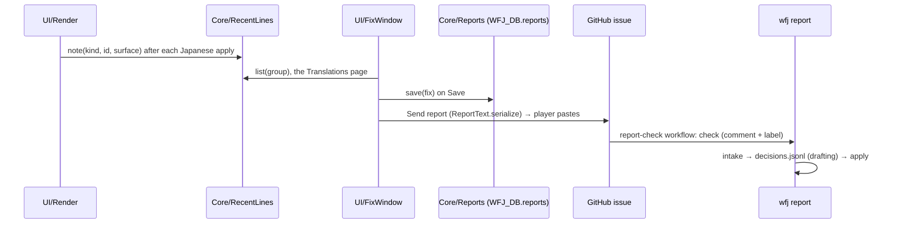

# Fix reports

How a player reports a wrong or awkward Japanese line in game, and how a report becomes data ([ADR-045](../adr/045-player-fix-reports.md)).

## Purpose

A player picks the exact line they found wrong from the lines the addon just put on screen, says what is wrong (optionally writing their own Japanese), and later copies every saved fix out as one block of text into a GitHub issue form. The game makes no network call; the paste is the only thing that leaves the client. When the maintainer takes a report, the pipeline turns the issue into data: intake, a machine-drafting pass, apply. The maintainer's runbook is [Fix reports (operations)](../operations/fix-reports.md).

## How it works



## In game

### Ways in

| Way in | Left-click / action | Right-click |
|---|---|---|
| Minimap button (`UI/MinimapButton`) | opens the fix window | the menu |
| Blizzard's addon dropdown on the minimap (TOC `AddonCompartmentFunc` → `WFJ_OnAddonCompartmentClick` in `Main.lua`) | opens the fix window | the menu |
| About page: **Report a line** button (`Options` row `aboutFix`, above the bug and idea row) | opens the fix window | none |
| `/wfj fix` | opens the fix window | none |

The menu (`MenuUtil.CreateContextMenu`) holds exactly: **Translation on** (a checkbox bound to the `enabled` setting, the same state as the settings checkbox), **Report a line**, **Report a bug or idea** (opens the [report window](#bug-and-idea-reports)), **Settings** (the addon's settings), **Hide this button** (sets `minimapButton` off). The entries and the button's tooltip ("左クリック：翻訳を報告 ・ 右クリック：メニュー") are in one language: Japanese, or English ("Left-click: report a line · Right-click: menu") when translation is off or the reveal key is held as the menu or tooltip opens; menu entries are drawn in the bundled font through `Labels.menuText`, as `UI/Menus` does.

The button is built on the client's `MiniMapButtonTemplate`, placed on the minimap rim at an angle (degrees, 0 = right, counter-clockwise; default 225, the lower left). Dragging moves it around the rim; the angle is saved to `WFJ_DB.minimap.angle` on drop and restored on load (absent → the default). The `minimapButton` setting (default on; main settings page, `/wfj minimapButton on|off`) shows or hides it. The rim position assumes a round minimap (camelot's minimap shape is unverified). The icon is the addon's 字 medallion (`Media/icon.tga`, the TOC's `IconTexture`), 20 px at `TOPLEFT` 5, -5 inside the tracking-border ring.

### The fix window

`UI/FixWindow` (`WFJFixWindow`) is built on the client's own window frame, `ButtonFrameTemplate` with the portrait hidden and the title set by `SetTitle`: 600 × 580, movable, Esc closes it, strata `FULLSCREEN_DIALOG` with `SetToplevel`, so the beta's Issue Reporter button does not cover it. Three tabs from the client's `TabSystemTemplate` (`TabSystemTopButtonTemplate` buttons) sit in the strip above the inset: **翻訳** (Translations) · **送信待ち（n）** (Pending (n)) · **報告を送る** (Send report); a row opens the edit panel, which keeps its tab selected. Every widget is a Forever template, with no hand-drawn frames:

| Widget | Template (`UI/OptionsWidgets` / `UI/FixWindow`) |
|---|---|
| lists (Translations, Pending) | `W.scrollList`: `WowScrollBoxList` + `MinimalScrollBar`, a linear view of pooled 32 px rows |
| filter and reason choices | radial radio buttons (`UIRadialButtonTemplate`); each one's click area is the circle plus its own label, so a click never lands on the neighbour |
| the line box, the note, the report | `W.scrollText`: `ScrollingEditBoxTemplate` in a `TooltipBackdropTemplate` field with a `MinimalScrollBar`; the bundled font re-applied by a hook on the edit box's `ApplyText` and focus (the template resets its font object there; the addon uses no font object of its own); a click anywhere in the field puts the cursor in it |
| the form address | `W.copyBox` (`InputBoxTemplate`, read-only) |
| buttons | `W.button` (`UIPanelButtonTemplate`) |

**One language at a time**: every label, tab, button, radio and message comes from `UI/OptionsText` and shows its Japanese; it shows the English when translation is off (the master switch) or while the reveal key (default Alt) is held, the rule the game text follows. The window re-labels live on the State `modifier` and `enabled` events (`FixWindow.relabel`), except while one of its text boxes has focus (the client sends no modifier event then). All of its copy is in the bundled font at fixed sizes in either language, so nothing changes size when the language flips. The window shows one language at a time because both at once are hard to read in game.

| Page | What it shows | Clicks |
|---|---|---|
| **翻訳** (Translations) | radios **すべて** (All, the default) · **クエスト・会話** (Quests & NPCs) · **ツールチップ** (Tooltips) · **画面の文字** (Windows), the [groups](#recent-lines); then `RecentLines.list(filter)`: the newest burst first, each burst in on-screen order. A row: the type (クエスト, NPCの会話, アイテム, 呪文, 本, 画面の文字, 目標, 地域の目標) on the left and the start (~36 characters) of `shown`, the line as written on screen. The list redraws while the window is open when a new line is written (`RecentLines.onChange` → one redraw on the next frame). Empty: "Read some quest or NPC text, then open this again." | a radio → that group; a row → the edit panel for that address |
| **Edit panel** | one large editable box (248 px, 8000 bytes) pre-filled with the line as the addon stores it; the player may rewrite it; below it the five reasons as radios (Wrong meaning · Awkward / unnatural · Typo / broken text · A name was changed · Other) and an optional note in a two-row box (200 bytes; Enter leaves the box, and a line break is saved as a space) | **保存** (Save): a changed line goes with the report; an untouched box sends the reason (and note) only · **削除** (Delete, a pending report) · **戻る** (Back) |
| **送信待ち（n）** (Pending) | every saved report: the type and the reason on the left, the start of the player's Japanese (else the stored Japanese, else the note) on the right | a row → the edit panel for that report |
| **報告を送る** (Send report) | numbered steps: **1** open the report form: the address in a copy box, Ctrl+C, paste into the browser; **2** copy the report: the report text in a box that selects all of itself when clicked (and opens selected); **3** paste it into the form's Report box and submit; **4** clear the reports sent: **送信済みの報告を消去** (Clear sent reports) on the same line. With nothing saved, the steps are replaced by how to save one ("In Translations, click a line, choose what is wrong and click Save.") | the clear button: first click arms, a second within 5 seconds clears only the reports the copied text held (a report saved after the copy stays); an armed button that runs out puts its caption back. The report box has no letter limit |

The player-facing copy says "report" (報告), not "fix". A save without a reason is refused ("Pick what is wrong first."). A second report for a line that already has one is saved only on a second click within 5 seconds (or at once when the panel was opened from that pending report). The 26th pending report is refused with a message to send the report first. Confirmations use the settings pages' click-again pattern, not a StaticPopup (the Japanese in the popup's font is unverified). There is no read-only copy of the line and no in-game diff highlight: the report's `ja_hash` names the stored line (the before), and only a changed line travels as the after; colour codes in an EditBox would become text the player edits. The window reads lines only through `Core/RecentLines`, `Core/Reports` and `Core/Lookup`, never a frame, a global string or the Collector, so it never shows English game text ([principle 4](../architecture/principles.md#4-the-addon-never-ships-stored-english)).

### Recent lines

`Core/RecentLines` is an in-memory list (never SavedVariables); a line written again moves to the front instead of repeating. An entry is `{ type, id, field, ja_hash, ja, shown, surface, group, burst, seq }`:

| Key | What |
|---|---|
| `type`, `id`, `field` | the store address as the pipeline keys it |
| `ja_hash` | the addon hash (`Hash.key`) of the Japanese **as stored** (before values and player tokens are filled in; the hash a reading's `ja_hash` uses), which is what the report carries |
| `ja` | the stored Japanese (what the edit box is pre-filled with) |
| `shown` | the text as written on screen (a template's values filled in, player tokens expanded) with the inline marker message and colour codes removed (`RecentLines.clean`); what the list shows |
| `surface` | the surface name (kept, not shown) |
| `group` | `story` (quest, gossip, book, objective, area) · `tooltips` (item, spell) · `windows` (ui) |
| `burst`, `seq` | the burst number and the write order |

**Groups.** Each group keeps its own `CAP` = 100, so reopening windows full of labels never pushes quest lines out. `list(group)` returns one group, or every line for `nil` / `"all"`.

**Order.** Lines one surface writes within `BURST` = 1 second of each other are one burst (a quest window writes its title, then its text, then its objectives). `list` gives the newest burst first and each burst in the order its lines were written: the order the player reads them on screen.

It is fed by one call in `Render.sync`: after `SS.apply` writes the text, `noteRecent(rec, text, fromShow)` (passing the written text and `GetTime()`) runs when the record's own action is `apply`, that is, a primary record showing its Japanese. Only a write the client asked for (`Render.show`) records a line; a refresh (the reveal key released, a setting switched) records a record only the first time it applies it, so it never reorders the list or brings back lines of closed windows. Each stored Japanese is hashed once (a bounded memo). Restoring English (Alt, master switch off, an area off), a `leave` / `none` decision, and a companion record (`ctx.follow`, which only blanks) record nothing. The call is `pcall`'d; a failure increments `Render.recentErrors` and never stops the write.

`RecentLines.note(kind, id, surface)` reads the Lookup kind as `type` / `field` (`gossip` / `book` → `text`; `quest.title` → `quest` / `title`; a bare type with one field → that field) and looks the line up again; a kind that is not one store line, a line with no stored Japanese, and a **branch-variant line** (item / spell `$?` variants, [ADR-043](../adr/043-included-text-icons-and-branch-variants.md), which have no single stored Japanese) record nothing, never a made-up address.

What each `Render.show` caller records (the list `recent_lines_spec.lua` pins; a new caller must be added there):

| Caller | Kinds recorded |
|---|---|
| `UI/QuestFrame` | `quest.title` · `quest.objectives` · `quest.description` · `quest.progress` · `quest.completion` · `gossip` (the greeting prose) |
| `UI/QuestMap` | `quest.title` · `objective` · `area` · `ui` |
| `UI/Tooltip` | `item.description` · `spell.description` · `spell.aura` · `ui` |
| `UI/Gossip` | `gossip` |
| `UI/ItemText` | `book` |
| `UI/Labels`, `UI/Talents`, `UI/Popups`, `UI/DamageMeter`, `UI/CombatText` | `ui` |

### Pending fixes

`Core/Reports` keeps the pending fixes in `WFJ_DB.reports`: `{ type, id, field, ja_hash, reason, note?, ja? }`. A fix holds no time, and never the player's name: `Reports.save(fix, replace, name)` takes the character's name from `UI/FixWindow` and stores the `{name}` placeholder wherever the note or the Japanese held it, in any letter case (`Reports.withoutName`, whole words only). A `t` field that an earlier version saved is dropped on load. The key is created only with the first fix; a save without it (older versions, or no fix yet) loads as empty, and an entry a hand edit broke is dropped on load. At most `CAP` = 25; one fix per address. No English is ever stored. `Core/ReportText.serialize(addonVersion, build, fixes)` writes the report below (`build` from `GetBuildInfo`, `version.build`).

### SavedVariables added

| Key | Written when | Absent |
|---|---|---|
| `WFJ_DB.reports` | the first fix is saved | empty list |
| `WFJ_DB.minimap.angle` | the player drops the button after a drag | the default angle (225) |
| setting `minimapButton` | through the settings registry | on |

## Report text, version 1

The addon writes the report; `pipeline/wfj/core/fix_report.py` reads it (`wfj report …`). The two must agree byte for byte: `vectors/report_vectors.{jsonl,lua}` (generated by `make vectors`) holds the shared cases, and both test suites run them.

```
WFJ-REPORT 1
addon <version> client <build>
fix <type> <id> <field> <ja_hash> <reason>
note <escaped text>
ja <escaped text>
end <count>
```

| Line | Rule |
|---|---|
| `WFJ-REPORT 1` | First line of the block. Any other version is refused. |
| `addon … client …` | The addon's TOC version and the client build (`GetBuildInfo`), each one token of `[0-9A-Za-z._@?+-]`, at most 40 characters (the addon replaces anything else with `_`); `?` when unknown. They are echoed in the issue comment, so nothing else is accepted. |
| `fix` | One per fix, in the order the player saved them, at most 25 in a report (the number the addon keeps; the parser refuses more). Fields are separated by one space. |
| `note` | Optional, at most one per fix, right after its `fix` line. At most 200 bytes before escaping; never a newline. |
| `ja` | Optional, at most one per fix, after its `note` (if any). The player's Japanese; at most 8000 bytes before escaping (the longest shipped line is 6,416). |
| `end <count>` | Last line. `count` is the number of `fix` lines; a mismatch means the paste was cut. |

Fields of a `fix` line:

| Field | Values |
|---|---|
| `type` | `quest` `item` `spell` `gossip` `ui` `book` `objective` `area` |
| `id` | numeric types: a decimal id; `gossip` and `book`: the 16-hex English hash the addon keys the line by; `ui`: the UI key (no whitespace) |
| `field` | one of the type's fields in `model.FIELDS` |
| `ja_hash` | 16 lowercase hex: the addon hash (`Hash.key`, no normalizing) of the Japanese as stored in the addon, the same hash a reading's `ja_hash` uses |
| `reason` | `wrong` (wrong meaning) · `awkward` (awkward / unnatural) · `typo` (typo / broken text) · `name` (a name was changed) · `other` |

Escaping (in `note` and `ja` only): `\` → `\\`, newline → `\n`, carriage return → `\r`, `|` → `\x7c`. No other escape exists; any other `\` sequence is an error. The report therefore never contains `|` (a WoW escape character) and never a raw newline or carriage return inside a field: shipped lines hold CRs, and a browser turns a raw one into a line break. A note holds neither.

Reading rules: the parser takes the one block between `WFJ-REPORT` and `end` anywhere in the text (an issue form wraps it in a code fence and headings), ignores leading whitespace on each line, trailing whitespace on structural lines (a `note` / `ja` value keeps its own) and blank lines inside the block, and refuses: no header, a second header, an unknown version, a missing or wrong `end` count, an unknown type / field / reason, a malformed id or hash, a `note` / `ja` line with no `fix` before it or repeated for one fix, an over-long field, a bad escape, and the same `(type, id, field)` twice.

## GitHub

| File | What it does |
|---|---|
| `.github/ISSUE_TEMPLATE/translation-report.yml` | Issue form, label `translation-report`: **Report** (textarea, required), **Credit me as** (optional; empty → the GitHub name), **Permission** (required checkbox: the Japanese may ship under GPL-2.0-or-later). |
| `.github/workflows/report-check.yml` | On an issue opened / edited that carries `translation-report`: writes the body to a file (through an env var, never the script text), runs `python -m wfj report check --body-file …`, writes the summary as its one comment on the issue (an edit of the issue rewrites that comment), and labels `report-ok` (exit 0) or `report-broken` (exit 1), removing the other; any other exit (3: an internal error) or an empty summary fails the job with no comment or label. One run per issue at a time (a newer edit cancels an older run), a 5-minute timeout, and checkout keeps no token (`persist-credentials: false`). Every value the player wrote is echoed inside a code span (backticks removed, `@` full-width), so the comment renders no link, image or mention of theirs. The workflow's token is read-only; the `check` job alone gets `contents: read`, `issues: write` (the one exception to ADR-046's write rule, `test_workflows.py`); actions pinned to commits. |

The check only reads the paste: whether it parses, and for each fix whether the line is ready, changed since the player's build, no longer shipped, or not in the data. It never judges a translation and never writes data.

## Pipeline

`pipeline/wfj/core/fix_report.py` (pure: `parse`, `render`, `resolve`) and `pipeline/wfj/cmd/fix_report.py` (the CLI verb `wfj report`). `core/report.py` is unrelated: it counts the store's lines per type, field, status and reason for `wfj check` and `wfj stats`.

| Command | Make target | Reads | Writes |
|---|---|---|---|
| `wfj report check --body-file F` | (the workflow) | an issue body, `data/` | stdout: the markdown summary; exit 0 reads / 1 does not / 3 internal error |
| `wfj report intake --issue N` (or `--file F --number N`) `[--credit NAME] [--force]` | `make report-intake ISSUE=N [REPORT=<saved body>] [CREDIT=…] [FORCE=1]` | the issue via `gh issue view N --json body,author`, `data/`, `data/english/` | the issue's working folder, `batches/reports/issue-N/` at the repository root (git ignores `batches/`): `report.txt` (canonical text), `meta.json` (`issue`, `credit`, `addon`, `client`), `triage.jsonl`, `skipped.jsonl`. Refuses an existing triage without `--force`. |
| `wfj report apply --issue N --model M [--date D] [--by WHO] [--dry-run]` | `make report-apply ISSUE=N MODEL=M [DATE=…]` | `triage.jsonl`, `skipped.jsonl`, `decisions.jsonl`, `meta.json` | `data/` lines, `data/reading/` records, `ATTRIBUTION.md` Correctors, `reply.md`; then the Make target runs `check generate validate coverage` |

### Resolving a fix

`resolve` finds the store line for each fix: by `(id, field)` in the type's store; a book fix by the English hash through `book_owners` (the page the addon ships under that hash: the lowest shipped page id, a current page before a stale one). The fix is **skipped** when there is no such line (`no such line`), the line does not ship (`not shipping`), or the hash of the shipped Japanese differs from the fix's `ja_hash` (`already changed`), unless this same report already rewrote the line (`provenance.report` = N), so intake can run again after apply. A triage row is `{n, type, id, field, report_id?, reason, note, suggestion, en, ja, class, credit, consent}`; `report_id` only when a book page's store id differs from the hash the report used.

### Credit

`meta.credit` is `--credit`, else the form's "Credit me as", else the issue author's login, else "a player": letters of any script, digits, spaces and `._-` only (no markdown, HTML, `@` or invisible format character: it ships in `ATTRIBUTION.md`), at most 40 characters. `meta.consent` is whether the form's **Permission** box is ticked, read at intake (the author can edit the body after sending); apply refuses a `use` decision without it. `gh` failures are a message, not a traceback, and intake writes its four files under temporary names, then moves them into place together.

### Decisions and apply

The drafting pass (a model) writes one `decisions.jsonl` row per triage row: `{type, id, field, decision, ja?, note, words?}`, `decision` one of `use` · `rewrite` · `keep`. Apply checks every row before writing anything: one decision per triaged fix, no unknown keys, `ja` exactly on `use` / `rewrite` (and different from the shipped Japanese), `use` only where the player gave Japanese and ticked Permission, a note on every row, the line unchanged since intake, and `words` exactly where a line takes readings (checked by `readings.word_problems`). Then it writes the lines in memory and runs the pipeline's own status rules on the changed types (`check_type`: the line is Japanese, names kept (`align.check_names`), numbers (`align.check_numbers`), tokens); it refuses, writing nothing, unless each changed line ships its new Japanese. `translate_lint` is not run.

| Shipped line | Decision | Written |
|---|---|---|
| any | `use` | `correction` variant: `translator` = credit, `corrects`, `report` = N, `note`; no `model` |
| `human` / `correction` | `rewrite` | `correction` variant: `translator` = the corrected variant's translator, `model`, `report` = N, `note` |
| `machine` guarded by a live hand-written variant | `rewrite` | `correction` variant, `translator` = "the maintainer", `model`, `report` = N |
| `machine` | `rewrite` | the machine variant replaced in place: `source` = `report-N@<date>` (`report-N-sg<style guide version>@<date>` on a styled field), `model`, `imported`, `report` = N |
| any | `keep` | nothing |

The replaced variant moves to `conflicts`; a replaced `correction` gets a `reject` ruling and its `corrects` carries over. A note reads `fix report #N (<reason>): <note>` plus who wrote the Japanese and who approved it.

### Readings

Every `use` / `rewrite` of a quest, gossip, ui or plain book line imports its `words` through `readings import`'s writer (`import_rows`) as machine reading records, `source` `readings@report-N`, `ja_hash` of the new Japanese. None for `item`, `spell`, `objective`, `area`, an HTML book page, a line holding `|` (the word box refuses it), or a `keep`.

### Attribution and reply

`ATTRIBUTION.md` gets a **Correctors** section before Lineage: every translator of a `correction` variant with `report` and no `model` (the players whose own Japanese a report brought in, shipped or since superseded), with their issue numbers. Apply edits the section in place (`gen_attribution.with_correctors`); `gen_attribution.py` keeps it when regenerating the translator list. `reply.md` is a table for the issue: each fix **Changed** (your Japanese ships / rewritten), **Kept** (with the note) or **Skipped** (with why).

Apply is idempotent: a row whose line already ships its `ja` with `report` = N counts as already applied, and a second run writes nothing new.

## Bug and idea reports

Everything that is not a wrong line goes through a second, smaller window: `UI/ReportWindow.lua` (`WFJReportWindow`, Esc closes it), built on `ButtonFrameTemplate` through `W.toolWindow`, the frame the fix window and the collector send window share. It sends a bug, with the addon's own Lua errors ([Diagnostics log](diagnostics.md#the-addons-own-lua-errors), [ADR-057](../adr/057-catching-the-addons-own-lua-errors.md)), or an idea. Like the fix window it shows one language at a time from `UI/OptionsText` (`report.*` keys), and it shows the addon's own errors, never game text.

### Ways in

| Way in | Action |
|---|---|
| `/wfj bug` | opens the window on Bug |
| Minimap button menu (right-click) and the addon dropdown's menu: **Report a bug or idea** | opens the window on Bug |
| About page: **Report a bug or idea** button (`Options` row `aboutBug`, under the Report a line row) | opens the window on Bug |

### Modes

A radio choice at the top picks **Bug** or **Idea**. The window always opens on Bug, with a fresh report built from the errors not sent yet.

| Mode | Summary line | Steps |
|---|---|---|
| Bug, with unsent errors | "N new Lua errors from this addon go with the report." | **1** the link in a copy box, Ctrl+C, paste into the browser; **2** the form opens filled in (or, when the link would be too long, the error text in a box to copy into the form's Lua errors field); **3** write what happened and submit; **4** **I sent it**, on the same line |
| Bug, no errors | "No new Lua errors from this addon. Build and version go with it." | steps 1 to 3; no I sent it |
| Bug, another error addon | "Another addon (BugSack or similar) catches Lua errors: paste ours from it." (in place of either summary above) | steps 1 to 3; step 4 and **I sent it** still show while unsent errors are held (errors kept before the other addon was installed still go in the link) |
| Idea | "Ideas and code changes go to GitHub." | **1** the idea link in a copy box; **2** write the idea and submit |

### The link

`Core/BugReport.lua` (pure) builds it. A bug link opens the bug-report form with three fields filled through the URL (GitHub issue forms take a field's value from a query parameter named by the field's id):

`https://github.com/zyaga/wow-forever-japanese/issues/new?template=bug-report.yml&client-build=…&addon-version=…&errors=…`

- `client-build`: the build the login screen shows (`GetBuildInfo`, version and build number, as `1.60.1.70170`).
- `addon-version`: the addon's version.
- `errors`: the unsent errors as readable, percent-encoded text. Each error is a numbered block: `1) 3 times, first <time>, last <time>`, then the message, then the stack. With no errors the parameter is left out.

Percent-encoding and the length limit come from `Core/CollectorSend` (`percentEncode`, `URL_BUDGET`): a link over 6,000 characters, the limit measured for the collector send ([ADR-056](../adr/056-collector-send-string.md)), keeps build and version only, and the window shows the error text in a scrolling box to paste into the form's Lua errors field.

The idea link is `…/issues/new?template=idea.yml`, with nothing filled in.

### I sent it

The addon cannot tell that an issue was submitted, so the player clicks **I sent it** afterwards. It marks exactly the errors the report on screen held, matched by message, last time and count. An error that happened again after the report was built, even in the same second, stays unsent, since the report did not hold that occurrence. The window then says how many were marked, and the next report holds only new errors. A sent error that happens again later counts as a new error.

### On GitHub

Both forms need a GitHub account. No workflow checks bug or idea issues; the maintainer reads them.

## Key files

- `addon/WoWForeverJapanese/Core/RecentLines.lua` · `Core/Reports.lua` · `Core/ReportText.lua`: the log, the pending fixes, the serializer (pure, no frames)
- `addon/WoWForeverJapanese/UI/FixWindow.lua` · `UI/MinimapButton.lua`: the window; the button, menu and addon-dropdown handlers
- `addon/WoWForeverJapanese/UI/OptionsWidgets.lua`: `W.scrollList`, `W.scrollText`, `W.copyBox`, `W.button`, and the one-language copy (`W.pick`, `W.relabel`)
- `addon/WoWForeverJapanese/UI/Render.lua`: `noteRecent` in `sync`
- `addon/WoWForeverJapanese/Core/ErrorLog.lua` · `Core/BugReport.lua` · `UI/ReportWindow.lua`: the addon's own Lua errors, the bug and idea links, the report window
- `pipeline/wfj/core/fix_report.py` · `pipeline/wfj/cmd/fix_report.py` · `pipeline/wfj/dev/gen_report_vectors.py`
- `vectors/report_vectors.{jsonl,lua}`: the shared cases

## Invariants

- No English game text shown in the fix window, saved in `WFJ_DB.reports`, or written into a report ([principle 4](../architecture/principles.md#4-the-addon-never-ships-stored-english)).
- A fix is addressed by store address + hash of the Japanese seen, never by position ([principle 5](../architecture/principles.md#5-every-translation-is-keyed-by-the-game)).
- No machine output lands as a machine variant over a `human` or `correction` line; it is always a `correction` with `report` ([principle 6](../architecture/principles.md#6-provenance-on-every-line-people-over-machines)).
- Nothing is applied until the maintainer takes the report; the merged PR is the logged decision.

## Edge cases

- **Line changed since the player's build** → skipped as `already changed`; the reply says so.
- **Cut or edited paste** → the `end` count or a missing `end` line fails `check`; the workflow labels `report-broken` and asks for a fresh copy.
- **Two reports in one issue** → refused ("send one report per issue").
- **A line that left the screen** still opens from Recent lines (the log holds its address and Japanese).
- **A template line** (a tooltip with values, a quest with the player's name): the list shows the filled-in text, the edit box the stored line with its placeholders; the drafting pass keeps every token of the shipped line.
- **A pending fix whose line changed in a newer release** → the edit panel shows the Japanese shipped now; the saved hash stays the one the player saw, so intake skips it.

## Related
- [ADR-045](../adr/045-player-fix-reports.md) · [ADR-057](../adr/057-catching-the-addons-own-lua-errors.md) · [Diagnostics log](diagnostics.md) · [Fix reports runbook](../operations/fix-reports.md) · [Pipeline](pipeline.md) · [Readings](readings.md) · [Settings](settings.md) · [Addon modules](../architecture/addon-modules.md) · [Data model](../architecture/data-model.md) · [Testing → fix reports checklist](../testing/strategy.md#fix-reports-checklist) · [Testing → bug and idea reports checklist](../testing/strategy.md#bug-and-idea-reports-checklist) · [Glossary](../glossary.md)
