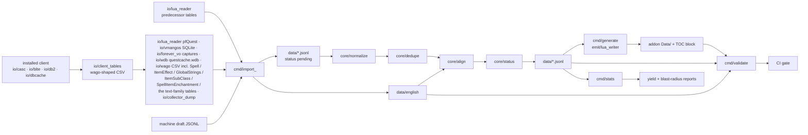

# Pipeline

> The Python build: predecessor data + English sources → `data/` → generated addon Lua. Every verb, its inputs and outputs, and the rules `check` applies. Terms: [Glossary](../glossary.md); the stored shapes: [Data model](../architecture/data-model.md).

## Purpose
Deterministic, re-runnable, no-model build of the shipped data (machine-drafted text arrives as a JSONL file through `import draft`; the pipeline calls no model). Pure core, thin IO shell, CI re-runs it and diffs.

## How it works

Package `pipeline/wfj/`: `core/` (**pure**: `model`, `normalize`, `hashing`, `language`, `align`, `dedupe`, `status`, `report`, `paragraphs`, `decisions`, `placeholders`, `specifiers`, `markup`, `readings`, `glosses`, `stat_words`, `tooltip_text`), `io/` (`lua_reader`, `jsonl_store`, `wago`, `vmangos`, `forever_vo`, `wdb`, `git_store`, `collector_dump`, `blte`, `casc`, `db2`, `client_tables`, `dbcache`, `tables_stamp`, `private_rules`), `emit/` (**pure**: `schema` (the slot map and file layout); `lua_writer` (lines → Lua text; item and spell Japanese reaches it with the translator's manual line breaks joined, `core/tooltip_text`, [ADR-049](../adr/049-manual-line-breaks-in-tooltips-are-joined.md))), `cmd/` (one module per verb: `import_`, `check`, `generate`, `validate`, `stats`, `toc_check`, `readings`, `glosses`, `fix_report`, `release`, `package_check`, `public_check`, `served`; `import_` holds the CLI entry, `build_parser` and `run`, and the importers live in `import_predecessor` (`Collector`, the predecessor / QuestJapanizer / CraftJapanizer_Quest importers, `merge_lineage`), `import_english` (pfQuest, `wago-ids`, `wago-ui`, `client-text`, collector, VMaNGOS, forever-vo, wdb, `merge_source`, `_merge_fields`) and `import_draft` (`read_draft`, `merge_draft`, `run_draft`)), `paths.py` (`data_root`, `allowlist_path`), `__main__.py`. Python ≥ 3.11, stdlib only (`validate --base` and `stats --delta` shell out to `git`; `io/vmangos` uses `sqlite3`; `io/blte` uses `zlib`; `make wago-fetch` uses `curl`). `make data` = `import → check → generate`. `dev/` holds repo-side generators and measurements (`gen_vectors`, `gen_align_vectors`, `gen_report_vectors`, `gen_attribution`, `cut_fixtures`, `list_name_typos`, `ui_inventory`, `enchant_drafts`, `cut_wdb_fixture`, `client_tables`, `cut_db2_fixture`, `tables_stamp`, `client_surface`, `client_ui`, `verify_columns`, `wdb_layout`, `served_columns`, `served_dispositions`, `level1_spells`, `table_counts`, `client_addons`, `coverage`, and the translation-batch tools below) that are not part of the CLI surface; `make vectors` runs the three vector generators and regenerates the three Python ↔ Lua contract pairs, `vectors/hash_vectors.{jsonl,lua}`, `vectors/align_vectors.{jsonl,lua}` and `vectors/report_vectors.{jsonl,lua}`.

The verbs (`cli.py`): `toc-check`, `import` (`predecessor` with the lineage importers; `english collector`, `english wago-ui`, `english vmangos`, `english forever-vo`, `english wdb`, `english client-text`; `draft`), `check`, `stats` (`--stale`, `--delta` with its status shift), `generate`, `validate`, `readings`, `glosses`, `report` (a player's fix report, [Fix reports](fix-reports.md)), `public-check` (keeps private material out of the public repository; its subcommands are below), and the release tooling: `release` (`next-version`, `changelog`, `notes`, and `changelog-gate`, the pull-request changelog check) and `package-check` (the release zip holds exactly the shipped files). Both release verbs are described in [Release](../operations/release.md).

`public-check` ([ADR-047](../adr/047-public-repository-hygiene.md)) has one subcommand per rule; each prints one line per problem and exits 1 when there is any. `make lint` runs `all` (every one but `pr`). The content rules beyond paths on the author's machine are read from a rules file kept outside the repository (`io/private_rules.py`); without one, only the public rules run.

- **paths**: no tracked file is a symlink, and no tracked file sits under an entry of the "Private project internals" block of the git folder's `info/exclude` (the ignore list git never publishes). An entry there holds no glob character (entries are compared literally) and none is listed twice. A checkout with that block must also have the private rules file.
- **content**: no tracked file holds a path on the author's machine (a home folder, an external drive), an id of the project's own issue tracker (an issue here is `#N`), or anything the private rules name: further patterns, words, names and addresses, read from `$WFJ_PRIVATE_RULES` or from `info/public-check-private.json` in the git folder. The repository holds no list of them, hashed or not. Without a rules file only the public rules run, and the check says so.
- **comments**: no comment or docstring records history (a person, a date, an approval, a numbered finding or a severity code from a review, a ruling label, and what the private rules name for comments). It reads Lua and Python comments and docstrings, `#` comments in YAML, TOML, shell, the `Makefile`, `.pkgmeta`, `.gitignore` and the pipeline's `.txt` / `.tsv` lists, and `--` comments in `.luacheckrc`, `.luacov` and the TOC.
- **links**: every relative Markdown link, image and reference-style link definition resolves to a tracked file; fenced code blocks are skipped.
- **images**: every image in `README.md` and `docs/curseforge.md` has alt text and fits the size limit, and no image under `docs/images/` carries a metadata block that can hold text (PNG `tEXt` / `iTXt` / `zTXt` / `eXIf` chunks, JPEG APP1 and COM segments).
- **pr**: the pull request's title, body, branch name and commit messages pass `content`. It reads the title, body and branch from the Actions event file (`$GITHUB_EVENT_PATH`) when there is one, else from `$PR_TITLE`, `$PR_BODY` and `$GITHUB_HEAD_REF`; with `$BASE_REF` set it also reads every commit in `origin/$BASE_REF..HEAD`: its message, and its author and committer addresses, which must be GitHub noreply ones. CI runs it on every pull request, in a job of its own, on every edit of the text too.

| verb | what |
|---|---|
| `import predecessor --quest-repo P --tooltip-repo P [--commit-quest SHA] [--commit-tooltip SHA] [--date YYYY-MM-DD] [--relabel-translator OLD=NEW]… [--questjapanizer FILE [--qjp-version 0.5.8]] [--craftjapanizer-quest FILE [--cjq-version 2012031300]]` | reads `QuestLogData.lua`, `Data/Item/ItemData.lua`, `Data/Spell/SpellData.lua` → `data/{quest,item,spell}/` as `pending` lines; source tags `cqjt@<sha>` / `ctjt@<sha>` (`git rev-parse --short=7 HEAD` unless given); translator = the quest entry's Translator tag (the Makefile relabels `CraftJapanizer=questjapanizer-wiki`, ADR-011), `WoWJapanizer` for item/spell; placeholders normalised to `{name}/{class}/{race}` and paragraph breaks to `\n\n` (`prepare_ja`). **Rebuilds** the three stores from the inputs but first reads them and **carries** every `correction` variant and every ruled variant (ADR-012; see Import below); prints `carried human decisions (corrections / ruled variants / redundant corrections): quest N/N/N · item N/N/N · spell N/N/N` (and `not carried: <type>: N orphaned rejects` when non-zero). Given the lineage files (`make import` passes both), it merges them into the rebuilt quest store in the same pass (after the decision carry, before the English baseline carry), with the same merge and the same `qjp@…:` / `cjq@…:` summary lines as the standalone subcommands below; saves once. Refused before anything is read or written: a `--qjp-version` / `--cjq-version` without its file, or an empty lineage path. There is no option to exclude a translator: exclusion by credit label cannot keep a translator's text out (identical text from another source survives under the community label, co-credits survive), so a removal request is handled on its own. A missing, unreadable or truncated input file ends the run with a one-line `wfj import: …` error (exit 1) and nothing saved; `io/lua_reader` reports a truncated file as `unexpected end of input` |
| `import questjapanizer <QuestData.lua> [--version 0.5.8] [--date D]` | QuestJapanizer 0.5.8's bundled data: only rows with `TranslationStat = "wiki"`; a trailing `翻訳:<name>` credit on any prose field is stripped (the Description's names the translator, else `questjapanizer-wiki`); source `qjp@<version>`; **merges** into the existing quest store (identical → origins + a named credit replaces the community label, different → conflict variant; identical to an existing variant → that variant's origins; `import_predecessor.merge_lineage`, shared with `predecessor`'s pass). A merge-into-store tool (existing lines keep their `english`); not part of `make import` |
| `import craftjapanizer-quest <CraftJapanizer_QuestData.lua> [--version 2012031300] [--date D]` | CraftJapanizer_Quest's positional rows `{title, objectives, description, progress, reward, completion, translator, status}`: only rows with a named translator **and** status `"1"`; source `cjq@<version>`; merges like `questjapanizer`; also not part of `make import` |
| `import english pfquest <quests.lua> --commit SHA` | T/O/D → `title`/`objectives`/`description` lines in `data/english/quest/`, `src = pfquest@<SHA>`; empty fields omitted; source-owned merge (below) |
| `import english vmangos <mangos.sqlite> --commit SHA` | (ADR-019) the VMaNGOS world database (SQLite snapshot, `io/vmangos`, opened read-only): quest: per `entry` the row with the highest `patch`, `RequestItemsText` → `progress`, `OfferRewardText` → `completion`, text verbatim, empty or blank skipped; gossip: the distinct non-empty strings of `broadcast_text.male_text` / `female_text` referenced by `npc_text.BroadcastTextID0..7` (slot value 0 = no text), `gossip_menu_option.option_text` and `quest_greeting.content_default`, then NPC speech (every other `broadcast_text` male / female text: says, yells, emotes, whispers, boss emotes; [ADR-035](../adr/035-ui-errors-frame-surface.md) §10), each a `text` line with `id = hash = key(normalize_v1(en))` and no `npcs`; the gossip strings are read sorted and before the speech strings, so when two raw forms normalize to one key the first keeps it and a gossip text keeps its key's English. `src = vmangos@<SHA>`; `--commit` must be 7–40 lower-case hex. Quest: source-owned merge (below). Gossip: the `vmangos@` lines are replaced as a set, a key already present from another source (a collector line with its `npcs`) is kept as it is, and a re-import keeps the `npcs` that `import english collector` unioned onto a `vmangos@` line. Guards: two different normalized texts under one hash → error (`vmangos: gossip hash <k> names two texts: …`, never resolved silently); zero gossip lines while `vmangos@` gossip lines exist → `refusing to replace existing vmangos gossip lines with zero lines`. **Books** (also a translation type, below): `page_text` → English type `book`, one `text` line per non-empty page, `id` = the page `entry` (a book's pages chain through `next_page`; each page is its own line). It is a source-owned merge. Every type is read and merged before any is written, so a refused merge leaves the other stores untouched too. Every table is required: a snapshot without `page_text` fails the whole import before any write, naming the table; a missing table or column or any SQLite error (`VmangosError`), an absent file or a bad `--commit` ends the run with a one-line error, nothing written. Prints `english quest: N ids · progress N · completion N (<src>)`, `english gossip: N keys (<src>); N already present from another source` and `english book: N pages (<src>)` (`13b49dc`: 1,257 pages). `make import` and `make import-english` run it after `pfquest` |
| `import english forever-vo <checkout> --commit SHA` | ([ADR-055](../adr/055-forever-vo-captures-as-an-english-source.md)) quest `progress` / `completion` English that Forever players recorded with forever-vo's addon (a clone of github.com/quinn-dougherty/forever-vo at `--commit`; `io/forever_vo.read_captures` reads `captures/*.json`, events `progress` and `complete` only). An entry counts only when its quest title equals the English title already held for that quest id (the captures name no client language; this drops German clients); a text counts only when at least two submissions sent it, compared normalized (`MIN_ORIGINS`); when they disagree the most-sent text wins, a tie going to the one that keeps a player token, then the newest build. NPC greetings (`gossip` entries, `read_greetings`): a submission whose quest entries all match the English titles held (at least one) counts as an English client; a greeting two such submissions sent becomes a gossip `text` line keyed by the hash of its English, with the creature ids as `npcs`, added only where no other source holds the key (nor a `$G` line's female wording, which its gender alias already ships) and the key is not listed in `--skip` (`pipeline/forever_vo_skipped.txt`: greetings in an invented in-game language, or damaged in the captures, each with its reason); this source's earlier greetings are replaced as a set. It only fills a (quest, field) no other source holds, and `collector` outranks it. `src = forever-vo@<SHA>`, source-owned merge. Prints `english quest: N lines (<src>): progress N · completion N · already held, same text N · already held, other wording N`, the skipped counts and `english gossip: N NPC greetings (<src>) no other source holds` (`one_submission`, `other_language`, `no_title`, `disagreed_resolved`). `make import` and `make import-english` run it after `vmangos`, after checking the clone is at `FOREVER_VO_SHA`. `ATTRIBUTION.md` credits forever-vo exactly while a `forever-vo@` line remains (`gen_attribution`) |
| `import english wdb <questcache.wdb> --build VERSION [--questv2 QuestV2.csv [--missing PATH]] [--merge replace\|union] [--allow-shrink] [--dry-run]` | (ADR-020) Blizzard's cached quest text from the client's quest cache (`io/wdb.read_quests`): `title` / `objectives` / `description` lines in `data/english/quest/` and the area description (an exploration / event objective's text; 198 quests on 1.15.9.69722) as English type `area` / field `text` keyed by the quest id in `data/english/area/` (an area line follows its quest under `union` / `replace` as the quest fields do, and a cache with no area text is not refused; the field table prints an `area` row), `src = wdb@<VERSION>`, text verbatim (normalization and hashing as for every English import), a blank field writes nothing. Each objective's own text ("Rescue Drull") is English type `objective` (English only): one `text` line per objective with text, `id` = its QuestObjective id (quest 498 → 381177), 202 on 1.15.9.69722; kill / collect objectives have none and write nothing. An objective id cached under two quests ends the run (`wdb: objective N is cached under two quests`, [principle 5](../architecture/principles.md#5-every-translation-is-keyed-by-the-game)), and so do objective text that is not UTF-8 and non-blank objective text under QuestObjective id 0 (whitespace-only text is never written, so it is no error), which could not be keyed (`objective N has text but QuestObjective id 0`). All of these stop the `--dry-run` that `wdb-preflight` runs, before any import writes. The `wdb@` objective lines are replaced as a set with the quests. `--build` must look like `1.15.9.69722` and its last number must equal the build in the file's header, else exit 1 (`wdb: questcache.wdb is build N, --build is …`). Quests whose title matches `PLACEHOLDER_TITLE` (case-insensitive `^\s*(?:<[A-Za-z]+>\|\[[^\]]*\])\|^\s*reuse\s*$`: a leading `<TAG>`, a leading `[…]`, or only `REUSE`) are dropped and counted. Source-owned merge (below): a cached quest's pfQuest line for that field is replaced; uncached quests, blank cached fields and VMaNGOS progress / completion keep their lines. Everything is read and merged before anything is written; a `WdbError` (below), no quest text at all, or `--missing` without `--questv2` ends the run with a one-line `wfj import: …` error, nothing written. Prints `english quest (wdb@<build>): N records · N quests · N placeholders dropped`, a per-field `same` / `changed` / `new` table against the line each (id, field) had before (`same` = equal hash), and `english objective (wdb@<build>): N objective texts`. Two kinds of cached text the client shows with no id the addon can read, a quest's conditional descriptions (another wording of the quest for a class or race, which Forever serves per `PlayerCondition`) and its completion log line (`GetQuestLogCompletionText`, the tracker's and quest log's line once the quest is ready), are written as English type `gossip`, field `text`, keyed by the hash of their English ([ADR-054](../adr/054-quest-text-keyed-by-its-english.md); `_wdb_keyed_lines`). The write is additive (`_add_keyed`): a key another source already has keeps its line, and a key whose line holds other English ends the run (`wdb: gossip hash K names two texts: …`). It prints `english gossip (wdb@<build>): N keyed texts (conditional descriptions, completion logs), N new`. With `--questv2` (`wago.read_ids`) it also prints `answered A / T QuestV2 ids below 10000`, `answered A / T all QuestV2 ids` and `cached ids not in QuestV2: N`; `--merge union` keeps a `wdb` line this cache does not provide, at the build that served it: Forever's server answers 28.5% of QuestV2's ids against Classic Era's 92.9% of its own, so the default `replace` would drop ~2,900 quests back to pfQuest's English; the objective lines follow the same rule, and `wdb` is then pinned at two builds, which `generate` allows for a source in `schema.MULTI_VERSION_SOURCES` and still refuses for every other. `--missing PATH` writes the unanswered QuestV2 ids (neither a quest nor a placeholder in the cache) ascending, one per line: the input of a rescan. **Shrink guard:** if a quest holds `wdb@<same build>` English but is not in the cache at all (a wiped cache, the wrong install), the run exits 1 with nothing written: `wdb: N quest(s) with wdb@<build> English are not in <file> (ids…): a smaller cache of the same build would delete their English. Copy the right cache, or pass --allow-shrink`. `--allow-shrink` proceeds and prints `quests with earlier wdb English not in this cache: N (their English deleted, --allow-shrink)`. A cache of another build replaces the earlier build's lines by design and prints `… N (earlier build; they fall back to pfQuest)`; under `make import-english` those quests keep pfQuest's lines. `--dry-run` runs every check (build, layout, shrink guard, QuestV2 coverage), prints the report with `[dry run: nothing written]`, and writes neither the store nor `--missing`. Re-running is a byte no-op. `make import` and `make import-english` run it after `pfquest` and `vmangos` |
| `import english wago-ids <ItemSparse.csv> <SpellName.csv> --build VERSION [--id-col C --name-col C] [--src wago\|db2] [--merge replace\|union]` | `name` lines in `data/english/{item,spell}/`, `src = <src>@<VERSION>` (`--src` default `wago`; `db2` = the same tables extracted from an installed client); columns `ID` + `Display_lang` / `ID` + `Name_lang` by default; source stamp checked first (below); client-table merge (below); `--merge union` keeps a client-table line this import does not provide, under its existing `src` (the default `replace` drops it; `client-text` and `wago-ui` take the same option) |
| `import english client-text <ItemSparse.csv> <Spell.csv> <ItemEffect.csv> [--itemxitemeffect ItemXItemEffect.csv] --build VERSION [--src wago\|db2] [--merge replace\|union] [--dry-run]` | item / spell tooltip English from the client tables: spell `description` = `Spell.Description_lang`, spell `aura` = `Spell.AuraDescription_lang` (the buff / debuff text); item `description` = the descriptions of the item's `ItemEffect` spells in (slot, effect id) order, then `ItemSparse.Description_lang` (the flavour text), non-empty parts joined by a line break. Only effects whose `ItemEffect.TriggerType` the tooltip prints are joined (ADR-021, `TOOLTIP_TRIGGERS`): 0 Use, 1 Equip, 2 Chance on hit, 5 Use without delay; 6 (learn spell) and 7 (loot tracker), on 1.15.9.69722 only Season of Discovery rune items and `[DNT]` trackers, are counted and printed (`item effects not in the tooltip, not joined: type 6: N, type 7: N`), not joined. This is read from the client source, not checked in game; hidden types are skipped before the missing-spell check, so they never make an item incomplete. Raw client templates (`Restores $o1 health over $d.`): numbers live in the spell-effect table, so offline English never carries them (ADR-007). Hashed like every English line; `src = <src>@<VERSION>`. An effect naming an item the tables lack is counted and not written; an item with **any** shown (0/1/2/5) effect naming a spell the Spell table lacks gets no `description` English at all, never a partial tooltip (`item effects not written: N name no known spell (M items left without tooltip English), K no known item`). An empty Spell / ItemEffect / ItemSparse CSV, a spell or an item listed twice is an error, nothing written; the source stamp is checked before anything is read (below). Everything is read before anything is written; client-table merge (below), per field, so the `name` lines of `wago-ids` stay; zero lines over existing ones is refused. `--itemxitemeffect` names the item each effect belongs to, for a build whose `ItemEffect` writes `ParentItemID` 0 on every row (Forever); `--dry-run` reads and joins every table and writes nothing (the preflight). Prints `english spell: description N · aura N (<src>)` and `english item: description N (N with flavour text, N with effects) (<src>)`. On 1.15.9.69722: spell description 17,615 · aura 6,543 · item description 12,814 (1,898 with flavour, 12,254 with effects) |
| `import english wago-ui <GlobalStrings.csv> <ItemSubClass.csv> [--enchantments SpellItemEnchantment.csv] [--subtexts Spell.csv] [--families <client folder>] --keys pipeline/ui_keys.txt --build VERSION [--src wago\|db2] [--merge replace\|union]` | `text` lines in `data/english/ui/` for **exactly** the keys in the curated list (one per line, `#` comments; a duplicate raises): a global-string name from `GlobalStrings` (`BaseTag` → `TagText_lang`, a `\n` read as a real newline and a `\\` as one backslash, in one pass, so an escaped backslash before an `n` is never a break, and a texture path reads as the client's `_G` holds it; `io/wago._unescape`), `ItemSubClass:<ClassID>:<SubClassID>` from `ItemSubClass` (`DisplayName_lang`), `SpellItemEnchantment:<ID>` from `--enchantments` (`Name_lang`, only stat lines), or `SpellSubtext:<ID>` from `--subtexts` (Spell `NameSubtext_lang`, the spellbook subtext, [ADR-032](../adr/032-level-1-gaps-subtexts-and-name-titles.md); every non-empty subtext is read, and the key list decides which are words: 12 listed, pet families / form names / `QASpell` never), or `<Family>:<ID>` from `--families` ([ADR-042](../adr/042-client-table-text-families.md): a client folder holding every `wago.FAMILY_TABLES` CSV (Faction.csv, Achievement.csv, …), each read by `read_family`; a missing CSV raises; the families below). `--src wago\|db2` as for `wago-ids`. A list entry ending in `:*` (`ItemSubClass:1:*`, `SpellItemEnchantment:*`) is a family: `wago.expand_keys` replaces it with every table key of that prefix in id order, fails when none exists, and a key listed twice after expansion fails. `src = <src>@<VERSION>`; a listed key absent or empty in the tables fails the import with nothing written (under `--merge union` it is printed and its existing English is kept); source stamp checked first, `--enchantments`, `--subtexts` and the `--families` CSVs included (below); client-table merge (below) |
| `import english served <QuestV2.csv> <questcache.wdb> <ItemSparse.csv> <SpellName.csv> --keys <ui_keys.txt> [--map-cache WDB]… [--dry-run]` | ([ADR-034](../adr/034-forever-is-the-only-target.md), amended by [ADR-050](../adr/050-english-is-additive.md); `cmd/served.py`) the last English step. It drops the English of ids Forever has **never** served and never removes one it has. What the **target client** (Forever, whose folder `make import-served` passes) serves on this build: `quest` ids in QuestV2 ∪ the Forever quest cache (placeholders included); `item` ids in ItemSparse; `spell` ids in SpellName; `ui` keys whose English carries the three CSVs' `tables-source.txt` stamp and that are in the `--keys` list (its families expanded). The step adds those ids to the served record `pipeline/served/<kind>.tsv` (quest, item, spell, ui; `id<TAB>first build<TAB>last build`, a `#` header line) and moves their last build forward. A line is kept when its id is in the record (this build or an earlier one) or its `src` is Forever's own (`wdb@1.60…`, `db2@1.60…`); `area` lines follow their quest; `objective` lines follow their quest, mapped through the Forever cache then each `--map-cache` (Classic Era's; an objective no cache maps is kept and counted, and one another cache files under another quest follows the target cache). An id an earlier build served and this one did not keeps its English and its older last build; the step prints `served <kind>: N ids an earlier build served, not served on <build>: kept (pipeline/served/<kind>.tsv keeps their last build)`. Nothing acts on that list; it is a record for a possible later cleanup. Never touches `book` / `gossip` / `unit` English or any `data/<kind>` Japanese. Everything is read and decided before anything is written; refuses (nothing written) on a missing input, a CSV with no stamp or stamps that differ, a cache whose build is not the stamp's build, or a kind that would lose every line. Prints `served: target <src>@<build> · N QuestV2 ids + N cached only · N items · N spells` and per kind `kept N lines, removed N (N ids)`. Idempotent; `--dry-run` writes nothing |
| `import draft <type> <draft.jsonl> --model ID [--critic ID] --date YYYY-MM-DD --name NAME [--reverify]` | (ADR-014) merges machine-drafted text into `data/<type>/`: rows exactly `{"id", "field", "ja"}`; provenance `{class: machine, model, critic?, source: draft-<NAME>@<date>, imported}`. Per (id, field): absent → new `pending` line (added); same text by `ja_identity` → unchanged; a machine variant from the same draft name → replaced; otherwise → appended to `conflicts`. Never edits a `human` / `correction` variant. Refuses an unknown type, a `--name` outside `[a-z0-9-]`, a quest `progress` / `completion` or gossip draft whose `--name` does not end in `-sg<N>` for the style guide's current version or with no style guide (ADR-023; `core/style.py`), a non-integer id for a numeric type (ids are 16-hex strings for the `HASH_KEYED` type gossip and names for `ui`; integers otherwise, `book` included), a duplicate or invalid row (nothing written). Prints `added · unchanged · replaced · appended`; `make import-draft DRAFT= TYPE= NAME= MODEL= [CRITIC=] DATE= [REVERIFY=1]`. **`--reverify`** (`REVERIFY=1`; `import_draft.REVERIFY_TYPES` = `ui`, `quest`, `objective`, `area`, `item`, `spell`; another type is refused: gossip is keyed by its English hash, so a rewording is a new key, and books come from VMaNGOS): after the merge, every line the draft names (added, replaced or unchanged) gets the `english` a fresh `check` would record for its (id, field), `check.current_baseline` (shared with `check`): `{hash, src}` of the English the field is judged against, plus `of` for a quest / item / spell line judged against another field (a quest field hashed on another field, an item / spell line judged on its name). This is because the draft was written against that English, so `check` judges a stale line against it instead of keeping the old hash (ADR-003's audit pass done by the tool, not a hand edit of `english`). A row whose (id, field) has no English refuses the whole import, and so does a line with a hand-written variant not ruled `reject` (`decisions.hand_written_all_rejected`; error `have a hand-written variant not ruled reject`) (a stale hand-written line needs a ruling before a redraft can take it over); the summary adds `re-verified N` (lines whose `english` changed). `--critic` is passed only when a second model reviewed the draft (ADR-014) |
| `import english collector <SavedVariables.lua>` | a player's `WFJ_Collector` → quest `title`…`completion`, item/spell `description`, unit `name`, gossip `text` (with `npcs`) lines, `src = collector@<build>`; replaces a stand-in (pfQuest, VMaNGOS, an older client) and keeps the same client's own tables and quest cache ([ADR-053](../adr/053-forever-shown-english-is-the-english.md), [Collector](collector.md)); quest and gossip lines are consulted by `check`/`validate`/`stats` (below); `make import-collector DUMP=<file>` (the path may contain spaces) |
| `check [--report]` | builds English scopes from `data/english/` (gossip: from the gossip key, `scopes_for`), runs the status decision table on every quest/item/spell/ui/gossip/book/objective/area line (`check.TYPES`), promotes conflict winners, stores every line's `conflicts` in one canonical order (ADR-012 §5, `core/dedupe.canonical_conflicts`: class `human` < `correction` < `machine` < other, then source, translator, `ja`; winner selection never reads it), writes `status`/`reasons`/`checks`/`english` back via `Store`; prints a one-line summary, `--report` the full per type × field report; idempotent (rerun = byte no-op), ~2.6 s over 40k lines (`cmd/check.py`) |
| `generate [--addon DIR]` | `data/` → `addon/…/Data/<Type>/<Type>_NNNN.lua` id-range shards + `Data/Meta.lua` + `Data/Vectors.lua`, and rewrites the TOC's generated block; deterministic and idempotent (unchanged files are not rewritten, shards whose range emptied are deleted); also `Data/Reading/Reading_<type>_<shard>.lua` from `data/reading/` (current readings only; below), and `Data/Gloss/Gloss_<NNNN>.lua`, the meanings those readings point at, numbered from `data/reading/meaning-numbers.tsv` (written back when a meaning is new: `generate: N meanings numbered for the first time`); prints artifact count, counts, `gender aliases: N added · M dropped · K ambiguous` (+ one `dropped alias <type>:<key>` / `ambiguous female variant <type>:<hash>` line each), written/unchanged/deleted (`cmd/generate.py`) |
| `validate [--base REF] [--addon DIR]` | the CI gate, exit 1 listing every problem: schema; provenance ([principle 6](../architecture/principles.md#6-provenance-on-every-line-people-over-machines); needs `--base`, else "skipped": a line `human` / `correction` at REF and `machine` in the current store fails unless the machine line carries `ruling: accept`, or every hand-written variant is ruled `reject` **and** the line shipped nothing at REF, ADR-014); zero English hash collisions; referential integrity of every shipped line (gossip via `check.scopes_for`); regenerate-and-diff of `Data/` + the TOC block; no unknown player placeholder on a shipped line; UI string specifiers and ambiguity (a key in the `OWN` table of `Core/UIStringKeys.lua`, read by `validate.ui_own`, is left out of the ambiguity comparison, [ADR-037](../adr/037-staticpopup-dialogs-and-owned-keys.md)), markup and adjacent captures; objective ambiguity (`rule_objective`: two shipped objective ids with one English hash and different Japanese; the addon finds an objective by its English, so neither could be shown, objective and area rows grouped together by h1, the first 32 bits of the English hash the addon's index keys on, `objective ambiguous: <type> <id>, … share one English fingerprint with different Japanese`; prints `validate: objective index: objective N shipped · area N shipped`); readings (rule 8); the voice tables (`rule_voice`) (`cmd/validate.py`). `luac -p` over the generated files is `make luac`, chained by `make validate` |
| `stats [--stale PATH [--dump SAVEDVARIABLES]…] [--delta REF [--capture PATH]]` | the same report as `check --report` (gossip included), no writes to `data/` (`cmd/stats.py`), then the **gossip blast radius** (`report.gossip_radius`): `gossip: N keys with English · M translated` (every gossip English line, collector and VMaNGOS; VMaNGOS has no `npcs` and so sorts at 0) and the top 20 (`GOSSIP_TOP`) gossip keys by NPC count, ties by key, as `<npcs> <key> <status or -> <English cut to 60 chars…>`, or `gossip: no collected English`. `--stale PATH` (ADR-019, `report.stale_rows`) also writes the quest lines to fix offline as JSONL and prints `stale report: N quest lines → PATH`: one row per shipped line (`trusted` / `stale` / `unaligned`) that is `stale`, or whose `(id, field)` has English from any source (collector included, though `check` does not consult it) with a hash other than the line's `english.hash`; `{"id", "field", "status", "ja", "en", "src", "of", "others": [{"src", "en", "hash"}]}` (`en` = the English the line was checked against, `null` when no store line has that hash; `of` = the line's `english.of` (checked against another field's English, so any English of its own field is listed under `others`); `others` holds one entry per (src, hash)), sorted by (id, field order), deterministic; without the flag the output is unchanged. `--dump FILE` (repeatable, requires `--stale`) also reads a collector dump's quest entries (`collector_dump.read_dump`, `src collector@<build>`) and compares them: `import english collector` keeps a pfQuest / VMaNGOS line and stores nothing where a curated source has the (id, field) (it only prints `differs`), and `import english vmangos` replaces collector lines for the fields it provides, so the store alone never shows Blizzard's text disagreeing with a curated source. A bad dump is read before anything prints; it, or an unwritable output path, ends the run with a one-line `wfj stats: …` error (exit 1). `check --report` is unchanged. `--delta REF` (ADR-020; `io/git_store.load_english_at`, `report.english_delta` / `render_delta`) loads `data/english/<type>` at the git ref (`git rev-parse --verify`, `git ls-tree`, `git show`) for quest / item / spell / ui / gossip / objective / book / area. It first prints `status shift since REF:` (`io/git_store.load_lines_at(…, english=False)`, `report.status_shift` / `render_status_shift`): per translation type (`check.TYPES`), the lines whose status differs between REF and the current store, as `<field> <was>→<now> N` (`-` for a line on one side only), or `none`. Then it prints `english delta since REF:` with, per type, `new` (ids only in the current store), `removed` (ids only at REF), `changed` (lines of ids on both sides whose hash differs or that exist on one side only) and the changed lines by field. `--capture PATH` (requires `--delta`; `report.capture_rows`) writes the **capture list** as JSONL and prints `capture list: N quests → PATH`: one row per quest id that is new or whose `title` / `objectives` / `description` changed, `{"id", "title", "change": "new"\|"changed", "fields", "progress_src", "completion_src"}` (`title` = the current English title; `*_src` = the source of the current progress / completion English, `null` = none, so a player must see that window), sorted by id, deterministic. An unknown ref is read before anything prints and ends the run with a one-line `wfj stats: unknown git ref …` error (exit 1). Removed quest ids stay near zero by construction (pfQuest lines persist), so the import's `--missing` list is the "not answered" view |
| `readings export --type quest\|gossip\|ui\|book --ids FILE [--all] [--class machine\|human\|correction] --out BATCH.jsonl` | ([Readings](readings.md), `cmd/readings.py`) one row `{"type", "id", "field", "ja", "ja_hash"}` per shipped Japanese line of the listed ids (one id per line, `#` comments; ints for quest, 16-hex keys for gossip) that has **no current reading** (`--all`: every line) and holds no `|` escape sequence (`readings.holds_escape`, the predicate validate uses too: the reading box refuses such a line). `--class` (choices `model.PROVENANCE_CLASSES`) keeps only lines whose shipped variant has that provenance class. The model writes `words` onto each row. Prints `readings export: N line(s) → BATCH` |
| `readings import BATCH.jsonl --model MODEL --batch NAME [--date YYYY-MM-DD] [--dry-run]` | rows `{"type", "id", "field", "ja_hash", "words"}` (a kept `ja` is ignored; also the `<name>.words.jsonl` that `translate_batch expand` writes from draft rows carrying `words`) → `data/reading/<type>/`, provenance `{class: machine, model, source: readings@<NAME>, imported}`; `--batch` is 4–64 of `[0-9A-Za-z._-]`. A row is **rejected with its reason** and nothing of it written when its shape is wrong (`core/readings.record_problems`), the batch has the line twice, the line has no shipped Japanese, its `ja_hash` is not the current Japanese's (`written for a variant that does not ship: the shipped line is another text; export it to write its readings` when the hash is one of the line's `conflicts` variants (a draft merged as a conflict because a hand-written line still wins, or as `unchanged`), otherwise `written for Japanese that has since changed; export it again`), or a word fails the word checks (`word_problems`: an entry is `[word, reading]` or `[word, reading, dictionary form, its reading, meaning]`; in the Japanese in order after the previous word, holds a kanji (or is a kana word reading itself in a 5-item entry), holds no ASCII character, kana-only reading; `meaning_problems`: a dictionary form that is non-empty Japanese with no ASCII, a kana dictionary-form reading, a meaning that is one trimmed line of at most 60 characters with no `\|` or tab). Every written row gets a copy of a word's entry at each further place the line uses that word (`readings.fill_repeats`), so a word used twice has its card both times. Machine output replaces machine output and **never** a `correction` reading (kept and reported). Prints each rejected / kept line and `readings import: wrote N · rejected N · kept N · by type {…}`; exit 1 when any row was rejected; `--dry-run` writes nothing |
| `readings fill-repeats [--dry-run]` | ([Readings](readings.md)) every current reading whose line uses a listed word again with no card of its own (`readings.uncovered_repeats`, placed the way the addon places entries) gets a copy of that word's entry at each such place (`readings.fill_repeats`); provenance stays. Prints `readings fill-repeats: filled N place(s) in N line(s) · by type {…} · left N`; exit 1 when a line could not be completed |
| `readings import BATCH.jsonl --correction --by NAME [--date YYYY-MM-DD] [--note TEXT] [--dry-run]` | the rows fix readings already in the store: each is written as a `correction` record, `{class: correction, translator: NAME, source: correction@<date>, corrects: <the replaced record's source>, imported, note?}`; when the replaced record is itself a correction from the same day (same `correction@<date>` source), `corrects` keeps that record's `corrects`, so a second fix the same day never names itself; `--model` / `--batch` are not needed, `--by` is required. A row for a line with no reading yet is rejected, `no reading to correct`; every other check is the machine import's ([Translation batches → Readings for a batch](../operations/translation-batches.md#readings-for-a-batch)) |
| `glosses check --jmdict FILE [--readings DIR] [--top N]` | ([Readings](readings.md), `cmd/glosses.py`) **local only**: reads every reading record (`data/reading/`, or DIR laid out the same way) and prints `glosses: N of M words carry a meaning · K distinct meanings`, then the dictionary forms JMdict (jmdict-simplified English JSON, a local copy) does not know, most used first (`--top`, default 30): usually game compounds (大族長); a misspelt or invented form shows up there too. JMdict is never committed or shipped |
| `voice speakers --vmangos <mangos.sqlite> --commit SHA [--wdb questcache.wdb] [--forever-vo DIR --forever-vo-commit SHA]` | ([ADR-061](../adr/061-voice-over-from-a-separate-pack.md), [ADR-062](../adr/062-voice-cast-per-speaker-in-step-with-the-text.md), [Voice over](voice.md), `cmd/voice.py` over `core/voice.py`) writes `data/voice/speakers.jsonl` (pack key → its main speaker, a creature id or `narrator`, and the `others` who say it too) for every voiced line: quest starters and enders and gossip from VMaNGOS, the quest cache's conditional descriptions, forever-vo's player captures for quests the database lacks, and the collector's NPC ids (`npcs`), which win; a signed book page is read by its writer. Prints narrator lines, conflicts and lines with no Japanese. A row unchanged but for its date keeps its old date. `make voice-speakers` (runs `make voice-levels` first) |
| `voice levels --wdb <questcache.wdb> --vmangos <mangos.sqlite>` | (`cmd/voice_store.py`) writes `pipeline/voice_quest_levels.txt`: each quest's level, the client's quest cache first (`io/wdb.py`, payload offset 8), VMaNGOS for the rest, so the packs can be split where the client files are not. `make voice-levels` |
| `voice profiles build \| export \| import` | (`cmd/voice_cast.py` over `core/casting.py`) `data/voice/profiles.jsonl`: one row per speaking creature (race, gender, age, archetype, role, each with its source) from the client's display tables and VMaNGOS; `export` / `import` run the casting pass for what the tables cannot say, never over a table value or a ruling |
| `voice cast [--config voice.toml]` | (`cmd/voice_make.py`) casts every profile through `pipeline/voice.toml`'s cast rows and `data/voice/overrides.jsonl` into `data/voice/voices.jsonl` (creature → roster voice and the row that chose it) |
| `voice audition build \| serve \| apply` | (`cmd/voice_audition.py`) a local listening page of every usable voice reading the same lines beside the kinds of speaker; the picks are written into `voice.toml` |
| `voice record-hashes [--store DIR]` | (`cmd/voice_make.py`) fills the SHA-256 of audio record rows made before the field existed, from the store files (read only); a file missing or not the recorded size is left and named |
| `voice plan [--scope S] [--players all]` | what `generate` would make now, by cast row and voice, with characters and hours; makes nothing |
| `voice generate [--config voice.toml] [--store DIR] [--scope S] [--players all]` | reads the shipped Japanese of every missing or changed file through the local AivisSpeech Engine (`io/aivis.py`: `/version`, `/speakers`, `/audio_query`, `/synthesis`), player tokens spoken as 冒険者 (`core/voice.speech_text`), WAV → `lame` → MP3 (mono, 22.05 kHz, 32 kbps CBR, no Xing / Info header) into the audio store, and records each file in `data/voice/audio.jsonl` (fingerprint: Japanese hash, roster voice, its engine settings). Resumes where a run stopped; with nothing to make it needs no engine, with work and no engine it refuses. `make voice-generate` (then `voice-sync`), `make voice-run` in the background, `voice status` for progress |
| `voice store-sync [--store DIR] [--if-changed]` | (`cmd/voice_store.py`) commits and pushes what the audio store (a checkout of the voice audio repository) holds new or changed, and writes that commit to `pipeline/voice-audio-commit.txt`, the audio pin. Refuses a store not on a branch. `--if-changed` does nothing (no push, no new pin) when the store holds nothing new and nothing unpushed, as at the end of a run that made no file. `make voice-sync` |
| `voice pack [--store DIR] [--out DIR]` | (`cmd/voice_ship.py` over `core/voice_packs.py`, `emit/voice_pack.py`) writes the Voice entry and every pack under `build/voice-pack/`, split by `pipeline/voice-packs.toml` (level bands from the committed level table), from the recorded files in step with the shipped Japanese; prints each pack's size and room, refuses a pack past the cap. `make voice-pack`; `make voice` = speakers → generate → pack |
| `voice release [--dry-run] [--curseforge-only] [--only FOLDER,…] [--entry-without-packs]` | builds and checks every zip, then uploads to CurseForge only the packs whose content changed since the last `voice-v*` GitHub release (the entry when the packs it requires changed), recording each upload on a draft release so a re-run never uploads twice, and publishes the GitHub release. Refuses unless the store sits at the audio pin. The Release workflow's voice job runs it; `make voice-release DRY=1` locally |
| `voice inputs` | prints `changed=true\|false`: whether the fingerprint of everything the packs are built from differs from the last voice release's; the Release workflow skips the voice job when it is false |
| `toc-check` | reads the TOC + `clients.toml`; asserts `## Interface` == `[forever].interface`; requires `## Interface` / `## Title` / `## Version` / `## SavedVariables`; warns if `## X-Curse-Project-ID` is empty (`cmd/toc_check.py`) |

### Import
- `io/lua_reader` is a Lua **table-literal** reader, not a Lua parser: `NAME[...][...] = { … }`, nested tables, `["k"] = v` / `[1] = v` / `name = v` / positional entries, strings with Lua 5.1 escapes (unknown escapes keep the char, as Lua 5.1 does), numbers, `nil`/`true`/`false`, `--` comments. **Duplicate keys are preserved** in file order (`Table.items` is a list of `(key, value)`), which is what makes duplicate-id handling explicit ([principle 5](../architecture/principles.md#5-every-translation-is-keyed-by-the-game)). Anything else raises `LuaSyntaxError` with a line number.
- `lua_reader.parse_assignments(text) → {name: value}` reads any number of top-level `NAME = <value>` statements (`nil` allowed); a SavedVariables file holds `WFJ_DB` and `WFJ_Collector`; `parse_assignment` is unchanged.
- `io/vmangos.py` reads the VMaNGOS world database snapshot (`vmangos/core` release `db_latest`, asset `db-sqlite-<sha>.zip` → `sqlite-dump/mangos.sqlite`; schema verified on `db-13b49dc`): `read_quests(path) → [(id, field, en)]` and `read_gossip(path) → [en]` (sorted distinct), `read_speech(path) → [en]` (every `broadcast_text` male / female text, sorted distinct: NPC speech, imported as gossip lines) and `read_books(path) → [(entry, en)]` (`page_text` `entry`/`text`/`next_page`, sorted by entry), which checks only its own table. Before reading it checks every table and column it needs (`quest_template` `entry`/`patch`/`RequestItemsText`/`OfferRewardText`, `npc_text` `BroadcastTextID0..7`, `broadcast_text` `entry`/`male_text`/`female_text`, `gossip_menu_option` `option_text`, `quest_greeting` `content_default`) and raises `VmangosError` naming the first gap; any other SQLite error while opening or querying also becomes a one-line `VmangosError`. The file is opened read-only through its URI (`path.resolve().as_uri() + "?mode=ro"`), so a path containing `#` or `?` works. Text is returned verbatim; normalization and hashing are the importer's.
- `io/wdb.py` (ADR-020) reads the client's quest cache `Cache/WDB/enUS/questcache.wdb`. **The framing is build-independent:** a 24-byte header (magic `TSQW`, build `u32`, locale `SUne`), then `[quest id u32][length u32][payload]` records and an 8-byte zero terminator. `read_ids(path) → (build, cached ids)` walks only that, never a payload, so a rescan list can be produced on a build whose payload layout is not pinned yet (the rescan list); it still raises `WdbError` on a broken header or frame. **The payload layout is per build**, one frozen `Layout` per entry of `LAYOUTS`, each carrying the `evidence` it was verified against; `read_quests(path[, layout]) → WdbCache(build, quests, placeholders, layout)` picks by the header's build and `layout_for` refuses an unpinned one, naming the pinned builds and pointing at `wfj.dev.wdb_layout`. A `Layout` says where the objective count sits, where the objectives start, whether the 12-byte string-length block is at a fixed offset or follows the variable parts, what the bits behind the nine lengths must be (`pad_bits`), which `u32` must be zero, and the counts of four optional lists: 12-byte entries before the objectives, 4-byte entries after them, the conditional-text arrays, and an objective record's own inner list. Pinned: **69722** (Classic Era 1.15.9, objective count 448, objectives 504, block fixed at 492, pad 0, zero at 480/484/488, no lists: 4,217 of 4,217 records) and **69913** (Forever 1.60.1, count 436, objectives 488, block after the variable parts, pad 32, zero at 480/484, pre-list count at 64, post-list at 448, conditional counts at 472/476, objective inner count at +33: 1,965 of 1,965 records, and 1,233 of 1,245 already-held titles reproducing character for character) and **70009** (Forever 1.60.1.70009: the 69913 offsets unchanged, 2,231 of 2,231 records, 2,164 quests, 67 placeholders, 16 conditional entries, 2,091 of 2,101 held titles reproducing; layout 69722 reads none) and **70124** (Forever 1.60.1.70124: the same offsets again, 2,325 of 2,325 records of the full scan, and every record of the 2,356-record cache after the all-ids sweep) and **70170** (Forever 1.60.1.70170: the same offsets again, all 2,406 records after the all-ids sweep, a catch-up scan and a slow recheck) and **70245** (Forever 1.60.1.70245: the same offsets again, 3,003 of 3,003 records after the known-list scan and its slow recheck) and **70291** (Forever 1.60.1.70291: the same offsets again, 2,880 of 2,880 records after the known-list scan and its slow recheck). The Era and Forever layouts read **zero** of each other's records. `decode_payload(qid, payload, lay) → WdbQuest` is the payload layer: an objective is 43 bytes plus four per inner-list entry, then its description's length byte, a flag byte whose low 7 bits are zero, then the text; a conditional-text entry is `[PlayerCondition id u32][quest-giver id u32][12-bit length + 4 zero bits][text]`. `WdbQuest` carries `title` / `objectives` / `description` / `area`, the `(QuestObjective id, text)` pairs and `conditional`: Forever's per-condition variant of a description, read so the payload adds up and **reported by the import, never written** (its key is `(quest, condition)`, which the data model does not have). A record whose title matches `PLACEHOLDER_TITLE`, case-insensitive `^\s*(?:<[A-Za-z]+>|\[[^\]]*\])|^\s*reuse\s*$` (a leading `<TAG>` in any case such as `<UNUSED>` or `<nyi> <TXT>…`, a leading `[…]` such as `[Never used]`, or only `REUSE`; "Test of Lore" stays), is a placeholder: 63 of the 4,217 records on 1.15.9.69722 and 66 of the 1,965 on 1.60.1.69913, none with a translation. Text is Blizzard's raw template (`$B`, `$N`, `$G a : b;`). `WdbError` names the file and quest id on wrong magic, a non-enUS locale, an unpinned build, a record past the end, a missing terminator or trailing bytes, a `u32` this build requires to be zero, a list count past `MAX_COUNT` (64), padding bits that are not this build's `pad_bits`, unknown objective flag bits, a conditional entry whose four low bits are set, a payload not consumed exactly, invalid UTF-8, non-blank objective text under QuestObjective id 0, or a quest id cached twice ([principle 5](../architecture/principles.md#5-every-translation-is-keyed-by-the-game)); never a guess, so a changed layout on a new client build fails loudly. `dev/cut_wdb_fixture.py` cuts a fixture per build (`tests/fixtures/wdb/`: records 170, 498, 247, 25, 172, 490; `tests/fixtures/wdb-forever/`: 12 records chosen so every part of that layout is exercised) and its `expected.json`.
- `io/git_store.py` returns `data/english/<type>` as it was at a git ref (`load_english_at(repo, ref, types)`), and `data/<type>` too (`load_lines_at(repo, ref, types, english=False)`, for the status shift), read-only; a ref starting with `-` or not naming a commit raises `ValueError`.
- `io/wago.py` reads the wago.tools CSV exports by column name (`--id-col`/`--name-col` override); the defaults were verified against live exports.
- `io/wago.py` also reads `GlobalStrings` (`BaseTag`, `TagText_lang`: a tag listed twice with different text raises; the two characters `\n` become a newline, so the English hash is the hash of the client's string), `ItemSubClass` (`ClassID`, `SubClassID`, `DisplayName_lang`), `SpellItemEnchantment` (`read_enchantments`: `ID`, `Name_lang`, kept only when the text fully matches `ENCHANT_STAT_LINE` `[+-]\d+ [A-Za-z][A-Za-z' ]*`, "+3 Fire Spell Damage" yes, "Crusader", "Rockbiter 3" and "+2 Stamina +2 Spirit" no), Spell subtexts (`read_subtexts`: `ID`, `NameSubtext_lang` → `{"SpellSubtext:<ID>": subtext}`, empty skipped), the curated key list (`read_keys`) and its families (`expand_keys`); columns verified on 1.15.9.69722. [ADR-042](../adr/042-client-table-text-families.md): the **client-table text families**; `TEXT_FAMILIES` maps a family to its table and text column (`FactionDescription` Faction `Description_lang` · `AchievementTitle` / `AchievementDescription` / `AchievementReward` Achievement `Title_lang` / `Description_lang` / `Reward_lang` · `AchievementCategory` Achievement_Category `Name_lang` · `SkillLineDescription` SkillLine `Description_lang` · `SkillCategory` SkillLineCategory `Name_lang` · `EmoteText` EmotesTextData `Text_lang` · `HolidayDescription` HolidayDescriptions `Description_lang` · `CurrencyDescription` CurrencyTypes `Description_lang` · `CurrencyCategory` CurrencyCategory `Name_lang` · `DispelType` SpellDispelType `Name_lang` · `CreatureType` CreatureType `Name_lang` · `QuestSort` QuestSort `SortName_lang` · `CustomizationCategory` ChrCustomizationCategory `CategoryName_lang` · `CustomizationOption` / `CustomizationChoice` ChrCustomizationOption / ChrCustomizationChoice `Name_lang` · `CustomizationSource` ChrCustomizationReq `ReqSource_lang` · `PvpColumn` / `PvpColumnTooltip` PVPScoreboardColumnHeader `Name_lang` / `Tooltip_lang` · `PvpStat` PVPStat `Description_lang` (the scoreboard's stat names the column-header table does not carry, such as Alterac Valley's towers and graveyards; read from the install from 1.60.1.70291, matched to wago.tools' export row for row) · `LfgCategory` GroupFinderCategory `Name_lang` · `LfgActivityGroup` GroupFinderActivityGrp `Name_lang` · `LfgActivity` GroupFinderActivity `FullName_lang` · `WidgetText` UiWidgetStringSource `Value_lang` · `ItemNameDescription` ItemNameDescription `Description_lang`; and the families the served-text inventory found shown on Forever, [ADR-052](../adr/052-coverage-by-served-data.md), each read from the install and matched to wago.tools' 1.60.1.70170 export row for row: `CriteriaText` CriteriaTree `Description_lang` · `RenownRewardName` / `RenownRewardDescription` / `RenownRewardToast` RenownRewards `Name_lang` / `Description_lang` / `ToastDescription_lang` · `SharedString` SharedString `String_lang` · `TradeSkillCategory` TradeSkillCategory `Name_lang` · `MailBody` MailTemplate `Body_lang` · `QuestTag` QuestInfo `InfoName_lang` · `AreaPoiDescription` AreaPOI `Description_lang` · `AreaPoiState` AreaPOIState `Description_lang` · `PetLoyalty` PetLoyalty `Name_lang` · `PvpLongDescription` Map `PvpLongDescription_lang` · `Difficulty` Difficulty `Name_lang` · `EventToastText` UiEventToast `SubIcon_lang` · `BroadcastText` BroadcastText `Text_lang` · `PetFood` ItemPetFood `Name_lang` · `RestState` Exhaustion `Name_lang` · `ItemSubClassMask` ItemSubClassMask `Name_lang` · `RecentAllyType` / `RecentAllyInteraction` RolodexType · / `FriendshipGain` FriendshipReputation `Description_lang` / `StandingModified_lang` · `InstanceEntryMessage` MapDifficulty `Message_lang` · `InstanceEntryFailure` MapDifficultyXCondition `FailureDescription_lang` · `PlayerConditionFailure` PlayerCondition `Failure_description_lang` · `LockTypeName` / `LockTypeResource` / `LockTypeVerb` LockType `Name_lang` / `ResourceName_lang` / `Verb_lang` (the gathering skill names Herbalism, Mining and Fishing, and the developer rows, are left out) · `FlyoutName` / `FlyoutDescription` SpellFlyout `Name_lang` / `Description_lang` · `ServerMessage` ServerMessages `Text_lang` (templated: matched by `Index:matchTail`) · `TransmogSituation` TransmogSituation `Name_lang` · `TransmogTrigger` / `TransmogTriggerDescription` TransmogSituationTrigger `Name_lang` / `Description_lang` · `TransmogSlotOption` TransmogOutfitSlotOption `Name_lang`); `FAMILY_TABLES` is its tables in order, the same list as the Makefile's `FAMILY_TABLES`. PVPScoreboardColumnHeader is optional (Forever only): a root that names the table with no enUS content key is `TableAbsent`, like one that names no file. ItemSubClass writes `VerboseName_lang` too; `read_item_subclass_names(path)` → `{"ItemSubClassName:<ClassID>:<SubClassID>": long name}` (the short `DisplayName_lang` where a subclass has no long one), read by `read_families` from the same folder's `ItemSubClass.csv`. `read_family(path, prefix)` → `{"<prefix>:<ID>": text}` for every row whose text is non-empty and not developer text (`INTERNAL_TEXT`: `[DNT]`, `[PH]`, `DNT`, `REUSE`, `(hidden)`, `Do Not Display`, `OBSOLETE`, or a whole text of `OLD` / `Unused` / `Hidden` / `x` / `NewItem`, case-insensitive; a bare `None` is read), the two characters `\n` in the CSV read as a line break; `read_families(folder)` reads every family. Names are never a family ([principle 2](../architecture/principles.md#2-names-stay-in-english)): the key list's client-table block (one key per distinct English per family) leaves out name rows, developer rows, `Rank N` titles, dispel types the client never shows, form, demon, mount and recipe / profession subclasses, dungeon / raid / zone names and barber choices that are only a name. `core/model.UI_FAMILIES` repeats the family names for `UI_KEY_RE` (core does not import io; a test keeps them equal); `RESTRICTED_FAMILIES` is `UI_FAMILIES` plus `ItemSubClassName`, and `ui_family(key)` names a key's restricted family (`None` for an open key). `read_ids` reads QuestV2 (`ID`, `UniqueBitFlag`; verified on 1.15.9.69722) as a set of quest ids: the scan plan and the coverage denominator; an empty table raises. For `client-text` (columns verified on 1.15.9.69722): `read_spell_texts` (Spell `ID`, `Description_lang`, `AuraDescription_lang` → {id: (tooltip, buff text)}; a spell listed twice raises), `read_item_descriptions` (ItemSparse `ID`, `Description_lang`; its keys are the items the table knows) and `read_item_effects` (ItemEffect `ID`, `ParentItemID`, `LegacySlotIndex`, `SpellID` → (item, slot, effect id, spell) sorted, rows without an item or a spell skipped). The key list's curation rules are in its header and tested (`test_ui_keys.py`): no name (a reviewed `KNOWN_NAME_COLLISIONS` list for UI words that equal a name); no `|H` / `|T` / `|A` / `|K` / `$` token (colour codes and `|4` plural grammar are allowed); keys sharing one English drafted with one Japanese; one term for Focus and label-before-number damage templates (`test_nit_terms_are_consistent`). `_unescape` also decodes Lua's `\r` and decimal escapes (`\32` → a space) in the same single pass: the chat header English `CHAT_*_SEND` is written `Say:\32` and is "Say: " in the client's `_G`.
- **Client tables from the installed client** ([ADR-021](../adr/021-client-tables-from-the-local-archive.md); stdlib only, read-only on the game folder, no network). `io/casc.py` (`LocalArchive(wow_dir, product)`) reads `.build.info`, the build config, the local `.idx` indexes, `data.NNN` entries, the encoding file and the root, and finds a table by the name hash of its client path (falling back to the 1.15.9.69722 FileDataID); when enUS root blocks give a FileDataID several content keys (not seen on 1.15.9.69722), variants flagged LowViolence `0x80` / DoNotLoad `0x100` are set aside and exactly one left is used, otherwise `CascError` lists every key with its locale and content flags; truncated or unreadable archive files raise `CascError` (`local archive at …: truncated or unreadable (…)`). **A `data.NNN` entry whose 30-byte header is blank is read, not refused** ([ADR-026](../adr/026-blank-archive-header-is-unwritten.md)): the Forever beta client (1.60.1.69893) leaves that header zeroed and writes the BLTE payload at +30 as normal, so a blank header is *unwritten*, not *wrong*; `read_blob` trusts the index and records the ekey, while a header naming a **different** key raises exactly as before. For those entries `read_file` verifies the decoded bytes against their content key (a content key is the MD5 of the content), raising `FileDataID N: content hashes to X, but its content key is Y: the index pointed at the wrong bytes`; the check is skipped for a file with encrypted frames, whose zero-filled gaps cannot hash to the original. `io/blte.py` decodes BLTE frames `N` / `Z`, checks each chunk's MD5 (`chunk N does not match its checksum`) and returns encrypted `E` frames as ranges. `io/db2.py` reads WDC5 without column names (dense and sparse tables, id lists, copy tables, relationship maps; encrypted sections skipped and counted; a duplicate id or a secondary-key table raises `Db2Error`; pallet-array storage has a synthetic fixture test). `io/client_tables.py` is the one column map: the nine tables (ItemSparse, SpellName, Spell, GlobalStrings, ItemSubClass, SpellItemEnchantment, QuestV2, ItemEffect, ItemXItemEffect) and, (`_TEXT_TABLES`, [ADR-042](../adr/042-client-table-text-families.md)), twenty-two text-only tables (Faction, Achievement, Achievement_Category, SkillLineCategory, SkillLine, EmotesTextData, HolidayDescriptions, CurrencyTypes, CurrencyCategory, SpellDispelType, CreatureType, QuestSort, ChrCustomizationCategory, ChrCustomizationOption, ChrCustomizationChoice, ChrCustomizationReq, PVPScoreboardColumnHeader, GroupFinderCategory, GroupFinderActivityGrp, GroupFinderActivity, UiWidgetStringSource, ItemNameDescription) each writing only its `ID` and its text column (a name column such as Faction / CurrencyTypes `Name_lang` or SkillLine's display names is declared unwritten and never imported), verified: Classic Era against wago.tools 1.15.9.69722, 0 rows differ on the nine of the first twelve it ships rows for (HolidayDescriptions, CurrencyTypes, CurrencyCategory have none there); Forever against wago 1.60.1.70009, 0 rows differ on all twenty-two; `dev/verify_columns` Forever ↔ Era per `Layout.verified` ([research](../research/2026-09-26-client-table-text.md#column-maps)); SkillLineCategory is looked up by FileDataID on Forever (its root names no path), each pinned to the layout hash and field count its map was verified on, checked before any row decodes (`Spell` writes `NameSubtext_lang`, field 0, the spellbook subtext, before a declared-but-unwritten string, beside `Description_lang` and `AuraDescription_lang`; same layout `0xE3D134FB` on both clients, and every other table's CSV is byte-identical); rows are written in wago.tools' CSV shape so `io/wago` reads them unchanged. **A map is pinned per build, with its evidence** ([ADR-027](../adr/027-column-maps-verified-per-build.md)): a table's own fields hold its 1.15.9.69722 layout, and `Table.layouts` holds one `Layout` per other build the map has been verified on; `layout_hash`, `field_count`, `verified` (the citation: the build and the agreement rate that verified it) and, **only where they differ from the table's own**, `columns` / `unwritten_strings` / `record`. Leaving `columns` unset is the positive assertion that no column moved, and a test refuses a redundant restatement. `for_layout(table, header)` resolves the table against the build once at the top of `extract()`, before any row decodes; a layout nobody has verified is refused naming **every** verified layout as `<hash>/<N>f`: `QuestV2: layout hash c6faa9aa/1f, column map verified on deadbeef/1f, 1854bdb9/3f: layout changed on this build, column map needs re-verifying`. **An `optional` table is one only some builds ship**: when the client's root names no enUS content for it, `extract` raises `TableAbsent` (`<Table>: not shipped on this build (…)`) and `dev/client_tables` prints that and keeps going, instead of failing the all-or-nothing run. Only absence is forgiven (the check is on the root naming 0 enUS files) so a table that is present and will not read still raises `TableError`, or an encrypted or truncated table would quietly read as "this build doesn't have it". `ItemXItemEffect` and `PVPScoreboardColumnHeader` are the two `optional` tables: Classic Era ships no `ItemXItemEffect` file because it does the item→item-effect join inline, and its root lists `PVPScoreboardColumnHeader` with no enUS content. **On the Forever beta, every table reads** (1.60.1.69913, evidence in [Verifying the Forever client's DB2 column maps](../research/2026-09-18-forever-db2-columns.md)): `ItemSparse` 19,171 rows · `SpellName` 31,767 · `Spell` 31,767 · `GlobalStrings` 27,262 · `ItemSubClass` 100 · `SpellItemEnchantment` 2,216 · `QuestV2` 6,600 · `ItemEffect` 12,571 · `ItemXItemEffect` 12,565. Four of them (`ItemSparse`, `SpellItemEnchantment`, `QuestV2`, `ItemEffect`) have a new layout on this build; their maps are pinned per build against cross-build evidence, and only `QuestV2` actually moved a column (its row id became an inline field 0, pushing `UniqueBitFlag` to field 1). On the same client `ItemEffect`'s **relationship map is empty** (every section reports `relationship_data_size` 0, against Classic Era's 135,732 bytes) so `ParentItemID` cannot be read from it: all 12,571 rows are written parent `0` with the row-count note, and the item→effect join comes from `ItemXItemEffect` instead. Classic Era 1.15.9.69722 still reads its eight tables and reports `ItemXItemEffect: not shipped on this build`. Parts of `Spell` / `SpellName` are encrypted on the beta (5 sections, 16–275 records each, keys we do not hold) and are counted and skipped. The hotfix cache must be the archive's own build: on 1.60.1.69913 the install's `DBCache.bin` was still build 69893, so `--hotfixes` is refused (`DBCache.bin is build X, the archive is Y`) until the client is logged into again. A line break is written as the two characters `\n` and read back as a break, so a literal backslash-n in text reads back as a break too (lossy, as wago.tools' export is); a carriage return stays inside the quoted cell. ItemEffect writes `TriggerType` (DB2 field 1). `Table.record` pins the declared type of every field (`i8`/`u8`/`i16`/`u16`/`i32`/`u32`/`str`, WoWDBDefs at the pinned layout hash, a non-inline relation last) for ItemSubClass, QuestV2 and ItemEffect: the DB2 field structure holds 0 bits for packed fields, so the file can't give them. A number column is cut to its declared size and signed by its declared type; a number column in a table with no declared types is refused (`<Table>: <column> is a number column but the table declares no field types`). `io/dbcache.py` reads the hotfix cache `Cache/ADB/<locale>/DBCache.bin` (version 9: a 44-byte header `XFTH` / version / build / 32-byte hash, then entries `XFTH`, region, push id, unique id, table hash, record id, data size, status; the entries of a record apply in (push id, file order) order and the last decides: status 1 with data replaces the row, any other entry, 2 removed, 3 invalidated, 4 not public, or 1 without data, removes it; this follows the community DBCD hotfix reader, the client's own ordering is not verified). Every table takes hotfixes, `ItemXItemEffect` included: though its `record` (`i32`, `i32`) is marked **[unverified]** for hotfix decoding, as is `QuestV2`'s on Forever (`i32`, `i32`, `i32`): the widths are read off the fields' storage, and no hotfix has been decoded against either, because this build's cache is a different build's. A text-only table (`Table.text_only`: ItemSparse, SpellName, Spell, GlobalStrings, SpellItemEnchantment) reads a hotfix record as its leading strings (`dbcache.leading_strings`); a table with declared types reads the whole record by them (`dbcache.decode_fields`, after wowdev/DBCD's `HTFXReader.cs` / `HTFXRow.GetFields`: fields in definition order at their declared sizes, a non-inline id left out, a non-inline relation read from the data). The record must be used up exactly, or zero-padded only up to the next 4-byte boundary (as a sparse DB2 record), else the table stops (`<Table>: hotfix of row N: record of B bytes, its F fields use U`) instead of writing shifted values. **Not yet verified on a real `DBCache.bin`**; `test_client_tables_install.py` runs the check with `WFJ_WOW_DIR` and `WFJ_HOTFIXES` set. If a hotfix decode stops `make tables-extract`, rerun with `HOTFIXES=` (archive rows only, pre-hotfix). The fit rule is the only guard on this decode; `--against` is not one (below). `dev/client_tables.py` is the CLI: `python -m wfj.dev.client_tables --wow <World of Warcraft> --product <product> --out <dir> [--tables …] [--hotfixes DBCache.bin] [--against <wago CSV dir>]`; prints `build: <version>.<build> (<product>)`, `hotfixes: <path>` or `hotfixes: none (no cache file at <path>)` (a `--hotfixes` folder is refused: `--hotfixes <path> is not a file`), per table `<Table>: N rows` with any `hotfixes: R rows replaced, A added, D removed` / `encrypted: …` lines; a cache of another build than the archive is refused (`DBCache.bin is build X, the archive is Y`); an `--out` inside `--wow` is refused; all selected tables are written or none, except that an `optional` table the build does not ship prints `<Table>: not shipped on this build (…)` and writes no CSV without failing the run (`client-tables: failed; nothing written to …`), and the written tables' stamp lines in `--out/tables-source.txt` are cleared before the move and written `db2@<version>` after it (`wrote N tables → <out> (stamped db2@<build>)`). The read-only guarantee is tested statically (open modes) and, at run time: every write-capable call is wrapped during a full extractor run. `--against` compares every written column (and the importers' own readers' results, QuestV2 through `wago.read_ids` included) with wago.tools' CSVs of the build and exits 1 on a difference; comparison keys are parsed like values (GlobalStrings `BaseTag` stripped, ItemSubClass ids as ints), so two rows that collide after parsing raise `listed twice`; a difference on a hotfixed row is excused wherever wago's value equals the archive's pre-hotfix value: our value is not looked at, so in the usual beta-day case (wago's export lacking the hotfix) a misdecoded hotfix row is excused, and `--against` is no check on the hotfix decode; a hotfix that changes an ItemSubClass `ClassID` / `SubClassID` moves the row key, so that row shows as a difference, not excused (known limits); excused rows are listed apart (`differ only where a hotfix applied: N rows`). On 1.15.9.69722 (hotfixes: 1,384 cache entries; 5 SpellName, 5 Spell and 47 GlobalStrings rows applied, all identical to wago's export) all eight tables had 0 rows different from wago; on Forever 1.60.1.70170, likewise 0 rows differ on all eight, and ours has only hotfix rows wago lacks; on 1.60.1.70245 the same holds, and wago has one ItemEffect row ours lacks (234068), a row the hotfix cache removes; on 1.60.1.70291, 0 rows differ on all eight again, and ours has only the hotfix rows. A relation column wago's export leaves out (ItemEffect `ParentItemID`) is not compared (`client_tables.skipped_columns`), and the run prints it: `not compared (a relation column wago leaves out): ParentItemID`. `dev/cut_db2_fixture.py` cuts `tests/fixtures/db2/` (ItemSubClass, QuestV2 and wago's CSVs beside them).
- **Proving a column map against a second client** ([ADR-027](../adr/027-column-maps-verified-per-build.md); read-only, no network, stdlib only). `python -m wfj.dev.verify_columns --wow "<World of Warcraft>" --product <subject> --against-product <oracle> [--tables …]` reads the same table from two installed clients through `io/casc.py` + `io/db2.py` and reports, per table, what is known about its map on the subject build. The oracle is a client whose map is already verified: the same field of the same table read by the same code, so a disagreement is about the client rather than about two toolchains; wago.tools stays a cross-check only. It prints both clients' `0x<layout>/<N>f`, then:
  - **Which string-field sets parse at all** (sparse tables only, `string_sets_that_parse`): every leading set `0..k` up to `MAX_STRING_PREFIX` (8) that `io/db2.read` accepts. A wrong set leaves the fields short of the record or past it and raises, so where exactly **one** set parses the string layout is fixed (the run prints `unique, the string layout is fixed`) before any content is compared, and no content evidence can override it.
  - **Cross-build agreement per written column**, over the ids present in both clients and non-empty on the oracle: `<column> = field N: A/C = R% (S shared ids): <verdict>`. Three verdicts, not two: `unchanged` at ≥ 90%; `MOVED: field N agrees X% instead` when a low rate has a better field, the verdict that puts `QuestV2`'s `UniqueBitFlag` at field 1 on Forever; and `position unchanged, content differs on this build` when a low rate has **no** better field: the column is in place and the build changed the data, which is a finding about content, not about the map. Calling that third case "moved" would send the next reader hunting a column that never went anywhere.
  - A `note:` when the subject's relationship map is empty and the oracle's is not (`a non-inline relation column cannot be read here`): the case of `ItemEffect.ParentItemID` on Forever.

  Two constraints are refusals rather than reports: two clients that share **no** ids for a table raise (`the two clients share no ids; no evidence either way, not a 0% verdict`), because absence of evidence is not a 0% verdict; and a table only one of the two clients ships has nothing to compare, reported as `<Table>: no cross-build evidence; …`. `ID` and `PARENT` columns are skipped (they are not fields). Exit 1 when a table cannot be read on either client or when two clients share no ids for it. Where there is no second client at all, the map is verified end to end instead: `ItemXItemEffect` is proved by resolving item 4536 → `ItemEffectID` 97715 → `ItemEffect.SpellID` 433 → `Spell.Description_lang`, character-for-character the English `data/english/item` already holds for that id.
- **Re-checking the no-content windows per build** (`dev/table_counts.py`, `make forever-table-counts WOW_DIR=<client folder> [HOTFIXES=<Cache/ADB/enUS/DBCache.bin>]`; read-only, no network). Prints, per table, the local archive's record count and the hotfix cache's valid rows, and flags a table with rows: the tables behind every `no-content` disposition ([window sweep §5](../research/2026-09-19-forever-window-sweep.md)) plus `TraitSubTree` (hero talents). The Forever root carries no name hashes for these tables, so each is looked up by a FileDataID pinned in the tool (from the community listfile). Exit 1 when a table is missing or unreadable; a missing table is a finding, not a pass. On 1.60.1.70009 every no-content table is still empty except the PvP rank's reuse of Covenant (2) and RenownRewards (22) and the companion pets (BattlePetSpecies 115), and `TraitSubTree` has 0 rows.
- **The served-text inventory** (`dev/served_columns.py`, `make served-columns WOW_DIR=<client folder> [LISTFILE=<community listfile>] [HOTFIXES=<DBCache.bin>]`; read-only, no network, [ADR-021](../adr/021-client-tables-from-the-local-archive.md)). Coverage and translation scope come from what the client serves, not from a list of what a player is likely to see ([ADR-052](../adr/052-coverage-by-served-data.md)). The tool lists every text column of every DB2 table the install ships and writes the committed `pipeline/served_columns.txt`: one line per column, `<table>.f<field>  rows=<n>  text=<non-empty>  distinct=<n>`, under a header naming the build. The archive root carries no file names, so the tables are named through the community listfile (`$(INPUTS)/community-listfile.csv` by default, refreshed per build like the UI extract's); a listed table the build does not ship (`casc.LocalArchive.ships`) is skipped. Text columns are found from the bytes alone (`io/db2.text_fields`), with no column map: in a dense table, a column is text when every non-zero value points at the start of a NUL-terminated UTF-8 string; in a sparse table, it is the one string or number layout under which every record parses, leading-string layouts tried first. On 1.60.1.70170 this matches the pinned column maps of all 31 tables the pipeline reads (the only differences are declared string fields empty on every row). On 1.60.1.70245 no column was added or dropped. On 1.60.1.70291, 40 columns changed and none was added or dropped; one of them, `PVPStat` `Description_lang`, was no longer covered by the column-header table's text, so it became its own family (`PvpStat`). A column empty on every row is not listed; if a later build fills it, it appears as a new column. Hotfix rows from `Cache/ADB/enUS/DBCache.bin` are applied as their leading strings, and a hotfix table hash the archive does not name is listed as `hash-<hash>.*  hotfix-only`. A table the reader cannot open is listed as `<table>.*  unreadable: <reason>`, and each server cache `Cache/WDB/enUS/*.wdb` as `wdb-<name>.*  records=N`. With `--previous` (which `make served-columns` passes) the tool prints what the build added, dropped or changed against the committed file: the per-build delta. On 1.60.1.70170: 1,161 tables shipped, 171 with text, 254 columns, 1 unreadable (`collectablesourcevendorsparse`, a secondary-key table), 6 caches.

  Each served column has exactly one **disposition** in the hand-written `pipeline/served_dispositions.txt` (`<column>  <disposition>  # evidence`, parsed by `dev/served_dispositions.py`): `surface:<type>.<field>` or `surface:<type>.*` (a data type ships it, e.g. `surface:spell.aura`), `surface:ui:<Family>` (a UI key family ships it), `names` (names stay English), `internal` (developer text the client never prints), `no-display` (prose the Forever client has no place for), `covered-by:<column>` (the same text reaches the screen through another column) or `empty`. `internal`, `no-display` and `covered-by` need evidence after `#`. `served_dispositions.check` fails on a served column with no disposition, a disposition for a column no longer served, a `covered-by` that points at a column which is not a surface, and `empty` on a column that has text. Gates: `tests/python/test_served_inventory.py` (every served column has a disposition; the inventory's build equals the Makefile's `forever_BUILD`) and `make coverage`, which refuses when `served_columns.txt` is from another build or a column lacks a disposition. Evidence and the 70170 sweep: [the served-text inventory](../research/2026-10-02-served-text-inventory.md).

  **Coverage gaps.** `dev/coverage.py` counts every served line of a surface (spell tooltips and auras included, with no visible-spell filter) and `gaps()` returns the served lines that have neither shipped Japanese nor a stated reason (a names list, nothing to translate, English still waiting on the Forever tables, a status with its reason). An interface key outside `ui_keys.txt` counts as a reason when it is in `ui_exclusions.txt` or is a client-table family row the curated list leaves out ([ADR-042](../adr/042-client-table-text-families.md)). `tests/python/test_coverage.py` fails on any gap. The report's "Served text inventory" section counts the columns per disposition and lists every column.
- **The client-table rows no key ships** (`dev/family_rows.py`, `make family-rows`; reads the pinned Forever tables, no network). A text family ships only the keys `pipeline/ui_keys.txt` lists, one per distinct English ([ADR-042](../adr/042-client-table-text-families.md), [ADR-052](../adr/052-coverage-by-served-data.md)), so a row a new build adds stays English until it is listed, and the served-text inventory, which sees columns rather than rows, cannot catch it. `make family-rows` rewrites `pipeline/family_rows.txt` with every row of every family whose English no listed key of that family covers (one line per distinct English, the lowest id), as `<Family>:<id>  <reason>  <English hash>  # <English or evidence>`. Reasons: `curated` (left out when the family was curated: names, zones, dungeons, classes, professions, ranks, developer and test rows), `developer` (a developer or tracking row the client never shows), `name` (names stay English), `gossip` (an NPC's own line, shipped by the gossip surface), `not-shown` (no window shows it, with the evidence). A row the file already names keeps its reason while its English hash is the same; any other row comes in as `?`, the make target prints it and exits 1, and `tests/python/test_family_rows.py` fails until the row is listed in `ui_keys.txt` (then rerun) or given a reason.
- **The level-1 spell set** (`dev/level1_spells.py`, `make level1-spells WOW_DIR=<client folder> [PRODUCT=wow_classic_beta]`; read-only on the local archive). The spells a fresh level-1 character already has: a `SkillLineAbility` row with `AcquireMethod` 1 or 2, `MinSkillLineRank` ≤ 1, on a skill line whose `SkillLine.CategoryID` is not 11 (professions) or 9 (secondary skills); every race and class together. Column maps pinned with their evidence in the module docstring (`SkillLineAbility` layout `0x224F7EA0`: 3 SkillLine, 4 Spell, 5 MinSkillLineRank, 8 AcquireMethod; `SkillLine` layout `0x6763217C`: 6 CategoryID); a different layout raises `Level1Error`. The committed artifact `pipeline/level1_spells.txt` (157 spells at 1.60.1.70245; header line names the build) lets the gate `tests/python/test_level1_spells.py` (every member with an English description has a Japanese one) run without a game install.
- Duplicates (`cmd/import_predecessor.py`): same `(type, id, field)` with identical Japanese (NFC + whitespace-collapsed compare) → one line, `provenance.origins` appended; different Japanese → first occurrence wins, the rest land in `conflicts: [{ja, provenance}]`. Empty source fields are skipped (no line written). Spell short text is kept as `extra.short`; item `$N1` value tables are substituted into `ja`.
- **Carry-over** (ADR-012). `import predecessor` rebuilds rather than merges, so an importer normalisation fix reaches every line (a merge would keep old whitespace variants, since `ja_identity` collapses whitespace). Before rebuilding, `core/decisions.carried(lines)` lists every `correction` variant and every variant with a `ruling` as `(id, field, variant)`, deep-copied and sorted canonically (id, field, corrections first, `reject` rulings last, source, text) so the result never depends on where a previous `check` promoted a variant. After rebuilding, `Collector.carry` (`cmd/import_predecessor`) puts each back: a correction is always kept as its own variant (compared by NFC text: whitespace and paragraph breaks count; only a byte-identical correction already present is redundant); a ruled imported variant whose text (`ja_identity`) a rebuilt variant has → that variant takes the ruling, new text → appended to `conflicts` with its `provenance` / `extra` / `ruling`; an (id, field) the inputs do not produce → the carried variant becomes the line, except a lone `reject`-ruled variant, which is held (`Collector.orphans`). The lineage merge (in the same `predecessor` pass, after the decision carry; or the standalone subcommands) seeds from the carried store, so a ruled lineage variant carried at the rebuild collapses with its re-import (origin appended once); `Collector.add` never collapses imported text into a correction. After the lineage merge each held reject is carried again: a line only a lineage source produces (quest 1958 objectives / description) does not exist at the first carry, so its ruling re-attaches then, to the variant with the same text. One whose (id, field) still no input produces is counted as an orphaned reject and not shipped. `validate_line` checks provenance on every `conflicts` entry too (a correction there needs `translator` and `corrects`). An imported `ja` edited by hand without `class: correction` is not carried. Then `Collector.carry_english` puts each line's prior `english` baseline (`{hash, src}`: the English that (id, field) was last checked against) back on the rebuilt line: it runs after the decision carry and after the lineage merge, so a line a carried correction recreated, or that only QuestJapanizer / CraftJapanizer_Quest produce, gets its baseline too, and it is keyed by (id, field), never by text; a rebuild that changes the Japanese keeps the baseline, as `make import-english` (which never touches the Japanese) does. A rebuilt line with no prior baseline keeps `english: null`; a baseline whose (id, field) none of the given inputs (predecessor or lineage files) produce is counted, not written. It prints `carried english baselines: quest N · item N · spell N`, plus `english baselines not produced by the inputs: quest N · item N · spell N` when any were lost: on the pinned inputs it does not print. Run without the lineage files, `predecessor` loses the baselines of lineage-only lines, which is why `make import` passes them. `make data` twice on the real inputs is byte-identical, and `make data` on a clean checkout is a fixed point: `check` stores `conflicts` in one canonical order, so the bytes never depend on which variant an earlier `check` promoted.
- **Machine drafts are carried too** (ADR-014): `core/decisions.carried` also lists every `machine` variant (a draft is not reproducible from any pinned input); a carried draft identical (`ja_identity`) to a rebuilt variant is redundant (counted), and no importer collapses an imported text into a machine draft.
- Every sub-verb prints a summary table: ids, lines, collapsed, conflicts, empty (for `predecessor` with the lineage files, the quest row's ids / lines / conflicts count the store after the lineage merge).
- `data_root()` walks up from cwd to the directory containing `data/SCHEMA`, so the verbs run from `pipeline/` or the repo root.
- `make import` first runs `wdb-preflight` (below) for **every** client, then one `import predecessor` pass (with `--questjapanizer` / `--craftjapanizer-quest`), then the English no client serves (`import-shared-english`: `import english pfquest`, `import english vmangos`, `import english forever-vo`), then **per client, in `CLIENTS` order** (`classic-era`, then `forever`, oldest first) `import-client`: `import english wdb`, `import english wago-ids`, `import english client-text` and `import english wago-ui` (given the client's `Spell.csv` as `--subtexts $(CLIENT_SPELL)`), each with that client's build (`--build`), table source (`--src`, the last three) and input folder, all `--merge union`. `make import-english` is the same without the predecessor pass. Both end with **`import-served`** ([ADR-034](../adr/034-forever-is-the-only-target.md)): after every client is merged, `wfj import english served` runs on the Forever folder (`SERVED_DIR = $(call client_dir,forever)`, named, not "the last client"), with every other client's `questcache.wdb` as `--map-cache`, and removes the English for ids Forever does not list (the command row above; the rule below). The later client wins every (id, field) it provides; a line only the earlier client has keeps its `wago@` / `wdb@1.15.9.69722` src ([ADR-020](../adr/020-quest-cache-harvest.md)). Clients are declared once: `CLIENTS := classic-era forever`, and per client `<client>_BUILD` / `_SRC` / `_PRODUCT` (`classic-era` = `1.15.9.69722` / `wago` / `wow_classic_era`; `forever` = `1.60.1.70291` / `db2` / `wow_classic_beta`); each client's inputs live in `$(INPUTS)/clients/<client>-<build>/` (its table CSVs with their `tables-source.txt`, `questcache.wdb`, and the `missing.txt` the cache import writes). `CLIENT ?= forever` selects the client a single-client target (`wago-fetch`, `tables-extract`, `wdb-copy`) acts on and that each `import-client` sub-make is re-invoked with; `WDB_QUEST`, `WDB_BUILD`, `WAGO_QUESTV2`, `WDB_MISSING`, `WAGO_ITEM`, `WAGO_SPELL`, `WAGO_BUILD`, `CLIENT_SPELL`, `CLIENT_ITEMEFFECT`, `CLIENT_ITEMXITEMEFFECT`, `TABLES_SRC`, `WAGO_GLOBALSTRINGS`, `WAGO_ITEMSUBCLASS`, `WAGO_ENCHANTMENTS` and `PRODUCT` derive from it (`FAMILY_ARGS` / `FAMILY_CSVS` too: `--families "$(CLIENT_DIR)"` and the `FAMILY_TABLES` CSVs, only when `CLIENT` is in `FAMILY_CLIENTS := forever`: Forever is the only target, [ADR-034](../adr/034-forever-is-the-only-target.md), and `import-served` drops `ui` English no Forever table stamps, so Classic Era is never asked for the text-family tables) (a command-line value reaches every sub-make, so pass them only to a single-client target); an unknown `CLIENT` is a make error. Shared: `PRED_QUEST`, `PRED_TOOLTIP`, `QJP`, `QJP_VERSION`, `CJQ`, `CJQ_VERSION`, `PFQUEST`, `PFQUEST_SHA`, `VMANGOS_DB` (`$(INPUTS)/vmangos/mangos.sqlite`), `VMANGOS_SHA` (`13b49dc`), `FOREVER_VO` (`$(INPUTS)/forever-vo`), `FOREVER_VO_SHA` (`025070f`), `UI_KEYS` (defaults point at `<repo>/predecessors/…`, gitignored, via `INPUTS=<checkout>/predecessors`, or the main checkout's folder from a worktree; `IMPORT_DATE` pins `provenance.imported`; where the inputs come from: [Local setup](../operations/local-setup.md)). **`make rebuild-check`** is the reproducibility proof: it refuses (deleting nothing) when `data/` or the addon folder has uncommitted changes, runs the preflight, deletes `data/english/**/*.jsonl`, runs `make data`, and fails printing the changed files if anything under `data/` or the addon differs from `HEAD` (~40 s; `rebuild-check: data/ and addon/WoWForeverJapanese rebuilt byte for byte`).
- **Harvest targets** (ADR-020): `make tables-extract WOW_DIR=<client folder> [CLIENT=forever] [HOTFIXES=]` (ADR-021) is the beta-day source of the client tables: it runs `wfj.dev.client_tables --wow <parent of WOW_DIR> --product $(PRODUCT) --out <client folder> --hotfixes $(HOTFIXES)` and writes every table's CSV into the client's input folder or none (nine on Forever, eight on Classic Era, which ships no `ItemXItemEffect`; plus the twenty-two text-family tables); `PRODUCT` follows `CLIENT` (a wrong one fails listing the install's products), `HOTFIXES` defaults to `$(WOW_DIR)/Cache/ADB/enUS/DBCache.bin`, `HOTFIXES=` extracts the archive rows only: the fallback when a hotfix decode stops the run; `WOW_DIR` and a relative `HOTFIXES` are resolved before the recipe changes directory (no `WOW_DIR` → usage message, exit 2; not a folder → `tables-extract: no folder …`, exit 1). `make wago-fetch`, the table source of a wago-pinned client (`CLIENT=classic-era`) and a cross-check for a `db2` one, downloads `ItemSparse`, `SpellName`, `GlobalStrings`, `ItemSubClass`, `SpellItemEnchantment`, `QuestV2`, `Spell` and `ItemEffect` (`WAGO_TABLES`) from `https://wago.tools/db2/<Table>/csv?build=$(WAGO_BUILD)&locale=enUS` into the client's input folder (`CLIENT=classic-era`; a client pinned to `db2` is refused, exit 2) all or nothing: every table downloads to `<Table>.csv.part` and is validated, and only when all succeed are they moved into place; an HTTP error prints `wago-fetch: <table> failed at <build>; no CSV replaced`, an empty or HTML body `… is empty or not a CSV (build not on wago.tools?); no CSV replaced`, and removes every `.part` file, exit 1. Before moving the CSVs in it clears those tables' stamp lines (`tables_stamp clear`), and after the move it writes `wago@$(WAGO_BUILD)` (`tables_stamp write`); a fetch cut off in between leaves the tables unstamped. `make wdb-copy WOW_DIR=<client folder> [CLIENT=forever]` copies `$(WOW_DIR)/Cache/WDB/enUS/questcache.wdb` to `WDB_QUEST`, read-only on the game folder, after copying any existing `WDB_QUEST` to `WDB_QUEST.prev` (`wdb-copy: previous copy kept as ….prev`); paths are quoted (no `WOW_DIR` → usage message, exit 2; no cache → `did the client Exit Game?`, exit 1). `make wdb-preflight` is the first step of `make import` and `make import-english`; it runs `client-preflight` for every client in `CLIENTS` before any import writes, so a broken second client cannot leave a half rebuild (messages are prefixed `import: <client>:` and name `CLIENT=<client>`). Per client: `test -f "$(WDB_QUEST)"` (else `import: no quest cache at … (make wdb-copy WOW_DIR=…)`), `test -f "$(WAGO_QUESTV2)"` (else `import: no QuestV2 at … (make tables-extract or make wago-fetch)`), `test -f "$(CLIENT_SPELL)" -a -f "$(CLIENT_ITEMEFFECT)"` (else `import: no Spell / ItemEffect CSV in … (make tables-extract or make wago-fetch)`), then the wdb import as `--dry-run`. A missing or bad cache stops the target before pfQuest's import replaces the `wdb@` lines, with nothing written; so `make import`, `import-english` and `data` require every client's quest cache, QuestV2, Spell and ItemEffect. Filling the quest cache is the maintainer's step.
- **Source stamp** (ADR-021; `io/tables_stamp.py`): `make tables-extract` and `make wago-fetch` write `tables-source.txt` in the client's input folder, one line per table, `<table> <src>@<build>`, keeping the other tables' lines: they clear the fetched tables' lines before moving the CSVs in and write the new stamp after, so a run that fails before the move keeps the old CSVs and their stamp, and one cut off after the clear leaves those tables unstamped (refused), never under the old source's stamp. A table is the CSV file name up to the first dot (`ItemSparse.csv`, `ItemSparse.excerpt.csv`). `wdb-preflight` (run first by `make import` / `make import-english`) runs `python -m wfj.dev.tables_stamp check --src $(TABLES_SRC) --build $(WAGO_BUILD)` (the client's `<client>_SRC` / `<client>_BUILD`) over every client-table CSV that client's imports read (on Forever the `FAMILY_TABLES` CSVs too), so a missing or other stamp stops the target before any import step writes (`tables-stamp: <csv>: …`). `wago-ids`, `client-text` and `wago-ui` also check every CSV they were given before reading anything and refuse, writing nothing, with `<csv>: no source stamp for <table> in <folder>/tables-source.txt: make tables-extract (db2) or make wago-fetch (wago) rewrites the CSVs and their stamp` or `<csv>: stamped <src>@<build>, the import was told --src S --build B; the CSV came from elsewhere; pass the stamped source and build, or make tables-extract (db2) or make wago-fetch (wago) rewrites the CSVs and their stamp`. A malformed stamp line or a table stamped twice raises. Not checked: pfQuest, VMaNGOS and the wdb import's `--questv2`. `python -m wfj.dev.tables_stamp` has subcommands `write --dir D --src S --build B TABLES…`, `clear --dir D TABLES…` and `check --src S --build B CSV…`.
- **Client-table merge** (`import_english._merge_fields`): `wago-ids` (`name`), `client-text` (item `description`, spell `description` / `aura`) and `wago-ui` (`text`) write under `wago@<build>` or `db2@<build>`, and those two labels are one source family (`CLIENT_TABLE_SOURCES`): an import replaces the family's lines of **its own fields** under either label, plus any other line of an (id, field) it provides, and keeps every other line. So a `db2@` re-import leaves no `wago@` line of those fields behind, and names, tooltip text and UI strings never wipe each other. A `collector@` item/spell `description` line is replaced where `client-text` provides that (id, field); a later collector dump whose rendered text differs from the template keeps the curated line and lists it as differs. A relabel with the same tables changes only `src` (hashes equal); on the pinned inputs the store stays `wago@1.15.9.69722` and `Data/Meta.lua` is unchanged. Zero lines over existing family lines of those fields is refused.
- **Source-owned English merge** (`import_english.merge_source`): `pfquest`, `vmangos` (quest lines; `book`) and `wdb` replace their own lines and any line whose `(id, field)` they provide, and keep every other source's lines of that type (e.g. `pfquest@` title/objectives/description beside `vmangos@` progress/completion; a `collector@` quest progress/completion line is replaced where VMaNGOS provides that (id, field)). Gossip is not merged by (id, field): `vmangos` replaces its own gossip lines as a set and skips a key another source already holds (above). An import yielding zero lines refuses to wipe the source's existing lines. **English source precedence** follows from this and the Makefile order: the last import to provide an (id, field) owns it, except that `pfquest` never replaces a `wdb` line (`merge_source(…, outranked_by=("wdb",))`): under union a later cache restores only the quests IT holds, so an earlier build's cached line must survive the pfQuest step. A union `wdb` import takes a quest it **answered** (a quest or a placeholder the cache holds) whole for title / objectives / description / area (`answered=`, `take_answered_whole`): neither an older build's cached line nor pfQuest's fills a field the new cache left empty, because Forever reuses quest ids for other quests; that field then has no English and the player sees the live text. Under `replace` (one client) pfQuest's line for an empty cached field still stays. `make import` runs both caches under union, so the rule applies to the Classic Era cache too. Quest `title` / `objectives` / `description`: `wdb` (Blizzard's cache) > `pfquest`, so `import english wdb` runs after `pfquest` and `vmangos` (ADR-020); quest `progress` / `completion`: `collector` > `vmangos`, and `forever-vo` only fills a field neither has (ADR-053, ADR-055). A shipped quest line whose pfQuest English differs from the cached text goes `stale` at the next `check` (sticky, ADR-003); the player already saw the marker through the live check (ADR-019 §3). A line whose names changed can instead go `rejected` (`alignment_failed`) and fall back to the live English (13 fields on 1.15.9.69722). `generate` refuses one source at several versions among non-stale shipped lines (stale lines don't pin a version; Meta, below), except the sources two clients serve, `schema.MULTI_VERSION_SOURCES = {"wdb", "db2", "wago", "collector"}`: a union import keeps both builds' lines on purpose (Forever's server answers under a third of Classic Era's quest ids), and for `db2` / `wago` the next build's import keeps the lines that build does not provide, at the build that last provided them (what `stats --unseen-since` reads), so importing the next build is a command, not a manual fix; a collector line keeps the build it was recorded on, and dumps from several builds add up (ADR-053). Meta records every version of those, joined with `+`.
- **What ships is what Forever has served** ([ADR-034](../adr/034-forever-is-the-only-target.md), [ADR-050](../adr/050-english-is-additive.md)). The union merge fills English from every client, so without a further step `data/english` (and through `generate`, the download) would also hold ids only Classic Era has. The served step removes them after the merge, but only for ids no Forever build has ever served. The rule is Forever's **own tables**, not the English's stamp: a quest in Forever's QuestV2 that the server has not answered in the harvest keeps its Classic Era English; it is a real Forever quest and keeps shipping. A `ui` key counts as served on a build by its stamp (under the union merge Forever's line wins wherever Forever has the key) while it is in `ui_keys.txt`. The step is additive: a quest, item, spell or key that a later build stops listing keeps its English, because a scan miss or a build that drops content for a while is not proof it is gone. The record `pipeline/served/<kind>.tsv` keeps each id's first and last serving build, and the import prints how many ids an earlier build served that this one did not; nothing acts on that count. Japanese is never touched: a line whose English is removed (Classic Era-only content) is `rejected` `no_english_id` at the next `check`, keeps its last `english` baseline (so English that returns reworded makes it `stale`, not fresh; `check.check_type`), is not generated, and ships again when a later harvest lists the id. Collector English is never removed (a dump is not replayed by `make import`), and the step refuses, writing nothing, when a table is missing, the stamps differ (including the ui source tables `served.UI_TABLES`: GlobalStrings, ItemSubClass, SpellItemEnchantment, Spell and, the `wago.FAMILY_TABLES`), the cache is another build, or a kind would lose every line. With no English, `check` also stores a line's variants in one order (hand-written first), so an incremental run and `make rebuild-check` agree. `tests/python/test_import_served.py` covers each kind, the keep cases, book / gossip and the Japanese untouched, idempotence and the refusals.
- **Collector import** (`run_collector`, `io/collector_dump.read_dump`): `WFJ_Collector` missing or `version ≠ 1` → exit 1. Every entry is re-validated and rejections counted by reason (`bad_key`, `bad_kind`, `bad_field`, `bad_id`, `not_english` (empty, or any kana or kanji), `unknown_placeholder` (a `{…}` placeholder or any `$x` other than `$N`/`$C`/`$R`/`$B`), `hash_mismatch` (`h` recomputed as `key(normalize_v1(e))`), `no_build` (missing or not a valid `collector@<build>` source); a repeated key drops every copy as `duplicate_key`); arrays accepted positional or keyed, strings with Lua escapes. The stored `en` is the dump's `e` verbatim: Blizzard's tokens (`$N`, quest-only `$C`/`$R`, `$B$B` between paragraphs: the pfQuest convention, so `paragraphs.count_english` counts it like pfQuest English, [ADR-011](../adr/011-provenance-layers-and-completeness.md)) with markup already stripped. `npc` → type `unit`, field `name`. `gossip` → type `gossip`, field `text`: `i` must be a 16-hex string equal to `h` with the key `gossip:<i>:text` (else `bad_key`); `n` must be a list of 1–`NPC_CAP` (32) ids in 1..2^31−1 and only on gossip (else `bad_id`); `Entry.id_` is `int | str`, `Entry.npcs` the sorted unique ids, written as the line's `npcs` (`model.english_line(…, npcs=)`, omitted when empty: every other line byte-identical). Merge per `(type, id, field)`: absent → added; same hash → unchanged (gossip: a dump naming an NPC id the line lacks → `npcs` unioned, counted and written); `collector@` with another hash → replaced; pfQuest/wago with another hash → kept and listed as differs. Prints a per-type added/unchanged/replaced/differs table, `gossip lines that gained an NPC: N` when the dump has gossip entries, the rejected counts and the differs list; a shard is rewritten only when something was added, replaced or gained an NPC, so re-import is a byte no-op. Rules and shape: [Collector](collector.md).
- `dev/ui_inventory.py` (ADR-015 §6, ADR-016 §17, ADR-034) writes `pipeline/ui_inventory.txt` (`<surface> <KEY>`, sorted) from a Forever client UI extract + the Forever `GlobalStrings.csv`; `make ui-inventory` runs it (byte-identical on rerun). `read_inventory()` reads the committed file back as key → surfaces (for `ui_lint` and the UI audit). Only the Forever client is inventoried. Kinds of source:
  - **windows** (`FOREVER_WINDOWS` in `dev/ui_windows.py`, below): for each surface, the camelot load set of its window. The scan takes `text="KEY"`, `value="KEY" type="global"`, bare upper-case identifiers and `..NAME..` concatenations (never a field `t.NAME`), filtered to names GlobalStrings defines;
  - **dynamic families** (`DYNAMIC` in `dev/ui_windows.py`, per surface): names Blizzard builds at run time, expanded against GlobalStrings: `character`: `SPELL_STAT\d_NAME`, `RESISTANCE\d_NAME`, `RESISTANCE_TYPE\d`, the resistance ratings, `<CLASS>_<STAT>_TOOLTIP`, the slot names; `reputation`: `FACTION_STANDING_LABEL\d(_FEMALE)?`; `spellbook`: `PET_TYPE_*`; `friends`: `LASTONLINE_*`, `GUILDCONTROL_OPTION\d+`, `GUILD_TOTAL` (a quoted `GetText` name), `SEARCH` (a template KeyValue); `help`: `PET_ACTION_*`, `PET_MODE_*`, `reportframe`: `REPORTING_(MAJOR|MINOR)_CATEGORY_*`; `groupfinder`: `ROLE_DESCRIPTION_(TANK|HEALER|DAMAGER)`; `skills`: `STAT_CATEGORY_WEAPON_SKILLS`; `macro`: `ICON_SELECTION_TITLE_CURRENT`; `talents`: the talent button tooltip's three action-bar status lines and `GENERIC_TRAIT_FRAME_EDGE_REQUIREMENTS_BUTTON_TOOLTIP`; `lossofcontrol`: `LOSS_OF_CONTROL_DISPLAY_*` (the words `C_LossOfControl` hands over); `subscriptioninterstitial`: `SUBSCRIPTION_INTERSTITIAL_UPGRADE_BULLET\d+`; `texttospeech`: `*_TTS_LABEL`;
  - **tooltip families** (`FAMILIES`): the C client prints item / spell tooltip lines itself, so every GlobalStrings key in those families;
  - **dialog definitions** (`popup_keys`, surface `popups`): every `StaticPopupDialogs["X"] = { … }` definition's top-level `text`, `subText`, `button1`–`button4` and `extraButton` keys (a nested table's `text` is an inserted frame's, not the dialog's), and any later `StaticPopupDialogs["X"].text = NAME` line, in every Lua file of the camelot load set: 375 dialog keys listed, 9 excluded (the typed confirmation words the player must type in English, product names, pass-through templates) ([ADR-037](../adr/037-staticpopup-dialogs-and-owned-keys.md));
  - **HelpTip callouts** (`helptip_keys`, surface `help`): in every Lua file of an addon the game can show (not `no-content` / `unreachable`), a `text = NAME` inside a table that holds `HelpTip.` (its button style or target point), or a `<…HelpTip…>.text = NAME` assignment. This is how the dressing room's `LINK_TRANSMOG_CUSTOM_SET_HELPTIP` callout (`blizzard_sharedxmlgame/dressupmodelframemixin.lua:23–30`), `PROFESSIONS_NEW_TUTORIAL(_ICON)` and `TEXT_TO_SPEECH_TUTORIAL` are found; about 30 retail-only callouts are excluded;
  - **key bindings** (`binding_keys`, surface `settingspanel`): the client reads Bindings XML outside every TOC, so no window scan sees it. Every `<Binding name="X">` in camelot's `Blizzard_FrameXML/Bindings_Camelot.xml` and in each shown addon's own `Bindings.xml` gives `BINDING_NAME_X`, and its `category="BINDING_HEADER_Y"` / `header="Y"` a `BINDING_HEADER_*`.

  **Keys the inventory cannot see**: `pipeline/ui_uninventoried.txt` lists, one `KEY  # reason` per line, the listed keys no scanned file names: the client passes the string by reference, builds its name at run time, or the C client writes the line (for example `FRAME_ACTION_CONFIRM` / `FRAME_ACTION_EXIT`, the icon selector's gamepad footer in a shared template file no surface scans). `tests/python/test_ui_uninventoried.py` requires every key in `ui_keys.txt` to be in the inventory or in that file with a reason, and fails on a line the inventory covers. A `DYNAMIC` family or a window file is preferred over a line there.

  **The load-set sweep** (`dev/ui_loadset.py`, written by `make ui-inventory` with the inventory → `pipeline/ui_loadset.txt`, committed): the window inventory scans the files each hooked window names, so a string in another loaded file could go unnoticed. The sweep reads every file of every addon camelot loads whose disposition in `pipeline/forever_addon_dispositions.txt` is `surface`, `planned` or `library`, and lists each GlobalStrings name it mentions that the window inventory does not already have, as `<addon> <KEY>`. An addon marked `unreachable`, `no-content`, `not-a-window` or `no-text` is covered by that reason as a whole. `tests/python/test_ui_coverage.py` fails on any listed key that is in neither `ui_keys.txt` nor `ui_exclusions.txt`, and `test_ui_uninventoried.py` counts a load-set key as seen. The first run decided 1,325 strings: 739 translated, 586 excluded with a reason, plus 10 more excluded for link markup and 9 for equalling an item or spell name.

  The committed inventory lists 128 surfaces and 10,309 distinct keys. `tests/python/test_ui_coverage.py` requires each inventoried key in `pipeline/ui_keys.txt` or in `pipeline/ui_exclusions.txt` with a reason (never both), the inventory surfaces to equal the addon modules' `SURFACE` / `DECLARE` constants (a surface with no module, or a module with no inventory, fails), and one sample label key per surface. Re-run it when the client build changes or a surface is added.
- **The Forever file map** ([ADR-029](../adr/029-camelot-targets-the-mainline-family.md), [ADR-030](../adr/030-every-window-the-forever-client-loads.md)): `python -m wfj.dev.ui_inventory <Interface/AddOns> <GlobalStrings.csv>` (`make ui-inventory` → `pipeline/ui_inventory.txt`, committed) reads a Forever client UI extract (`wfj.dev.client_ui`) and the Forever `GlobalStrings`. Forever's game type `camelot` is a member of the mainline family, so its file map, `FOREVER_WINDOWS` (with `DYNAMIC` and the other window tables in `dev/ui_windows.py`, which `ui_inventory` imports), is the camelot load set per surface, taken from the client's own TOC gating ([camelot surface re-target](../research/2026-09-19-camelot-surface-retarget.md)). The core surfaces are `questmap` (the mainline quest map, `QuestInfo`, the objective tracker), `pvprank`, `communities` (the whole `Blizzard_Communities` load set except `Blizzard_CommunitiesSecure`, which runs in the secure environment, plus `Blizzard_FrameXMLUtil/CommunitiesUtil.lua`), the `Blizzard_PlayerSpells` spellbook and talents, the camelot character / reputation / skills / bank frames, `Blizzard_MailFrame`, the camelot friends frame and the who list. Three more maps are merged in: `_OTHER_WINDOWS` (every other window the client loads, one surface per `surface` disposition in `pipeline/forever_addon_dispositions.txt`, below, including `gamepad`, the gamepad-mode HUD, [ADR-040](../adr/040-gamepad-hud.md)); `_LEVEL1_WINDOWS` (files a fresh level-1 character reaches: the chat tabs' edit box and menu files, the UnitPopup and HelpPlate files, the level-1 `Blizzard_Tutorials` HelpTips, the spellbook tutorials, `EventToastManager`); and `_TUTORIAL_WINDOWS` (surface `tutorial`, the mainline tutorial popup camelot loads at login, `blizzard_framexml.toc:32–33`, plus the tutorial manager's pointer and class / profession tutorial files on `help`). `DYNAMIC` also holds Forever's run-time names: the camelot stat pane's power words and resistance category, `<CLASS>_MELEE_ATTACK_POWER_TOOLTIP`, `CR_<class>_HIT_CAP_TOOLTIP` and `STAT_<class>_(PET_)CRIT_BONUS` (`paperdollframestats.lua:449, 539–541`), the community calendar's `WEEKDAY_*` names (`communitiescalendar.lua:37`), `CHAT_[A-Z_]+_SEND` (`chatframeeditbox.lua:693`), the unit mouseover lines (`TOOLTIP_UNIT_LEVEL(_RACE)?(_TYPE)?`, `UNIT_(TYPE_)?(PLUS_)?LEVEL_TEMPLATE`, `UNIT_LEVEL_DEAD_TEMPLATE`, `UNIT_SKINNABLE_*`, `CORPSE_TOOLTIP`), the buff timers' `(DAY|HOUR|MINUTE|SECOND)_ONELETTER_ABBR`, and the level-up toast's `LEVEL_GAINED` / `LEVEL_UP_YOU_REACHED`. `DYNAMIC["tutorial"]` = `TUTORIAL(_TITLE)?(17|18|22|27|28|37|46|52)(_[A-Z]+)*`: the popup builds `_G["TUTORIAL"..id]` / `_G["TUTORIAL_TITLE"..id]` with race / class suffixes (`tutorialframe.lua:446–455, 481–487`), and only the 8 ids `DISPLAY_DATA` lists draw (`:119–182`). The extract is lowercased, so paths resolve through a **casefold index** built once per run; the map keeps Blizzard's casing. `file_index` **refuses two paths that differ only in case** (`ValueError: … differ only in case`) instead of resolving to whichever `rglob` returned last. The coverage test holds `ui_keys.txt` / `ui_exclusions.txt` to the inventory and the addon's surfaces to its surfaces. Every exclusion has a reason: a retail-only system, a name-carrying composite, a widget no surface hooks and why, a wordless texture key, `SocialUIFrame` (`C_SocialUI.IsSystemEnabled() = false on Forever`, in game); every composite reason starts `permanent: ` (why no form can reach it) or `follow-up: ` (a named form not built yet), checked by `tests/python/test_ui_exclusions.py`. `tests/python/test_ui_dispositions.py` holds `ui_keys.txt` / `ui_exclusions.txt` to the disposition table of the menus-and-callouts research. `blizzard_subtitles` stays `not-a-window` until the in-game check in [cinematic subtitles](../research/2026-09-26-cinematic-subtitles.md) settles it.
- **Forever UI health**: `tests/python/test_ui_forever_health.py` computes what `/wfj debug ui` would count on Forever from the committed data alone (`UIStrings.build`'s recipe over the shipped `data/ui` rows and the Forever `db2@` English in `data/english/ui` (`db2@1.60.1.70291`)), and requires **mismatched 0**, **ambiguous 0** and **unresolved 0**: The served step drops the English of a key only Classic Era defines and Forever has never served, so no such key ships. A reworded line nobody re-drafted fails CI instead of an in-game pass.
- **The Forever window list** ([ADR-030](../adr/030-every-window-the-forever-client-loads.md); evidence: [the Forever window sweep](../research/2026-09-19-forever-window-sweep.md)). `dev/client_addons.py` resolves every Blizzard addon in a Forever UI extract from the client's own TOCs, so the window list is mechanical:
  - **Rules** (pinned by `tests/python/test_client_addons.py` on a fixture TOC tree): `[Family]` → `Mainline`, `[Game]` → `Camelot`; a TOC line or a `## AllowLoadGameType:` header loads when it names `camelot` or `mainline` and no `ExcludeLoadGameType` names either (`standard` and `classic` do **not** include camelot; the client writes `standard, camelot` where both are meant); `[AllowLoadTextLocale …]` without `enUS` drops a line; `## AllowLoad: Glue` / `[AllowLoad glue]` is the login screen; `<Addon>_Mainline.toc` is read before `<Addon>.toc`; an XML file's `<Include file>` / `<Script file>` are followed relative to it; paths resolve through `ui_inventory.file_index`.
  - **Output:** one `<addon> <gated|glue|login|lod> <files>` line per addon (`files` = the size of its camelot load set in the extract). `make forever-addons` writes `pipeline/forever_addons.txt` (committed; at 1.60.1.70009: 348 addons, 47 `gated`, 16 `glue`, 193 `login`, 92 `lod`). `--files <extract> ADDON …` prints a load set; `--titles <extract> [ADDON …]` lists every `SetTitle(` call site in the load sets as `<addon> <path>:<line> <argument>` (`make forever-titles` prints it; it is the input of `forever_titles.txt`). Both targets read `FOREVER_UI`, the same extract as `make ui-inventory` (default `$(INPUTS)/forever-ui-$(forever_BUILD)/interface/addons`: one extract folder per build, so a re-pull never overwrites the previous build's), whose path list must include the addons' `.toc` files ([Local setup](../operations/local-setup.md)).
  - **`pipeline/forever_addon_dispositions.txt`** (hand-triaged, committed): `<addon>  <disposition> [argument]  # reason` for every `login` / `lod` addon, the disposition from a closed set: `surface <names>` · `library` · `no-text` · `unreachable` · `no-content` · `planned` (text not handled yet, left as the client shows it) · `not-a-window` ([Glossary → Disposition](../glossary.md)). At 1.60.1.70009: surface 129 · library 20 · no-text 74 · unreachable 13 · no-content 23 · planned 6 · not-a-window 20.
  - **`pipeline/forever_titles.txt`** (committed): every `SetTitle(` site of a `surface` addon as `<addon> <path>:<line> <kind> [KEY surface]  # reason`, kind `key <KEY> <surface>` · `name` · `ruled` (`BANK`) · `dynamic`. 83 sites: 41 key, 25 dynamic, 16 name, 1 ruled.
  - **`tests/python/test_forever_windows.py`** holds the files together: no addon missing, none listed twice, none the resolver does not report; every line from the closed set with a reason; `unreachable` cites a `path:line` or "no reference in the load set", `no-content` cites the entry point and the table evidence; a `planned` line says what is not handled yet; every `surface` name is a `FOREVER_WINDOWS` key and every `FOREVER_WINDOWS` file belongs to a `surface` addon (both ways); every `SetTitle` site of a surface addon is listed. On a new client build: rerun `make forever-addons` and `make forever-titles`, and the test names what needs a disposition.
- `dev/enchant_drafts.py` builds the `SpellItemEnchantment:<id>` draft rows from a phrase table (`<English words>\t<Japanese label>`): "+3 Fire Spell Damage" → `炎呪文ダメージ +3` (label, one space, the signed number). A stat line whose words are not in the table fails the run by name. `python -m wfj.dev.enchant_drafts <SpellItemEnchantment.csv> <phrases.tsv> > draft.jsonl`, then `import draft ui … --name ui-enchant`. The 944 committed rows are built from the 33-phrase table `pipeline/ui_enchant_phrases.tsv`.
- The import reads the client's quest cache file (`io/wdb.py`). The client writes the cache on Exit Game, not logout.
- `dev/cut_fixtures.py` cuts the committed fixture excerpts (raw text slices) under `tests/fixtures/{predecessor,pfquest,wago,questjapanizer,craftjapanizer}/`; quest ids 123 (identical duplicate) and 184 (differing duplicate) are real corpus cases. The collector fixture `tests/fixtures/collector/WoWForeverJapanese.lua` (12 entries, 3 gossip) is the stub play session's SavedVariables text, byte-checked by `collector_dump_spec`.

### Translation batches
Eight dev tools (`translate_batch`, `translate_lint`, `rule_held_back`, `rule_baked_numbers`, `apply_review`, `audit_batch`, `ui_lint`, `draft_stat_words`), with the helper modules `objective_items`, `lint_names`, `glossary` and `audit_ui`, prepare machine drafts for `import draft` and review hand-written lines: drafts of **server-only text** (quest `progress` / `completion`, gossip `text`, book page `text`) and of the **client text** re-pulled from Forever (quest `title` / `objectives` / `description`, item `description`, spell `description` / `aura`). The batch files are working files in `pipeline/batches/`, a folder git ignores, and raw model output is never committed. The pipeline itself calls no model: a drafting model writes the Japanese between `cut` and `translate_lint`. Runbook: [Translation batches](../operations/translation-batches.md); rules the drafter follows: [Translation style guide](../content/translation-style-guide.md).
- `dev/translate_batch.py cut --kind {progress,completion,quest_title,quest_objectives,quest_description,gossip,book,objective,area,item_description,spell_description,spell_aura} --size N [--ids FILE [--redraft]] [--redraft-older] [--held-back] [--src PREFIX] --out FILE` (`KINDS`: progress → `quest`/`progress`, completion → `quest`/`completion`, quest_title / quest_objectives / quest_description → `quest`/`title` · `objectives` · `description` (the client's quest cache English), gossip → `gossip`/`text`, book → `book`/`text`, item_description → `item`/`description`, spell_description → `spell`/`description`, spell_aura → `spell`/`aura` (below), objective → `objective`/`text` (a quest objective's own server text, id = QuestObjective id; every row is cut, not only those `has_prose` accepts: a title-case event line such as "Archive Burned" is not a bare label, and one that is only a name is recorded in `pipeline/objective_names.txt` instead of being drafted), area → `area`/`text` (the quest cache's exploration / event objective text, id = quest id; title-case like objective; a placeholder quest's area text is never cut)). `cut --kind objective` leaves out every id in `pipeline/objective_names.txt` (`objective_names(repo)`, the one reader, shared with `test_objective_pipeline.py`). `eligible` keeps English lines of the field whose `data/` line is not `trusted`, has no `human` / `correction` variant ([principle 6](../architecture/principles.md#6-provenance-on-every-line-people-over-machines)), and has no `machine` variant. With `--redraft-older` it keeps a line whose machine variants are all from older style versions, `trusted` or not: none whose `provenance.source` ends its name in `-sg<N>@` for the style guide's current `version: sg<N>` (`core/style.py`: `guide_version` reads `docs/content/translation-style-guide.md`, `source_version` reads the `-sg<N>` right before `@`). With `--ids FILE --redraft`, only the listed lines are selected, never another line sharing their English, except that a listed book page brings every eligible page with its English hash, since those are one row in the addon; plain `--ids` keeps every undrafted line sharing a listed line's English. `group` makes one row per distinct `model_english` text, for `book`, one row per English **hash** (the addon's page key, ADR-022), so pages whose English differs only in whitespace share one row and one Japanese, the row showing the first page's English, in store order: `{"ref", "kind", "en", "targets": [[id, field], …]}`, `ref` = the first 10 hex of `hashing.key(en)` (a collision fails the run). Quest rows also carry `"items"`: `quest_items` (`dev/objective_items.py`) runs `objective_items` over each quest's English `objectives` against the English item `name`s (longest match first, up to 8 words; a plural last word matched in the singular; a match joined by a space to a capitalised word refused unless that word starts the sentence, so `Dire Maul` is not the item `Maul`), and a row lists its targets' items in first-appearance order. `model_english`: `$B` runs → a paragraph break (`\n\n`), `$N/$n` → `{name}`, `$C/$c` → `{class}`, `$R/$r` → `{race}`, space runs collapsed; `$G male:female;` stays literal (the Japanese is written gender-neutral). `--redraft` (refused without `--ids`) keeps every line without a `human` / `correction` variant, drafted or not, so a listed line can be re-drafted and re-imported under its current draft name (the import replaces that machine variant). A row whose English is a bare label is dropped unless its kind is in `TITLE_CASE_KINDS` (`quest_title`, `objective`, `area`: title case capitalises every word, so "Blackrock Menace" has no lower-case word and is still a title). (`has_prose`: no lower-case word, no `{name}`/`{class}`/`{race}` token and no `.` `?` `!` `…`, reading `$G…:…;` as its first form and dropping other `$` codes), so `Stratholme` or `Auction House` ships as the English. For the `quest` kinds, every field of a placeholder quest, English title matching `io/wdb.PLACEHOLDER_TITLE` (`<UNUSED>`, `<NYI> <TXT> …`, `REUSE`), is dropped before selection (nothing a player is meant to see). An HTML book page's English keeps its tags and single line breaks; book rows carry no `items`. `--held-back` (`HELD_BACK_KINDS`: `completion`, the three client-template kinds, `quest_description`, `quest_objectives` and `quest_title`; refused for any other kind, such as `book` or `objective`) keeps a line whose hand-written variants **all** carry `ruling: reject` (`decisions.hand_written_all_rejected`) (the logged decision that a model translates the whole line and replaces that non-shipping text); one unruled hand-written variant is enough to keep the line out, and without the flag selection is unchanged. `--ids` (one id per line, `#` comments; numeric except the hash-keyed type `model.HASH_KEYED`, gossip, which reads 16-hex keys) keeps rows with any listed target. Prints `lines · unique · English chars` for everything in scope and for the batch; same store → byte-identical file. With `--ids`, a listed line the selection could not take is printed, not dropped silently: `listed but not selectable (N; a hand-written variant without --held-back, no English, or no prose): <ids>`; a hand-written tooltip variant cut without `--held-back` is the common case. `quest_title` rows (and `objective` and `area` rows, all three in `TITLE_CASE_KINDS`) carry `"names"` (`title_names`): the names the Japanese must keep in Latin letters; a capitalised word the English corpus never writes in lower case (`lowercase_vocab` over the quest, item, spell, gossip, book and UI English, with plural / `-ing` / `-ed` / possessive forms counted as the same word; a trailing `'s` or bare possessive `'` is dropped from the name, `Lee's` / `Bingles'` → `Lee` / `Bingles`), plus any item or creature name of two or more words inside the title (`known_names`, longest first, up to 8 words). Title case capitalises every word, so capitals alone say nothing; without this list `The Gift of Skysight` could pass as `天眼の贈り物`.
- `dev/translate_lint.py BATCH DRAFT [--allowlist PATH] [--glossary PATH] [--not-names PATH]` (name detection in `dev/lint_names.py`, the glossary reader in `dev/glossary.py`; variant helpers `decisions.variant_dicts` / `hand_written_variants`) checks draft rows `{"ref", "ja"}` one to one against the batch (`missing` / `duplicate` / `unknown_ref`), then per row: `not_japanese` (`language.is_japanese`), `tokens:` (the `{name}`/`{class}`/`{race}` multiset), `leftover:` (a `$` code, an unknown `{word}` or any `<a/b>` pair: `placeholders`), `slash:` (a `/` or `／` between two Japanese runs: two renderings instead of one), `paragraphs:` (`paragraphs.count` on both sides, the English first through `paragraphs.normalize_breaks`, so a line of only spaces between two breaks counts as one break on either side), `alignment_failed:` (`align.check_names` with `pipeline/allowlist.txt`; the words of a `$G…:…;` code do not count as English), `numbers_changed:` (`align.check_numbers`), `markup_changed:` (an HTML book page whose Japanese does not keep the English's tags in order: `markup.html_mismatch`, the rule `wfj check` applies to book pages; nothing for non-HTML English), `stat_word:` (item and spell rows only: a stat word kept in English letters on its own, or another spelling of the stat such as `ヘルス` or `知性` (`stat_words.NOT_SPELLINGS`), by `stat_words.find` / `not_spellings`; on these rows a stat word the English uses on its own, `stat_words.free_in_english`, is also no name to keep, so `Increases Stamina by $s1` → `スタミナが$N1増加します。` passes, while `Mana Shield` and `Elixir of Agility` are still names) and `name_missing:` (a capitalised mid-sentence English word the Japanese does not keep in Latin letters; words of `pipeline/translation_glossary.tsv` terms, titles and common nouns, races, classes, and hyphenated words led by one are exempt, unless directly followed or preceded by a capitalised non-glossary word (`Captain Althea`, `Dark Lady`), or followed by one through a run of glossary words (`Arch Druid Hamuul`), where they are part of a name; a profession name (`SKILLS`: `Skinning`, `Aid` of `First Aid`, …) is a name but not one a following title belongs to (`Skinning Trainer` → `Skinningのトレーナー`); a place or group word (`PLACES`) joined to a capitalised word by `of (the)` makes both words a name (`Temple of the Moon`, `Brotherhood of the Light`), a person title does not (`the King of Stormwind`), and `FIXED_NAMES` (`Duke of Shards` …) are always names; a possessive `'s` and a contracted `'ll` / `'d` are dropped; a word after a quote, a dash, `<`, `>`, `)` or a `\n\r` line break (`_OPENERS` includes `\r`) starts a sentence, and a word starting a sentence is neither read as a name nor a name for the word after it (`Say Captain…`, `Our Alchemist's…`) unless it is a glossary word or a profession name, which are checked there too (`Tailoring you say?`); `<…>` stage directions without a slash, `*…*` stage directions (`*cough*`) and the words of a `$G…:…;` code are not read; a hyphen, an en dash and an em dash end a word, so only the name part of `Scourge-driven` is checked; a word listed for the row's ref in the **not-names list** `pipeline/translation_not_names.tsv` is not read as a name on that row: `read_not_names`: `<ref>\t<word>\t<English context>` per line, `#` comments, a malformed line raises, a missing file is empty, for capitalised common words in book headings, letter greetings and plaques, each reviewed one row and word at a time), `counters:` (the `$<n>w` / `$<n>W` server counters), `placeholder_run:` (a `$N<k>` / `$D<k>` with letters glued to its end), `value_index:` / `duration_index:` (a `$N<k>` past the row's `slots` / a `$D<k>` past its `durations`), the slot reasons from `align.slot_problems` (below), `name_missing:` on a `quest_title`, `objective` or `area` row (`TITLE_CASE_KINDS`) for each of its `names` the Japanese does not keep (not-names entries honoured), plus (`lint_names.titles_before_names`) each glossary title word standing directly before one of those names; read back from the name one word at a time while the word is a capitalised glossary word other than `The` (`Baron Aquanis`, `Arch Druid Hamuul`): part of the name, so `男爵Aquanis` fails `name_missing:Baron`; the title word must be kept as a whole word (`_whole_word`: `王Lordaeron` does not keep `Lord`), and a Roman numeral (`Volume II`) is never a name a title word belongs to; a name listed on the not-names list brings no title words and `glossary:` (a `required` term in the English that the Japanese neither renders as the glossary does nor keeps in Latin letters as part of a name, a term listed for the row's ref in the not-names list exactly as the lower-case glossary term is not checked on that row: the word is used in another sense there, "a rogue spark"). A dots-only English line (`...`) passes `not_japanese` when the Japanese is dots only too; `wfj check` agrees (`status.decide`: a field in `Scope.dotted` may be only dots; gossip `000c2356b6a1e74a` and quest 5126 `progress` are trusted that way). Passing rows, breaks canonicalised (`paragraphs.normalize_breaks`), go to `<draft stem>.ok.jsonl` with the batch's `kind` and `targets`; exit 1 when any row failed. `align.tail_problems` adds four reasons for the name-list tail: `tail_missing` (the English ends in a `$?s<id>[<break>$@spellname<id>][]` chain and the Japanese does not end in `$T`), `tail_unexpected` (a `$T` with no tail), `tail_misplaced` (a `$T` that is not the line's one last token), `tail_chain` (the Japanese writes a `$?` / `$@` itself); a line's last `$T` is not counted as a leftover `$` code. [ADR-043](../adr/043-included-text-icons-and-branch-variants.md): `$I<k>` is a placeholder, not a leftover code (and `placeholder_run` covers it); `icon_missing:<k>` / `icon_index:<k>`: every `$I<k>` of the English once in the Japanese, and no other (`_icon_problems`). A branch row (it carries `branches`) is checked by `_check_branches`: `branch_skeleton` (the Japanese does not keep the English's `$?` conditionals: same conditions, branch counts, order), `branch_index:<N|D><k>` (a placeholder for a value the variant it sits in does not print, numbered over the whole template), `v<i>:<reason>` (variant i, renumbered by `align.ja_variants`, fails an ordinary rule against its own English), and `branches_indistinguishable` (`align.never_shown`: on every variant's line another variant's Japanese passes the addon's gate too). **Readings in the draft row**: a draft row may carry `"words": [[word, reading], …]` beside `ja` (the list `readings import` takes) checked by `words_problems` with the import's own word rules (`readings.word_problems`): `words:<problem>` (a word not found after the previous one, with no kanji, holding an ASCII character, or with a non-kana reading; an empty list fails too, except on a row whose Japanese has nothing to annotate (`readings.annotatable`), where `"words": []` counts as no `words` and the `.ok.jsonl` row carries none) and `words_unexpected` (`words` on a kind whose type is not in `readings.TYPES`: tooltips, objectives, area text; books take words). A passing row keeps its `words` in `.ok.jsonl`. A passing row of a reading type whose Japanese has words to annotate (`readings.annotatable`: a kanji, or kana beyond a bare particle; never an HTML book page) and carries no `words` is not a failure: `owed_readings` lists it, `main` prints `warn <ref>: no words; its readings are still owed` per row, and the summary becomes `lint: N ok · M failed · K without words → <draft stem>.ok.jsonl`.
- `dev/translate_batch.py expand OK_FILE --name NAME --out DIR` fans each passing row out to one `{id, field, ja}` row per target, one file per data type (`<NAME>.quest.jsonl`, `<NAME>.item.jsonl`, `<NAME>.spell.jsonl`, `<NAME>.gossip.jsonl`, `<NAME>.book.jsonl`). `style.STYLED_FIELDS` includes book `text`, so its imports need `-sg<N>` too (`book-sg4`: a draft name has no underscore). It refuses a `NAME` that is not a valid draft name ending in `-sg<N>` for the current style version (`style.check_name`; `import draft` checks the same), so `import draft --name NAME` records the style version in `provenance.source` (`draft-<kind>-sg<N>@<date>`) with no schema change. Bumping the guide's `version:` does not re-queue lines drafted under an older version; `cut --redraft-older` does. When a passing row carries `words`, `expand` also writes `<NAME>.words.jsonl`, one `{"type", "id", "field", "ja_hash", "words"}` row per target of that row (`ja_hash` = `readings.ja_hash` of the row's Japanese), the input of `readings import` once the lines are imported and generated, and prints `<NAME>.words.jsonl: N lines with readings` and returns `counts["words"]`; with no row carrying `words` no file is written and `counts` has no `words` key.
- `dev/translate_batch.py`'s companion `dev/rule_held_back.py --date D [--field {completion,description,objectives}] [--by WHO] [--examples N] [--apply]` records that decision in `data/`: a quest `completion` line with English, a hand-written variant and a non-shipping status (`report.SHIPPED`) gets `ruling: {ruling: reject, by, date, note}` on **every** hand-written variant. A line whose hand-written text ships is never touched, a line whose hand-written variant already carries a ruling is left alone and counted, and title / progress are never in scope. `--field` defaults to `completion`; `--field description` / `--field objectives` also require a `truncated` reason on the line (the first-paragraph-only predecessor layer, ADR-011) and write the note `NOTE_TRUNCATED` ("… the model translates the whole line"); a line rejected for other reasons only is left to a hand correction (ADR-012). Dry run by default (count + a few real examples); `--apply` writes. `--date` (the ruling's date) is required, with no default.
  - **The client-template kinds**: `item_description`, `spell_description`, `spell_aura`. Unlike the server-only kinds, this English is a **template the client fills** (`Restores $o1 health over $d.`), so a draft writes `$N<k>` where a value goes and the addon replaces it with the k-th number of the line the client is actually showing (`Align.fill` / `Align.values`, reading order). That is what keeps a translation right when the value differs by rank, level or talent: a baked number is refused by `Align.check` the moment the client's value moves, which is why most hand-written item descriptions with baked numbers do not ship. A draft carries `$D<k>` for a **duration**: the one value whose *unit* the client chooses (`$d` prints through `INT_SPELL_DURATION_SEC` / `_MIN` / `_HOURS` / `_DAYS`, so one template is seconds on one item and minutes on another). `Align.durations` finds each duration in the live line and hands it to `UIStrings.Index:duration` (the renderer, here over the 13 `SPELL_DURATIONS` GlobalStrings entries, the forms a `$d` prints, out of the 24 `DURATIONS`), so the phrase is copied with its unit and no unit is ever named by the corpus; `$D` indexes durations, `$N` every number ([ADR-028](../adr/028-a-duration-is-copied-not-named.md)). `translate_lint` **requires** a `$D<j>` for every duration because the runtime gate cannot catch a wrong unit: the number matches and the unit is Japanese text `Align.check` never reads. **The slot model** (`core/align.py`): `slots(en)` returns one `Slot(kind, duration, client_unit)` per value the live line will show, in reading order, or `None` where the template makes that unknowable (`UNCOUNTABLE`: a `$?…[…][…]` conditional or a `$@spelldesc…` inclusion), which is stated rather than guessed at (included text and branches, below, make most of them countable); codes that print a word, not a number (`$l…:…;` pluralisation, a `$g…:…;` branch, `$z` the home location), are skipped. `kind` is `literal` (a number the template already shows: one value even with a decimal or thousands separator, `0.15`, `1,200`, mirroring `Align.values`), `code` (a server code, `$s1`, `$d`, `$1oa`), `sum` (`${…}` arithmetic, one printed value) or `counter` (`$<n>w`, carried as the code). `duration` is set for a `$d` code **and** for any number the English writes in front of a unit word (`sec` · `min` · `hour` · `hrs` · `day` · `days`, and `Sec` · `Min` · `Hr` · `Day` · `Days`), because the live line shows that as a duration phrase and `Align.durations` finds it there; `client_unit` is set for `$d` only. `value_slots` (the `$N` range), `duration_slots` (the `$D` range) and `code_slots` derive from it. `slot_problems(en, ja)` names the slot at fault: `slot_missing:N<k>` (a `code` / `sum` value with no `$N<k>`, nor its `$D<j>` for a duration), `duration_as_value:N<k>` (a `$N<k>` on a `$d`: the number without the unit the client chose) and `duration_missing:D<j>` (a `$d` whose `$D<j>` is absent). Naming the slot tells a dropped `$o1` from a duration drafted as a value even when both totals come out right ([ADR-028](../adr/028-a-duration-is-copied-not-named.md)). A batch row for the slot kinds (these three plus the three quest client kinds, whose objectives carry server counts such as `$1oa`) carries `"slots"` (`value_slots`) and, when the English prints any, `"durations"` (`duration_slots`); a row whose count is `None` is left out and counted. For these kinds `model_english(player_tokens=False)` keeps `$n` / `$c` / `$r` as the values they are and `$b<k>` as a value, not a break (only a `$b` with no digit after it breaks), and `paragraphs.count_english(client=True)` counts the English the same way for the kinds in `core/status.CLIENT_KINDS` (item / spell); quest text keeps `$B<digit>` as a real break. `--src PREFIX` keeps only English from one source (for example `db2@1.60.1.70009`, the Forever pull, skipping item descriptions that still carry Classic Era's `wago@` English under the union merge); a prefix no English has is an error, not an empty batch. One draft still serves every line sharing its English, which these kinds make worth stating: the 37 items whose description is `Restores $o1 health over $d.` are one row and one Japanese, where the predecessor corpus holds 116 separate hand-written lines, each baking its own pair of numbers. [ADR-033](../adr/033-level-1-gaps-name-list-tails-and-untagged-menus.md): `_annotate_slots` keeps a row whose description ends in a name-list tail: its head is counted, the row carries `tail: true`, and the Japanese translates the head and ends in `$T` (the `tail` flag lives on the batch row only, never in `data/`). **Included text and branches** ([ADR-043](../adr/043-included-text-icons-and-branch-variants.md)): for the template kinds `cut` runs `expand_included` before grouping; a line the slot model cannot count as it is and that holds `$@` gets `align.expand_inclusions` over the spell English (`spell_english`): `$@spelldesc<id>` / `$@spelltooltip<id>` / `$@spellname<id>` → that spell's `description` / `aura` / `name` English, recursively (`MAX_INCLUDE_DEPTH` 4), `$@spellicon<id>` → `$I<k>` in reading order; a missing spell, a cycle, a deeper chain or another `$@` code leaves the line out with its reason. A row with icons carries `"icons"`. A `$?` row (`_annotate_branches`, `align.branching`) keeps its conditionals: `"branches"` = the number of variants (cap `MAX_VARIANTS` 16), `"slots"` / `"durations"` = the whole-template counts (every branch's values, reading order); a row whose variants cannot be enumerated or that no variant could ever show (`align.never_shown` on the English, the pre-draft check) is left out. Every template line left out is written, with its reason, to `<batch>.dropped.jsonl` beside the batch (`{id, field, reason}`). A whole-corpus parity test pins `align.slots` and its family for every template the plain slot model counts; `$I<k>` is never counted as a value.
- `dev/rule_baked_numbers.py --date D [--field {description,aura}] [--match REGEX] [--durations] [--accept] [--by WHO] [--examples N] [--apply]` (the tooltip twin of `rule_held_back`) records a reject ruling (ADR-012 shape, carried by `decisions.carried`) on every hand-written variant of an item or spell line whose Japanese holds a digit run the English template cannot produce (`align.check_numbers`, with `$N<k>` / `$D<k>` removed first), right for one item, refused by the gate on the next, so `cut --held-back` can redraft it with placeholders. Only Forever-sourced lines (`src` `db2@` / `wdb@`) whose slots can be counted are selected; `--match` narrows by a regex on the English, so a ruling is taken one set at a time. **`--durations`** selects instead the hand-written lines that name a `$d` duration's unit themselves (`named_units`: `align.slot_problems` reporting `duration_missing` / `duration_as_value`) and records its own note: duration units are never assumed. **`--accept`** (run after `make check`) records `ruling: accept` on each machine redraft that won a line whose hand-written variants this tool ruled `reject`, which `validate --base` asks for when the hand-written line shipped at the base. Dry run by default; `--apply` writes. A ruling is lifted again when no batch can redraft the line, so its hand-written Japanese ships through the gate.
- `dev/draft_stat_words.py OUT_DIR --tag MODEL=TAG … [--skip FILE]` redrafts every shipped machine item and spell line that keeps a stat word in English letters, by a scripted word swap (`stat_words.settle`), not a model ([ADR-048](../adr/048-stat-words-in-tooltips.md)). It writes one `{id, field, ja}` draft file per drafting model and type (`<tag>.item.jsonl`, the tag given per model with `--tag`; a model with no tag stops the run), so each line keeps the model that wrote its words, plus `contexts.txt` (every distinct stretch of text around a swapped word, read for a stat word that is really a name) and `lint.txt` (a `translate_lint` problem the swap brought that the old line did not have; exit 1 when there is one). A row whose character diff from its line is anything but stat-word swaps stops the run. `--skip FILE` leaves out `<type> <id> <field>` lines. **`--corrections FILE`** writes `apply_review --scope stat-words` rows instead, one per shipped `human` or `correction` line that keeps a stat word in English letters or writes ヘルス, with only those words swapped (`settle`, then `settle_spellings`), and `corrections.contexts.txt` beside it. **`--move-accepts DATE`** (after the import) moves `ruling: accept` from an accepted machine winner onto its redraft of the same text, since an accept beats the style-version tiebreak; the ruling keeps its `by`, `date` and reason, and its note adds the move. Runbook: [Translation batches → Scripted redraft](../operations/translation-batches.md#scripted-redraft-a-word-swap).
- `dev/apply_review.py <decisions.jsonl> --date D --by WHO --model ID [--scope {stale,audit,templates,stat-words}] [--dry-run]` applies a review of **stale hand-written lines**: each line whose English a client build changed is read against its new English and the person's Japanese is kept or edited as little as the new English needs, never redrafted. A decisions row is `{type, id, field, decision: keep | correct, ja?, note}` (`ja` on `correct` only; every row carries a note). `keep` re-stamps the line's English baseline to `check.current_baseline`, Japanese and variants untouched. `correct` adds a `correction` variant in the ADR-012 shape: `translator` = the corrected variant's translator, `source: correction@<date>`, `corrects` = the imported layer, `note` = the row's note plus who drafted and who ruled; it moves the old winner into `conflicts` (an earlier correction the line already shipped is ruled `reject`, superseded, and the new one names the layer it corrected), then re-stamps as for `keep`. Only a `stale` line whose winner is hand-written (`human` / `correction`) is taken; any other row, or one with no English to judge against, stops the run with nothing written. Prints `kept · corrected · ruled for redraft · earlier corrections superseded · already applied`; a re-run leaves an applied row as it is. `make check` then assigns the statuses. **`--scope audit`** takes any **shipped** line (`trusted` / `stale` / `unaligned`) whose winner is hand-written, with the decisions `correct` (as above, the note naming the audit) and `redraft`: every hand-written variant of the line is ruled `reject` in the `rule_held_back` shape (note `audit: <kind>: <problem>; the model redrafts the whole line …`), so the line ships nothing until a machine redraft is imported (`translate_batch cut --held-back`). `keep` is refused in this scope (a line the audit found right is not listed), as is `redraft` in the stale scope; a machine winner or a line that does not ship stops the run. Only a list the maintainer approved is applied ([principle 6](../architecture/principles.md#6-provenance-on-every-line-people-over-machines)). **`--scope templates`** is `audit` for the hand-written lines on included / branching templates that kept baked numbers: the same decisions and rules, the superseded variant ruled `reject` "with placeholders". **`--scope stat-words`** is `audit` for the hand-written item and spell lines that keep a stat word in English letters, from `draft_stat_words --corrections` ([ADR-048](../adr/048-stat-words-in-tooltips.md)). Tests: `tests/python/test_apply_review.py`. Procedure: [translation batches](../operations/translation-batches.md).
- `dev/audit_batch.py`: the audit of the shipped hand-written lines against their English; no model call in the tool; the verdicts are written by a reviewing model. `cut --type {quest,item,spell} --size N --out-dir DIR [--prefix P] [--words FILE …]` writes `
NN.jsonl` parts of every shipped line (`trusted` / `stale` / `unaligned`) whose winner is hand-written and that has English, in id / field order: `{type, id, field, class, ja, ja_hash, en, included?, words?}`; `included` holds the text of a spell the English includes (`$@spelldesc<id>` / `$@spelltooltip<id>`), `words` a word list from an earlier readings batch (`--words`) written for the same `ja_hash`; it prints the lines per field, the words reused and the lines left out for having no English. The reviewer writes `<part>.verdicts.jsonl`, one row per part row in order: `{type, id, field, ja_hash, verdict: match | correct | redraft, kind?, problem?, ja?, words?}`; `correct` and `redraft` name a `kind` (`KINDS`: meaning, other_text, cut_off, garbled, typo, particle, kanji, name, number, other) and a `problem`; `correct` carries the corrected `ja`; a quest `match` / `correct` carries 5-item `words` for the Japanese that will ship (nothing to annotate: none), a `redraft` and every item / spell row none. `check PART` runs the verdict checks on one part and writes nothing (the reviewer's own check). `report DIR [--out FILE] [--partial]` checks every part: a part with no verdicts yet stops it unless `--partial` (a progress view, never the list to apply); row count and order, a duplicate across parts, a changed `ja_hash`, an unknown verdict or kind, a `correct` whose `ja` is missing or unchanged, words missing or not owed, a non-5-item entry, `readings.word_problems` against the shipped Japanese, and prints each problem; with any, nothing is written. With none it writes `audit.decisions.jsonl` (the `correct` / `redraft` rows as `apply_review --scope audit` reads them, note `<kind>: <problem>`), `audit.words.jsonl` (the `match` rows' words, for `wfj readings import`) and `audit.correct-words.jsonl` (the `correct` rows' words, hashed for the corrected Japanese; imported after the corrections are applied), and the report: verdicts per type × field, per kind, and examples. It never writes `data/`. **UI strings** (`cut --type ui`, the UI side in `dev/audit_ui.py`): UI lines are machine-written, so this type reads every shipped UI line, not only hand-written ones, grouped into one row per (English, Japanese) pair, since keys that share an English ship one Japanese: `{type: ui, id: <first key>, field: text, keys, surfaces, own, ja, ja_hash, en, en_width, ja_width, warn}`; `surfaces` are the windows `pipeline/ui_inventory.txt` lists for any of the keys (empty when none is listed), `own` marks a key in `UIStrings.OWN` (each owned key is its own row, even when others share its English and Japanese), `warn` is `ui_lint`'s width and register warnings, `siblings` names the keys of other rows the addon finds by the same English (it differs only in colour codes or markup: `validate.ui_group`), which a fix must change too. A UI verdict carries `context` (`screen` when the row has surfaces, `key` when it has none; the check refuses the other), may carry `unsure: true` only on a key-judged `match` with a `problem`, never carries `words`, and adds the verdict `split` (UI only: `own` maps the keys that need their own Japanese to it, `ja` covers the rest; refused on a template, which the addon cannot own, and when it changes nothing) and the kinds `context_sense`, `too_long`, `register`, `inconsistent`, `format` (UI only; a quest, item or spell row refuses them). A `correct`'s or `split`'s new Japanese must pass `ui_lint`'s failing checks. For UI rows `report` writes no decisions; it writes `audit.ui-draft.jsonl` (one `{id, field: text, ja}` row per changed key, ready for `make import-draft TYPE=ui`), `audit.ui-base.jsonl` (`{id, ja_hash}`: the Japanese each of those keys was judged against, for `ui_lint --base`), `audit.ui-redraft.ids` and `audit.ui-split.jsonl` (`{id, en, ja, surfaces}` per split key), and adds to the report the pairs judged by screen and by key, verdicts per surface and per kind, and the unsure rows. Tests: `tests/python/test_audit_batch.py`. Procedure: [translation batches](../operations/translation-batches.md).
- `dev/ui_lint.py DRAFT [--base BASE] | --shipped` checks a UI dictionary draft (`{id, field: text, ja}` rows) against the keys' English in `data/english/ui`, or every shipped UI line, with the style guide's interface-text rules. Failing reasons (exit 1): `bad_row` (an `id` or `ja` that is not text), `missing_ja`, `unknown_key`, `duplicate`, `not_japanese` (`language.is_japanese`; a template with no words, `status._no_words`, and a line ruled `accept` are exempt), `specifiers:` (`specifiers.mismatch`), `markup:` (`markup.mismatch`) and `ambiguous:<keys>` (with the draft applied, keys of one `validate.ui_group` group, owned keys aside, would ship different Japanese: validate's one-English-one-Japanese rule) and `numbered:<reason>` (a numbered row whose Japanese does not fit its English), the rules `status` and `validate` apply to UI lines, run before the import; with `--base`, `moved:<hash>` for a key whose shipped Japanese is no longer the one its review judged (refused together with `--shipped`). A group reason lands on the key's first well-formed row. The addon's `OWN` table and the inventory are read from the checkout the data belongs to (`data_root().parent`). Warnings (exit 0), on a short label only (at most three English words, no `%` argument (a literal `%` is not one) or markup, no sentence ending, not an `ERR_*` / `SPELL_FAILED_*` key, not a key ending in `_TOOLTIP`, `_HELP`, `_DESC` or `_DESCRIPTION`, and not on the `errors` or `chatsystem` surface): `too_wide:<ja>/<limit>` past `max(ceil(english width × 1.25), 6)` columns (`display_width`: East Asian wide, full-width and ambiguous-width characters count 2, a combining mark 0) and `register:<ending>` for a Japanese ending in `です`, `ます` or `ください`. Tests: `tests/python/test_ui_lint.py` (including a run over the shipped lines, which must have no failure).

### Fix reports
`wfj report check | intake | apply` (`cmd/fix_report.py`, parser `core/fix_report.py`; `core/report.py` is the unrelated coverage tally) turns a player's pasted fix report into data: `check` reads an issue body for the `report-check` workflow; `intake` (`make report-intake ISSUE=N`) writes the issue's `triage.jsonl` to `batches/reports/issue-N/` at the repository root, a folder git ignores; a drafting model writes `decisions.jsonl` (`use` / `rewrite` / `keep` + `words`); `apply` (`make report-apply ISSUE=N MODEL=…`) writes corrections or in-place machine rewrites with provenance `report` = N, imports the lines' readings, refuses any changed line that would not ship under the status rules (`check_type`; `translate_lint` is not run), updates `ATTRIBUTION.md`'s Correctors and writes `reply.md`, then `make check generate voice-generate validate coverage` run. Machine output never lands as a machine variant over a hand-written line. Grammar, provenance table and edge cases: [Fix reports](fix-reports.md); runbook: [Fix reports (operations)](../operations/fix-reports.md); [ADR-045](../adr/045-player-fix-reports.md).

### Client surface survey (the asked-window rule)

- `dev/client_surface.py build --addon <addon dir> --out <json>`: every client name the addon depends on, read from its own Lua so the list cannot go stale by hand. Comments and block comments are blanked first (`code_only`) and generated `Data/` shards are skipped, so prose is never read as code. It reads `Compat.declare` candidate lists (literal, a file-local table, a table of tables, the loop variable of `for … in ipairs(TABLE)`, and declares spanning lines), `Compat.resolve`, `hooksecurefunc("Name", …)` (kind `function`), `hooksecurefunc(frame, "Method", …)` (kind `method`), `HookScript` script types (literal, or expanded from the table a loop walks), and direct client API calls (kind `api`). A name it cannot resolve statically is kept as `dynamic` with its expression; an `api` match that looks like prose, an event, a constant or a widget method is kept with `suspect: true` and held out of the headline counts. A surface that names a load-on-demand Blizzard addon carries it as `lod`.
- `dev/client_surface.py probe --manifest <json> --out <file.lua>`: writes the probe as one Lua file, with no TOC of its own: any addon whose TOC declares `## SavedVariables: WFJScanDB` and lists the file can load it. The maintainer's WFJScan dev addon does, and installing that addon rebuilds it from the current addon, so its name list is never older than the checkout. In game it answers every name at login, sweeps again on `ADDON_LOADED` (recording which addons loaded, so a load-on-demand surface is answered once its window is opened), and saves its answers under `WFJScanDB.probe`, stamped with a hash of the manifest it was built from and the client build: answers saved under another manifest or build are dropped, never merged. It only ever replaces `WFJScanDB.probe`; the rest of `WFJScanDB` is the quest scan's progress and is never touched. **`/wfjprobe <surface>`** sweeps and marks that surface as asked with its window open (`WFJScanDB.probe.asked`); `/wfjprobe` alone lists the surfaces still unasked. There is no `all` verb: it would mark every surface as asked with its window open while nothing is open. The `lod` tag only reaches a surface whose Blizzard addon the addon itself names in `LoadOnDemand.when`; a window the client builds on first show without one (guild is the open case) has no tag, so this is the only signal that separates “the client removed it” from “nobody ever opened it”.
- `dev/client_surface.py report --manifest <json> --probe <WFJScan.lua> [--source <extracted client UI>] --out <json>`: reads the probe's table out of the scan addon's SavedVariables file (`probe_section`; an older standalone `WFJProbeDB` file, as in `docs/research/`, still reads), then merges the client's answers with the extracted source and gives every entry one verdict: `works`, `names only` (absent in the client, still in its source), `rework` (absent in both) or `unknown` (a dynamic name, a `method` hook judged by its frame, or a load-on-demand surface whose addon never loaded). It refuses a probe file that does not cover the manifest, and prints the per-surface table and the totals over the same population. `asked_surfaces(text)` reads the probe file's `asked` table and `report` takes it as an optional argument: an absence in a surface with `asked == 0` is `unknown` (“the window was never opened”) rather than `rework` or `names only`, the `lod` reason winning where both apply. A probe file with no such table makes `asked_surfaces` return `None`, and every absence is judged without it; the CLI prints the never-opened surfaces, or says the probe carries no occasion data. **Window-less surfaces**: a surface that owns no window, `Core/` modules, `Main.lua`, and the UI modules in `WINDOWLESS_UI` (`keycapture`, `revealbinding`, `slash`, `loadondemand`, `render`, `labels`, `font`), carries `windowless: true` in the manifest and skips the asked-window rule, because there is no window to open: the login sweep is its evidence, so an absent name there reads `rework` / `names only`. The probe addon never lists them as left to ask, and `/wfjprobe <surface>` on one prints that the login sweep already answers it. **Dotted names of any depth**: the probe's `valueOf` walks every segment (as `Core/Compat.lua` does), and the parser's `_SV_ENTRY` accepts a name with any number of dots, so `Enum.TooltipDataType.Item` resolves to the value and not the table two segments up.
- `dev/client_ui.py --wow "<World of Warcraft>" --product 
 --out <dir> [--files …] [--list <file>] [--listfile <id;path csv>]`: extracts interface files (FrameXML, `Blizzard_*`) from a local install through `io/casc.py`, read-only, refusing an `--out` inside the install (compared case-folded, since the game drive is case-insensitive) and keeping the client's own directory layout, because several UI flavours share one basename. This build's root carries no file names, hence the listfile; a path neither resolves is `missing`, content genuinely absent from the local index is `not downloaded`, and the run exits 1 when nothing resolved. On the Forever beta (1.60.1.69893): **4,042 of a 7,706-path candidate list extract**. On 1.60.1.70170 the extract was run with a fresh community listfile and a `--list` naming every `interface/addons` path in it: 4,412 files, 121 of them changed from 1.60.1.70124. On 1.60.1.70245, run the same way: 4,419 files, two of them changed from 1.60.1.70170 (the chat edit box whisper target pattern and the talent tooltip closure), neither hooked by the addon; and on 1.60.1.70291: 4,434 files, 206 changed from 1.60.1.70245 (179 modified, 21 added, 6 removed), among them the inspect window (its talents button removed, a PvP pane added), the pet level line, the tracker's quest tags and new voice chat (Discord) strings, all of which the addon now follows. The extract can run while the client is open (not while it patches); only the table pull and the quest-cache copy need the client closed. A blank archive header means an unwritten file, not a missing one ([ADR-026](../adr/026-blank-archive-header-is-unwritten.md)); read that way, the client's own TOCs extract, and they name the `camelot` game type ([Forever client differences](../research/2026-09-17-forever-client-differences.md#the-headline-finding-forevers-game-type-is-camelot)).

### Rules
- **normalize_v1**: as specified in ADR-005 (NFC, markup strip, `$B`, full-width digit folding, `$N/$C/$R/$G` placeholders, whitespace collapse). A `$G` branch is trimmed of the spaces around it, as the client shows it (`$g lad : lass;?` → `lad?`, [ADR-059](../adr/059-a-gender-branch-is-trimmed.md)). After any change to it, `python -m wfj.dev.rehash_english [--dry-run]` re-stamps every stored English hash: a gossip key moves with its translations and readings, a translation's recorded hash follows; where two lines meet on one key the one with a `$G` code keeps it (else the line already there) and the other is dropped and printed; dropping a hand-written translation or the only one, or two lines moving to one key, stops the run with nothing written. **`player_tokens=False`** skips the `$N`/`$C`/`$R` step for text a **client template** holds, where the same letters are values the client fills in and not the player: `Fear all Demons within $r yards` is a radius, `surrounded by $n balls of lightning` a count, and a translation carrying `{race}` there would print the player's race where a number belongs. The client-table imports hash through `import_english._client_hash`, and `translate_batch.model_english(..., player_tokens=False)` shows the drafter the same form, so those codes are counted as the value slots they are. 111 lines differ on the 1.60.1.69913 corpus, all item / spell descriptions and auras; no name or UI string carries one. The addon needs no counterpart and `vectors/hash_vectors.jsonl` still covers the whole contract: by the time it sees an item or spell line the client has resolved every code, so no live text reaches `Core/Normalize.lua` with one in it. (Every `db2@` and `wago@` item / spell line is hashed this way; `test_hashing.py` asserts it.) Japanese side: NFC, `\r\n`→`\n`, trim, full-width digits folded for the numbers check only.
- **paragraphs** (`core/paragraphs.py`): `normalize_breaks` (runs of ≥ 2 spaces, ASCII or U+3000, after `。！？!?」』）)` → `\n\n`; newline runs collapse; titles are not passed through it), `count` (Japanese paragraphs), `count_english` (raw pfQuest `$B` runs), `is_truncated(ja, en_raw, en_norm) → (bool, ja_paras, en_paras)` with `TRUNCATED_RATIO = 0.22` and `TINY_RATIO = 0.08` (calibrated: 859 / 868 known truncated caught, 0 / 397 named rows flagged).
- **dedupe** (`core/dedupe.py`): group `(type,id,field)`; identical `ja` is already collapsed at import (origins merged); differing variants arrive as the line + `conflicts` (index 0 of `variants(line)` is the line's own `ja`, 1.. the conflicts). `resolve(cands, evaluate)`: a single variant wins; a human `ruling: accept` on exactly one variant wins the conflict (two accepts → no winner): the rules still decide the status; `ruling: reject` excludes a variant; a ruling on a single-variant line has no effect (`resolve` returns before reading rulings); otherwise exactly one variant passing the rules wins; several passing → `resolve(…, priority=True, rank=)` picks the unique best rank, `check` ranks (`status._rank`, lower wins) by class, `correction` 0 (ADR-012) · `human` 1 · `machine` 2 (ADR-014), then English paragraphs covered (`paragraphs.completeness`), then (between machine drafts) the higher style guide version (`-sg<N>` in `provenance.source`, none = 0) and the newer `imported` date, then source `cqjt` > `cjq` > `qjp` > `qjwiki`, then a named translator over the community labels `questjapanizer-wiki` / `unknown` (`ANONYMOUS_TRANSLATORS`), and `check` records `tiebreak` (not when a ruling decided); only variants passing every rule are ranked, so a failing correction never ships and never blocks a passing import; equal rank or zero passing → no winner and the line is `rejected/duplicate_conflict` until a person rules. `promote(line, winner)` swaps the winner into the line (`ja`, `provenance`, `extra`, `ruling`) and moves the displaced variant into `conflicts`: nothing is deleted. `canonical_conflicts(conflicts)` (ADR-012 §5) returns them in the stored order: class `human` < `correction` < `machine` < other, then source, translator, `ja`; `check` applies it to every line after promotion, since `promote` alone leaves [displaced] + others and the order would depend on history.
- **language** (`core/language.py`): `is_japanese(text, field)`: some CJK (kana or kanji) **and** no simplified-only character (a fixed set: 见说们这务应让还为车东转张书门话讨论请击败经动进发问给两种产业电听战对关样时长开从过达头图术级队处单实龙灵亚严丽义乐习乡买亲仅价众优传伤侠; 着/将/几/么 are left out because they are Japanese). Latin-only prose is **not** Japanese; a Latin-only *title* passes (it renders identically to English). `has_simplified()` is exposed for the report.
- **align** (`core/align.py`): `latin_names(text, allowlist)`: Latin runs `[A-Za-z][A-Za-z'’\-]{2,}`, joined into multi-word names when space-separated and the next token is capitalized ("Senani Thunderheart", "Sharptalon's Claw"); `{name}/{class}/{race}` placeholders stripped first; allowlist terms (case-insensitive) and runs under 3 letters dropped. `check_names(ja, scope_text, allowlist) → (checked, missing)`: each name must occur case-insensitively in the scope; a missing multi-word name is retried word by word (reordered/joined names pass), only still-missing words are reported. `numbers(text, english=False)`: digit runs after full-width folding, ignoring digits glued to Latin letters (`Mk2`); with `english=True` English number words are added ("six"→6, "twenty-five"→25/20, "two hundred"→200, "a dozen"→12). `check_numbers(ja, scope)`: multiset(ja) ⊆ multiset(en). The runtime twin is `Core/Align.lua`, proven against `vectors/align_vectors.jsonl`: 33 cases over `latin_names` / `check_names` / `numbers` / `english_number_words`, written by `dev/gen_align_vectors.py` from this module and iterated by both test suites; the Lua allowlist is parity-tested against `allowlist.txt`. `pipeline/allowlist.txt` (`load_allowlist` / `allowlist_problems`): each line `term  # justification`, a line without a justification is an error; today it holds stat/resource words (Health Mana Stamina Spirit Intellect Agility Strength Armor Rage Energy, kept because the hand-written lines that still ship write them in English letters, while machine tooltip lines use the interface's Japanese, `core/stat_words`), abbreviations (NPC PvP; terms under 3 letters can never be extracted, so they are not listed) and world/faction/reputation words translators add for context (Azeroth Horde Alliance Forsaken Elune Neutral Friendly Honored Revered Exalted); a test asserts every term is actually used in the corpus. **Name-list tail** (ADR-033): `NAME_LIST_TAIL` matches a trailing run of `$?s<id>[<break>$@spellname<id>][]` groups (Languages 1293657, Armor Proficiency 1293712); `split_tail(en) → (head, bool)` peels it only when it is the trailing run and a non-empty head precedes it; `slots` counts the head only (the tail prints names, never a number); `tail_problems(en, ja)` → `tail_missing` / `tail_unexpected` / `tail_misplaced` / `tail_chain`. `TAIL = "$T"`, the addon's twin is `Align.splitTail` (Core/Align.lua).
- **stat_words** (`core/stat_words.py`, [ADR-048](../adr/048-stat-words-in-tooltips.md)): `STAT_WORDS`, the ten stat and resource words and the interface's Japanese for each (armor アーマー, health 体力, mana マナ, stamina スタミナ, strength 筋力, agility 敏捷性, intellect 知力, spirit 精神, rage 怒り, energy エネルギー), matching the style guide's settled interface terms table (a test holds the two equal); `NOT_SPELLINGS` (health: `ヘルス`). `spans(ja)` / `find(ja)` list the stat words a line keeps in English letters on their own (any case, a plural `-s` or `-ies`, a possessive `'s`); a word joined to another Latin word by spaces, a hyphen or a line break is part of a name and is skipped (`Mana Shield`, `Elixir of Agility`), and texture, link and colour escapes are not read. `settle(ja)` swaps each one found for its Japanese; `free_in_english(en, names)` lists the stat words an English template uses on their own, not joined by `of` to a capitalised word, not beside a name word and not before a capitalised word; `not_spellings(ja)` lists the other spellings used and `settle_spellings(ja)` swaps them (ヘルス → 体力). `translate_lint` applies it to the three tooltip kinds; a test holds every shipped machine item and spell line to it. Hand-written lines are held to it too, through corrections.
- **specifiers** (`core/specifiers.py`): format specifiers in Blizzard UI templates: `%s %d %i %c %f %g` with flags / width / precision, `%N$` positional, `%%` literal. `parse(text)` → `(argument index, conversion)` in reading order (mixing plain and positional raises); `signature` = the sorted set; `mismatch(en, ja)` → `None` or `en[…] ja[…]`. Read by `status` (the `ui` rule) and validate rule 7; the Lua twin is `Core/UIStrings.parse`. A lone space flag with no position whose conversion runs straight into a letter ("above 100% is for": `% i` then `s`) is prose, not a specifier (`SPEC`'s `(?! [sdcfgi][A-Za-z])` look-ahead; the Lua twin clears the match the same way), so `OPTION_TOOLTIP_RENDER_SCALE` takes no argument and ships.
- **markup** (`core/markup.py`): `tokens(text)`: the multiset of colour tokens (`|c` + 8 hex digits, lower-cased; `|r`), line breaks (`\n`, and the `|n` escape) and file textures `|T<path>:<size>…|t` (counted verbatim, case kept: a Japanese that drops, adds or alters a texture's path or size is `markup_changed`); `plural_malformed(text)`: a `|4` that does not start a well-formed `|4singular:plural;` group; `mismatch(en, ja)` → `None` when the Japanese keeps the English's token multiset and carries no malformed `|4`, else a short reason. Japanese has no plural, so a `|4` group may be dropped (the specifier it follows must stay, `specifiers.mismatch`). Read by `status` (`markup_changed`), validate rule 7 and `translate_lint`. ([ADR-038](../adr/038-menus-callouts-and-composite-forms.md)) an **atlas** `|A<atlas>…|a` is counted verbatim like a file texture and a **named colour opener** `|cnNAME:` like a hex one, its name verbatim (`VERBATIM = ("|T", "|A", "|cn")`): a Japanese that drops or alters one is `markup_changed`. A `|H` link is one verbatim token and is listed only for the keys in `static_links` (`ONLINE_SAFETY_NOTICE`, `RAF_NO_RECRUITS_DESC`, `SPEECH_TO_TEXT_SUBTEXT`, `TEXT_TO_SPEECH_MORE_VOICES`); `|K` and `$` stay out of the dictionary by curation (`test_no_listed_english_carries_links_key_markup_or_tokens`). **HTML tags**: `html_tags(text)` lists a book page's tags in order as `<NAME attrs>` (name upper-cased, attributes whitespace-collapsed; ` ` and `  ` stay distinct); `is_html_page(text)`: starts with `<HTML` (case-insensitive, after whitespace); `html_mismatch(en, ja)` → `None` when the page is not HTML or the tag sequences match, else the first difference.
- **status** (`core/status.py`): `Scope(kind, fields, hashes, raw, src, srcs)` (`raw` = the un-normalised English, for paragraph counts; `src` = the first English line's source, the fallback; `srcs` = the source per field): a quest's scope is every consulted English field of that quest (quest cache or pfQuest title/objectives/description, VMaNGOS progress/completion, and any collector line, which replaced the stand-in for its field); an item/spell's scope is its client-table English: the name and the tooltip `description` (and spell `aura`); `area` is its own type, scoped like `objective`; `Scope.dotted` names the fields whose English is only dots (`status.DOTS`, the lint's rule): gossip scopes take it from `data/english/gossip`; a `ui` key's scope is its `text` template; a `gossip` line's scope (`check.gossip_scopes`) is its key alone: `hashes["text"]` = the line's id, no English text (the key is the hash of the English, ADR-005). `cmd/check.build_scopes` fills `fields` with **normalize_v1** English (markup and `$B` gone, so a count after a line break is still a number to the checks) and `hashes` from the store. `decide(line, scope, allowlist, current_hash) → Decision(status, reasons, checks, winner)`, in order: (1) no scope or empty scope → `rejected` `no_english_id`; (1b) **machine guard** (ADR-014, [principle 6](../architecture/principles.md#6-provenance-on-every-line-people-over-machines)): a `machine` variant on a line that has a `human` or `correction` variant is dropped from the candidates unless it carries `ruling: accept`, or unless the hand-written variant itself carries `ruling: reject`, which does not protect the line; a lone failing hand-written variant is rejected with its own reasons; (2) each remaining variant is evaluated: not Japanese → `not_japanese` (except a `ui` variant with `ruling: accept`: a UI line ruled to stay in English letters, `NEW_CAPS` "NEW" and `SETTINGS_FMT_FPS` "%d FPS"); quests: names checked against the whole quest scope → `alignment_failed:<name>`; numbers checked **only for fields that have their own English** (`title`/`objectives`/`description` from pfQuest; `progress`/`completion` when VMaNGOS has them; without it they are not checked), and like names against the whole quest scope → `numbers_changed:<n>`; **completeness** for quest prose fields with their own English (not `title`; `progress`/`completion`): `paragraphs.is_truncated` → `truncated:<j>/<e>` (a first-paragraph-only layer is recognised by `first_paragraph_only(provenance)`, which reads `corrects` for a correction so a fixed name does not lift the rule), and `length` joins `checks` whenever the English is multi-paragraph or the tiny-ratio cut fired; items/spells get **no** names/numbers check offline (ADR-007: their text came from rendered tooltip lines; the runtime gate does the real check); `ui` gets the specifier check → `specifiers_changed:<detail>` (`checks: [specifiers]` when either side has one) and the markup check → `markup_changed:<detail>`: no names / numbers / length; a `ui` template with no words outside its specifiers and colour codes (`(%s)`, `%s (|cffffffff%d|r)`) is exempt from `not_japanese`; `gossip` gets only the Japanese check (`text` is prose, so Latin-only text is `not_japanese`); (3) conflict ruling via dedupe: zero or several passing → `rejected` `duplicate_conflict`; (4) any reasons → `rejected`; (5) item/spell (never `trusted`, ADR-007) → `stale` when a prior `english.hash` is present and ≠ current (sticky as in (6); a baseline taken from the name is re-judged first, below), else `unaligned`; `ui` , `gossip` and `book` go on like a quest (never `unaligned`; a gossip line is never `stale` either: its current hash is its own key, and changed English is a different key); (6) a prior `english.hash` present and ≠ current → `stale` (a failing numbers check rejects instead: ADR-003), and `check` keeps the old hash on the line so it stays stale until an audit pass re-verifies it (sticky); (7) else `trusted`. `checks` lists which of `names`/`numbers` actually had something to compare; **`checks: []` = nothing to check, ships as trusted**. Machine output never overwrites a `human` or `correction` line without an explicit, logged decision: an `accept` ruling on the draft, or a `reject` ruling on every hand-written variant of the line (tested). `book`, `objective` and `area` (`status.PROSE_KINDS = ("quest", "book", "objective", "area")`) get the quest prose rules against their own `text` English (names, numbers, completeness) and `book` also the HTML rule (`markup.html_mismatch` on the raw English → `markup_changed:html:<detail>`). `_no_words` (a UI template with no words outside its specifiers may carry no kana or kanji) also ignores named colour codes `|cn<NAME>:`: the gossip quest prepend `|cnPURE_BLUE_COLOR:%s|r %s`.
- **report** (`core/report.py`): `tally()` / `render()`: per type × field, total/trusted/unaligned/stale/rejected/pending, a reasons summary, the `checks=[]` count and lines with conflicts, plus a headline dict (quests with description English from pfQuest or the quest cache, trusted descriptions/titles, descriptions rejected as `truncated`, post-Vanilla ids) and, per type, a `truncated by source/translator` line and a `placeholders in shipped lines` line: token counts over `trusted` / `stale` / `unaligned` lines in the order `{name}` `{class}` `{race}` `<a/b>`, then any unknown token; omitted for a type with none. Per type, `<type> shipped by provenance: human N · correction N · machine N` counts shipped lines by `provenance.class`, so "how much is AI" is `make stats`. `stale_rows(lines, english, field_order)` builds the `stats --stale` rows (above).
- **placeholders** (`core/placeholders.py`): the pipeline's view of the [player placeholders](../glossary.md) the addon expands at display time (`Core/Placeholders.lua`); tokens stay literal in `data/`. `KNOWN = ("name", "class", "race")`: parity-tested against the Lua `Placeholders.KNOWN`. `tokens(ja)` → every token as a display key (`{…}` for anything between braces, `<a/b>` for an ASCII word pair `<[A-Za-z]+/[A-Za-z]+>`); `unknown(ja)` → what the addon would render literally: brace contents outside `KNOWN` (`{foo}`, `{Name}`: case-sensitive, `{name1}`, `{ name }`, `{名前}`) and `<x/y>` pairs that are not two ASCII words (`<閣下/ご婦人>`, `<Mr./Ms.>`). A null `ja` reads as empty. An emote in angle brackets and a single `<word>` are not tokens. Read by `report` and validate rule 6.
- **determinism**: no timestamps in outputs; sorted shards; byte-identical on rerun (tested with a frozen clock).

### Check
- `english` written by `check` is `{hash, src}` (`check.english_ref(scope, field) → (hash, src, of)`; `english_hash` returns its hash): `hash` is read from the English store, in order: the line's **own** field (quest `progress`/`completion`: VMaNGOS; item/spell `description`: `client-text`) → the quest `description` → the item/spell `name` → the hash of the joined scope (title-only pfQuest entries), so a change there marks a quest line `stale` on the next run; `src` is the source of the field actually used (`Scope.srcs`), so a completion line checked against its own English records `vmangos@…` and its description `pfquest@…`. The joined fallback hashes only the non-`progress`/`completion` fields (`OWN_ENGLISH_LATER`), so a title-only pfQuest quest keeps the hash it had before VMaNGOS English arrived; a quest scope with no title / objectives / description English (only VMaNGOS progress / completion) has nothing to join: `english_ref` returns `(None, None, None)` and those lines are `rejected` `no_english_id`. `english_ref` returns `(hash, src, of)`: `of` names the field used when it is not the line's own (`description` / `name` / `joined`). For a **quest** line `check` writes it (`english = {hash, src, of}`) and `lua_writer.rows` ships no `h1` for that field, so the addon's live check and the collector's known check never compare a field's live English with another field's hash. Item / spell lines get no `of`. **Item / spell tooltip English**: with `client-text` English an item/spell `description` line is checked against its own field, the tooltip-text hash. An item/spell line checked against the name (no tooltip English yet) records `english.of: "name"`, as a quest records a borrowed field; for item/spell the `h1` is still shipped. **A baseline taken from the name never makes the line stale** (`check.fallback_baseline`): a rename re-baselines it, and when the line's own tooltip English arrives it is judged fresh against it; also for older data without `of`, when the stored hash equals the current name hash. Changed tooltip English makes the line `stale` (sticky); a changed name does not; in the addon a stale item/spell entry is still gated ([Addon modules](../architecture/addon-modules.md), ADR-007). Not caught offline: a changed number (the text is a template: 61 → 80 health leaves `Restores $o1 health over $d` as it was; the in-game gate leaves the English). The collector's known check compares a rendered line's hash with the shipped `h1`, so a spell description with no `$` variable matches and is not re-recorded; templates with variables still differ. `english: null` only for `no_english_id`.
- **Re-baseline, once** (ADR-019; `check.fallback_baseline`): pfQuest never provides `progress`/`completion`, so a baseline on those fields whose prior `english.src` starts with `pfquest@` is the description's hash, not the field's English. When the field has its own English, `check` drops that prior baseline before deciding: the line is judged fresh (trusted, or rejected by the rules) and records `{hash, src: vmangos@…}` rather than `stale`. A baseline already from `vmangos@` is never re-baselined: a later VMaNGOS change marks only that field `stale`, sticky as for any field. Numbers and completeness then run on those lines. `check` refuses to run (`SystemExit`) when `data/english/<type>` is empty while `data/<type>` is not.
- **Gossip** (ADR-017): `check.TYPES = ("quest", "item", "spell", "ui", "gossip", "book", "objective", "area")`. `check.scopes_for(english, store, type_)` returns `gossip_scopes(store.load("gossip"))` for gossip and `build_scopes(english, type_)` for every other type; `check.run` and `validate.rule_referential` both use it. A passing gossip line gets `english = {hash: <key>, src: "gossip-key@normalize_v1"}` (`check.GOSSIP_SRC`): the key, not collector English, so the rule below is unchanged. Hand-written ranks before machine through the existing ranking and machine guard. `stats` tallies gossip and `validate`'s placeholders rule covers it. Machine gossip lines come in through `import draft gossip`.
- **Books** ([ADR-022](../adr/022-book-and-trainer-greeting-surfaces.md)): `book` is in `check.TYPES`, with scopes from its own English through `build_scopes` (`data/english/book` by page id). A passing line is `trusted` with `english = {hash, src: vmangos@…}` of that English; a book line whose English hash changed since it was checked is `stale` (sticky); a Latin name in the Japanese that the English does not have → `alignment_failed` (the check does not detect an English name the Japanese dropped or transliterated, as for quests), a dropped or reordered HTML tag → `markup_changed:html:…`. `stats` and `validate` (referential, placeholders, shipped count) cover it through `check.TYPES`.
- **Gossip kept in English**: `status._evaluate` honours `ruling: accept` for gossip as for UI: a label that is only a name, a class or profession name, an internal string or a made-up-language line ships as its English, so no gossip key shows the missing marker. `translate_lint` reads the names inside a `$G<male>:<female>;` branch as English the neutral draft may keep (a common word there still fails `alignment_failed`).
- **Objectives** ([ADR-031](../adr/031-objective-lines-menus-and-helptips.md)): `objective` is in `model.FIELDS` (field `text`, id = QuestObjective id), `check.TYPES`, `status.PROSE_KINDS` (checked like a quest field against its own `wdb@` English: a Latin name or a number in the Japanese must be in the English) and `style.STYLED_FIELDS` (a draft name ends in `-sg<N>`). `generate` writes it as an id-range type (`schema.TYPES`, `Data/Objective/Objective_NNNN.lua`, row `{ text, h1, status }`); `validate` adds `rule_objective` (one English → one Japanese across ids, since the addon matches by the English's hash). Every `data/english/objective` line is either drafted (machine, `trusted`) or listed in `pipeline/objective_names.txt` as a bare name with nothing to translate (one `<id>  # <English>` per line; the count is in [coverage](../operations/coverage.md)); `test_objective_pipeline.py` holds the partition complete and disjoint. `area` (field `text`, id = quest id) has the same shape, index and check, and its own list `pipeline/area_names.txt` (2 name-only lines), read by `cut --kind area` through the same reader (`objective_names(repo, AREA_NAMES)`) and held complete and disjoint by the same test.
- **Area text** ([ADR-044](../adr/044-area-text-and-book-word-cards.md)): `area` is a translation type shaped like `objective`: `model.FIELDS` / `ENGLISH_FIELDS` (field `text`, id = quest id), `check.TYPES`, `status.PROSE_KINDS`, `style.STYLED_FIELDS`, `schema.TYPES` (`Data/Area/Area_NNNN.lua`, row `{ text, h1, status }`), `import_draft.REVERIFY_TYPES`, `served.KINDS` (kept exactly when its quest is), `stats.DELTA_TYPES`. English: 217 lines (202 unique hashes); 215 drafted, 2 name-only lines stay English. `rule_objective` covers both types, because the addon indexes them together. Area text takes no readings.
- **Book readings**: `book` is in `readings.TYPES`; `readings.html_page` keeps an HTML page (`<HTML`) out of `readings export` and out of validate's owed count; `readings.addon_keyed` re-keys book records by the page's English hash for `generate`. [Readings](readings.md).
- **Included spells** ([ADR-043](../adr/043-included-text-icons-and-branch-variants.md)): `check.Included` indexes the spell English once; for an item / spell line whose English holds `$@`, `Included.of` lists every spell it splices in (`align.included_spells`, nested inclusions too) with that spell field's current hash (`""` for a spell the tables lack), and `current_baseline(scope, field, includes)` records them as `english.includes = {"<spellid>.<field>": <hash>}`. A line whose recorded `includes` differ from the current ones is `stale` (`status.decide(…, includes_changed=True)`), like a change to its own English; a line checked before it recorded `includes` is judged by its own English only and records them on its next fresh check.
- `make import` = `wdb-preflight` → one `import predecessor` pass (relabelled; rebuild → carry decisions → merge QuestJapanizer → merge CraftJapanizer_Quest → carry English baselines → save) → the English imports (`QJP`, `QJP_VERSION`, `CJQ`, `CJQ_VERSION`, `RELABEL_TRANSLATOR` in the Makefile; inputs: [Local setup](../operations/local-setup.md)). `make import` / `make data` rebuild the imported text of `data/` from those inputs, carry corrections, rulings and prior `english` baselines (above); `make import-english` (also preflighted) refreshes only `data/english/` and leaves `data/` alone. Both paths let `check` derive `stale`, with identical statuses.
- **Collector English is consulted for quest and gossip** ([ADR-053](../adr/053-forever-shown-english-is-the-english.md)): `build_scopes` skips lines whose source is in `UNCONSULTED_SOURCES = ("collector",)` except for `CONSULTED_COLLECTOR_TYPES = ("quest", "gossip")`. What the Forever client shows is the English, so a quest line's collector English sets its hash, scope and number check like any source; quest `progress`/`completion` text exists only in what the server sends at the NPC, so a collector line is the only source of Forever's version, and a quest whose turn-in Forever reworded shows the stale marker until the line is seen in game and the dump imported. Item and spell collector English stays unconsulted: it is recorded with the numbers filled in, and the client tables hold the templates. The `stats` gossip blast radius lists collector gossip English by NPC count; `stats --stale` reads collector quest English from a dump to list mismatches.
- **Alignment accuracy:** `tests/fixtures/alignment_sample.jsonl` is a 200-entry stratified sample (120 rule-trusted / 60 rule-rejected / 20 nothing-to-check), labelled by a model reading JA against EN (178 aligned / 22 misaligned; not independently verified). `tests/python/test_alignment_accuracy.py` gates precision(trusted) ≥ 0.95 and prints recall; it evaluates only the sample rows whose Japanese text is unchanged since labelling. Result: precision **1.000**, recall(misaligned) **1.000**, a within-sample figure; true recall is not estimable from a rule-stratified sample; 38 of the 60 rule-rejected sample lines are correct translations rejected for strictness (extra place/NPC names, or Cataclysm rewrites of the same quest); that is the price of "start strict".

### Generate + validate
- **Readings** ([Readings](readings.md)). For each reading type `generate` checks `data/reading/<type>/` against the shipped Japanese (`readings.check`): a malformed record, a duplicate or one naming no shipped line stops the run (`invalid data/reading/ records (first shown): …`); a stale one is left out; the current ones are written one shard per translation shard (quest `Reading_quest_NNNN.lua` by id range, gossip `Reading_gossip_<first two hex>.lua`) as `WFJ.Data.add("reading", { ["<type>:<id>"] = { <field> = "word=reading word=reading …" } })`: **one packed string per field** (`lua_writer.reading_text`; a string per word cost more than the Japanese itself, in file size and client memory). `Meta.counts.reading` = lines with a current reading. `glosses.number` gives every distinct `(dictionary form, its reading, meaning)` of the current readings its number from `data/reading/meaning-numbers.tsv` ([ADR-060](../adr/060-stable-meaning-numbers.md)): a known meaning keeps its number, a new one takes the next after the highest (new ones in sorted order), a meaning no reading uses keeps its line and ships nowhere, and a number is never reused; with no file the numbers are 1 to N in sorted order. `generate.write_numbers` writes the file back when it gained lines; a malformed line, a number given twice or a meaning listed twice stops the run. A word that carries one packs as `word=reading=n` (`lua_writer._packed_word`), and the table is written 1,000 per file as `Data/Gloss/Gloss_<NNNN>.lua` = `WFJ.Data.add("gloss", { [n] = "dictionary form<TAB>its reading<TAB>meaning" })` (`lua_writer.gloss_text`, `schema.gloss_relpath`); a stale reading's meanings are not emitted; `Meta.counts.gloss` = distinct meanings shipped. `core/readings.annotatable(ja)` (the Japanese holds a kanji, or a run of kana that is more than a bare particle) is the test for a line that should carry readings (`readings export`, `validate`'s owed lines and `translate_lint`'s warning).
- **What ships.** `generate` reads `data/{quest,item,spell,objective,area,gossip,book,ui}/` through `Store` and keeps lines with `status ∈ {trusted, stale, unaligned}` and non-empty `ja` (`lua_writer.shipped`). It also reads `data/english/{quest,gossip,book}` for the female variants (below); hashes only reach the addon. Layout: [Data model → Generated Lua](../architecture/data-model.md); decision: [ADR-008](../adr/008-generated-data-layout.md).
- **Shards.** One file per 1,000-id range, `Data/Quest/Quest_NNNN.lua` with `NNNN = id // 1000`: the same boundaries as the JSONL shards (`model.SHARD_WIDTH`, shared with `io/jsonl_store`), so a data PR touches the same shard in both trees. Empty ranges get no file. Each shard is `local _, WFJ = ...` then one `WFJ.Data.add("<type>", { [id] = { … }, … })`, ids ascending. Gossip shards by the first two hex chars of the key (`Data/Gossip/Gossip_NN.lua`). Book pages shard the same way: the keyed types `schema.KEYED_TYPES = ("gossip", "book")`, written by one `lua_writer.keyed_rows(type_, lines)` / `keyed_text(type_, nn, rows)`: `Data/Book/Book_NN.lua`. **Book key rule:** a book row is keyed by `english.hash` (the English its Japanese was checked against), not the page id (the client exposes no page id) with status always `.`; a shipped book line without `english.hash` raises (`run make check`); pages sharing one key with equal Japanese generate one row (equal with whitespace runs compared as one space, as `wfj import` compares texts, the lowest page id's text written) with different Japanese `generate.plan` raises `book pages A, B and C share the English <key> with different Japanese; one English, one Japanese` (a `stale` page under a current page's key gives way to it instead), which `validate` reports through regenerate-and-diff ([principle 5](../architecture/principles.md#5-every-translation-is-keyed-by-the-game)). A book shard's header names `data/book/` (its rows can come from any JSONL shard). UI strings shard by the key's first character, upper-cased (`Data/UI/UI_A.lua`).
- **Row.** Quest: slots 1–5 `title, objectives, description, progress, completion` (`nil` when not shipped), slots 6–10 the first 32 bits of each field's `english.hash` as a `0x` literal (`lua_writer.h1_literal`; `nil` when not shipped or when the field's `english` has `of`), slot 11 a status string one char per field (`.` trusted · `s` stale · `u` unaligned · `m` not shipped). Item: `{ description, h1, status }`. Spell: `{ description, aura, h1, h1, status }`. [ADR-043](../adr/043-included-text-icons-and-branch-variants.md): an item / spell slot whose Japanese keeps `$?` conditionals ships as a table, `{ "<variant 1>", …, shape = { "<values>/<durations>", … } }` (`generate.branch_variants`: the English, inclusions spliced in, split by `align.branching`; the Japanese renumbered per variant by `align.ja_variants`; identical (text, shape) pairs once; `lua_writer.variants_literal`), `generate` raises on a skeleton that does not fit its English or a line no variant could ever show (`align.never_shown`), which `translate_lint` refuses before import; `SLOTS.spell` has `hash = 2, status = 5`, and `Lookup.get` refuses a bare `spell` kind, so every addon caller asks `spell.description` / `spell.aura`. Gossip: `["<16 hex>"] = { text, status }`. Book: `["<16 hex english.hash>"] = { text, "." }`. UI: `["<global-string name | ItemSubClass:c:s | SpellItemEnchantment:id>"] = { text, h1, status }`. A numbered row (`WidgetText:<id>`, `core/numbered`) ships the h1 of its English skeleton (`skeleton`: every `%<id>w` token and digit run `#`) and its Japanese with each token as `%<k>$s` (`fill_slots`: k the token's place among the English's number runs; a token the English lacks raises). `emit/schema.py` (`GENERATED_TYPES` = quest, item, spell, objective, area, gossip, book, ui: the TOC load order) (`SLOTS`, `STATUS_CHAR`, `MISSING`, `shard_of`, `shard_relpath`, `TOC_BEGIN`/`TOC_END`) is the Python side of the slot map; `Core/Const.lua` (`WFJ.SLOTS`, `WFJ.STATUS`) is the hand-written twin, parity-tested from both sides.
- **Female variants** ([ADR-024](../adr/024-gender-variants-and-short-name-candidates.md)). `core/normalize.female_variant` resolves every `$G<male>:<female>;` to its female branch (`None` without a gender code), after stripping links, textures and colour codes as `normalize_v1` does first: a link's `:` would otherwise split the code. For the keyed types `generate.female_index(english_lines) → (index, ambiguous)` maps each English hash to `key(normalize_v1(female_variant(en)))` where that differs from the hash; a hash whose stored texts give different female keys is left out and reported. For quests `generate.female_fields` maps `(id, field) → (hash, female key)`, so a literal line that shares a gendered line's hash (quests 8897 / 8898) never inherits its variant. **Masked keys** (ADR-028): `generate.masked_fields` maps each quest `(id, field)` to `key(normalize.mask_values(normalize_v1(en)))` (and the female variant's masked key), `mask_values` turns a server code led by a digit (`$1oa`, `$1997w`) and every number (digits with `.` / `,` between them count as one, `1,000`) into `#`; `lua_writer.rows(type_, lines, female, masked)` ships them as the `h1` / `h1f` of a field whose Japanese carries `$N<k>` / `$D<k>` **while its `english.hash` is the current English** (a stale line keeps its sticky hash, ADR-003, so it stays marked), which the addon compares with `Collector.fingerprints(live, player, true)`. Nothing is written to `data/`; a stale line whose old English is not stored gets no variant. **Quest:** `lua_writer.rows(type_, lines, female)` appends `h1f×5` after the status string on a row where some field (that ships an `h1`, and whose `english.hash` is the variant's hash) has a female key, `nil` for the others; other rows keep 11 slots (`schema.SLOTS["quest"]["female"] = 11`). **Keyed types:** `lua_writer.gender_aliases(k_rows, female)` repeats each row under its female key: a real row under that key wins (alias dropped); aliases on one key with equal rows collapse to one; with different rows all are dropped (live English). It never raises. `run` prints `generate.gender_report_lines`: `generate: gender aliases: N added · M dropped · K ambiguous`, then `  dropped alias <type>:<key>` per dropped key and `  ambiguous female variant <type>:<hash>` per ambiguous hash; `counts` stay translated lines, not alias keys. With no female keys the output has no `h1f` slots and no aliases.
- **Strings.** `lua_writer.lua_string`: Lua double-quoted literals with `\`, `"`, newline, CR and tab escaped and every other C0 control / DEL as `\ddd`; UTF-8 passes through verbatim. `dev/gen_vectors` uses the same function. `make luac` parses every generated file.
- **Meta + Vectors.** `Data/Meta.lua` sets `WFJ.Data.meta = { schema, english = { … }, counts = { … }, fields = {…} }` (example in [Data model](../architecture/data-model.md); a `MULTI_VERSION_SOURCES` source lists every version, joined with `+`), content-derived only (book lines pin their `vmangos` version; gossip's `english.src` names the key primitive and pins nothing) (the `english` versions come from the distinct `english.src` values on shipped lines that are not `stale`, `generate._pins_version`: a stale line keeps the hash and src it was checked against, sticky per ADR-003, so its version is history and does not pin; two non-stale lines on different versions of one source are still an error, which a `WDB_BUILD` or `VMANGOS_SHA` bump would otherwise hit on any changed shipped line), no timestamp or path. `Data/Vectors.lua` is `vectors/hash_vectors.lua` with `WFJ.Data.vectors =` in place of `return` (`gen_vectors.to_lua(rows, head=…)`), shipped so `/wfj debug hash` self-checks in-client.
- **TOC block.** `generate` rewrites the lines between `# <<< generated by wfj generate. Do not edit between the markers; wfj validate diffs this block.` and `# >>>` in `WoWForeverJapanese.toc` to `Data\Meta.lua`, `Data\Vectors.lua`, then the shards by type (quest, item, spell, objective, area, gossip, book, ui, then `reading` (a reading row is only read after its translation), then `gloss` (a meaning is only read for a word a reading row points at): `schema.TOC_ORDER`) then range. It exits non-zero if the markers are missing. Everything outside the markers is hand-maintained.
- **Determinism.** `generate.plan()` computes every artifact as text; `apply()` writes only changed files, deletes generator-owned files the plan does not produce (`<Type>/<Type>_*.lua`, `Meta.lua`, `Vectors.lua`; nothing else under `Data/` is touched), and rewrites the TOC block only when it differs; the TOC is read and checked (exactly one marker pair) before any shard is written. `generate` refuses a store with an invalid line, a shipped line without its English hash, a duplicate `(id, field)`, or English sources pinned at mixed versions. Rerun = byte no-op.
- **`validate` rules** (`cmd/validate.py`, one function each, problems collected then printed (the first 100) with `(type, id, field)` or the file path):
  1. **schema**: every `data/` and `data/english/` line passes `validate_line`; `(id, field)` is unique per type (a duplicate line is reported, never resolved last-wins; the emitter raises on one too); `data/SCHEMA` equals `model.SCHEMA`.
  2. **provenance** ([principle 6](../architecture/principles.md#6-provenance-on-every-line-people-over-machines)): with `--base REF`, a line whose `provenance.class` was hand-written (`human` or `correction`) at REF may not be `machine` in the current store (a `correction` may replace anything), **unless** the line carries `ruling: accept`, or every hand-written variant on it carries `ruling: reject` (`decisions.hand_written_all_rejected`). Both are the explicit, logged decision the principle asks for. Base lines are read via `git show REF:path`, from every `data/<type>/*.jsonl` except `data/english/` and `data/voice/` (speaker and audio records carry no provenance class). Without `--base` it prints `provenance rule skipped (no --base)`.
  3. **collisions** (ADR-005): within each `data/english/<type>/`, one `hash` never names two different `normalize_v1` texts.
  4. **referential**: every shipped line has `english = {hash, src}` with `src` matching `^[a-z0-9_-]+@`, an English scope for its id (gossip: the key, `check.scopes_for`), and its hash equals the current store hash (`trusted`/`unaligned`) or differs from it (`stale`); an item / spell line is also rightly `stale` with a current hash when its `english.includes` differ from the spells its English splices in.
  5. **regenerate-and-diff**: `generate.plan()` equals `Data/` on disk byte-for-byte and the TOC block equals a regeneration; missing, differing and extra files are named. `rule_numbers` also checks that `data/reading/meaning-numbers.tsv` is the file `generate` would write (`missing; run make generate`, `N meanings have no number …`, or `differs from a regeneration`); `validate` never writes it.
  6. **placeholders**: a shipped line (`trusted` / `stale` / `unaligned`) carries nothing the addon would render literally, no `{…}` outside `placeholders.KNOWN` and no `<x/y>` pair it cannot expand: `placeholders: quest 7/description ships unknown token(s) {foo}; known: {name}, {class}, {race}`. Unshipped lines are not checked; the committed store passes.
  7. **ui strings**: a shipped `ui` line takes exactly its English template's arguments (`specifiers.mismatch`), and no two shipped keys share one `normalize_v1` English with different Japanese (`ui ambiguous: A, B share the English '…' with different Japanese`: the addon could not tell them apart). (ADR-042) lines are grouped by restricted family and English (`ui_family`; the grouping is `ui_group`, which `ui_lint` and the UI audit share), so a restricted family's key is compared only with keys of its own family; the addon finds those rows only where a widget names the family. The Japanese is normalized the same way before that comparison (colour codes stripped), so `Level %d` / `Level |cffffffff%d|r` drafted `レベル %d` / `レベル |cffffffff%d|r` are not ambiguous. The line also keeps the English's colour tokens and line breaks (`markup.mismatch` → `markup differs from the English (…)`); and **`adjacent_captures_reordered`**, where the English has two free-text `%s` captures separated only by whitespace (`PLAYER_LEVEL` "Level %d %s %s": a race may be two words), the Japanese keeps them in reading order (`%3$s %2$s` fails). Free text = the argument kinds `text` / `words` / `skill` / `time` declared for the key in `Core/UIStringKeys.lua` `UIStrings.ARGS` (`ui_arg_kinds` reads that block by text); a `%s` with no kind is a number and never counts. The addon splits such a line lazily, which is only safe when fill restores the same order.
  8. **readings** ([ADR-036](../adr/036-readings-hover-word-lists.md), `rule_readings` over `core/readings.check`): every `data/reading/<type>/` record (types `quest`, `gossip`, `ui`, `book`) has exactly the keys `id, field, ja_hash, words, provenance` (class `machine` or `correction`), is not a duplicate `(id, field)`, and its words pass the word checks against its line's Japanese. A record whose `ja_hash` is not the current Japanese's hash, or whose line does not ship, is **stale**: printed (`validate: readings: N stale quest (not shipped): 456/description, …`, first 20 ids), not a failure, and `generate` leaves it out. Per type it also prints `validate: readings: N of M shipped <type> lines have one` and the lines still owed one (Japanese with words to annotate, `readings.annotatable`, not an HTML book page, and no current reading): `validate: readings: N <type> lines with words to annotate have none: <id>/<field>, …` (first 20, then `… K more`; lines holding `|` are counted apart (`N <type> lines hold an escape sequence (no readings)`): the reading box refuses any `|` text). Neither is a failure. Last, `validate: readings: N of M words carry a meaning (the word popup)` over the current readings.
  9. **objective** ([ADR-031](../adr/031-objective-lines-menus-and-helptips.md), `rule_objective`; it runs before the readings rule): no two shipped `objective` / `area` lines share one English fingerprint (`h1`, the first 32 bits of the English hash) with different Japanese, compared byte for byte as the addon's index compares it: `objective ambiguous: <type> <id>, … share one English fingerprint with different Japanese`. It prints `validate: objective index: objective N shipped · area N shipped`.
  10. **voice** ([ADR-061](../adr/061-voice-over-from-a-separate-pack.md), `rule_voice` over `core/voice.speaker_problems`): `data/voice/speakers.jsonl` and `voices.jsonl` are well formed (a key `<quest id>-description|progress|completion`, `g-<16 hex>` or `b-<16 hex>`, a speaker that is a positive creature id or `narrator` and `others` that are other creature ids, a voice that is a roster voice id and the cast row that chose it), `profiles.jsonl` passes the casting checks (`core/casting.problems`), every row carries provenance (`source` `name@version`, `imported` a date), no key or creature appears twice, every creature that speaks has a voice row, and the voices are what `pipeline/voice.toml` casts now. How much audio is in step with the shipped Japanese is printed, not failed on: `tests/python/test_voice.py::test_audio_in_step` is that gate. Missing files are empty tables.
- On success it prints `validate: ok (N shipped lines; base=…)`. `make validate` = `wfj validate $(VALIDATE_FLAGS)` then `make luac`; CI passes `VALIDATE_FLAGS="--base origin/<base branch>"` (e.g. `origin/main`) on pull requests ([Release](../operations/release.md)).

## Key files
`pipeline/wfj/**` (`cli.py` · `core/model.py` · `io/jsonl_store.py` · `io/lua_reader.py` · `io/wago.py` · `io/vmangos.py` · `io/wdb.py` · `io/git_store.py` · `io/collector_dump.py` · `io/blte.py` · `io/casc.py` · `io/db2.py` · `io/client_tables.py` · `io/dbcache.py` · `io/tables_stamp.py` · `core/language.py` · `core/align.py` · `core/dedupe.py` · `core/status.py` · `core/report.py` · `core/placeholders.py` · `core/specifiers.py` · `core/markup.py` · `core/stat_words.py` · `emit/schema.py` · `emit/lua_writer.py` · `core/paragraphs.py` · `core/decisions.py` · `cmd/import_.py` · `cmd/import_predecessor.py` · `cmd/import_english.py` · `cmd/import_draft.py` · `cmd/check.py` · `cmd/generate.py` · `cmd/validate.py` · `cmd/stats.py` · `cmd/toc_check.py` · `dev/cut_fixtures.py` · `dev/gen_vectors.py` · `dev/gen_align_vectors.py` · `dev/gen_attribution.py` · `dev/list_name_typos.py` (hand-correction candidates) · `dev/ui_inventory.py` · `dev/ui_loadset.py` · `dev/enchant_drafts.py` · `dev/cut_wdb_fixture.py` · `dev/client_tables.py` · `dev/cut_db2_fixture.py` · `dev/tables_stamp.py` · `dev/translate_batch.py` · `dev/objective_items.py` · `dev/translate_lint.py` · `dev/lint_names.py` · `dev/glossary.py` · `dev/rule_held_back.py` · `dev/draft_stat_words.py` · `core/style.py` · `dev/client_surface.py` · `dev/client_ui.py` · `dev/verify_columns.py` · `dev/wdb_layout.py` · `dev/served_columns.py` · `dev/served_dispositions.py` · `dev/client_addons.py`) · `data/SCHEMA` · `pipeline/allowlist.txt` · `pipeline/translation_glossary.tsv` · `docs/content/translation-style-guide.md` (the `version: sg<N>` the batch tools read) · `pipeline/ui_keys.txt` (the curated UI keys) · `pipeline/ui_inventory.txt` (generated from the Forever UI extract, the only inventory) · `pipeline/served_columns.txt` (generated per build) + `pipeline/served_dispositions.txt` · `pipeline/forever_addons.txt` (generated) + `pipeline/forever_addon_dispositions.txt` + `pipeline/forever_titles.txt` · `pipeline/ui_exclusions.txt` · `pipeline/served/<kind>.tsv` (the served record, written by the served step) · `pipeline/clients.toml` · `vectors/hash_vectors.jsonl` (canonical) + `vectors/hash_vectors.lua` (generated twin) · `vectors/align_vectors.jsonl` + `vectors/align_vectors.lua` (the align contract, both generated) · `addon/WoWForeverJapanese/Data/` (generated: `Meta.lua`, `Vectors.lua`, `<Type>/<Type>_NNNN.lua`, `Reading/Reading_<type>_<shard>.lua`, `Gloss/Gloss_<NNNN>.lua`) + the TOC's generated block · `core/readings.py` + `cmd/readings.py` · `core/voice.py` + `cmd/voice.py` + `io/aivis.py` + `emit/voice_pack.py` + `pipeline/voice.toml` + `data/voice/` (voice over) · `core/glosses.py` + `cmd/glosses.py` · `data/reading/meaning-numbers.tsv` (generated by `generate`, committed) · `tests/python/` · `tests/fixtures/{predecessor,pfquest,wago,wdb,wdb-forever,db2}/` · `tests/fixtures/collector/WoWForeverJapanese.lua` · `tests/fixtures/lua/escape_fixture.lua` · `tests/fixtures/alignment_sample.jsonl` · `Makefile`

## Invariants
- Pure core never touches disk; IO shell has smoke tests only. `emit/` is pure text (no disk); `cmd/generate` owns the filesystem and the TOC.
- English never enters `addon/`: `generate` ships only `data/<type>/` lines, whose `english` field is a hash, and reads `data/english/` only to derive female-variant keys and `h1f`; no English text reaches the generated Lua (`make lint-no-english-in-addon`, part of `make lint`, fails on any `data/english` reference under `addon/`).
- Nothing is deleted from `data/`. Under `addon/…/Data/` only `generate` writes and deletes the generator-owned files; `validate` fails on any hand edit of them, a missing one, or a leftover shard the plan does not produce (other files under `Data/` are ignored by both).
- The generated `Data/` + TOC block are a pure function of `data/` + `vectors/hash_vectors.jsonl`: rerun is byte-identical, CI regenerates and diffs on every PR.

## Edge cases
- Predecessor item lines with `$N1` + value tables → substituted at import into `ja`; the runtime numbers gate (ADR-007) then compares against the live line. Spell lines keep their `$N<k>` placeholders in `ja` (there is no value table to substitute); the addon fills them from the live tooltip line's numbers at display time, before the gate runs (`Core/Align.fill`, ADR-010).
- A near-miss name in an otherwise complete translation (quest 456 `Thistle bore` for `Thistle Boar`) is rejected `alignment_failed`; `dev/list_name_typos.py [--cutoff 0.7] [--context 30]` lists such variants (only near-miss name failures, both contexts) for a person to read before writing a correction ([Local setup → Hand corrections](../operations/local-setup.md#hand-corrections)).
- Predecessor gossip-looking file (`ScriptData`) is **NPC chat**, not imported (`import predecessor` reads only `QuestLogData`, `ItemData`, `SpellData`); it stays in the predecessor repo for a future area.
- pfQuest test/unobtainable quests import harmlessly; the served step removes the English of every quest id no Forever build has listed (in neither QuestV2 nor its quest cache, and not in `pipeline/served/quest.tsv`).

## Related
- [Data model](../architecture/data-model.md) · [Collector](collector.md) · [Readings](readings.md) · [Fix reports](fix-reports.md) · [Voice over](voice.md) · [Testing](../testing/strategy.md) · [Release](../operations/release.md) · [Translation batches](../operations/translation-batches.md) · [Translation style guide](../content/translation-style-guide.md)
- [ADR-011](../adr/011-provenance-layers-and-completeness.md) · [ADR-012](../adr/012-human-decisions-survive-regeneration.md) · [ADR-013](../adr/013-collector-english.md) · [ADR-014](../adr/014-machine-drafted-text-and-ui-dictionary.md) · [ADR-016](../adr/016-whole-window-interface-coverage.md) · [ADR-017](../adr/017-gossip-surface.md) · [ADR-019](../adr/019-quest-english-per-field-and-live-check.md) · [ADR-020](../adr/020-quest-cache-harvest.md) · [ADR-021](../adr/021-client-tables-from-the-local-archive.md) · [ADR-022](../adr/022-book-and-trainer-greeting-surfaces.md) · [ADR-023](../adr/023-server-only-text-drafted-in-measured-batches.md) · [ADR-024](../adr/024-gender-variants-and-short-name-candidates.md) · [ADR-029](../adr/029-camelot-targets-the-mainline-family.md) · [ADR-030](../adr/030-every-window-the-forever-client-loads.md) · [ADR-031](../adr/031-objective-lines-menus-and-helptips.md) · [ADR-032](../adr/032-level-1-gaps-subtexts-and-name-titles.md) · [ADR-043](../adr/043-included-text-icons-and-branch-variants.md) · [ADR-045](../adr/045-player-fix-reports.md) · [ADR-052](../adr/052-coverage-by-served-data.md)
- Research: [Whole-UI window inventory](../research/2026-09-14-whole-ui-window-inventory.md) · [What the Forever client changed](../research/2026-09-17-forever-client-differences.md) · [The Forever window sweep](../research/2026-09-19-forever-window-sweep.md)
