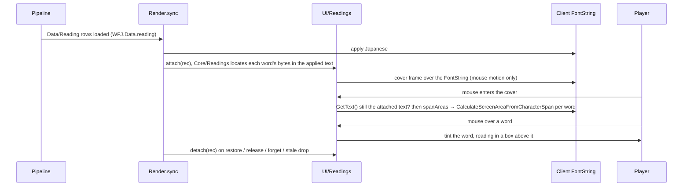

# Readings

> The word-reading box: pointing at a Japanese word in quest or gossip prose, in a plain-text window label, or on a plain-text book or letter page shows that word's whole reading (少し → すこし) in a small box above it. Where the word carries a dictionary form and a meaning, the box is the **word card**. Code: `pipeline/wfj/core/readings.py`, `pipeline/wfj/cmd/readings.py`, `pipeline/wfj/core/glosses.py`, `pipeline/wfj/cmd/glosses.py`, `validate` rule 8, `generate`'s `Data/Reading/` and `Data/Gloss/` files, `Core/Readings.lua`, `Core/Glosses.lua`, `UI/Readings.lua`, `UI/ReadingPopup.lua`, the `Render` attach / detach calls, the `readings.enabled` and `readings.glosses` settings. Decisions: [ADR-036](../adr/036-readings-hover-word-lists.md), [ADR-039](../adr/039-word-meanings-written-in-context.md), [ADR-041](../adr/041-word-cards-on-window-labels.md), [ADR-044](../adr/044-area-text-and-book-word-cards.md). The box and the card are among the few on-screen additions [principle 3](../architecture/principles.md#3-japanese-by-default-english-one-key-away) allows.

## Purpose
A learner can read a kanji word without anything being added to the text until they ask for it. Nothing is drawn until the mouse is on a word; the box never shows while English shows; one setting turns it off. Readings are their own data, keyed to the Japanese they annotate, so a translation and its readings change independently.

A word can also carry its dictionary form and a short English meaning of the whole word as the sentence uses it (食べている → 食べる, "is eating"). Such a word shows the **word card** instead of the reading-only box. The meaning is written by the model with the sentence in front of it, so it is the sense that sentence uses, not a dictionary list.

## How it works


### Data
`data/reading/<type>/<type>-NNNN.jsonl`, types `quest` (every quest field), `gossip` (`text`), `ui` (`text`; keyed by the UI string key, `data/reading/ui/ui-<first character>.jsonl`) and `book` (`text`; keyed by the page id, like the book translation store), the same sharding as the translation store. One record per shipped Japanese line:

```json
{"id": 456, "field": "title", "ja_hash": "90029072567103f2", "words": [["自然界", "しぜんかい"]], "provenance": {"class": "machine", "model": "<model id>", "source": "readings@<batch>", "imported": "2026-09-25"}}
```

- `words`: entries in reading order, each `[word, whole reading]` or `[word, whole reading, dictionary form, its reading, meaning]`, e.g. `["倒して", "たおして", "倒す", "たおす", "defeat"]`. Every word must sit in the Japanese after the previous one, hold **no ASCII character** (names stay English, [principle 2](../architecture/principles.md#2-names-stay-in-english); and the generated row packs words with ` ` and `=`), and carry a kana-only reading (hiragana, katakana, ー). A word holds a kanji, or is a **kana word**: all kana, its reading is itself, and only as a 5-item entry (it is listed for the card only). The Japanese itself is never copied or changed.
- The 5-item entry: **one word = the whole inflected unit**: a verb or adjective with all its endings and helper verbs (減らしてやって欲しい → 減らす, "I want you to reduce (them) for me"), noun + する, a noun with a plural or honorific suffix, a fixed expression; a noun and its particle are never one word. The dictionary form keeps the text's spelling (a word written in kana stays in kana: いる, not 居る) and holds no ASCII; its reading is kana. The meaning is one trimmed line of at most 60 characters with no `|`, tab or line break. A 3- or 4-item entry is refused. Every batch writes 5-item entries.
- `ja_hash`: the addon's hash primitive over the Japanese exactly as stored. A reading whose Japanese has changed since is **stale**: `validate` prints it (not a failure), `generate` leaves it out.
- `provenance.class`: `machine` (needs `model`; source `readings@<batch>`) or `correction` (a reviewed fix: `translator` = who wrote the fixed reading, source `correction@<date>`, `corrects` = the source it replaces, optional `note`). Machine output never replaces a correction.
- **Book pages.** Stored by page id; shipped under the key the addon finds a page by, its English hash (`readings.addon_keyed`, below). A page written as HTML (`<HTML`, `readings.html_page`) is never exported and never owed a reading: it keeps the client's SimpleHTML, which cannot place a card. Item, spell, objective and area text take no readings.
- A record whose line no longer ships (rejected, withdrawn) is stale too: reported, left out, back when the line ships again with the same Japanese. A malformed record or a duplicate `(id, field)` fails `validate` and `generate`.

Full shape: [Data model](../architecture/data-model.md).

### Pipeline
| step | command | what |
|---|---|---|
| export | `wfj readings export --type quest\|gossip\|ui\|book --ids FILE [--all] [--class machine\|human\|correction] --out BATCH.jsonl` | one row `{type, id, field, ja, ja_hash, en}` per shipped Japanese line of those ids with no current reading (`--all`: every line). `--class` keeps only lines whose shipped variant has that provenance class (`--class machine`: the machine-written lines). A line holding a `|` escape sequence (a colour code, `|n`) is left out: the reading box refuses it. A line with nothing to annotate is left out too: the Japanese needs a kanji, or a run of kana that is more than a bare particle or copula (は が を に で と の へ も や か よ ね な から まで だ です ー; `readings.annotatable`), so an English-only title, or names joined by a particle ("TyrandeとRemulos", "%sの%s"), is not exported; `en` is the line's current English from `data/english/<type>/`, left out when there is none; batch input only, the import ignores it and it never ships. ui ids are UI string keys, one per line; book ids are page ids, and an HTML page is never exported |
| words | the drafting model | writes 5-item `words` onto each row (following [Translation batches → Readings for a batch](../operations/translation-batches.md#readings-for-a-batch); the meaning uses the game's word from `en` where the Japanese word translates it), or, for a new translation, on the draft row itself (below) |
| import | `wfj readings import BATCH --model M --batch NAME [--date D] [--dry-run]` | rejects each bad row with its reason (shape, not found in order, no kanji (or a kana word that is not a 5-item entry reading itself), ASCII, non-kana reading, a bad dictionary form or meaning, Japanese changed since export, no shipped line, twice in the batch, an empty `words` list) and writes the rest; a `correction` reading is kept and reported |
| correct | `wfj readings import BATCH --correction --by NAME [--date D] [--note TEXT] [--dry-run]` | the rows fix readings already in the store: each is written as a `correction` record; a row for a line with no reading yet is rejected, `no reading to correct` |
| validate | `wfj validate`, rule 8 | re-checks every record against the shipped Japanese; prints stale readings, how many lines per type (quest, gossip, ui, book) have one, and the lines owed one (something to annotate, by the export's rule above, and no current reading), up to 20; lines holding `\|` counted apart, not owed; `validate: readings: N of M words carry a meaning (the word popup)`; `validate: readings: N <type> words have no meaning` per type while any current word lacks one. Rule 5 (regenerate-and-diff) also fails when `data/reading/meaning-numbers.tsv` is not the file `generate` would write: missing, some meanings with no number, or any other difference; `validate` never writes it |
| generate | `wfj generate` | `Data/Reading/Reading_<type>_<shard>.lua` (ui shards: the UI dictionary's, the key's first character): `["<type>:<id>"] = { <field> = "word=reading word=reading=n …" }` (`=n`: the word's meaning number); a book row is keyed `["book:<16-hex English hash>"]` in `Reading_book_<hh>.lua` (`readings.addon_keyed`: pages sharing one English ship the lowest page id's reading, the page whose Japanese `lua_writer.keyed_rows` ships; a stale page gives way to a current one); then `Data/Gloss/Gloss_<NNNN>.lua` (below); readings load after the translation types, meanings after the readings; `Meta.counts.reading` = lines with a current reading, `Meta.counts.gloss` = distinct meanings shipped. Writes `data/reading/meaning-numbers.tsv` when it numbered a new meaning and prints `generate: N meanings numbered for the first time` |
| check meanings | `wfj glosses check --jmdict FILE [--readings DIR] [--top N]` | **local only**: words with a meaning, distinct meanings, and the dictionary forms JMdict (jmdict-simplified English JSON) does not know, most used first: usually game compounds, but a misspelt or invented form shows up there too. No JMdict data is committed or shipped |

**One packed string per field.** A Lua string per word and per reading cost more than the Japanese itself, in file size and in client memory. On disk `Data/Reading/` is about 1.8× the size of the four folders it annotates (`Data/Quest`, `Data/Gossip`, `Data/UI`, `Data/Book`). Runbook: [Translation batches → Readings for a batch](../operations/translation-batches.md#readings-for-a-batch).

**The meaning table.** `generate` collects every distinct `(dictionary form, its reading, meaning)` from the current readings and writes them 1,000 per file: `Data/Gloss/Gloss_<NNNN>.lua` = `WFJ.Data.add("gloss", { [n] = "dictionary form<TAB>its reading<TAB>meaning" })`. A reading row points at a meaning by number (`word=reading=n`), so a meaning used by many lines is stored once. A stale reading's meanings are not emitted.

**Meaning numbers are stable** ([ADR-060](../adr/060-stable-meaning-numbers.md)). The numbers live in a committed file, `data/reading/meaning-numbers.tsv`: one line per meaning ever numbered, `n<TAB>dictionary form<TAB>its reading<TAB>meaning`, sorted by `n`. It is generated (marked `linguist-generated`); never edit it by hand.

- A meaning keeps its number from one run to the next, so adding a meaning changes only the Reading files that use it, the last Gloss file and the meaning count in `Data/Meta.lua`.
- A new meaning takes the next number after the highest in the file. Several new ones are numbered in sorted order, so a run is deterministic.
- A meaning no current reading uses keeps its line and ships nowhere: its number is a gap in `Data/Gloss/`. The gloss table is read by number only, so a gap is harmless.
- A number is never given to another meaning. A meaning that comes back gets its old number.
- With no file, the meanings are numbered 1 to N in sorted order, and `generate` writes the file.
- A malformed line, a number given twice or a meaning listed twice stops `generate` with an error naming the file.

`Core/Glosses.lua` and the Lua row formats do not depend on how the numbers were chosen.

**Readings in the draft row.** A quest, gossip, UI or book translation batch writes its readings with its Japanese: the drafting model adds `words` to each draft row, `translate_lint` checks them with the import's rules (a line with something to annotate and no `words` passes with a warning, as its readings are still owed; lint uses validate's rule, `readings.annotatable`, so a kana-only line like はい。 owes its words too), and `translate_batch expand` writes `<name>.words.jsonl` for `wfj readings import` once the lines are imported. Export → words → import remains for lines that got Japanese without words.

Verbs in full: [Pipeline](pipeline.md).

### Display
- **`Core/Readings.lua`** (pure). `words(kind, id)` parses the packed row (`kind` = `quest.<field>`, `gossip`, `ui` → `ui:<KEY>`'s `text`, or `book` → `book:<English hash>`'s `text`); `locate(words, text)` finds each word's first and last byte in the text on screen, in order, each search starting after the previous word. A word the text does not hold (a substituted `{name}`, a changed line) is skipped; the rest are still found.
- **`Core/Readings.lua`, meanings.** `words` returns triples `word, reading, gloss` (the meaning number, or `false`); `locate`'s spans carry `word`, `reading` and `gloss`. `withTokenWords(spans, text)` adds a span for every class and race word in the text on screen: the katakana the addon fills in for `{class}` / `{race}` (read from `Core/Placeholders`' `CLASS` / `RACE` on first use; `Readings.tokenWords()`), which no reading row can list, and the same katakana words in prose, when the word stands alone (no katakana or ー directly before or after it: トロール in コントロール / パトロール, オーク in オークション, ハンター in シャドウハンター get nothing) and no listed word already covers that spot. 人間 (Human) is left out: in prose it is the common noun "person". Their card carries the English name ("Druid (a class)"; names stay English). `tokenSpans(text)` returns those same standing-alone class / race words, and `lookup` passes them to `locate` as guards: a listed word found on part of one, inside it (エルフ inside a filled-in ナイトエルフ) or across its edge, is passed over and the search goes on, so it anchors on its own word in the prose; a word covering the whole class / race word (ドルイド, ウォリアーたち) is kept. Every standing-alone class / race word is a guard, filled-in or written in prose: a word list must not split a prose ナイトエルフ into ナイト + エルフ (none does; checked over every current row).
- **`Core/Glosses.lua`** (pure). `Glosses.get(n)` → `{ lemma, lemmaReading, meaning }` from `WFJ.Data.gloss[n]`, or nil.
- **`UI/Readings.lua`** (`WFJ.ReadingView`). `Render.sync` calls `attach(rec)` after it applies Japanese, and `detach(rec)` before every restore, release, forget and stale drop. `attach` takes records on `SURFACES` and window labels (below), lays one **cover frame** over the FontString (`SetAllPoints`, mouse motion enabled and propagated, never clicks) and remembers the exact applied text and the word spans. A cover is never made in combat: `SetPropagateMouseMotion` is a protected call the client blocks there, so a line first shown in combat gets its cover the next time it is attached.
- **Following the FontString:** `QuestInfo_Display` moves its FontStrings between the quest window's panels, the quest map details pane and its popup; `attach` re-parents the cover to the FontString's current parent each time. A re-attach while the mouse rests on the text starts the hover again (no new `OnEnter` would come). `Render` attaches only once the bundled font is applied (a refused font lays the text out in another face); `Render.retryFonts` attaches when the retry succeeds.
- **On mouse enter** the cover checks that the FontString is visible and still shows exactly the text it was attached for (gossip rows are pooled and can be rewritten outside `Render`); otherwise it hides itself and does nothing, so a missed detach can never show a wrong reading or keep taking mouse motion. It then measures every word's rectangles fresh, so layout, resize and scroll are always current. While the mouse is inside, an `OnUpdate` maps the cursor (divided by the effective scale) to a word rectangle.
- **On a word:** a gold tint at low alpha over each of the word's rectangles (one per line, so a word wrapped onto the next line tints both parts) and a box with the reading in white (the game's own tooltip frame and border (`TooltipBackdropTemplate`), sized to the text plus 18 × 12 px for the border; strata `TOOLTIP`), in the bundled font at the text's size (at least 12), 2 px above the word's first rectangle. Off every word, both hide.
- **The word card (`UI/ReadingPopup.lua`, `WFJ.ReadingPopup`).** When the hovered word carries a meaning (`Glosses.get`, or a class / race word's own card) and `readings.glosses` is on, `UI/Readings` shows the card instead of the box, at the same anchor (bottom-centre, 2 px above the word) and strata:

  ```
  倒して  たおして              the word (text size + 2, at least 14) and its reading (a kana word shows once)
  倒す　たおす                  the dictionary form and its reading (pale blue / muted gold), only when it differs
  defeat (and then)            the meaning in this sentence, wrapped inside the card
  ```
  280 px wide (`Popup.WIDTH`), clamped to the screen; drawn on `TooltipBackdropTemplate`, the game's tooltip frame and border, with 10 px padding inside it. It owns no data and no hit testing; `UI/Readings` shows and hides it. A kanji word with no meaning, or any kanji word while `readings.glosses` is off, shows the reading-only box. A kana word is listed for the card only: without a meaning, or with meanings off, it is not a hover target (`measure` skips it).

| surface (`SURFACES`) | where |
|---|---|
| `questframe.detail` · `questframe.reward` · `questframe.progress` | the quest window's panels |
| `questframe.greeting` | the quest greeting prose |
| `questmap.info` · `questmap.popup.info` | the quest map's details pane and its popup |
| `gossip` (record key `greeting` only) | the gossip window's greeting; option rows are buttons and get none |
| `itemtext` | a plain-text book / letter / plaque page showing Japanese (below); an HTML page gets none |

Forever has no trainer greeting window; a trainer's greeting is a gossip greeting.

**Book pages ([ADR-044](../adr/044-area-text-and-book-word-cards.md)).** The client draws a page in a SimpleHTML (`ItemTextPageText`), which has no span call [verified: Forever 1.60.1.70009 `SimpleHTMLAPIDocumentation`: `GetTextData` gives `{ text, type, align }` only]. So `UI/ItemText` draws a plain-text page showing Japanese in a FontString of its own, laid where the SimpleHTML's text starts, as wide as it, in the `P` text type's font and colour, and gives the SimpleHTML `""` while it shows (details: [Addon modules → ItemText](../architecture/addon-modules.md)). The page record's `fs` is the ItemText page adapter; `page:spanRegion()` returns the adapter's FontString, and `UI/Readings` (`region(rec)`) covers it only while it holds exactly the text the record applied; a page drawn by the SimpleHTML (English, an HTML page) takes no cover. A page turn or a new item hides the FontString; the cover's text check on enter then hides the cover too.

**Window labels ([ADR-041](../adr/041-word-cards-on-window-labels.md)).** A `ui` record (a label shown by `UI/Labels` → `Render.show(…, "ui", "ui", key, …)`) takes a cover on **any** surface when all hold:

| check | refuses |
|---|---|
| the widget has `CalculateScreenAreaFromCharacterSpan` | a Button's text (a ButtonText adapter) and a menu entry (a `Labels.menuText` adapter): buttons, tabs, menus, dropdowns |
| the FontString's parent is not a Button (`IsObjectType("Button")`) and not protected (`IsProtected()`): `inWindow` | CheckButton and list-row text; anything inside a secure frame |
| the surface is not non-window (`View.nonWindow`) | `View.NON_WINDOW` and every surface under each name (`alerts` → `alerts.<anything>`): alerts, toasts, banners, the tracker, the quest map's tracker headers (`questmap.trackerlabels`) and objectives, HUD labels, the gamepad HUD (`gamepad`), the errors frame, combat text / feedback, the casting bar, unit frames, zone text, chat tabs, queue status, the cooldown viewer, the damage meter, Edit Mode's HUD selection overlays (`editmode.selection`), `help` (UI/HelpTooltip, MicroMenu's records on it), `spellbook.menu`, and the surfaces whose labels are GameTooltip lines under a name without `tooltip` (`auctionhouse.token`, `communities.benefits.rewardtip`, `deathrecap.tip`, `quickjoin.tip`), …; any surface whose name holds `tooltip`; each surface `UI/TooltipLines.follow` follows (`View.tooltipSurface`: that exact surface only, not the surfaces under its name) |
| `Readings.words("ui", key)` has words found in the applied text | a label with no word list, and a label whose only words would be the class / race token cards (a label holding only ドルイド): those cards are for prose only |

Every other surface is a window: the quest window's 報酬 and 以下の報酬から1つ選択できます, the character sheet's labels, the spellbook, mail's 宛先:. The prose rule above is unchanged. A cover sets `ignoreInLayout = true`, so it never counts toward the size of a Blizzard `ResizeLayout` frame it sits in.

Two pytests keep the list honest: every `NON_WINDOW` entry names a surface some UI module registers, and `test_every_registered_surface_is_classified` resolves every surface name a module hands to `Labels` / `LabelTree` / the Communities kit / `Render` / `TooltipLines` (literal, constant or the `show` alias) and fails on one that is neither in its `WINDOW_SURFACES` set nor non-window; `test_no_new_surface_named_by_a_variable` pins the reviewed call sites that pass a variable: a new surface is a window only once someone has decided so.

**Known limit: composite labels.** In a label built from a pattern and filled-in arguments (`Labels.showArgs`, a popup with filled args), the word search runs over the whole line on screen. A listed word that also appears inside an argument filled in earlier in the line (a name, an item) is found there first. The reading is still right for those characters; only the spot is not the pattern's own word.

### The guard
`FontString:CalculateScreenAreaFromCharacterSpan(left, right)` gives the word rectangles. It takes **UTF-8 byte indices with the right end exclusive**: Blizzard passes `#text + 1` for "to the end of the line" (`blizzard_sharedxml/scrollingmessageframe.lua:451, :459, :467`). It returns one rect per line the span covers, relative to the FontString's `BOTTOMLEFT` (`scrollingmessageframe.lua:496–503`).

A span that splits a UTF-8 character is **not a Lua error**: the client exits, and `pcall` cannot catch it. So:

- `View.spanAreas(fs, text, first, last, where)` is the **only** caller of that function in the addon; a pytest fails if the name appears in any other addon file.
- It refuses, and counts, any call where the text contains `|`, the span is out of range (`first < 1`, `right <= first`, `right > #text + 1`), or either end is not on a character boundary (a byte that is not a UTF-8 continuation byte, or `#text + 1`).
- A refused span is counted in `View.refused`, and the first is kept in `View.refusedAt` as `<kind> <id> <first>..<right>: <why>`, for `/wfj debug`.

**Text containing `|` gets no readings for now.** How the client counts bytes around escape sequences (colour codes, `|n`) is not verified, so a boundary in our string might not be one in the string the client measures. `attach` skips such text before any call is made.

### The setting
`readings.enabled`, default **on**: "Show readings when hovering a word" / 「単語にカーソルを合わせると読み方を表示」, beside *Enable translation* on the main settings page. Its apply fires State event `readings`; off hides every cover frame at once, on shows the attached ones again, with no `/reload`. The About page has a help line (`about.readings`). `/wfj readings on|off` sets it and `/wfj readings` prints `readings on|off` (any other second word falls through to the settings grammar, so `/wfj readings glosses off` still works). `/wfj debug` prints `readings: N quests / greetings loaded · on|off · N attached · N spans refused[ (first: …)] · N errors` (errors: `Render.readingErrors`, calls into the box that raised; `Render` wraps attach / detach in `pcall`, so the box can never stop a surface from rendering). See [Settings](settings.md).

`readings.glosses`, default **on**: "Show word meanings in the reading box" / 「読み方の枠に単語の意味を表示」, the second row of the main page's translation section, under *Enable translation*; `/wfj glosses on|off` still sets it and `/wfj glosses` prints `glosses on|off · N meanings loaded`. Its apply fires State event `glosses`: off → every word shows the reading-only box and kana words stop being hover targets; a card already open closes. `readings.enabled` off hides the card too. `/wfj debug` adds `glosses: N meanings loaded · on|off` (N = distinct meanings loaded).

## Key files
- `pipeline/wfj/core/readings.py`: record shape, word checks (incl. `meaning_problems`), staleness (pure)
- `pipeline/wfj/core/glosses.py`: meaning numbering (`number`, `parse_numbers`, `numbers_text`) and the JMdict cross-check (pure); `pipeline/wfj/cmd/glosses.py`: `wfj glosses check`
- `pipeline/wfj/cmd/readings.py`: `export`, `import`
- `pipeline/wfj/dev/translate_lint.py`, `pipeline/wfj/dev/translate_batch.py` (`expand`): `words` on draft rows
- `pipeline/wfj/cmd/validate.py` (`rule_readings`, `rule_numbers`), `pipeline/wfj/cmd/generate.py` (`load_numbers`, `write_numbers`), `pipeline/wfj/emit/lua_writer.py` (`reading_text`, `gloss_text`), `pipeline/wfj/emit/schema.py` (`reading_relpath`, `gloss_relpath`, `TOC_ORDER`)
- `addon/WoWForeverJapanese/Core/Readings.lua`: parse + locate + class / race words (pure)
- `addon/WoWForeverJapanese/Core/Glosses.lua`: meaning lookup (pure); `UI/ReadingPopup.lua`: the word card
- `addon/WoWForeverJapanese/UI/Readings.lua`: cover frame, box, the guard, the window-label rule (`NON_WINDOW`, `nonWindow`, `inWindow`)
- `addon/WoWForeverJapanese/UI/TooltipLines.lua`: `follow` marks its surface non-window
- `addon/WoWForeverJapanese/UI/Render.lua`: attach / detach calls
- `addon/WoWForeverJapanese/UI/ItemText.lua`: the plain-text page FontString and `page:spanRegion`
- `addon/WoWForeverJapanese/Core/Settings.lua`, `UI/Options.lua`, `UI/OptionsText.lua`, `UI/Slash.lua`: setting, page row, help line, debug line
- `data/reading/` (with `meaning-numbers.tsv`), `addon/WoWForeverJapanese/Data/Reading/`, `addon/WoWForeverJapanese/Data/Gloss/`
- `tests/python/test_readings.py`, `tests/lua/spec/readings_spec.lua`

## Invariants
- Every span call goes through `spanAreas`; nothing reaches the client with an index off a character boundary or with text holding `|`.
- The box and the card never show while English shows: every path that puts English back detaches first, and the cover re-checks the text on enter.
- Readings never edit the Japanese, never carry a name (a word holds no ASCII, and needs a kanji unless it is a kana word with a meaning; a class / race card gives the English name), and ship only while their `ja_hash` matches (ID-keyed, provenance on every record, machine never replaces correction: [principles 5 and 6](../architecture/principles.md#5-every-translation-is-keyed-by-the-game)).
- The cover takes mouse motion only: clicks and scrolling go to the frames underneath.
- Nothing runs per frame unless the mouse is over a covered FontString.

## Edge cases
- **Placeholders.** `{name}` / `{class}` / `{race}` are expanded before the apply; the words are found in the expanded text, and a word inside a substituted name is simply not found.
- **A word twice.** Each search starts after the previous word, so the n-th reading lands on the n-th occurrence (quest 456's objectives list 匹 twice).
- **Stale reading.** A corrected translation drops its reading until it is written again (export lists it, as it has no current reading).
- **Pooled list rows.** A window label in a pooled row is rewritten outside `Render`; the cover's text check on enter hides it, as for gossip rows.
- **Tooltips** get none: a tooltip belongs to whatever the mouse is on, so it cannot be hovered. **HTML book pages** get none: they stay in the client's SimpleHTML, which has no span call; a plain-text page takes the card through `UI/ItemText`'s own FontString.
- **Objective and area lines** get none: no reading type covers `objective` or `area` text, and their rows are not prose surfaces (objective tracker and list lines take no word cards; Alt shows their English).
- **Scrolling.** Rectangles are relative to the FontString, and the cover and the box are anchored to it, so both move with the text when its frame scrolls. A reflow while the mouse stays inside (a resize) is picked up on the next enter.
- **Coverage.** How many lines of each type carry a current reading, and how many of their words carry a meaning, is generated into [coverage](../operations/coverage.md). A line that holds a `|` escape takes no reading (the reading box refuses any text with `|`); `validate` counts those lines apart from the lines still owed one. Every translation batch writes its lines' readings. Rounds and conventions: [Translation batches](../operations/translation-batches.md).
- **Book pages.** A plain-text page carries 5-item word lists with meanings; an HTML page carries none and is owed none.

## Related
- [ADR-036](../adr/036-readings-hover-word-lists.md) · [ADR-039](../adr/039-word-meanings-written-in-context.md) · [ADR-041](../adr/041-word-cards-on-window-labels.md) · [ADR-044](../adr/044-area-text-and-book-word-cards.md) · [ADR-060](../adr/060-stable-meaning-numbers.md) · [Testing → word card checklist](../testing/strategy.md#word-card-checklist) · [Pipeline](pipeline.md) · [Settings](settings.md) · [Addon modules](../architecture/addon-modules.md) · [Data model](../architecture/data-model.md) · [Translation batches](../operations/translation-batches.md) · [Testing → readings checklist](../testing/strategy.md#readings-checklist) · [Glossary](../glossary.md)
