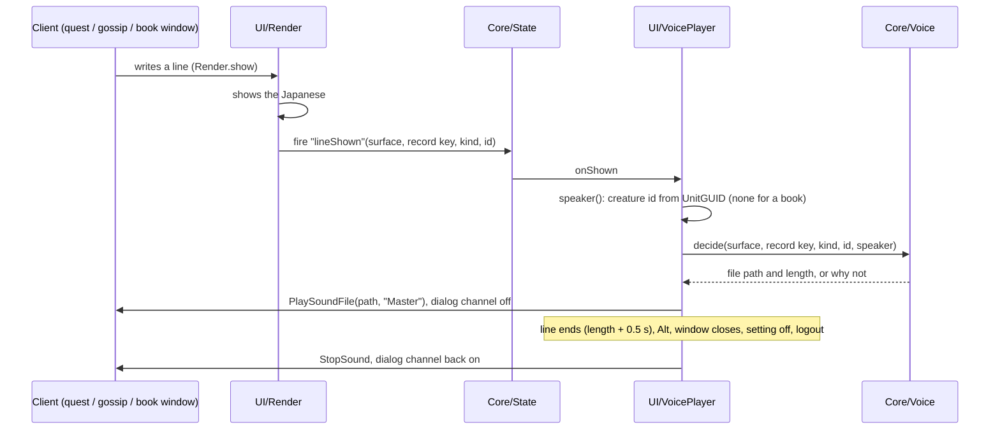

# Voice over

> Japanese audio for quest and NPC talk, book and letter pages and the character's own error lines, read aloud from the Japanese the addon ships. The audio lives in separate voice addons (the Voice entry, `WoWForeverJapanese_Voice`, and the packs `WoWForeverJapanese_Voice<Name>`); the main addon holds the player and plays nothing without them. Code: `Core/Voice.lua`, `UI/VoicePlayer.lua`, `UI/VoiceErrors.lua`, the `WoWForeverJapanese_RegisterVoice` global in `Main.lua`, the `voice.*` settings, `pipeline/wfj/cmd/voice.py` (and `voice_cast.py`, `voice_audition.py`, `voice_make.py`, `voice_ship.py`, `voice_store.py`), `pipeline/wfj/core/voice.py`, `pipeline/wfj/core/casting.py`, `pipeline/wfj/io/aivis.py`, `pipeline/wfj/emit/voice_pack.py`, `pipeline/wfj/core/voice_packs.py`, `pipeline/wfj/io/curseforge.py`, the voice readers in `pipeline/wfj/io/vmangos.py`, `pipeline/voice.toml`, `pipeline/voice-packs.toml`, `data/voice/`. Decisions: [ADR-061](../adr/061-voice-over-from-a-separate-pack.md), [ADR-062](../adr/062-voice-cast-per-speaker-in-step-with-the-text.md). Runbook: [Voice over](../operations/voice.md).

## Purpose
When the quest window, the NPC talk window or the book window shows a line in Japanese, a player with the voice installed hears it read aloud in Japanese, in the voice cast for whoever says it: a voice per kind of speaker (race or creature family, gender, age, archetype), the same voice for an NPC every time, a narrator for lines no creature says, and for book and letter pages the writer when the page is signed by a creature the game has, else a book narrator. The character's own spoken error lines ("out of range") play in Japanese too, in a voice for the character's race and sex. The audio is made on the maintainer's computer with the AivisSpeech Engine, from the Japanese the addon ships, for every voiced line in the game: about 16,000 files, 1.2 GB, in the voice addons on CurseForge.

## How it works


### What is voiced
| Window | Record | Pack key | Setting |
|---|---|---|---|
| Quest window, offer | `description` | `<quest id>-description` | `voice.offer` |
| Quest window, progress | `progress` | `<quest id>-progress` | `voice.progress` |
| Quest window, turn-in | `completion` | `<quest id>-completion` | `voice.turnin` |
| Quest window, NPC greeting panel | `greeting` | `g-<gossip key>` | `voice.greeting` |
| NPC talk window, greeting | `greeting` | `g-<gossip key>` | `voice.greeting` |
| Book window, a page | `page` | `b-<page key>` | `voice.books` |

`Voice.KINDS` holds this table. Objectives, titles, option rows and every other surface are never voiced. The character's error lines are not a window's line: `UI/VoiceErrors` follows the game's own vocal error call (below). Forever's trainer window has no greeting text (the UI extract's `blizzard_trainerui` holds no greeting string), so there is nothing to voice there.

### The packs
The voice ships as several addon folders, split by `pipeline/voice-packs.toml` ([Voice over → Which pack holds a line](../operations/voice.md#which-pack-holds-a-line)): the **entry**, which holds no audio and on CurseForge requires the main addon and every pack, and one folder per **pack**, named for what it holds (`…VoiceLevels1to10` to `…VoiceLevels51to60`, `…VoiceOther`). Each is under 420 MB, the most one upload can carry.

```
WoWForeverJapanese_Voice/                 the entry
  WoWForeverJapanese_Voice.toc            ## Dependencies: WoWForeverJapanese; no files to load; the main addon's icon
  README.txt                              the packs it installs
WoWForeverJapanese_VoiceLevels1to10/      a pack (and so on for the others)
  WoWForeverJapanese_VoiceLevels1to10.toc ## Dependencies: WoWForeverJapanese; the main addon's icon; English-only notes
  Register.lua                            one call: WoWForeverJapanese_RegisterVoice({ format = 2, folder = "<its folder>", lines = { … }, creatures = { … } })
  Sound/<file>.mp3                        one file per line, and per voice for a line several voices say
  README.txt                              what it holds, the line count, the credits
```

Each `lines` entry is `[<pack key>] = { <file name>, <Japanese hash>, <seconds>, v = { [<voice id>] = { <file name>, <seconds> } } }`, the `v` table only for a line said by differently cast creatures; `creatures` maps each speaker of such a line to its voice. The Other pack also carries the character's own error lines (`errors`: the game's voice id → kind, and per race and sex the file of each message and kind). Every voice addon depends on the main addon, so the AddOn List shows them all under it (the list groups one level deep). The Japanese hash is `Hash.key` (the same function as the gossip key, `hashing.key` in the pipeline) over the shipped Japanese with its tokens unfilled (`{name}` stays `{name}`). One entry may point at another key's file: the female wording of a gendered gossip line is its own gossip key and plays the same file.

### Registration (`Core/Voice.lua`, `Main.lua`)
- The pack's `Register.lua` runs in its own addon and cannot see the main addon's namespace, so it calls the global `WoWForeverJapanese_RegisterVoice(tbl)`. It forwards to `Voice.register(tbl) → registered, invalid`.
- A table with the wrong `format`, the wrong `folder` or no `lines` is refused whole (`invalid = 1`). A pack's folder must start with `WoWForeverJapanese_Voice`. An entry is kept only when its file name matches `^[%w%-_]+%.mp3$`, its hash is 16 hex digits and its length is a number or absent; anything else is dropped and counted. A file name outside the pack's `Sound` folder is never built, so a pack cannot play another addon's file. Packs merge by folder: a second pack adds its lines, and a second registration of the same folder replaces only that folder's lines.
- The pack loads after the main addon (it depends on it), usually after the settings pages are built. When the registration brings the first pack, `Options.addPage("voice")` builds the *Voice* page and adds it under the addon's category ([Settings](settings.md)); a failure is recorded in `WFJ.initErrors` (surface `options.voice`).

### The decision (`Voice.decide`)
`Voice.decide(surface, recKey, kind, id, who)` returns the file's path (`Interface\AddOns\<its pack folder>\Sound\<file>`) and its length, or nil and a reason, checked in this order:

| Reason | When |
|---|---|
| `kind` | the surface and record are not in `Voice.KINDS` |
| `off` | `voice.enabled` or the kind's setting is off |
| `english` | translation is off, or the reveal key is held |
| `nopack` | no pack registered |
| `missing` | the pack has no entry for the line's pack key |
| `notext` | the addon ships no Japanese for the line |
| `stale` | the pack's hash differs from the hash of the shipped Japanese |

A line with variants plays the file of the speaker on screen (`who`: its creature id and, for a creature shown as both genders, `UnitSex`), else the line's main voice. `missing`, `stale` and a played line (`matched`) are counted in `Voice.counts`, shown by `/wfj debug`. Core/Voice has no frames and no sound calls; its dependencies (lookup, hash, settings, reveal key, translation state) are passed in by `Main` at load.

### When a line starts
- `Render.show` fires State event `lineShown(surface, recordKey, kind, id)` only when the client has just written a line and the addon now shows it in Japanese (a write with the `apply` action). A refresh (the reveal key released, a setting switched) goes through `Render.refresh` and never fires it, so releasing Alt never restarts a line the player already heard. The event is fired under `pcall` after the write and the banner, so a failing listener cannot leave the window half translated. `UI/VoicePlayer` is its only listener.
- One line at a time: a new line stops the one playing. The same line shown again while it plays is not restarted (the NPC talk window lays its first view out twice).
- A new line of a window that will not play (no file, `missing`, `stale`, `notext`; its kind switched off, `off`; or English showing, `english`) stops that window's line and hides its button, so the button never replays the previous line.

### Playing (`UI/VoicePlayer.lua`)
- `PlaySoundFile(path, "Master")` returns whether it will play and a handle; `StopSound(handle)` stops it. The `Master` channel keeps the line audible while the dialog channel is off. The client reports no end of a sound, so the line counts as playing for the pack's length plus 0.5 s (30 s when an entry has no length), timed with `C_Timer.After`; a timer from a line stopped early finds a newer token and does nothing.
- **Stops:** the quest, NPC talk or book window hides (an `OnHide` hook on `QuestFrame`, `GossipFrame` and `ItemTextFrame`; a book's next page is a new line), the reveal key goes down, translation is switched off, any voice setting changes, the player logs out (`PLAYER_LOGOUT`).
- **The game's English voice.** With `voice.muteDialog` on, while a line plays the addon sets `Sound_EnableDialog` to `0` if it was `1`, and records that in `WFJ_DB.voiceDialogMuted`. The client saves that setting, so a reload or a crash in between would otherwise leave the player's NPC voices off. It is put back to `1` when the line ends, on stop, at logout and on the next load (`VoicePlayer.init` restores it first). A player who had the dialog channel off keeps it off. Recovery by hand: `/console Sound_EnableDialog 1`.
- **The button.** A 28 px button at the window's top right (`TOPRIGHT`, -8, -31), on the band below the title, raised 10 levels above the window's art. It shows once a line of that window has started and hides when the window closes or its new line will not play (no file, its kind off, or English showing). While the line plays it shows the client's stopwatch pause icon (`Interface\TimeManager\PauseButton`) and a click stops the line; once the line stopped or ended it shows the play arrow (`Interface\Buttons\UI-SpellbookIcon-NextPage-Up`) and a click plays it again from the start. The client can only start and stop a sound file, so a stopped line cannot resume where it stopped. A click never plays while English is showing or `voice.enabled` is off. No text on it; `voice.button` hides it.
- `VoicePlayer.counts` keeps `played` and `refused` (no `PlaySoundFile`, or the client would not play the file).

### The character's error lines (`UI/VoiceErrors.lua`)
- The error frame's `TryDisplayMessage` plays the game's English line through `C_Sound.PlayVocalErrorSound(voiceID)`. A hook after that call notes the voice id; a hook after `TryDisplayMessage` reads which message it showed (`GetGameMessageInfo`) and plays that message's Japanese recording, so the voice says the words on screen; a call from anywhere else plays the voice id's kind line. Both hooks follow the client's code, never replace it.
- While a pack has lines for the character's race and sex, the client's error speech (`Sound_EnableErrorSpeech`) is turned off and the change kept in `WFJ_DB.voiceErrorSpeechMuted`; it is put back when switched off, at logout and on the next load. A player who had it off keeps it off. The same line is not started again within 2 seconds.

### Settings
`voice.enabled`, `voice.offer`, `voice.progress`, `voice.turnin`, `voice.greeting`, `voice.books`, `voice.errors`, `voice.muteDialog`, `voice.button`, all on by default. They are hidden (`Settings.isHidden`) until a pack registers: a player without the pack sees no setting that does nothing, in the settings pages or in `/wfj`'s status. Their page is *Voice* under the addon's category ([Settings](settings.md)).

### `/wfj debug`
`voice: N lines (N invalid) · matched N · missing N · stale N · played N · refused N`, then `voice packs:` with each pack folder and its line count, and the error lines' counts (`voice errors: game asked N · message known N · played N · repeats skipped N · refused N`, and the last silent one). Without a pack: `voice: no pack`, with `(a pack registered an invalid table)` when one was refused. The About page names the packs that loaded, or shows the Voice entry's CurseForge address.

### The pipeline (`wfj voice`)
- **`speakers`** (`make voice-speakers`) writes `data/voice/speakers.jsonl` (pack key → its main speaker, a creature id or `narrator`, and `others` who say it too) for every voiced line ([Data model](../architecture/data-model.md#voice-over-tables)). From the pinned VMaNGOS database: a quest's offer is read by the creature that starts it, its progress and turn-in by the creature that ends it; a quest an object or item starts has the narrator; gossip menu greetings and quest greetings become gossip lines. The quest cache's conditional descriptions and forever-vo's player captures fill speakers the database lacks; a creature id the collector recorded (`npcs` in `data/english/gossip`) wins over the database ([Collector](collector.md)). A book or letter page is read by its writer when its last line is a signature naming exactly one cast creature, else by the book narrator. A signature is a name after one or two hyphens, an en or em dash or a tilde, maybe followed by a title after a comma or " - " ("- Windan Shay", "--VanCleef", "-Thrall, Warchief of the Horde"), or an undashed name that does not read as a title ("The End" does not count; a single word only under a closing line such as "Your friend,"). It also runs `levels`.
- **`profiles`** (`wfj voice profiles`) builds `data/voice/profiles.jsonl`: per speaking creature its race (or family), gender, age, archetype and role, from the client's display tables first, VMaNGOS second, and a machine casting pass for what only judgement gives, each field with its own provenance; a maintainer value is never overwritten.
- **`cast`** writes `data/voice/voices.jsonl` (creature → roster voice, and the cast row that chose it; a creature shown as both genders gets both) from the profiles, `voice.toml`'s cast rows and the overrides. A creature keeps its voice; neighbours spread over a row's voices.
- **`plan`** prints what `generate` would make now, by cast row and voice, with characters and hours.
- **`generate`** (`make voice-generate`, `make voice-run` for the whole game in the background) reads every voiced line's shipped Japanese through the local AivisSpeech Engine ([`pipeline/voice.toml`](../operations/voice.md#configuration): roster voices and their settings, pace) into the audio store (`build/voice/<key>[_<voice>].mp3`) and records each file in `data/voice/audio.jsonl`, with its size and SHA-256. The text read is the shipped Japanese with `{name}`, `{class}` and `{race}` spoken as 冒険者 and a `<…>` stage direction holding non-ASCII text dropped; any other markup stops the run with the line's key. A file is made again only when its fingerprint (Japanese hash, roster voice, style, speed, pitch, intonation) changed, so recasting one kind of speaker remakes only its lines; the engine version is recorded beside the fingerprint, not in it.
- **`pack`** (`make voice-pack`) writes the entry and every pack under `build/voice-pack/` from the audio record's files whose Japanese hash still equals the shipped Japanese (the rest are counted as left out), split by quest level as `pipeline/voice-packs.toml` says. A quest's level is Forever's own, from the committed `pipeline/voice_quest_levels.txt` (the quest cache's level at payload offset 8, else VMaNGOS). It prints each pack's size and room under the cap, marks a pack past 315 MB, and writes nothing when one is past 420 MB, when there is no audio store, or when a store file is not the recorded take (its SHA-256 differs from the audio record's: the one shared store may hold another branch's remake). The TOCs' `## Interface` is copied from the main addon's TOC.
- **`release`** (run by the voice job of the Release workflow; `make voice-release DRY=1` locally) refuses unless the audio store sits at the pinned commit, then builds, zips and checks every folder, uploads the packs whose content changed since the latest `voice-v*` GitHub release to their CurseForge projects (the entry when the set of packs changed), and makes one GitHub release with every zip and one zip of everything ([Voice over → Releasing the voice](../operations/voice.md#releasing-the-voice)).
- **`store-sync`** (`make voice-sync`; `voice-run` and `voice-generate` end with `store-sync --if-changed`, which does nothing when the run made no file) commits the audio store's new files to the audio repository (`zyaga/wow-forever-japanese-voice`, checked out at `build/voice/`), pushes, and writes that commit to `pipeline/voice-audio-commit.txt`: the audio that goes with this text.
- **`levels`** (`make voice-levels`, run by `voice-speakers`) writes `pipeline/voice_quest_levels.txt`, each quest's level from the quest cache and VMaNGOS, so `pack` and `release` split the packs without the client files.
- **`make voice`** runs speakers, generate and pack. `build/` is gitignored in this repository: the MP3s are committed only to the audio repository, the packs never.
- **`wfj validate`** checks `data/voice/` (`rule_voice`): well formed rows, provenance on each, no duplicate key or creature, a voice row for every creature that speaks, the casting in step with `voice.toml`, and prints how many files are in step, stale or not made.
- **The CI gate:** `tests/python/test_voice.py::test_audio_in_step` fails a pull request when a voiced line has no recorded audio, or audio made from other Japanese or in another voice. Remake with `make voice-generate`.

## Key files
- `addon/WoWForeverJapanese/Core/Voice.lua`: the registry, `decide`, `packKey`, counts. Pure.
- `addon/WoWForeverJapanese/UI/VoicePlayer.lua`: every sound and client-setting call for window lines, the speaker, the button, the window hooks.
- `addon/WoWForeverJapanese/UI/VoiceErrors.lua`: the character's error lines.
- `addon/WoWForeverJapanese/Main.lua`: `WoWForeverJapanese_RegisterVoice`, the load steps `voice` and `voiceplayer`, `PLAYER_LOGOUT`.
- `addon/WoWForeverJapanese/UI/Render.lua`: fires `lineShown`.
- `pipeline/wfj/core/voice.py`: the scope, who speaks, the text read, the fingerprint, the in-step comparison, the validate checks. Pure. `pipeline/wfj/core/casting.py`: profiles and casting. Pure.
- `pipeline/wfj/cmd/voice.py`, `pipeline/wfj/io/aivis.py`, `pipeline/wfj/emit/voice_pack.py`, `pipeline/wfj/io/vmangos.py`.
- `pipeline/wfj/core/voice_packs.py`: which pack holds a line, content hashes and versions. Pure. `pipeline/wfj/cmd/voice_ship.py`: `pack` and `release`. `pipeline/wfj/io/curseforge.py`: the upload API.
- `pipeline/voice.toml`, `pipeline/voice-packs.toml`, `pipeline/voice_quest_levels.txt`, `pipeline/voice-audio-commit.txt`, `data/voice/` (profiles, speakers, voices, audio record, error tables).

## Invariants
- Japanese voice only while Japanese shows: the reveal key, the master switch and closing the window stop it, and nothing restarts it on release.
- A line plays only when the pack's hash equals the hash of the Japanese the addon ships for that key. A stale or missing line stays silent; it never voices other words.
- The pack holds Japanese audio only; the speakers table holds keys and creature ids, never English. Names in the Japanese stay English and are read as written.
- The main addon never depends on the packs and reads them only through the registered tables. Without a pack nothing plays and no voice setting shows; the About page says the voice is not installed and shows the Voice entry's CurseForge address to copy, and with packs it names the ones that loaded.
- Every change to `Sound_EnableDialog` and `Sound_EnableErrorSpeech` is recorded in `WFJ_DB` and undone.
- An NPC always has the same voice; a line said by differently cast NPCs plays the voice of the one on screen.

## Edge cases
- A line whose Japanese changed after the pack was made: `stale`, silent, counted. `make voice` remakes only the changed files.
- A gendered gossip line: the female wording has its own key and plays the male wording's file.
- The player's name, class or race in a line: spoken as 冒険者.
- A reload or crash while a line plays: the next load turns the dialog channel back on.
- The pack loads before the settings pages exist: the *Voice* page is built with the others (`requires`).

## Not in this build
- Quest objectives (not voiced), audio per class or race (spoken as 冒険者).

## Unverified in game
Listed with their steps in [Testing strategy → Voice over checklist](../testing/strategy.md#voice-over-checklist): `PlaySoundFile(path, channel)` and playing an MP3 from an addon folder; setting `Sound_EnableDialog` from an addon; whether a new pack folder needs a full client restart; whether the Settings panel lists a subcategory added after `RegisterAddOnCategory`; whether the pack loads after the main addon's `ADDON_LOADED`.

## Related
- [ADR-061](../adr/061-voice-over-from-a-separate-pack.md) · [ADR-062](../adr/062-voice-cast-per-speaker-in-step-with-the-text.md) · [Voice over runbook](../operations/voice.md) · [Settings](settings.md) · [Collector](collector.md) · [Pipeline](pipeline.md) · [Addon modules](../architecture/addon-modules.md) · [Data model](../architecture/data-model.md) · [Research](../research/2026-10-04-japanese-voice-over.md)
