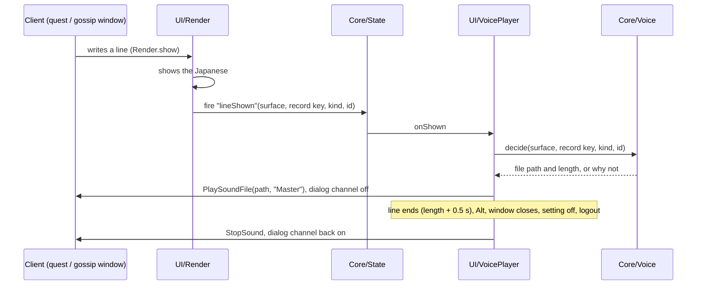

# Voice over

> Japanese audio for quest and NPC talk, read aloud from the Japanese the addon ships. The audio lives in separate voice addons (the Voice entry, `WoWForeverJapanese_Voice`, and the packs `WoWForeverJapanese_Voice<Name>`); the main addon holds the player and plays nothing without them. Code: `Core/Voice.lua`, `UI/VoicePlayer.lua`, the `WoWForeverJapanese_RegisterVoice` global in `Main.lua`, the `voice.*` settings, `pipeline/wfj/cmd/voice.py`, `pipeline/wfj/core/voice.py`, `pipeline/wfj/io/aivis.py`, `pipeline/wfj/emit/voice_pack.py`, `pipeline/wfj/cmd/voice_ship.py`, `pipeline/wfj/core/voice_packs.py`, `pipeline/wfj/io/curseforge.py`, the voice readers in `pipeline/wfj/io/vmangos.py`, `pipeline/voice.toml`, `pipeline/voice-packs.toml`, `data/voice/`. Decision: [ADR-061](../adr/061-voice-over-from-a-separate-pack.md). Runbook: [Voice over](../operations/voice.md).

## Purpose
When the quest window or the NPC talk window shows a line in Japanese, a player with the voice pack hears that line read aloud in Japanese, in a male, female or narrator voice that fits who says it. The pack is made on the maintainer's machine with the AivisSpeech Engine and is not published yet. The first pack covers the night elf starting area, Shadowglen: 16 quests (456, 457, 458, 459, 916, 917, 920, 921, 928, 2159, 3120, 3519, 3521, 3522, 4495, 5842) and the greetings of their NPCs and the druid trainer, 48 lines from 12 creatures (37 lines in the male voice, 10 in the female voice, 1 narrator line: the offer of 5842, which no creature starts).

## How it works


### What is voiced
| Window | Record | Pack key | Setting |
|---|---|---|---|
| Quest window, offer | `description` | `<quest id>-description` | `voice.offer` |
| Quest window, progress | `progress` | `<quest id>-progress` | `voice.progress` |
| Quest window, turn-in | `completion` | `<quest id>-completion` | `voice.turnin` |
| Quest window, NPC greeting panel | `greeting` | `g-<gossip key>` | `voice.greeting` |
| NPC talk window, greeting | `greeting` | `g-<gossip key>` | `voice.greeting` |

`Voice.KINDS` holds this table. Objectives, titles, option rows and every other surface are never voiced.

### The packs
The voice ships as several addon folders, split by `pipeline/voice-packs.toml` ([Voice over → Which pack holds a line](../operations/voice.md#which-pack-holds-a-line)): the **entry**, which holds no audio and on CurseForge requires every pack, and one folder per **pack**, named for what it holds (`…VoiceLevels1to10` to `…VoiceLevels51to60`, `…VoiceOther`). Each is under 420 MB, the most one upload can carry.

```
WoWForeverJapanese_Voice/                 the entry
  WoWForeverJapanese_Voice.toc            ## Dependencies: WoWForeverJapanese (load order only); no files to load
  README.txt                              the packs it installs
WoWForeverJapanese_VoiceLevels1to10/      a pack (and so on for the others)
  WoWForeverJapanese_VoiceLevels1to10.toc ## Dependencies: WoWForeverJapanese; Notes carry the engine, models, licences
  Register.lua                            one call: WoWForeverJapanese_RegisterVoice({ format = 2, folder = "<its folder>", lines = { … }, creatures = { … } })
  Sound/<file>.mp3                        one file per line, and per voice for a line several voices say
  README.txt                              what it holds, the line count, the credits
```

Each `lines` entry is `[<pack key>] = { <file name>, <Japanese hash>, <seconds>, v = { [<voice id>] = { <file name>, <seconds> } } }`, the `v` table only for a line said by differently cast creatures; `creatures` maps each speaker of such a line to its voice. The Other pack also carries the character's own error lines (`errors`). The Japanese hash is `Hash.key` (the same function as the gossip key, `hashing.key` in the pipeline) over the shipped Japanese with its tokens unfilled (`{name}` stays `{name}`). One entry may point at another key's file: the female wording of a gendered gossip line is its own gossip key and plays the same file.

### Registration (`Core/Voice.lua`, `Main.lua`)
- The pack's `Register.lua` runs in its own addon and cannot see the main addon's namespace, so it calls the global `WoWForeverJapanese_RegisterVoice(tbl)`. It forwards to `Voice.register(tbl) → registered, invalid`.
- A table with the wrong `format`, the wrong `folder` or no `lines` is refused whole (`invalid = 1`). An entry is kept only when its file name matches `^[%w%-]+%.mp3$`, its hash is 16 hex digits and its length is a number or absent; anything else is dropped and counted. A file name outside the pack's `Sound` folder is never built, so a pack cannot play another addon's file. Packs merge by folder: a second pack adds its lines, and a second registration of the same folder replaces only that folder's lines.
- The pack loads after the main addon (it depends on it), usually after the settings pages are built. When the registration brings the first pack, `Options.addPage("voice")` builds the *Voice* page and adds it under the addon's category ([Settings](settings.md)); a failure is recorded in `WFJ.initErrors` (surface `options.voice`).

### The decision (`Voice.decide`)
`Voice.decide(surface, recKey, kind, id)` returns the file's path (`Interface\AddOns\WoWForeverJapanese_Voice\Sound\<file>`) and its length, or nil and a reason, checked in this order:

| Reason | When |
|---|---|
| `kind` | the surface and record are not in `Voice.KINDS` |
| `off` | `voice.enabled` or the kind's setting is off |
| `english` | translation is off, or the reveal key is held |
| `nopack` | no pack registered |
| `missing` | the pack has no entry for the line's pack key |
| `notext` | the addon ships no Japanese for the line |
| `stale` | the pack's hash differs from the hash of the shipped Japanese |

`missing`, `stale` and a played line (`matched`) are counted in `Voice.counts`, shown by `/wfj debug`. Core/Voice has no frames and no sound calls; its dependencies (lookup, hash, settings, reveal key, translation state) are passed in by `Main` at load.

### When a line starts
- `Render.show` fires State event `lineShown(surface, recordKey, kind, id)` only when the client has just written a line and the addon now shows it in Japanese (a write with the `apply` action). A refresh (the reveal key released, a setting switched) goes through `Render.refresh` and never fires it, so releasing Alt never restarts a line the player already heard. The event is fired under `pcall` after the write and the banner, so a failing listener cannot leave the window half translated. `UI/VoicePlayer` is its only listener.
- One line at a time: a new line stops the one playing. The same line shown again while it plays is not restarted (the NPC talk window lays its first view out twice).
- A voiced line of a window with no file to play (`missing`, `stale`, `notext`) stops that window's line and hides its button, so the button never replays the previous line.

### Playing (`UI/VoicePlayer.lua`)
- `PlaySoundFile(path, "Master")` returns whether it will play and a handle; `StopSound(handle)` stops it. The `Master` channel keeps the line audible while the dialog channel is off. The client reports no end of a sound, so the line counts as playing for the pack's length plus 0.5 s (30 s when an entry has no length), timed with `C_Timer.After`; a timer from a line stopped early finds a newer token and does nothing.
- **Stops:** the quest or NPC talk window hides (an `OnHide` hook on `QuestFrame` and `GossipFrame`), the reveal key goes down, translation is switched off, any voice setting changes, the player logs out (`PLAYER_LOGOUT`).
- **The game's English voice.** With `voice.muteDialog` on, while a line plays the addon sets `Sound_EnableDialog` to `0` if it was `1`, and records that in `WFJ_DB.voiceDialogMuted`. The client saves that setting, so a reload or a crash in between would otherwise leave the player's NPC voices off. It is put back to `1` when the line ends, on stop, at logout and on the next load (`VoicePlayer.init` restores it first). A player who had the dialog channel off keeps it off. Recovery by hand: `/console Sound_EnableDialog 1`.
- **The button.** A 28 px button at the window's top right (`TOPRIGHT`, -8, -31), on the band below the title, raised 10 levels above the window's art. It shows once a line of that window has started and hides when the window closes or its new line has no file. While the line plays it shows the client's stopwatch pause icon (`Interface\TimeManager\PauseButton`) and a click stops the line; once the line stopped or ended it shows the play arrow (`Interface\Buttons\UI-SpellbookIcon-NextPage-Up`) and a click plays it again from the start. The client can only start and stop a sound file, so a stopped line cannot resume where it stopped. A click never plays while English is showing or `voice.enabled` is off. No text on it; `voice.button` hides it.
- `VoicePlayer.counts` keeps `played` and `refused` (no `PlaySoundFile`, or the client would not play the file).

### Settings
`voice.enabled`, `voice.offer`, `voice.progress`, `voice.turnin`, `voice.greeting`, `voice.muteDialog`, `voice.button`, all on by default. They are hidden (`Settings.isHidden`) until a pack registers: a player without the pack sees no setting that does nothing, in the settings pages or in `/wfj`'s status. Their page is *Voice* under the addon's category ([Settings](settings.md)).

### `/wfj debug`
One line: `voice: N lines (N invalid) · matched N · missing N · stale N · played N · refused N`, or `voice: no pack`, with `(a pack registered an invalid table)` when one was refused.

### The pipeline (`wfj voice`)
- **`speakers`** (`make voice-speakers`) writes `data/voice/speakers.jsonl` (pack key → creature id or `narrator`) and `data/voice/voices.jsonl` (creature id → `male`, `female` or `narrator`) for the scope ([Data model](../architecture/data-model.md#voice-over-tables)). From the pinned VMaNGOS database: a quest's offer is read by the creature that starts it, and its progress and turn-in by the creature that ends it; a quest an object or item starts has the narrator; each scoped creature's gossip menu greetings (male and female wording) and quest greeting become gossip lines; a creature's voice is its display's gender (0 male, 1 female, anything else the narrator). A creature id the collector recorded for a gossip line (`npcs` in `data/english/gossip`) wins over the database ([Collector](collector.md)). It prints the narrator lines, conflicts (two creatures for one line: the lowest id is taken), scoped English with no shipped Japanese, and creatures with no known gender. A re-run that changes nothing keeps each row's old date.
- **`generate`** (`make voice-generate`) reads every speakers row's shipped Japanese through the local AivisSpeech Engine ([`pipeline/voice.toml`](../operations/voice.md#configuration): engine address, voices, pace) and writes `build/voice/<pack key>.mp3` and `build/voice/manifest.json`. The text read is the shipped Japanese with `{name}`, `{class}` and `{race}` spoken as 冒険者 and a `<…>` stage direction holding non-ASCII text dropped; any other markup stops the run with the line's key. A file is made again only when its fingerprint (Japanese hash, voice, style, pace, engine version) changed. It prints the numbers the packing decision needs ([Voice over → Numbers](../operations/voice.md#numbers)).
- **`pack`** (`make voice-pack`) writes the entry and every pack under `build/voice-pack/` from the audio record's files whose Japanese hash still equals the shipped Japanese (the rest are counted as left out), split by quest level as `pipeline/voice-packs.toml` says. A quest's level is Forever's own, from the pinned quest cache (`io/wdb.py` reads it at payload offset 8, the minimum level at 16), else VMaNGOS. It prints each pack's size and room under the cap, marks a pack past 315 MB, and writes nothing when one is past 420 MB. The TOCs' `## Interface` is copied from the main addon's TOC.
- **`release`** (`make voice-release`, `DRY=1` for a dry run) builds, zips and checks every folder, uploads the packs whose content changed since the latest `voice-v*` GitHub release to their CurseForge projects (the entry when the set of packs changed), and makes one GitHub release with every zip and one zip of everything ([Voice over → Releasing the voice](../operations/voice.md#releasing-the-voice)).
- **`make voice`** runs all three. `build/` is gitignored: the audio and the pack are never committed.
- **`wfj validate`** checks `data/voice/` (`rule_voice`): well formed rows, provenance on each, no duplicate key or creature, and a voice row for every creature that speaks.

## Key files
- `addon/WoWForeverJapanese/Core/Voice.lua`: the registry, `decide`, `packKey`, counts. Pure.
- `addon/WoWForeverJapanese/UI/VoicePlayer.lua`: every sound and client-setting call, the button, the window hooks.
- `addon/WoWForeverJapanese/Main.lua`: `WoWForeverJapanese_RegisterVoice`, the load steps `voice` and `voiceplayer`, `PLAYER_LOGOUT`.
- `addon/WoWForeverJapanese/UI/Render.lua`: fires `lineShown`.
- `pipeline/wfj/core/voice.py`: the scope, who speaks, the text read, the fingerprint, the validate checks. Pure.
- `pipeline/wfj/cmd/voice.py`, `pipeline/wfj/io/aivis.py`, `pipeline/wfj/emit/voice_pack.py`, `pipeline/wfj/io/vmangos.py`.
- `pipeline/wfj/core/voice_packs.py`: which pack holds a line, content hashes and versions. Pure. `pipeline/wfj/cmd/voice_ship.py`: `pack` and `release`. `pipeline/wfj/io/curseforge.py`: the upload API.
- `pipeline/voice.toml`, `pipeline/voice-packs.toml`, `data/voice/speakers.jsonl`, `data/voice/voices.jsonl`, `data/voice/audio.jsonl`.

## Invariants
- Japanese voice only while Japanese shows: the reveal key, the master switch and closing the window stop it, and nothing restarts it on release.
- A line plays only when the pack's hash equals the hash of the Japanese the addon ships for that key. A stale or missing line stays silent; it never voices other words.
- The pack holds Japanese audio only; the speakers table holds keys and creature ids, never English. Names in the Japanese stay English and are read as written.
- The main addon never depends on the packs and reads them only through the registered tables. Without a pack nothing plays and no voice setting shows; the About page says the voice is not installed and shows the Voice entry's CurseForge address to copy, and with packs it names the ones that loaded.
- Every change to `Sound_EnableDialog` is recorded in `WFJ_DB` and undone.

## Edge cases
- A line whose Japanese changed after the pack was made: `stale`, silent, counted. `make voice` remakes only the changed files.
- A gendered gossip line: the female wording has its own key and plays the male wording's file.
- The player's name, class or race in a line: spoken as 冒険者.
- A reload or crash while a line plays: the next load turns the dialog channel back on.
- The pack loads before the settings pages exist: the *Voice* page is built with the others (`requires`).

## Not in this build
- Quest objectives, audio per class or race, and the trainer window's text.

## Unverified in game
Listed with their steps in [Testing strategy → Voice over checklist](../testing/strategy.md#voice-over-checklist): `PlaySoundFile(path, channel)` and playing an MP3 from an addon folder; setting `Sound_EnableDialog` from an addon; whether a new pack folder needs a full client restart; whether the Settings panel lists a subcategory added after `RegisterAddOnCategory`; whether the pack loads after the main addon's `ADDON_LOADED`.

## Related
- [ADR-061](../adr/061-voice-over-from-a-separate-pack.md) · [Voice over runbook](../operations/voice.md) · [Settings](settings.md) · [Collector](collector.md) · [Pipeline](pipeline.md) · [Addon modules](../architecture/addon-modules.md) · [Data model](../architecture/data-model.md) · [Research](../research/2026-10-04-japanese-voice-over.md)
